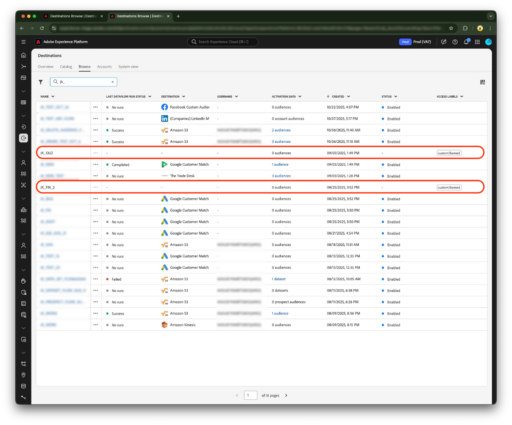

# Toegangslabels gebruiken om gebruikerstoegang tot bestemmingsgegevensstromen te beheren

Als deel van de [[!UICONTROL attribute-based access control]](overview.md)-functionaliteit in Real-Time CDP, kunt u nu toegangslabels op [bestemmingsgegevensstromen](../../dataflows/ui/monitor-destinations.md) toepassen. Op deze manier kunt u ervoor zorgen dat alleen een subset van gebruikers in uw organisatie toegang krijgt tot specifieke doelgegevens.

Wanneer u een toegangslabel aan een bepaalde bestemming toevoegt, slechts kunnen de gebruikers die toegang tot een rol hebben die dat toegewezen etiket heeft dat bestemmingsgegeven zien en uitgeven. Als een bestemmingsdataflow niet met om het even welke etiketten wordt gemerkt, is het zichtbaar aan alle gebruikers die tot uw organisatie behoren.

Lees deze pagina om voorbeelden van gebruiksgevallen, eerste vereisten te begrijpen alvorens u toegangslabels op bestemmingsdataflows kunt toepassen, en andere belangrijke callouts wanneer het gebruiken van deze functionaliteit.

## Vereisten {#prerequisites}

U moet aan de volgende voorwaarden voldoen voordat u deze functionaliteit gaat gebruiken. Adobe raadt u ook aan de volgende artikelen te lezen, zodat u vertrouwd kunt raken met [!UICONTROL attribute-based access control] :

* [Overzicht van toegangsbeheer op basis van kenmerken](/help/access-control/abac/overview.md)
* [Op attributen-gebaseerde toegangsbeheergids van begin tot eind](/help/access-control/abac/end-to-end-guide.md)

### Toegang tot de interface voor machtigingen {#access-permissions-ui}

[!UICONTROL Permissions] is het gebied van Experience Cloud waar beheerders gebruikersrollen en beleid kunnen bepalen om toestemmingen voor eigenschappen en voorwerpen binnen een producttoepassing te beheren. Lees de [ sectie van toestemmingen ](/help/access-control/abac/end-to-end-guide.md#permissions) om begonnen te worden.

### Rollen, labels maken en gebruikers toewijzen {#create-roles-labels-assign-users}

Na het krijgen van toegang tot [!UICONTROL permissions] UI, moet u of een lid van uw team opstellingsrollen en de vereiste etiketten toevoegen aan die rollen. Tot slot moeten de gebruikers die tot middelen zouden moeten toegang hebben die met de specifieke etiketten worden geëtiketteerd aan de rol worden toegevoegd. Raadpleeg de volgende secties over documentatie:

* [Een nieuwe rol maken](/help/access-control/abac/ui/roles.md)
* [Labels toevoegen aan een rol](/help/access-control/abac/end-to-end-guide.md#label-roles)
* [Gebruikers aan een rol toevoegen](/help/access-control/ui/users.md)

### Doelgegevens maken {#create-dataflow}

U moet eerst met de gewenste bestemming verbinden en een dataflow creëren om gegevens uit te voeren, alvorens u toegangslabels op dataflow kunt toepassen.

Lees de gidsen op [ verbindend met een bestemming ](/help/destinations/ui/connect-destination.md) en [ activerend gegevens aan de bestemming ](/help/destinations/ui/activation-overview.md). Dan, selecteer de gewenste bestemming van de [ catalogus van beschikbare schakelaars ](/help/destinations/catalog/overview.md).

## Al beschikbaar: Toegangslabels toepassen op andere Experience Platform-bronnen {#apply-labels-other-resources}

Terwijl deze versie u toelaat om gebruikers objecten-vlakke toegang tot specifieke bestemmingsdataflows te verlenen, is de functionaliteit om toegangsbeheer op een objecten niveau te verlenen reeds algemeen beschikbaar voor andere middelen van Experience Platform, zoals [ publiek ](/help/access-control/abac/end-to-end-guide.md#apply-labels-to-segments).

## Voorbeeld van hoofdletters gebruiken {#use-case-example}

Met voorwerp-vlakke toegangsbeheer voor bestemmingen, beperk specifieke teams van marketers om toegang tot hun specifieke slechts bestemmingen te krijgen. Bijvoorbeeld, als uw organisatie klantengegevens in verscheidene geografische plaatsen, zoals de Verenigde Staten en het Verenigd Koninkrijk heeft, kunt u een marketing team beperken om de gegevensstromen voor de plaats van de V.S. slechts te bekijken en uit te geven, en een ander marketing team om de gegevensstromen voor de plaats van het VK te bekijken en uit te geven.

## Toegangslabels toepassen op doelgegevensstromen {#apply-labels-to-destination-dataflow}

Om toegangslabels op een specifieke gegevensstroom toe te passen:

1. Navigeer naar **[!UICONTROL Destinations]** > **[!UICONTROL Browse]** en zoek de doelgegevensstroom waarvoor u gebruikerstoegang wilt beperken.
1. Selecteer de ellips (`...`) in de [!UICONTROL Name] kolom en gebruik  **[!UICONTROL Apply access labels]** controle om nieuwe etiketten toe te voegen en de bestaande etiketten voor dataflow te beheren.
   
1. Selecteer de labels die u aan de doelgegevensstroom wilt toevoegen en selecteer **[!UICONTROL Save]**.
   
1. Bericht hoe dataflow nu een toegangsetiket heeft dat in UI wordt getoond.
   

Als een doelgegevensstroom niet is gemarkeerd met labels, is deze voor alle gebruikers zichtbaar. Als de gegevensstroom met één of meerdere toegangslabels duidelijk is, is het slechts zichtbaar voor gebruikers die tot een rol behoren die het zelfde etiket of de combinatie etiketten heeft.

U kunt standaard- en aangepaste labels toevoegen aan de gegevensstroom van de bestemming. Nadat u een label aan bestemmingsgegevens toevoegt:

* De gebruikers die aan rollen met toegang tot het zelfde etiket worden toegewezen kunnen dataflow met het nieuwe etiket in UI bekijken. Ze kunnen de doelgegevensstroom weergeven en bewerken in de gebruikersinterface of via API&#39;s.

* De gebruikers die *niet* aan rollen met toegang tot het zelfde etiket worden toegewezen hebben geen toegang tot de bestemmingsdataflow om het in het gebruikersinterface of via APIs te bekijken of uit te geven.

## Belangrijke callouts en onderdelen die u moet weten {#important-callouts}

* Toegangslabels kunnen momenteel alleen worden toegepast op bestaande gegevensstromen. Dit betekent dat u een gegevensstroom aan een bestemming moet tot stand brengen alvorens u toegangslabels kunt toepassen.
* U kunt geen toegangslabel op een bestemmingsgegevensstroom toepassen als u geen toegang tot dat etiket hebt.
* Wanneer het toevoegen van veelvoudige etiketten aan een bestemmingsdataflow, moeten de gebruikers die de dataflow zouden moeten kunnen bekijken en uitgeven aan een rol met minstens de zelfde combinatie etiketten worden toegevoegd. Bijvoorbeeld, als u de etiketten C1, I2, en een ander douanelabel op een bestemmingsdataflow toepast, slechts kunnen de gebruikers die aan rollen met toegang tot de combinatie deze drie etiketten worden toegevoegd deze specifieke bestemmingsdataflow bekijken en uitgeven.
* De gegevens van de bestemming die een gebruiker geen toegang tot wegens de configuraties van het toegangsetiket kan in UI in een grayed-uit staat verschijnen; de gebruikers kunnen geen acties op die dataflows uitvoeren.

>[!NOTE]
>
> Wanneer het zoeken naar bestemmingsdataflows gebruikend het onderzoeksvakje bij de bovenkant van het gebruikersinterface van Experience Platform, kunnen de resultaten bestemmingsdataflows omvatten die uw etiketten van de gebruikerstoegang u van zien beperken. Dit gedrag wordt in een toekomstige update gecorrigeerd.

## Volgende stappen {#next-steps}

Door de stappen in dit document te volgen, weet u nu hoe te om toegangslabels op bestemmingsdataflows toe te passen zodat slechts een ondergroep van gebruikers in uw organisatie toegang tot specifieke bestemmingsdataflows krijgt.

Vervolgens kunt u meer lezen over andere functionaliteit die door [!UICONTROL attribute-based access control] wordt ondersteund bij het activeren van gegevens naar doelen. Bijvoorbeeld, kunt u de toegang van gebruikers tot [ mening beperken en specifieke gebieden slechts activeren ](/help/access-control/abac/overview.md#destinations).
