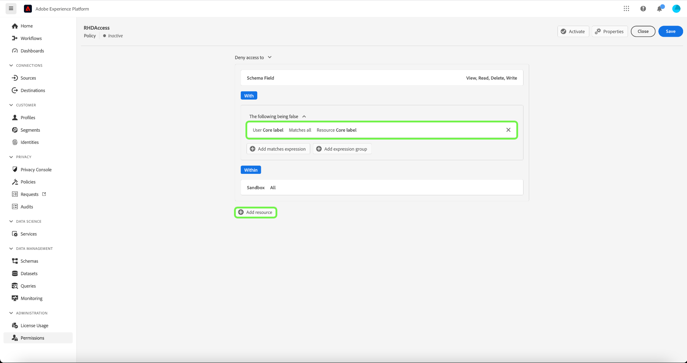

# Op attributen-gebaseerde toegangsbeheergids van begin tot eind

Toegangsbeheer op basis van kenmerken is een Adobe Experience Platform-functie die privacybewuste merken meer flexibiliteit biedt om gebruikerstoegang te beheren. Afzonderlijke objecten zoals schemavelden en segmenten kunnen worden toegewezen aan gebruikersrollen. Met deze functie kunt u toegang tot afzonderlijke objecten verlenen of intrekken voor specifieke gebruikers van Platforms in uw organisatie.

Deze functionaliteit staat u toe om schemagebieden, segmenten, etc. met etiketten te categoriseren die organisatie of gegevensgebruikswerkingsgebied bepalen. In Adobe Journey Optimizer kunt u dezelfde labels toepassen op reizen en aanbiedingen. Tegelijkertijd kunnen beheerders toegangsbeleid definiëren rondom XDM-schemavelden en beter bepalen welke gebruikers of groepen (interne, externe of externe gebruikers) toegang hebben tot deze velden.

## Aan de slag

Deze zelfstudie vereist een goed begrip van de volgende onderdelen van het Platform:

* [[!DNL Experience Data Model (XDM)] Systeem](../../xdm/home.md): Het gestandaardiseerde kader waardoor het Experience Platform gegevens van de klantenervaring organiseert.
   * [Basisbeginselen van de schemacompositie](../../xdm/schema/composition.md): Leer over de basisbouwstenen van schema&#39;s XDM, met inbegrip van zeer belangrijke principes en beste praktijken in schemacompositie.
   * [Zelfstudie Schema Editor](../../xdm/tutorials/create-schema-ui.md): Leer hoe te om douaneschema&#39;s tot stand te brengen gebruikend de Redacteur UI van het Schema.
* [Adobe Experience Platform Segmentation Service](../../segmentation/home.md): De segmenteringsengine binnen [!DNL Platform] gebruikt om publiekssegmenten van uw klantenprofielen tot stand te brengen die op klantengedrag en attributen worden gebaseerd.

### Hoofdlettergebruik

In deze handleiding wordt een voorbeeld gebruikt van het beperken van de toegang tot vertrouwelijke gegevens om de workflow aan te tonen. U zult door een op voorbeeldattributen-gebaseerde toegangsbeheerwerkschema gaan waar u rollen, etiketten, en beleid zult creëren en toewijzen om te vormen of uw gebruikers tot bepaalde middelen in uw organisatie kunnen of niet kunnen toegang hebben. Dit gebruiksgeval wordt hieronder beschreven:

U bent een zorgleverancier en u wilt toegang tot middelen in uw organisatie vormen.

* Uw interne marketingteam moet toegang hebben tot **[!UICONTROL PHI/ Regulated Health Data]** gegevens.
* Uw externe instantie mag geen toegang krijgen tot **[!UICONTROL PHI/ Regulated Health Data]** gegevens.

Om dit te doen, moet u rollen, middelen, en beleid vormen.

U zult:

* [Label de rollen voor uw gebruikers]{#label-roles}: Gebruik het voorbeeld van een zorgleverancier (ACME Business Group) wiens marketinggroep samenwerkt met externe bureaus.
* [Etiketteer uw middelen (schemagebieden en segmenten)]{#label-resources}: Wijs het **[!UICONTROL PHI/ Regulated Health Data]** label aan schemamiddelen en segmenten.
* [Het beleid maken dat ze met elkaar verbindt]{#policy}: Creeer een beleid om de etiketten op uw middelen aan de etiketten in uw rol te verbinden ontkennend toegang tot schemagebieden en segmenten. Hierdoor wordt toegang tot het schemaveld en -segment in alle sandboxen geweigerd voor gebruikers die geen overeenkomende labels hebben.

## Toestemmingen

[!UICONTROL Permissions] is het gebied van Experience Cloud waar de beheerders gebruikersrollen en toegangsbeleid kunnen bepalen om toegangstoestemmingen voor eigenschappen en voorwerpen binnen een producttoepassing te beheren.

Doorheen [!UICONTROL Permissions], kunt u rollen tot stand brengen en beheren, evenals de gewenste middeltoestemmingen voor deze rollen toewijzen. [!UICONTROL Permissions] kunt u ook de labels, sandboxen en gebruikers beheren die aan een specifieke rol zijn gekoppeld.

Als u geen beheerdersrechten hebt, neemt u contact op met de systeembeheerder om toegang te krijgen.

Als u beheerdersrechten hebt, gaat u naar [Adobe Experience Cloud](https://experience.adobe.com/) en meld u aan met uw Adobe-referenties. Zodra het programma geopend, **[!UICONTROL Overview]** wordt weergegeven voor uw organisatie waarvoor u beheerdersrechten hebt. Op deze pagina worden de producten weergegeven waarop uw organisatie is geabonneerd, samen met andere besturingselementen voor het toevoegen van gebruikers en beheerders aan de organisatie als geheel. Selecteren **[!UICONTROL Permissions]** om de werkruimte voor de integratie van uw Platform te openen.

De werkruimte voor machtigingen voor de gebruikersinterface van het Platform wordt geopend in het dialoogvenster **[!UICONTROL Roles]** pagina.

## Labels op een rol toepassen {#label-roles}

Rollen zijn manieren om de soorten gebruikers te categoriseren die met uw instantie van het Platform in wisselwerking staan, en bouwstenen van toegangsbeheerbeleid zijn. Een rol heeft een bepaalde reeks toestemmingen en de leden van uw organisatie kunnen aan één of meerdere rollen, afhankelijk van het werkingsgebied van toegang worden toegewezen zij nodig hebben.

Selecteer **[!UICONTROL ACME Business Group]** van de **[!UICONTROL Roles]** pagina.

Selecteer vervolgens **[!UICONTROL Labels]** en selecteer vervolgens **[!UICONTROL Add Labels]**.

Er wordt een lijst met alle labels in uw organisatie weergegeven. Selecteren **[!UICONTROL RHD]** om het label toe te voegen voor **[!UICONTROL PHI/Regulated Health Data]**. Laat even een blauw vinkje naast het label staan en selecteer **[!UICONTROL Save]**.

## Labels toepassen op schemavelden {#label-resources}

Nu u een gebruikersrol met hebt gevormd [!UICONTROL RHD] label, de volgende stap is dat het zelfde etiket aan de middelen toe te voegen die u voor die rol wilt controleren.

Selecteren **[!UICONTROL Schemas]** van de linkernavigatie en selecteer dan **[!UICONTROL ACME Healthcare]** in de lijst met schema&#39;s die worden weergegeven.

Selecteer vervolgens **[!UICONTROL Labels]** om een lijst te zien die de gebieden verbonden aan uw schema toont. Hier kunt u labels toewijzen aan een of meerdere velden tegelijk. Selecteer **[!UICONTROL BloodGlucose]** en **[!UICONTROL InsulinLevel]** velden, en selecteer vervolgens **[!UICONTROL Edit governance labels]**.

De **[!UICONTROL Edit labels]** wordt weergegeven, zodat u de labels kunt kiezen die u op de schemavelden wilt toepassen. Selecteer voor dit gebruik de optie **[!UICONTROL PHI/ Regulated Health Data]** label, selecteert u vervolgens **[!UICONTROL Save]**.

>[!NOTE]
>
>Wanneer een label aan een veld wordt toegevoegd, wordt dat label toegepast op de bovenliggende bron van dat veld (een klasse of een veldgroep). Als de ouderklasse of de gebiedsgroep door andere schema&#39;s wordt gebruikt, zullen die schema&#39;s het zelfde etiket erven.

## Labels toepassen op segmenten

Nadat u de schemavelden hebt gelabeld, kunt u nu beginnen met het labelen van de segmenten.

Selecteren **[!UICONTROL Segments]** in de linkernavigatie. Een lijst van segmenten beschikbaar in uw organisatie wordt getoond. In dit voorbeeld moeten de volgende twee segmenten worden gelabeld omdat ze gevoelige gezondheidsgegevens bevatten:

* Bloedglucose > 100
* Insuline &lt;50

Selecteren **[!UICONTROL Blood Glucose >100]** om het segment te labelen.

Het segment **[!UICONTROL Details]** wordt weergegeven. Selecteer **[!UICONTROL Manage Access]**.

De **[!UICONTROL Edit labels]** wordt weergegeven, zodat u de labels kunt kiezen die u op het segment wilt toepassen. Selecteer voor dit gebruik de optie **[!UICONTROL PHI/ Regulated Health Data]** label, selecteert u vervolgens **[!UICONTROL Save]**.

Herhaal bovenstaande stappen met **[!UICONTROL Insulin <50]**.

## Creeer een beleid van de toegangscontrole {#policy}

Het beleid van de controle van de toegang hefboomhefboometiketten om te bepalen welke gebruikersrollen toegang tot specifieke middelen van het Platform hebben. Het beleid kan of lokaal of globaal zijn, en kan ander beleid met voeten treden. In dit voorbeeld wordt toegang tot schemavelden en -segmenten in alle sandboxen geweigerd voor gebruikers die niet over de overeenkomende labels in het schemaveld beschikken.

Als u een toegangsbeheerbeleid wilt maken, selecteert u **[!UICONTROL Permissions]** van de linkernavigatie en selecteer dan **[!UICONTROL Policies]**. Selecteer vervolgens **[!UICONTROL Create policy]**.

De **[!UICONTROL Create new policy]** wordt weergegeven en u wordt gevraagd een naam en een optionele beschrijving in te voeren. Selecteren **[!UICONTROL Confirm]** wanneer gereed.

Als u toegang tot de schemavelden wilt weigeren, gebruikt u de vervolgkeuzepijl en selecteert u **[!UICONTROL Deny access to]** en selecteer vervolgens **[!UICONTROL No resource selected]**. Selecteer vervolgens **[!UICONTROL Schema Field]** en selecteer vervolgens **[!UICONTROL All]**.

In de onderstaande tabel staan de voorwaarden die beschikbaar zijn bij het maken van een beleid:

| Voorwaarden | Beschrijving |
| --- | --- |
| De volgende fout is onwaar | Wanneer &#39;Toegang weigeren&#39; is ingesteld, wordt de toegang beperkt als de gebruiker niet voldoet aan de geselecteerde criteria. |
| Het volgende is waar | Wanneer &#39;Toegang toestaan tot&#39; is ingesteld, wordt de toegang beperkt als de gebruiker aan de geselecteerde criteria voldoet. |
| Komt overeen met alle | De gebruiker heeft een label dat overeenkomt met een willekeurig label dat op een bron is toegepast. |
| Komt overeen met alles | De gebruiker heeft alle labels die overeenkomen met alle labels die op een bron zijn toegepast. |
| Kernlabel | Een kernlabel is een door Adobe gedefinieerd label dat in alle instanties van het Platform beschikbaar is. |
| Aangepast label | Een aangepast label is een label dat door uw organisatie is gemaakt. |

Selecteren **[!UICONTROL The following being false]** en selecteer vervolgens **[!UICONTROL No attribute selected]**. Selecteer vervolgens de gebruiker **[!UICONTROL Core label]** selecteert u vervolgens **[!UICONTROL Matches all]**. Selecteer de bron **[!UICONTROL Core label]** en selecteert u **[!UICONTROL Add resource]**.

>[!TIP]
>
>Een bron is het element dat of het object dat een onderwerp kan of kan benaderen. De middelen kunnen segmenten of schema&#39;s zijn.

Als u toegang tot de segmenten wilt weigeren, gebruikt u de vervolgkeuzepijl en selecteert u **[!UICONTROL Deny access to]** en selecteer vervolgens **[!UICONTROL No resource selected]**. Selecteer vervolgens **[!UICONTROL Segment]** en selecteer vervolgens **[!UICONTROL All]**.

Selecteren **[!UICONTROL The following being false]** en selecteer vervolgens **[!UICONTROL No attribute selected]**. Selecteer vervolgens de gebruiker **[!UICONTROL Core label]** selecteert u vervolgens **[!UICONTROL Matches all]**. Selecteer de bron **[!UICONTROL Core label]** en selecteert u **[!UICONTROL Save]**.

Selecteren **[!UICONTROL Activate]** om het beleid te activeren, en er verschijnt een dialoogvenster waarin u wordt gevraagd de activering te bevestigen. Selecteren **[!UICONTROL Confirm]** en selecteer vervolgens **[!UICONTROL Close]**.

## Volgende stappen

U hebt de toepassing van labels op een rol, schemagebieden, en segmenten voltooid. Het externe agentschap dat aan deze rollen wordt toegewezen wordt beperkt van het bekijken van deze etiketten en hun waarden in het schema, de dataset, en de profielmening. Deze gebieden worden ook beperkt van worden gebruikt in de segmentdefinitie wanneer het gebruiken van de Bouwer van het Segment.

Voor meer informatie over op attribuut-gebaseerde toegangsbeheer, zie [op attributen-gebaseerd toegangsbeheeroverzicht](./overview.md).
