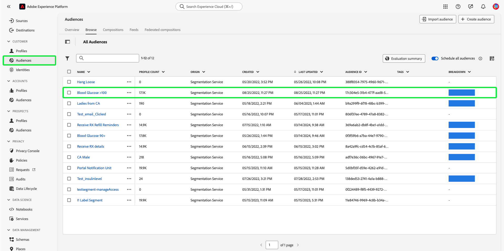

# Op attributen-gebaseerde toegangsbeheergids van begin tot eind

Gebruik op kenmerken gebaseerde toegangscontrole op Adobe Experience Platform om uzelf en andere privacybewuste klanten meer flexibiliteit te bieden om gebruikerstoegang te beheren. De toegang tot individuele voorwerpen, zoals schemagebieden en publiek, kan met beleid worden verleend dat op de attributen en de rol van de objecten wordt gebaseerd. Met deze functie kunt u toegang tot individuele objecten verlenen of intrekken voor specifieke platformgebruikers in uw organisatie.

Met deze functionaliteit kunt u schemavelden, publiek, enzovoort categoriseren met labels die het bereik van organisatie- of gegevensgebruik definiëren. U kunt dezelfde labels toepassen op reizen, aanbiedingen en andere objecten in Adobe Journey Optimizer. Tegelijkertijd kunnen beheerders toegangsbeleid definiëren rondom XDM-schemavelden (Experience Data Model) en beter beheren welke gebruikers of groepen (interne, externe of externe gebruikers) toegang hebben tot deze velden.

>[!NOTE]
>
>Dit document concentreert zich op het gebruiksgeval van het beleid van de toegangscontrole. Als u aan opstellingsbeleid probeert om het **gebruik** van gegevens te regeren eerder dan welke gebruikers van het Platform toegang tot het hebben, zie in plaats daarvan de gids van begin tot eind op [ gegevensbeheer ](../../data-governance/e2e.md).

## Aan de slag

Deze zelfstudie vereist een goed begrip van de volgende platformcomponenten:

* [[!DNL Experience Data Model (XDM)]  Systeem ](../../xdm/home.md): Het gestandaardiseerde kader waardoor het Experience Platform gegevens van de klantenervaring organiseert.
   * [ Grondbeginselen van schemacompositie ](../../xdm/schema/composition.md): Leer over de basisbouwstenen van schema&#39;s XDM, met inbegrip van zeer belangrijke principes en beste praktijken in schemacompositie.
   * [ het leerprogramma van de Redacteur van het Schema ](../../xdm/tutorials/create-schema-ui.md): Leer hoe te om douaneschema&#39;s tot stand te brengen gebruikend de Redacteur UI van het Schema.
* [ de Dienst van de Segmentatie van Adobe Experience Platform ](../../segmentation/home.md): De segmenteringsmotor binnen [!DNL Platform] wordt gebruikt om publiekssegmenten van uw klantenprofielen tot stand te brengen die op klantengedrag en attributen worden gebaseerd.

### Hoofdlettergebruik

U zult door een op voorbeeldattributen-gebaseerde toegangsbeheerwerkschema gaan waar u rollen, etiketten, en beleid zult creëren en toewijzen om te vormen of uw gebruikers tot specifieke middelen in uw organisatie kunnen of niet kunnen toegang hebben. In deze handleiding wordt een voorbeeld gebruikt van het beperken van de toegang tot vertrouwelijke gegevens om de workflow te demonstreren. Dit gebruiksgeval wordt hieronder beschreven:

U bent een gezondheidszorgleverancier en wilt toegang tot middelen in uw organisatie vormen.

* Uw interne marketingteam moet toegang hebben tot **[!UICONTROL PHI/ Regulated Health Data]** -gegevens.
* Het externe bureau heeft geen toegang tot **[!UICONTROL PHI/ Regulated Health Data]** -gegevens.

Om dit te doen, moet u rollen, middelen, en beleid vormen.

U zult:

* [ Etiket de rollen voor uw gebruikers ](#label-roles): Gebruik het voorbeeld van een gezondheidszorgleverancier (ACME BedrijfsGroep) de waarvan marketing groep met externe agentschappen werkt.
* [ Etiket uw middelen (schemagebieden en publiek) ](#label-resources): Wijs het **[!UICONTROL PHI/ Regulated Health Data]** etiket aan schemamiddelen en publiek toe.
* [ activeer het beleid dat hen samen ](#policy) zal verbinden: Laat het standaardbeleid toe om toegang tot schemagebieden en publiek te verhinderen door de etiketten op uw middelen aan de etiketten in uw rol te verbinden. Gebruikers met overeenkomende labels krijgen dan toegang tot het schemaveld en segmenten in alle sandboxen.

## Machtigingen

[!UICONTROL Permissions] is het gebied van Experience Cloud waar de beheerders gebruikersrollen en beleid kunnen bepalen om toestemmingen voor eigenschappen en voorwerpen binnen een producttoepassing te beheren.

Via [!UICONTROL Permissions] kunt u rollen maken en beheren en de gewenste resourcemachtigingen voor deze rollen toewijzen. Met [!UICONTROL Permissions] kunt u ook de labels, sandboxen en gebruikers beheren die aan een specifieke rol zijn gekoppeld.

Neem contact op met de systeembeheerder als u geen beheerdersrechten hebt.

Zodra u admin voorrechten hebt, ga naar [ Adobe Experience Cloud ](https://experience.adobe.com/) en teken binnen gebruikend uw geloofsbrieven van de Adobe. Nadat u zich hebt aangemeld, wordt de pagina **[!UICONTROL Overview]** weergegeven voor uw organisatie waarvoor u beheerdersrechten hebt. Deze pagina toont de producten uw organisatie aan, samen met andere controles wordt geabonneerd om gebruikers en beheerders aan de organisatie toe te voegen. Selecteer **[!UICONTROL Permissions]** om de werkruimte voor uw platformintegratie te openen.

De werkruimte voor machtigingen voor de gebruikersinterface van het platform wordt geopend op de pagina **[!UICONTROL Overview]** .

## Labels op een rol toepassen {#label-roles}

>[!CONTEXTUALHELP]
>id="platform_permissions_labels_about"
>title="Wat zijn labels?"
>abstract="Met labels kunt u gegevenssets en velden categoriseren op basis van het gebruiksbeleid dat op die gegevens van toepassing is. Het platform biedt verschillende Adobe-definieert &quot;kern&quot;gegevensgebruiksetiketten, die een grote verscheidenheid aan gemeenschappelijke beperkingen omvatten die van toepassing zijn op gegevensbeheer. Met gevoelige &quot;S&quot;-labels zoals RHD (Gereglementeerde gezondheidsgegevens) kunt u bijvoorbeeld gegevens categoriseren die verwijzen naar beschermde gezondheidsinformatie (PHI). U kunt ook uw eigen aangepaste labels definiëren die aan de behoeften van uw organisatie voldoen."
>additional-url="https://experienceleague.adobe.com/docs/experience-platform/data-governance/labels/overview.html#understanding-data-usage-labels" text="Overzicht van labels voor gegevensgebruik"

>[!CONTEXTUALHELP]
>id="platform_permissions_labels_about_create"
>title="Nieuw label maken"
>abstract="U kunt uw eigen aangepaste labels maken die aansluiten op de behoeften van uw organisatie. De etiketten van de douane kunnen worden gebruikt om zowel gegevensbeheer als toegangsbeheerconfiguraties op uw gegevens toe te passen."
>additional-url="https://experienceleague.adobe.com/docs/experience-platform/data-governance/labels/overview.html#manage-labels" text="Aangepaste labels beheren"

>[!CONTEXTUALHELP]
>id="platform_permissions_roles_about"
>title="Wat zijn rollen?"
>abstract="Rollen zijn manieren om de soorten gebruikers te categoriseren die met uw instantie van het Platform in wisselwerking staan en bouwstenen van toegangsbeheerbeleid zijn. Een rol heeft een bepaalde reeks toestemmingen en de leden van uw organisatie kunnen aan één of meerdere rollen, afhankelijk van het werkingsgebied van mening worden toegewezen of toegang schrijven zij nodig hebben."
>additional-url="https://experienceleague.adobe.com/docs/experience-platform/access-control/abac/permissions-ui/roles.html" text="Rollen beheren"

>[!CONTEXTUALHELP]
>id="platform_permissions_roles_about_create"
>title="Nieuwe rol maken"
>abstract="U kunt een nieuwe rol tot stand brengen om gebruikers beter te categoriseren die tot uw instantie van het Platform toegang hebben. Bijvoorbeeld, kunt u een rol voor een Intern Team van de Marketing tot stand brengen en het etiket RHD op die rol toepassen, toestaand uw Intern Team van de Marketing om tot de Beschermde Informatie van de Gezondheid (PHI) toegang te hebben. Alternatief, kunt u een rol voor een Extern Agentschap ook tot stand brengen en die roltoegang tot PHI gegevens ontkennen door het etiket RHD op die rol niet toe te passen."
>additional-url="https://experienceleague.adobe.com/docs/experience-platform/access-control/abac/permissions-ui/roles.html#create-a-new-role" text="Een nieuwe rol maken"

>[!CONTEXTUALHELP]
>id="platform_permissions_roles_details"
>title="Roloverzicht"
>abstract="In het dialoogvenster Roloverzicht worden de bronnen en sandboxen weergegeven waartoe een bepaalde rol toegang heeft."

Rollen zijn manieren om de soorten gebruikers te categoriseren die met uw instantie van het Platform in wisselwerking staan en zijn bouwstenen van toegangsbeheerbeleid. Een rol heeft een bepaalde reeks toestemmingen, en de leden van uw organisatie kunnen aan één of meerdere rollen, afhankelijk van het werkingsgebied van toegang worden toegewezen zij nodig hebben.

Selecteer **[!UICONTROL Roles]** in de linkernavigatie en selecteer vervolgens **[!UICONTROL ACME Business Group]** om aan de slag te gaan.

Selecteer vervolgens **[!UICONTROL Labels]** en selecteer **[!UICONTROL Add Labels]** .

Er wordt een lijst met alle labels in uw organisatie weergegeven. Selecteer **[!UICONTROL RHD]** om het label voor **[!UICONTROL PHI/Regulated Health Data]** toe te voegen en selecteer vervolgens **[!UICONTROL Save]** .

>[!NOTE]
>
>Wanneer het toevoegen van een organisatiegroep aan een rol, zullen alle gebruikers in die groep aan de rol worden toegevoegd. Wijzigingen in de organisatiegroep (gebruikers verwijderd of toegevoegd) worden automatisch bijgewerkt binnen de rol.

## Labels toepassen op schemavelden {#label-resources}

Nu u een gebruikersrol met het [!UICONTROL RHD] etiket hebt gevormd, moet de volgende stap dat zelfde etiket aan de middelen toevoegen die u voor die rol wilt controleren.

Van de hoogste navigatie, selecteer **toepassingsschakelaar**, die door het  pictogram en selecteer dan **[!UICONTROL Experience Platform]**.

Selecteer **[!UICONTROL Schemas]** in de linkernavigatie en selecteer vervolgens **[!UICONTROL ACME Healthcare]** in de lijst met schema&#39;s die worden weergegeven.

Selecteer vervolgens **[!UICONTROL Labels]** om een lijst weer te geven met de velden die aan het schema zijn gekoppeld. Hier kunt u labels toewijzen aan een of meerdere velden tegelijk. Selecteer de velden **[!UICONTROL BloodGlucose]** en **[!UICONTROL InsulinLevel]** en selecteer vervolgens **[!UICONTROL Apply access and data governance labels]** .

Het dialoogvenster **[!UICONTROL Edit labels]** wordt weergegeven, waarin u de labels kunt kiezen die u op de schemavelden wilt toepassen. Selecteer voor dit gebruik het label **[!UICONTROL PHI/ Regulated Health Data]** en selecteer vervolgens **[!UICONTROL Save]** .

>[!NOTE]
>
>Wanneer een label aan een veld wordt toegevoegd, wordt dat label toegepast op de bovenliggende bron van dat veld (een klasse of een veldgroep). Als de ouderklasse of de gebiedsgroep door andere schema&#39;s wordt gebruikt, zullen die schema&#39;s het zelfde etiket erven.

## Labels toepassen op het publiek

>[!NOTE]
>
>Om het even welk publiek dat een geëtiketteerd attribuut gebruikt moet eveneens worden geëtiketteerd als u de zelfde toegangsbeperkingen op het wilt toepassen.

Nadat u de schemavelden hebt gelabeld, kunt u nu beginnen met het labelen van uw publiek.

Selecteer **[!UICONTROL Audiences]** in de linkernavigatie onder de sectie **[!UICONTROL Customers]** . Er wordt een lijst met publiek in uw organisatie weergegeven. In dit voorbeeld moeten de volgende twee soorten publiek worden geëtiketteerd omdat ze gevoelige gezondheidsgegevens bevatten:

* Bloedglucose > 100
* Insuline &lt;50

Selecteer **[!UICONTROL Blood Glucose >100]** (door de publieksnaam, niet checkbox) om het publiek te etiketteren.

Het scherm segment **[!UICONTROL Details]** wordt weergegeven. Selecteer **[!UICONTROL Manage Access]**.

Het dialoogvenster **[!UICONTROL Apply access and data governance labels]** wordt weergegeven, waarin u de labels kunt kiezen die u op het publiek wilt toepassen. Selecteer voor dit gebruik het label **[!UICONTROL PHI/ Regulated Health Data]** en selecteer vervolgens **[!UICONTROL Save]** .

Herhaal bovenstaande stappen met **[!UICONTROL Insulin <50]** .

>[!NOTE]
>
> Wijs etiketten toe die in de [!UICONTROL Permissions] werkruimte (zoals de segmentetiketten hierboven) aan diverse voorwerpen in Adobe Journey Optimizer worden gecreeerd gebruikend [ Controle van de Toegang van het Niveau van Objecten ](https://experienceleague.adobe.com/en/docs/journey-optimizer/using/access-control/object-based-access).&quot;

## Activeer het beleid van de toegangscontrole {#policy}

Het standaardtoegangsbeheerbeleid zal hefboometiketten gebruiken om te bepalen welke gebruikersrollen toegang tot specifieke middelen van het Platform hebben. In dit voorbeeld wordt toegang tot schemavelden en publiek in alle sandboxen geweigerd voor gebruikers die zich niet in een rol bevinden die de bijbehorende labels in het schemaveld heeft.

Als u het toegangsbeheerbeleid wilt activeren, selecteert u [!UICONTROL Permissions] in de linkernavigatie en selecteert u vervolgens **[!UICONTROL Policies]** .

Selecteer vervolgens de ellips (`...`) naast **[!UICONTROL Default-Field-Level-Access-Control-Policy]** en een vervolgkeuzelijst bevat besturingselementen voor het bewerken, activeren, verwijderen of dupliceren van de rol. Selecteer **[!UICONTROL Activate]** in de vervolgkeuzelijst.

 te activeren

Het dialoogvenster voor het activeren van het beleid wordt weergegeven waarin u wordt gevraagd de activering te bevestigen. Selecteer **[!UICONTROL Confirm]**.

Er wordt een bevestiging van beleidsactivering ontvangen en u keert terug naar de pagina [!UICONTROL Policies] .

<!-- ## Create an access control policy {#policy}

>[!CONTEXTUALHELP]
>id="platform_permissions_policies_about"
>title="What are policies?"
>abstract="Policies are statements that bring attributes together to establish permissible and impermissible actions. Every organization comes with a default policy that you must activate to define rules for resources like segments and schema fields. Default policies can neither be edited nor deleted. However, default policies can be activated or deactivated."
>additional-url="https://experienceleague.adobe.com/docs/experience-platform/access-control/abac/permissions-ui/policies.html" text="Manage policies"

>[!CONTEXTUALHELP]
>id="platform_permissions_policies_about_create"
>title="Create a policy"
>abstract="Create a policy to define the actions that your users can and cannot take against your segments and schema fields."
>additional-url="https://experienceleague.adobe.com/docs/experience-platform/access-control/abac/permissions-ui/policies.html#create-a-new-policy" text="Create a policy"

>[!CONTEXTUALHELP]
>id="platform_permissions_policies_edit_permitdeny"
>title="Configure permissible and impermissible actions for a policy"
>abstract="A <b>deny access to</b> policy will deny users access when the criteria is met. Combined with <b>The following being false</b> - all users will be denied access unless they meet the matching criteria set. This type of policy allows you to protect a sensitive resource and only allow access to users with matching labels.  A <b>permit access to</b> policy will permit users access when the criteria are met. When combined with <b>The following being true</b> - users will be given access if they meet the matching criteria set. This does not explicitly deny access to users, but adds a permit access. This type of policy allows you to give additional access to resource and in addition to those users who might already have access through role permissions."
>additional-url="https://experienceleague.adobe.com/docs/experience-platform/access-control/abac/permissions-ui/policies.html#edit-a-policy" text="Edit a policy"

>[!CONTEXTUALHELP]
>id="platform_permissions_policies_edit_resource"
>title="Configure permissions for a resource"
>abstract="A resource is the asset or object that a user can or cannot access. Resources can be segments or schemas fields. You can configure write, read, or delete permissions for segments and schema fields."

>[!CONTEXTUALHELP]
>id="platform_permissions_policies_edit_condition"
>title="Edit conditions"
>abstract="Apply conditional statements to your policy to configure user access to certain resources. Select match all to require users to have roles with the same labels as a resource to be permitted access. Select match any to require users to have a role with just one label matching a label on a resource. Labels can either be defined as core or custom labels, with core labels representing labels created and provided by Adobe and custom labels representing labels that you created for your organization."

Access control policies leverage labels to define which user roles have access to specific Platform resources. Policies can either be local or global and can override other policies. In this example, access to schema fields and segments will be denied in all sandboxes for users who don't have the corresponding labels in the schema field.

>[!NOTE]
>
>A "deny policy" is created to grant access to sensitive resources because the role grants permission to the subjects. The written policy in this example **denies** you access if you are missing the required labels.
a
To create an access control policy, select **[!UICONTROL Permissions]** from the left navigation and then select **[!UICONTROL Policies]**. Next, select **[!UICONTROL Create policy]**.

The **[!UICONTROL Create new policy]** dialog appears, prompting you to enter a name and an optional description. Select **[!UICONTROL Confirm]** when finished.

To deny access to the schema fields, use the dropdown arrow and select **[!UICONTROL Deny access to]** and then select **[!UICONTROL No resource selected]**. Next, select **[!UICONTROL Schema Field]** and then select **[!UICONTROL All]**.

The table below shows the conditions available when creating a policy:

| Conditions | Description |
| --- | --- |
| The following being false| When 'Deny access to' is set, access will be restricted if the user does not meet the criteria selected. |
| The following being true| When 'Permit access to' is set, access will be permitted if the user meets the selected criteria. |
| Matches any| The user has a label that matches any label applied to a resource. |
| Matches all| The user has all labels that matches all labels applied to a resource. |
| Core label| A core label is an Adobe-defined label that is available in all Platform instances.|
| Custom label| A custom label is a label that has been created by your organization.|

Select **[!UICONTROL The following being false]** and then select **[!UICONTROL No attribute selected]**. Next, select the user **[!UICONTROL Core label]**, then select **[!UICONTROL Matches all]**. Select the resource **[!UICONTROL Core label]** and finally select **[!UICONTROL Add resource]**.

>[!TIP]
>
>A resource is the asset or object that a subject can or cannot access. Resources can be segments or schemas.

To deny access to the segments, use the dropdown arrow and select **[!UICONTROL Deny access to]** and then select **[!UICONTROL No resource selected]**. Next, select **[!UICONTROL Segment]** and then select **[!UICONTROL All]**.

Select **[!UICONTROL The following being false]** and then select **[!UICONTROL No attribute selected]**. Next, select the user **[!UICONTROL Core label]**, then select **[!UICONTROL Matches all]**. Select the resource **[!UICONTROL Core label]** and finally select **[!UICONTROL Save]**.

Select **[!UICONTROL Activate]** to activate the policy, and a dialog appears which prompts you to confirm activation. Select **[!UICONTROL Confirm]** and then select **[!UICONTROL Close]**.

 -->

## Volgende stappen

U hebt de toepassing van labels op een rol, schemagebieden, en publiek voltooid. Het externe agentschap dat aan deze rollen wordt toegewezen wordt beperkt van het bekijken van deze etiketten en hun waarden in het schema, de dataset, en de profielmening. Deze gebieden worden ook beperkt van worden gebruikt in de segmentdefinitie wanneer het gebruiken van de Bouwer van het Segment.

Voor meer informatie over op attribuut-gebaseerde toegangsbeheer, zie het [ op attributen-gebaseerde toegangsbeheeroverzicht ](./overview.md).

De volgende video is bedoeld om uw begrip van op attribuut-gebaseerde toegangscontrole te steunen, en schetst hoe te om rollen, middelen, en beleid te vormen.

>[!VIDEO](https://video.tv.adobe.com/v/345641?learn=on)
