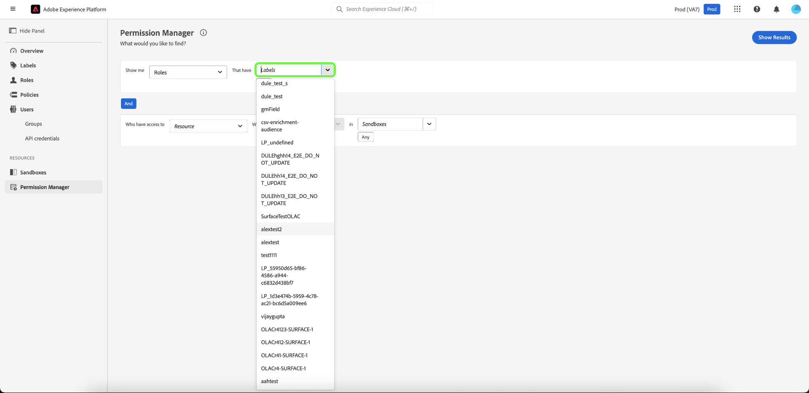

# Machtigingsmanager

>[!NOTE]
>
>Als u [!UICONTROL Permission Manager] wilt openen, moet u een productbeheerder zijn. Als u geen beheerdersrechten hebt, neemt u contact op met de systeembeheerder om toegang te krijgen.

Gebruik eenvoudige query&#39;s in de [!UICONTROL Permission Manager] om beknopte rapporten te maken die u helpen toegangsbeheer te begrijpen en tijd te besparen bij het valideren van toegangsmachtigingen in veel workflows en granulariteitsniveaus. U kunt [!UICONTROL Permission Manager] gebruiken om gebruikers te zoeken die tot een gebruikersgroep behoren en opgegeven toegangsrechten hebben, alsmede rollen die specifieke labels hebben.

## Een zoekopdracht uitvoeren naar gebruikers binnen een opgegeven gebruikersgroep {#search-users}

>[!CONTEXTUALHELP]
>id="platform_permission_manager"
>title="Machtigingsmanager"
>abstract="Gebruik de dropdown selecteurs op de pagina om de rapporten van het toegangsniveau van verschillende granularity niveaus voor gebruikers en rollen te krijgen."
<!-- >additional-url="https://experienceleague.adobe.com/docs/experience-platform/access-control/abac/permissions-manager/permissions.html" text="Permission manager" -->

Selecteer het kenmerk **[!UICONTROL Users]** met het keuzemenu.

Selecteer vervolgens de **[!UICONTROL User Group]** waarnaar u wilt zoeken in de vervolgkeuzelijst.

>[!INFO]
>
>[!UICONTROL User Group] is geen verplicht veld. U kunt slechts één gebruikersgroep voor elk rapport selecteren.

Voor een meer korrelig rapport kunt u de bron opgeven met handelingen in een bepaalde sandbox. Selecteer **[!UICONTROL Resource]**, **[!UICONTROL Actions]** en **[!UICONTROL Sandboxes]** met de vervolgkeuzelijst en selecteer vervolgens **[!UICONTROL Show Results]** .

>[!INFO]
>
>[!UICONTROL Resource] , [!UICONTROL Actions] en [!UICONTROL Sandboxes] zijn geen verplichte velden. Voor elk rapport kan slechts één [!UICONTROL Resource] worden geselecteerd. Een actie of een zandbak kan worden verwijderd zodra toegevoegd door **&quot;x&quot;te selecteren** naast de selectie u zou willen verwijderen.

Er wordt een lijst met gebruikers en hun e-mailadres gerapporteerd op basis van de geselecteerde criteria. Gebruik het filtermenu links om de kenmerken en resultaten bij te werken. Voor meer informatie over een specifieke gebruiker selecteert u de gebruikersnaam in de lijst.

## Zoeken naar rollen met specifieke labels {#search-roles}

Selecteer het kenmerk **[!UICONTROL Roles]** met het keuzemenu.

>[!INFO]
>
>[!UICONTROL Labels] is geen verplicht veld. U kunt meerdere labels selecteren. Deze worden onder deze vervolgkeuzelijst weergegeven wanneer u deze selecteert. Een etiket kan worden verwijderd zodra toegevoegd door **&quot;x&quot;te selecteren** naast de actie.

Selecteer vervolgens de **[!UICONTROL Labels]** waarnaar u wilt zoeken in de vervolgkeuzelijst.

Voor een meer korrelig rapport kunt u de bron opgeven met handelingen in een bepaalde sandbox. Selecteer **[!UICONTROL Resource]**, **[!UICONTROL Actions]** en **[!UICONTROL Sandboxes]** met de vervolgkeuzelijst en selecteer vervolgens **[!UICONTROL Show Results]** .

>[!INFO]
>
>[!UICONTROL Resource] , [!UICONTROL Actions] en [!UICONTROL Sandboxes] zijn geen verplichte velden. Voor elk rapport kan slechts één [!UICONTROL Resource] worden geselecteerd. Een actie of een zandbak kan worden verwijderd zodra toegevoegd door **&quot;x&quot;te selecteren** naast de selectie u zou willen verwijderen.

Er wordt een lijst met rollen gerapporteerd op basis van de geselecteerde criteria. Gebruik het filtermenu links om de kenmerken en resultaten bij te werken. Selecteer de rol in de lijst voor meer informatie over een specifieke rol.

De volgende informatie wordt weergegeven voor elke rol die aan uw criteria voldoet:

| Kenmerk | Beschrijving |
| --- | --- |
| Beschrijving | Een korte beschrijving van de rol. |
| Labels | Een lijst met labels die aan de rol zijn gekoppeld. |
| Sandboxes | Een lijst van de dozen van Sanboxes die deze rol bevatten. |
| Gewijzigd bij | De datum en tijdstempel van wanneer de rol voor het laatst is bijgewerkt. |
| Gemaakt op | De datum en tijdstempel van wanneer de rol is gemaakt. |
| Gemaakt door | Details van de maker van de rol. |

## Volgende stappen

U hebt nu geleerd hoe u rapporten kunt genereren voor gebruikers en rollen. Meer over op attribuut-gebaseerde toegangscontrole leren, zie het [ op attributen-gebaseerde toegangsbeheeroverzicht ](../overview.md).
