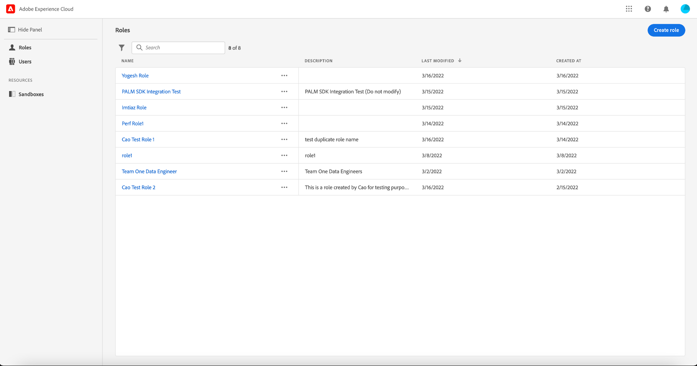

# Handleiding voor machtigingen

>[!IMPORTANT]
>
>Op attributen-gebaseerde toegangscontrole is momenteel beschikbaar in een beperkte versie voor op VS-Gebaseerde gezondheidszorgklanten. Deze mogelijkheid is beschikbaar voor alle Real-time Customer Data Platform-klanten zodra deze volledig is vrijgegeven.

Machtigingen zijn het gebied van Adobe Experience Cloud waar beheerders gebruikersrollen en toegangsbeleid kunnen definiëren om toegangsmachtigingen voor functies en objecten binnen een producttoepassing te beheren.

Met toestemmingen, kunt u vormen:

* [Labels](./labels.md)
* [Toestemmingen](./permissions.md)
* [Beleid](./permissions.md)
* [Rollen](./roles.md)
* [Sandboxen](./sandboxes.md)
* [Gebruikers](./users.md)

Om tot op attribuut-gebaseerde toegangsbeheertoestemmingen toegang te hebben voor [!DNL Experience Cloud], moet u een beheerder voor uw organisatie zijn die een abonnement op heeft [!DNL Experience Cloud]. Terwijl Adobe flexibele beheerderhiërarchieën voor uw organisaties steunt, moet u een productbeheerder voor Adobe Experience Platform zijn om toestemmingen te vormen. Zie het Adobe Help Center-artikel op [administratieve taken](https://helpx.adobe.com/enterprise/using/admin-roles.html) voor meer informatie .

Als u geen beheerdersrechten hebt, neemt u contact op met de systeembeheerder om toegang te krijgen.

Als u beheerdersrechten hebt, gaat u naar [Adobe Experience Cloud](https://experience.adobe.com/) en meld u aan met uw Adobe-referenties. Zodra het programma geopend, **[!UICONTROL Overview]** wordt weergegeven voor uw organisatie waarvoor u beheerdersrechten hebt. Op deze pagina worden de producten weergegeven waarop uw organisatie is geabonneerd, samen met andere besturingselementen voor het toevoegen van gebruikers en beheerders aan de organisatie als geheel. Selecteren **[!UICONTROL Permissions]** om de op attribuut-gebaseerde werkruimte van de toegangscontrole voor uw Platform integratie te openen.

De op attributen-gebaseerde werkruimte van het toegangsbeheer voor Adobe Experience Cloud verschijnt, die op **[!UICONTROL Roles]** pagina. Op deze pagina kunt u alle rollen weergeven en verschillende instellingen beheren zoals in dit document wordt beschreven.

>[!IMPORTANT]
>
>Zodra uw organisatie voor op attributen-gebaseerde toegangsbeheer wordt toegelaten, kunt u toestemmingen op Adobe Experience Cloud, in plaats van de Profielen van het Product in Adobe Admin Console beginnen te gebruiken, om toestemmingen voor gebruikers, functionaliteit, etiketten, en andere middelen in uw organisatie te beheren.

Deze gebruikershandleiding is vooral bedoeld voor het gebruik van de [!DNL Experience Cloud] om toegangsmachtigingen voor Platform toe te wijzen. Meer algemene informatie over het navigeren door de [!DNL Admin Console], zie de [Gebruikershandleiding voor Admin Consoles](https://helpx.adobe.com/enterprise/using/admin-console.html).

## Volgende stappen

Nadat u in de werkruimte met machtigingen hebt genavigeerd, gaat u verder naar de volgende stap van [een nieuwe rol maken](roles.md).
