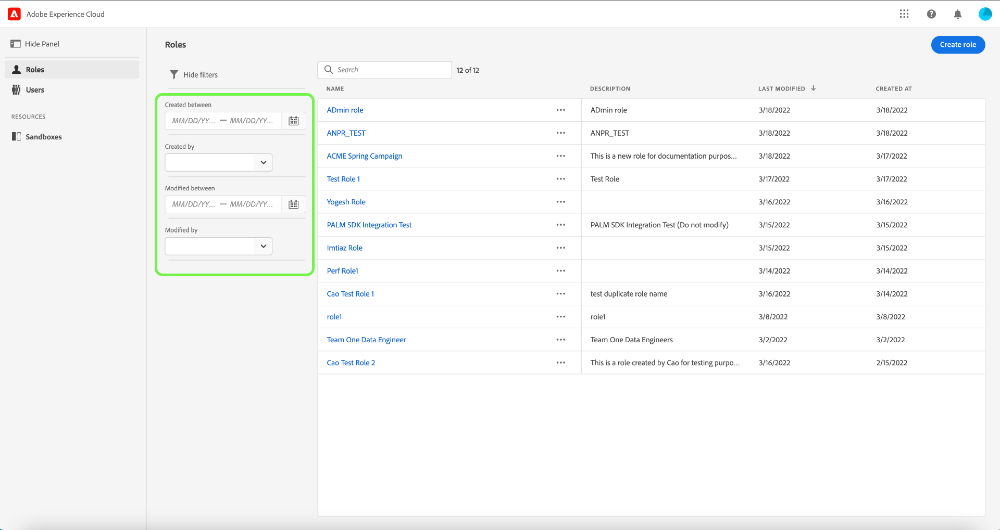
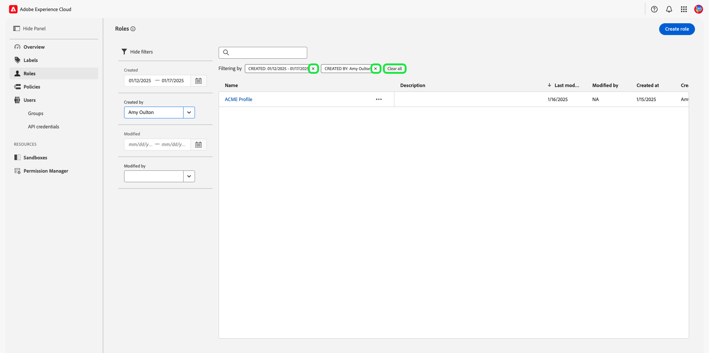
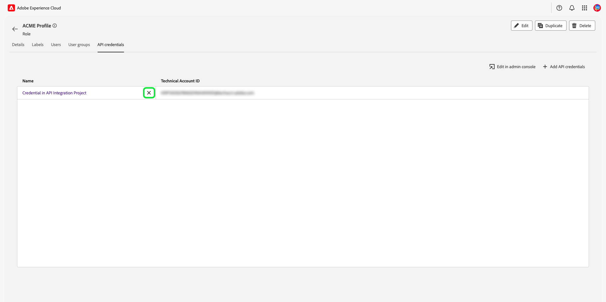

# Machtigingen voor een rol beheren {#manage-role-permissions}

>[!CONTEXTUALHELP]
>id="platform_permissions_roles_about"
>title="Wat zijn rollen?"
>abstract="De rollen bepalen de toegang die een beheerder, een specialist, of een eindgebruiker aan middelen in uw organisatie moet hebben. Zij categoriseren de gebruikers die met uw instantie van Experience Platform in wisselwerking staan en zijn de bouwstenen van toegangsbeheerbeleid. Een rol heeft een bepaalde reeks toestemmingen en de leden van uw organisatie kunnen aan één of meerdere rollen, afhankelijk van het werkingsgebied van mening worden toegewezen of toegang schrijven zij nodig hebben."
>additional-url="https://experienceleague.adobe.com/docs/experience-platform/access-control/abac/permissions-ui/roles.html?lang=nl-NL" text="Rollen beheren"

>[!IMPORTANT]
>
>Het toegangsbeheer gebruikt gebruiker - identiteitskaart (een interne unieke identiteitskaart die aan een gebruiker wordt toegewezen) voor het verlenen van toestemmingen. Wanneer een organisatie van Adobe ID naar bedrijfs-id wordt gemigreerd, gaan alle machtigingen die voor de gebruikers zijn ingesteld, verloren omdat de gebruikers-id wordt gewijzigd en het toegangsbeheer de nieuwe gebruikers-id gebruikt. Als uw organisatie is gemigreerd naar bedrijfs-id, neemt u contact op met uw Adobe-vertegenwoordiger om uw gebruikersnaam te migreren van Adobe ID naar bedrijfs-id.

Machtigingen zijn het gebied van Experience Cloud waar beheerders gebruikersrollen en toegangsbeleid kunnen definiëren om toegangsmachtigingen voor functies en objecten binnen een producttoepassing te beheren.

Door Toestemmingen, kunt u rollen tot stand brengen en beheren, evenals de gewenste middeltoestemmingen voor deze rollen toewijzen. Met machtigingen kunt u ook de labels, sandboxen en gebruikers beheren die aan een specifieke rol zijn gekoppeld.

Onmiddellijk nadat [&#x200B; creërend een nieuwe rol &#x200B;](#create-a-new-role), bent u teruggekeerd aan het **[!UICONTROL Roles]** lusje. Als u machtigingen voor een bestaande rol bewerkt, selecteert u de rol op het tabblad **[!UICONTROL Roles]** . U kunt ook de filteroptie gebruiken om de resultaten te filteren om een rol te zoeken.

## Filterrollen

Selecteer het pictogram van funnel () om een lijst van filtercontroles te tonen om smalle resultaten te helpen.

De volgende filters zijn beschikbaar voor rollen in UI:

| Filter | Beschrijving |
| --- | --- |
| [!UICONTROL Created between] | Selecteer een begindatum en/of een einddatum om een datumbereik te definiëren waarop de resultaten moeten worden gefilterd. |
| [!UICONTROL Created by] | Filteren op de maker van de rol door een gebruiker te selecteren in het vervolgkeuzemenu. |
| [!UICONTROL Modified between] | Selecteer een begindatum en/of een einddatum om een datumbereik te definiëren waarop de resultaten moeten worden gefilterd. |
| [!UICONTROL Modified by] | Filter op rolbepaling door een gebruiker van dropdown te selecteren. |

Als u een filter wilt verwijderen, selecteert u de &quot;X&quot; op het vulpictogram voor het desbetreffende filter of selecteert u **[!UICONTROL Clear all]** om alle filters te verwijderen.

## Roldetails {#role-details}

>[!CONTEXTUALHELP]
>id="platform_permissions_roles_details"
>title="Roloverzicht"
>abstract="In het dialoogvenster Roloverzicht worden de details van de rol weergegeven, inclusief de bronnen en sandboxen waartoe een bepaalde rol toegang heeft. U kunt labels, gebruikers, gebruikersgroepen en API-referenties voor de rol beheren door naar het bijbehorende tabblad te navigeren in de werkruimte van de rol."
>additional-url="https://experienceleague.adobe.com/nl/docs/experience-platform/access-control/abac/permissions-ui/permissions#manage-labels-for-a-role" text="Labels voor een rol beheren"
>additional-url="https://experienceleague.adobe.com/nl/docs/experience-platform/access-control/abac/permissions-ui/permissions#manage-users-for-a-role" text="Gebruikers voor een rol beheren"

Selecteer de rol op het tabblad **[!UICONTROL Roles]** , waarop het [!UICONTROL Details] -dashboard van de rol wordt geopend.

Het dashboard van [!UICONTROL Details] biedt een overzicht van de rol. In het overzicht worden de naam van de rol, de beschrijving, de maker en de laatste modifier weergegeven, samen met de datum waarop de rol is gemaakt en gewijzigd. Ook worden de machtigingen weergegeven die zijn gekoppeld aan de rol en de lijst met toegewezen sandboxen. De rolnaam en beschrijving kunnen, indien nodig, worden gewijzigd.

## Labels voor een rol beheren

Selecteer het tabblad **[!UICONTROL Labels]** om de werkruimte voor rollabels te openen en selecteer vervolgens **[!UICONTROL Add labels]** om labels aan de rol toe te wijzen.

Het dialoogvenster **[!UICONTROL Apply Access and Data Governance Labels]** wordt weergegeven en geeft een lijst met labels weer. In de lijst staan de labelnaam, de vriendelijke naam, de categorie en de beschrijving.

Selecteer de labels in de lijst die u aan de rol wilt toevoegen en selecteer vervolgens **[!UICONTROL Save]**

Toegevoegde labels worden weergegeven onder **[!UICONTROL Labels]** tab.

Als u een label uit een rol wilt verwijderen, selecteert u het label en vervolgens **[!UICONTROL Remove Labels]** .

## Sandboxen beheren voor een rol

Selecteer de tab **[!UICONTROL Details]** en navigeer naar de sectie **[!UICONTROL Sandboxes]** . Selecteer **[!UICONTROL View All]** om de volledige lijst met sandboxen weer te geven die aan de rol zijn toegevoegd.

Als u meer sandboxen aan een rol wilt toevoegen, selecteert u **[!UICONTROL Edit]** rechtsboven in de gebruikersinterface.

In het volgende scherm wordt u gevraagd welke sandboxbronnen u in de rol wilt opnemen via het vervolgkeuzemenu. Als u klaar bent, selecteert u **[!UICONTROL Save]** en vervolgens **[!UICONTROL Close]** .

## Gebruikers voor een rol beheren

Selecteer het tabblad **[!UICONTROL Users]** om de rollen [!UICONTROL Users] -werkruimte te openen en selecteer vervolgens **[!UICONTROL Add Users]** om gebruikers aan de rol toe te wijzen.

Het dialoogvenster **[!UICONTROL Add Users]** wordt weergegeven. Selecteer de gebruikers in de lijst die u aan de rol wilt toevoegen. U kunt ook de zoekbalk gebruiken om naar de gebruiker te zoeken door de naam of het e-mailadres in te voeren en vervolgens **[!UICONTROL Save]** te selecteren.

Toegevoegde gebruikers worden weergegeven onder **[!UICONTROL Users]** tab.

Om een gebruiker uit een rol te verwijderen, selecteer het **X** pictogram naast de naam van de gebruiker.

De volgende video is bedoeld om uw begrip van het creëren van een nieuwe rol en het leiden van gebruikers voor die rol te steunen.

>[!VIDEO](https://video.tv.adobe.com/v/336081/?learn=on)

## API-referenties voor een rol beheren {#manage-api-credentials-for-role}

>[!CONTEXTUALHELP]
>id="platform_permissions_apicredentials_about"
>title="Wat zijn API-referenties?"
>abstract="API-referenties worden toegewezen aan rollen om gebruikers en ontwikkelaars toegang te verlenen tot Experience Platform API&#39;s. Met Experience Platform API&#39;s kunt u via programmacode elementaire CRUD-bewerkingen (Maken, Lezen, Bijwerken, Verwijderen) uitvoeren op gegevens, zoals het configureren van berekende kenmerken, het openen van gegevens/entiteiten, het exporteren van gegevens, het verwijderen van overbodige gegevens of batches, enzovoort."
>additional-url="https://experienceleague.adobe.com/nl/docs/experience-platform/landing/platform-apis/api-guide" text="Experience Platform API-handleiding"

>[!IMPORTANT]
>
> Gebruikers moeten over beheerdersrechten voor het systeem beschikken om API-referenties te kunnen gebruiken en beheren in [!UICONTROL Permissions] .

Om Experience Platform APIs als gebruiker of ontwikkelaar te gebruiken, moet een systeembeheerder API geloofsbrieven toevoegen naast een rol gegeven reeks toestemmingen. Voor een volledige gids bij het creëren van en het toewijzen van API geloofsbrieven, evenals de toestemmingen nodig, verwijs naar het geleidelijke leerprogramma in [&#x200B; voor authentiek verklaren en toegang Experience Platform APIs &#x200B;](../../../landing/api-authentication.md#generate-credentials).

Selecteer het tabblad **[!UICONTROL API credentials]** om de werkruimte met API-referenties voor rollen te openen en selecteer vervolgens **[!UICONTROL Add API credentials]** om API-referenties aan de rol toe te wijzen.

Het dialoogvenster **[!UICONTROL Add API credentials]** wordt weergegeven. Selecteer API-referenties in de lijst om aan de rol toe te voegen en selecteer vervolgens **[!UICONTROL Save]**

Toegevoegde API-referenties worden weergegeven onder **[!UICONTROL API credentials]** tab.

Om een API referentie uit een rol te verwijderen, selecteer het **X** pictogram naast de API referentie naam.

Het dialoogvenster **[!UICONTROL Remove API credentials]** verschijnt waarin u wordt gevraagd het verwijderen te bevestigen. Selecteer **[!UICONTROL Confirm]** om het verwijderen van de geselecteerde referentie te voltooien.

U wordt teruggestuurd naar het tabblad **[!UICONTROL API credentials]** .

## Gebruikersgroepen beheren voor een rol {#manage-user-groups}

>[!CONTEXTUALHELP]
>id="platform_permissions_usergroups_about"
>title="Wat zijn gebruikersgroepen?"
>abstract="Gebruikersgroepen zijn verzamelingen van meerdere gebruikers die toegang tot dezelfde functies delen. De toegang tot middelen binnen een organisatie wordt beheerd door rollen die aan gebruikersgroepen worden toegewezen."
>additional-url="https://experienceleague.adobe.com/nl/docs/experience-platform/access-control/abac/permissions-ui/roles" text="Rollen beheren"

Gebruikersgroepen zijn meerdere gebruikers die zijn gegroepeerd en die toegang hebben om dezelfde functies uit te voeren.

Selecteer het tabblad **[!UICONTROL User groups]** om de werkruimte van de gebruikersgroepen voor de rol te openen en selecteer vervolgens **[!UICONTROL Add Groups]** om gebruikersgroepen aan de rol toe te wijzen.

Het dialoogvenster **[!UICONTROL Add Groups]** wordt weergegeven. Selecteer de gebruikersgroepen in de lijst die u aan de rol wilt toevoegen. U kunt ook de zoekbalk gebruiken om naar de gebruikersgroep te zoeken door de naam van de groep in te voeren en vervolgens **[!UICONTROL Save]** te selecteren

Toegevoegde gebruikersgroepen worden weergegeven onder **[!UICONTROL User groups]** tab.

Om een gebruikersgroep uit een rol te verwijderen, selecteer het **X** pictogram naast de naam van de gebruikersgroep.

Het dialoogvenster **[!UICONTROL Remove user group]** verschijnt waarin u wordt gevraagd het verwijderen te bevestigen. Selecteer **[!UICONTROL Confirm]** om de geselecteerde gebruikersgroep te verwijderen.

U wordt teruggestuurd naar het tabblad **[!UICONTROL User groups]** .

## Gebruikers aan Experience Platform toevoegen

Als systeembeheerder, kunt u ontwikkelaartoegang tot een gebruiker verlenen zodat kunnen zij [&#x200B; tot integratie &#x200B;](../../../landing/api-authentication.md#generate-credentials) in Adobe Developer Console leiden.

Om een gebruiker Experience Platform toe te voegen, login aan [&#x200B; Admin Console &#x200B;](https://adminconsole.adobe.com) en selecteer **[!UICONTROL Add users]**.

Het dialoogvenster **[!UICONTROL Add users to your team]** wordt weergegeven. Voer het e-mailadres, de voornaam (optioneel) en de achternaam (optioneel) van de gebruiker in. Selecteer vervolgens **[!UICONTROL Products]** .

Het dialoogvenster **[!UICONTROL Select products]** wordt weergegeven. Selecteer **[!UICONTROL Adobe Experience Platform]**.

Het dialoogvenster **[!UICONTROL Select product profiles]** wordt weergegeven. Selecteer **[!UICONTROL AEP-Default-All-Users]** en selecteer vervolgens **[!UICONTROL Save]** .

Controleer de gegevens en selecteer vervolgens **[!UICONTROL Save]** om de gebruiker toe te voegen.

## Volgende stappen

Met gevestigde toestemmingen, kunt u aan de volgende stap te werk gaan [&#x200B; gebruikers &#x200B;](users.md) beheren.
