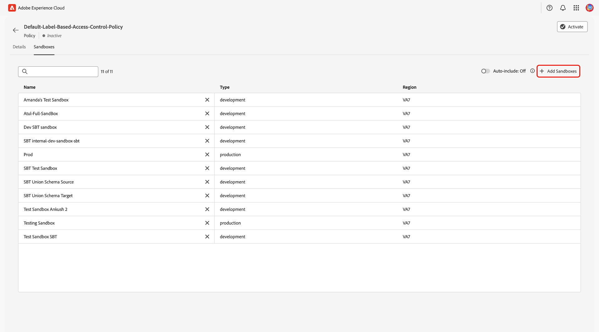
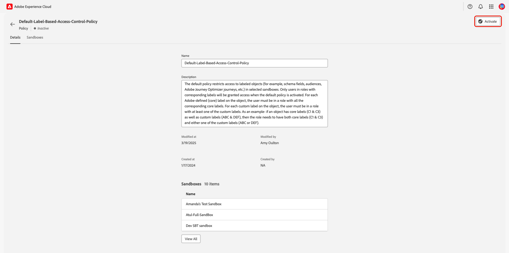
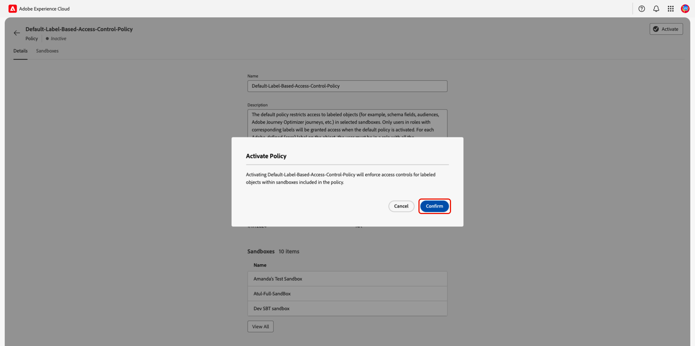

# Beleid voor toegangsbeheer beheren

Het beleid van de toegangscontrole is verklaringen die attributen samenbrengen om toelaatbare en ontoelaatbare acties te vestigen. Adobe verstrekt een standaardbeleid dat onmiddellijk kan worden geactiveerd of wanneer uw organisatie klaar is om toegang tot specifieke die voorwerpen te beginnen te controleren op [&#x200B; worden gebaseerd etiketten &#x200B;](./labels.md){target="_blank"}. Het standaardbeleid, **[!UICONTROL Default-Label-Based-Access-Control-Policy]**, leverages labels die op middelen worden toegepast om toegang te ontkennen tenzij de gebruikers in een rol met een passend etiket zijn.

>[!IMPORTANT]
>
>Het beleid van de toegangscontrole zou niet met het beleid van het gegevensgebruik moeten worden verward, dat controleert hoe de gegevens in Adobe Experience Platform worden gebruikt. Zie de gids bij het creëren van [&#x200B; beleid van het gegevensgebruik &#x200B;](../../../data-governance/policies/create.md){target="_blank"} voor meer informatie.

## Beleid voor een sandbox configureren {#configure-policy}

>[!NOTE]
>
>Het **[!UICONTROL Default-Label-Based-Access-Control-Policy]** -beleid is momenteel het enige beleid dat beschikbaar is voor configuratie.

Beginnen vormend een beleid, navigeer aan **[!UICONTROL Permissions]** in [&#x200B; Adobe Experience Cloud &#x200B;](https://experience.adobe.com/){target="_blank"}. Selecteer **[!UICONTROL Policies]** in het linkerdeelvenster. Selecteer de **[!UICONTROL Default-Label-Based-Access-Control-Policy]** in de lijst.

{zoomable="yes"}

De werkruimte Details van het beleid wordt weergegeven. Selecteer het **[!UICONTROL Sandboxes]**. Er wordt een lijst weergegeven met sandboxen die aan het beleid zijn gekoppeld.

{zoomable="yes"}

### Beleid toevoegen aan alle sandboxen {#add-policy-to-all}

>[!IMPORTANT]
>
>Standaard is **[!UICONTROL Auto-include]** ingeschakeld, wat betekent dat alle huidige en toekomstige sandboxen automatisch aan het beleid worden toegevoegd.

Schakel de functie **[!UICONTROL Auto-include]** uit om te voorkomen dat toekomstige sandboxen automatisch aan het beleid worden toegevoegd. Het in- en uitschakelen van de functie **verwijdert** geen sandboxen uit het beleid.

{zoomable="yes"}

Als **[!UICONTROL Auto-include]** niet actief is in een beleid, kunt u de schakeloptie gebruiken om deze weer in te schakelen. In het dialoogvenster **[!UICONTROL Enable Auto-include]** wordt u gevraagd uw selectie te bevestigen. Selecteer **[!UICONTROL Enable]** om de configuratie-instelling te voltooien.

>[!NOTE]
>
>De sandboxen die u uit het beleid hebt verwijderd terwijl **[!UICONTROL Auto-include]** was uitgeschakeld, worden opnieuw toegevoegd.

{zoomable="yes"}

### Sandboxen handmatig selecteren voor een beleid {#manually-select-sandboxes}

Om zandbakken aan een beleid manueel toe te voegen of te verwijderen, moet **[!UICONTROL Auto-include]** knevel **&#x200B;**&#x200B;weg zijn.

#### Sandboxen toevoegen

Selecteer **[!UICONTROL Add Sandboxes]** als u sandboxen aan een beleid wilt toevoegen.

{zoomable="yes"}

Het dialoogvenster **[!UICONTROL Add Sandboxes]** wordt weergegeven. Selecteer de sandbox(s) die u aan het beleid wilt toevoegen en selecteer vervolgens **[!UICONTROL Save]** .

{zoomable="yes"}

>[!NOTE]
>
>Als alle beschikbare sandboxen al aan het beleid zijn toegevoegd, wordt het bericht &quot;U hebt niets in uw bibliotheek&quot; weergegeven in het dialoogvenster.

#### Sandboxen verwijderen

Om zandbakken uit een beleid te verwijderen, vind zandbak u wenst om uit de lijst te verwijderen en dan het **X** pictogram te selecteren.

{zoomable="yes"}

Er wordt een bevestigingsvenster weergegeven. Selecteer **[!UICONTROL Confirm]** om het verwijderen van de sandbox uit het beleid te voltooien.

{zoomable="yes"}

## Een beleid activeren {#activate-policy}

>[!CONTEXTUALHELP]
>id="platform_permissions_policies_about"
>title="Wat is het beleid?"
>abstract="Het beleid is verklaringen die attributen samenbrengen om toegelaten en ontoelaatbare acties te vestigen. Elke organisatie wordt geleverd met een standaardbeleid dat u moet activeren om toegang tot specifieke die voorwerpen te controleren op etiketten worden gebaseerd. De etiketten die op middelen worden toegepast ontkennen toegang tenzij de gebruikers aan een rol met een passend etiket worden toegewezen. Het beleid kan niet worden uitgegeven of worden geschrapt, maar zij kunnen worden geactiveerd of worden gedeactiveerd."
>additional-url="https://experienceleague.adobe.com/en/docs/experience-platform/access-control/abac/permissions-ui/labels" text="Labels beheren"

Als u een bestaand beleid wilt activeren, selecteert u het beleid op de tab **[!UICONTROL Policies]** in **[!UICONTROL Permissions]** . De activeringsstatus van het beleid is zichtbaar onder de sectie **[!UICONTROL Status]** .

{zoomable="yes"}

De werkruimte Details van het beleid wordt weergegeven. Selecteer **[!UICONTROL Activate]**.

{zoomable="yes"}

Het dialoogvenster **[!UICONTROL Activate Policy]** wordt weergegeven. Selecteer **[!UICONTROL Confirm]** om de activering van het beleid te voltooien.

{zoomable="yes"}

## Volgende stappen

Met een geactiveerd beleid, kunt u aan de volgende stap te werk gaan [&#x200B; toestemmingen voor een rol &#x200B;](permissions.md) beheren.

<!--Policies are applied at the sandbox level to control which sandboxes enforce label-based access control. By default, the **[!UICONTROL Auto-include]** feature is turned on, which means all current and future sandboxes are automatically added to the policy. When **[!UICONTROL Auto-include]** is turned off, only the sandboxes you manually add will be subject to the policy's access control rules.

To begin configuring a policy's sandboxes, navigate to **[!UICONTROL Permissions]** in [Adobe Experience Cloud](https://experience.adobe.com/){target="_blank"}. Select **[!UICONTROL Policies]** from the left panel, then select the **[!UICONTROL Default-Label-Based-Access-Control-Policy]** from the list.

The policy's details workspace appears. Select the **[!UICONTROL Sandboxes]** tab to view the list of sandboxes associated with the policy and access the sandbox configuration options.

### Manage Auto-include {#manage-auto-include}

To control which sandboxes are included in a policy, you can toggle the **[!UICONTROL Auto-include]** feature on or off. When you toggle off **[!UICONTROL Auto-include]**, future sandboxes will not be automatically added to the policy. However, toggling off the feature **will not** remove any sandboxes that are already included in the policy.

To re-enable **[!UICONTROL Auto-include]**, use the toggle to turn it back on. The **[!UICONTROL Enable Auto-include]** dialog appears prompting you to confirm your selection. Select **[!UICONTROL Enable]** to complete the configuration setting.

>[!NOTE]
>
>When you re-enable **[!UICONTROL Auto-include]**, any sandboxes you previously removed from the policy will be re-added.

### Manually manage sandboxes {#manually-manage-sandboxes}

When **[!UICONTROL Auto-include]**is turned off, you can manually add or remove specific sandboxes from the policy. This gives you precise control over which sandboxes enforce the policy's access control rules.

>[!NOTE]
>
>To manually add or remove sandboxes, the **[!UICONTROL Auto-include]** toggle **must** be off.

**To add sandboxes:**

Select **[!UICONTROL Add Sandboxes]** from the policy's sandbox workspace.

The **[!UICONTROL Add Sandboxes]** dialog appears, displaying your library of available sandboxes. Select the sandbox(es) you wish to add to the policy and then select **[!UICONTROL Save]**.

>[!NOTE]
>
>If all available sandboxes are already included in the policy, you will see a "You have nothing in your library" message within the dialog.

**To remove sandboxes:**

Find the sandbox you wish to remove from the list and select the **X** icon next to its name.

A confirmation dialog will appear. Select **[!UICONTROL Confirm]** to finish removing the sandbox from the policy.

-->