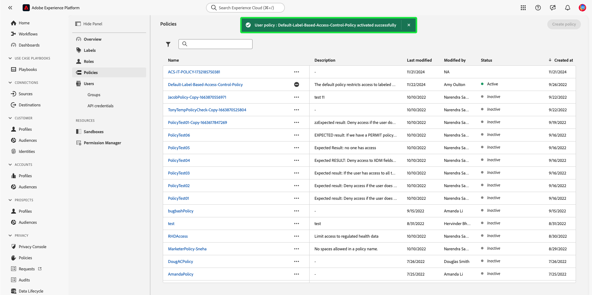

# Beleid voor toegangsbeheer beheren

Het beleid van de toegangscontrole is verklaringen die attributen samenbrengen om toelaatbare en ontoelaatbare acties te vestigen. Het toegangsbeleid kan of lokaal of globaal zijn, en kan ander beleid met voeten treden. Adobe biedt een standaardbeleid dat direct kan worden geactiveerd of wanneer uw organisatie gereed is om de toegang tot specifieke objecten te beheren op basis van labels. Het standaardbeleid leverages etiketten die op middelen worden toegepast om toegang te ontkennen tenzij de gebruikers in een rol met een passend etiket zijn.

>[!IMPORTANT]
>
>Het beleid van de toegang moet niet met het beleid van het gegevensgebruik worden verward, dat controleert hoe het gegeven in Adobe Experience Platform wordt gebruikt in plaats van welke gebruikers in uw organisatie toegang tot het hebben. Zie de handleiding bij het maken van [beleid voor gegevensgebruik](../../../data-governance/policies/create.md) voor meer informatie .

<!-- ## Create a new policy

To create a new policy, select the **[!UICONTROL Policies]** tab in the sidebar and select **[!UICONTROL Create Policy]**.

The **[!UICONTROL Create a new policy]** dialog appears, prompting you to enter a name, and an optional description. When finished, select **[!UICONTROL Confirm]**.

Using the dropdown arrow select if you would like to **Permit access to** () a resource or **Deny access to** () a resource.

Next, select the resource that you would like to include in the policy using the dropdown menu and search access type, read or write.

Next, using the dropdown arrow select the condition you would like to apply to this policy, **The following being true** () or **The following being false** ().

Select the plus icon to **Add matches expression** or **Add expression group** for the resource. 

Using the dropdown, select the **Resource**.

Next, using the dropdown select the **Matches**.

Next, using the dropdown, select the type of label (**[!UICONTROL Core label]** or **[!UICONTROL Custom label]**) to match the label assigned to the User in roles.

Finally, select the **Sandbox** that you would like the policy conditions to apply to, using the dropdown menu.

Select **Add resource** to add more resources. Once finished, select **[!UICONTROL Save and exit]**.

The new policy is successfully created, and you are redirected to the **[!UICONTROL Policies]** tab, where you will see the newly created policy appear in the list. 

## Edit a policy

To edit an existing policy, select the policy from the **[!UICONTROL Policies]** tab. Alternatively, use the filter option to filter the results to find the policy you want to edit.

Next, select the ellipsis (`…`) next to the policies name, and a dropdown displays controls to edit, deactivate, delete, or duplicate the role. Select edit from the dropdown.

The policy permissions screen appears. Make the updates then select **[!UICONTROL Save and exit]**.

The policy is successfully updated, and you are redirected to the **[!UICONTROL Policies]** tab.

## Duplicate a policy

To duplicate an existing policy, select the policy from the **[!UICONTROL Policies]** tab. Alternatively, use the filter option to filter the results to find the policy you want to edit.

Next, select the ellipsis (`…`) next to a policies name, and a dropdown displays controls to edit, deactivate, delete, or duplicate the role. Select duplicate from the dropdown.

The **[!UICONTROL Duplicate policy]** dialog appears, prompting you to confirm the duplication. 

The new policy appears in the list as a copy of the original on the **[!UICONTROL Policies]** tab.

## Delete a policy

To delete an existing policy, select the policy from the **[!UICONTROL Policies]** tab. Alternatively, use the filter option to filter the results to find the policy you want to delete.

Next, select the ellipsis (`…`) next to a policies name, and a dropdown displays controls to edit, deactivate, delete, or duplicate the role. Select delete from the dropdown.

The **[!UICONTROL Delete user policy]** dialog appears, prompting you to confirm the deletion. 

You are returned to the **[!UICONTROL policies]** tab and a confirmation of deletion pop over appears.

 -->

## Een beleid activeren

Als u een bestaand beleid wilt activeren, selecteert u het beleid in het menu **[!UICONTROL Policies]** tab.

Selecteer vervolgens de ellips (`…`) naast de naam van een beleid en een vervolgkeuzelijst bevat besturingselementen voor het bewerken, activeren, verwijderen of dupliceren van de rol. Selecteer activeren in het vervolgkeuzemenu.

De **[!UICONTROL Activate policy]** wordt weergegeven en u wordt gevraagd de activering te bevestigen.

U bent teruggekeerd aan **[!UICONTROL policies]** en verschijnt er een bevestiging van de activeringspop. De beleidsstatus wordt als actief weergegeven.

## Volgende stappen

Als een beleid geactiveerd is, kunt u verdergaan met de volgende stap naar [machtigingen voor een rol beheren](permissions.md).
