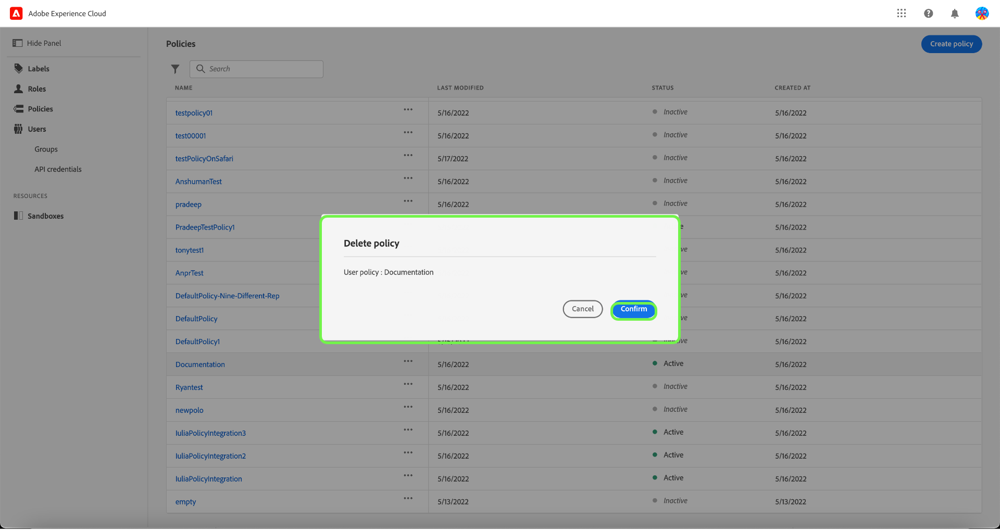

# Beleid voor toegangsbeheer beheren

Het beleid van de toegangscontrole is verklaringen die attributen samenbrengen om toelaatbare en ontoelaatbare acties te vestigen. Het toegangsbeleid kan of lokaal of globaal zijn, en kan ander beleid met voeten treden.

>[!IMPORTANT]
>
>Het beleid van de toegang moet niet met het beleid van het gegevensgebruik worden verward, dat controleert hoe het gegeven in Adobe Experience Platform wordt gebruikt in plaats van welke gebruikers in uw organisatie toegang tot het hebben. Zie de handleiding bij het maken van [beleid voor gegevensgebruik](../../../data-governance/policies/create.md) voor meer informatie .

## Nieuw beleid maken

Als u een nieuw beleid wilt maken, selecteert u de optie **[!UICONTROL Policies]** op de zijbalk en selecteert u **[!UICONTROL Create Policy]**.

De **[!UICONTROL Create a new policy]** wordt weergegeven en u wordt gevraagd een naam en een optionele beschrijving in te voeren. Als u klaar bent, selecteert u **[!UICONTROL Confirm]**.

Selecteer met de vervolgkeuzepijl of u **Toegang tot** (een bron of **Toegang weigeren tot** () een resource.

Selecteer vervolgens de bron die u in het beleid wilt opnemen met behulp van het vervolgkeuzemenu en het type zoektoegang, lezen of schrijven.

Selecteer vervolgens met de vervolgkeuzepijl de voorwaarde die u op dit beleid wilt toepassen, **Het volgende is waar** () of **De volgende fout is onwaar** ().

Selecteer het plusteken om **Overeenkomstexpressie toevoegen** of **Expressiegroep toevoegen** voor de bron.

Selecteer in het vervolgkeuzemenu de optie **Resource**.

Selecteer vervolgens in het vervolgkeuzemenu de optie **Overeenkomsten**.

Selecteer vervolgens met het vervolgkeuzemenu het type label (**[!UICONTROL Core label]** of **[!UICONTROL Custom label]**) om het label aan te passen dat is toegewezen aan de gebruiker in rollen.

Tot slot selecteert u **Sandbox** waarop u de beleidsvoorwaarden wilt toepassen via het vervolgkeuzemenu.

Selecteren **Bron toevoegen** om meer bronnen toe te voegen. Als u klaar bent, selecteert u **[!UICONTROL Save and exit]**.

Het nieuwe beleid is gemaakt en u wordt omgeleid naar de **[!UICONTROL Policies]** , waarin het nieuwe beleid in de lijst wordt weergegeven.

## Een beleid bewerken

Als u een bestaand beleid wilt bewerken, selecteert u het beleid in het menu **[!UICONTROL Policies]** tab. U kunt ook de filteroptie gebruiken om de resultaten te filteren en het beleid te zoeken dat u wilt bewerken.

Selecteer vervolgens de ellips (`…`) naast de naam van het beleid en een vervolgkeuzelijst bevat besturingselementen voor het bewerken, deactiveren, verwijderen of dupliceren van de rol. Selecteer Bewerken in het vervolgkeuzemenu.

Het scherm Beleidsmachtigingen wordt weergegeven. Breng de updates aan en selecteer **[!UICONTROL Save and exit]**.

Het beleid is bijgewerkt en u wordt omgeleid naar de **[!UICONTROL Policies]** tab.

## Een beleid dupliceren

Als u een bestaand beleid wilt dupliceren, selecteert u het beleid in het menu **[!UICONTROL Policies]** tab. U kunt ook de filteroptie gebruiken om de resultaten te filteren en het beleid te zoeken dat u wilt bewerken.

Selecteer vervolgens de ellips (`…`) naast de naam van een beleid en een vervolgkeuzelijst bevat besturingselementen voor het bewerken, deactiveren, verwijderen of dupliceren van de rol. Selecteer dupliceren in het vervolgkeuzemenu.

De **[!UICONTROL Duplicate policy]** wordt weergegeven, waarin u wordt gevraagd de duplicatie te bevestigen.

Het nieuwe beleid wordt in de lijst weergegeven als een kopie van het origineel in het dialoogvenster **[!UICONTROL Policies]** tab.

## Een beleid verwijderen

Als u een bestaand beleid wilt verwijderen, selecteert u het beleid in het menu **[!UICONTROL Policies]** tab. U kunt ook de filteroptie gebruiken om de resultaten te filteren om het beleid te zoeken dat u wilt verwijderen.

Selecteer vervolgens de ellips (`…`) naast de naam van een beleid en een vervolgkeuzelijst bevat besturingselementen voor het bewerken, deactiveren, verwijderen of dupliceren van de rol. Selecteer Verwijderen in het vervolgkeuzemenu.

De **[!UICONTROL Delete user policy]** wordt weergegeven en u wordt gevraagd de verwijdering te bevestigen.

U bent teruggekeerd aan **[!UICONTROL policies]** wordt weergegeven en verschijnt er een bevestigingspop-up.

## Een beleid activeren

Als u een bestaand beleid wilt activeren, selecteert u het beleid in het menu **[!UICONTROL Policies]** tab. U kunt ook de filteroptie gebruiken om de resultaten te filteren om het beleid te zoeken dat u wilt verwijderen.

Selecteer vervolgens de ellips (`…`) naast de naam van een beleid en een vervolgkeuzelijst bevat besturingselementen voor het bewerken, activeren, verwijderen of dupliceren van de rol. Selecteer activeren in het vervolgkeuzemenu.

De **[!UICONTROL Activate user policy]** wordt weergegeven en u wordt gevraagd de activering te bevestigen.

U bent teruggekeerd aan **[!UICONTROL policies]** en verschijnt er een bevestiging van de activeringspop. De beleidsstatus wordt als actief weergegeven.

## Volgende stappen

Als er een nieuw beleid is gemaakt, kunt u verdergaan met de volgende stap naar [machtigingen voor een rol beheren](permissions.md).
