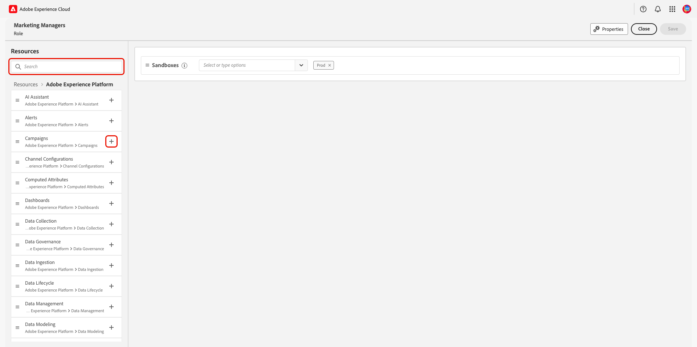
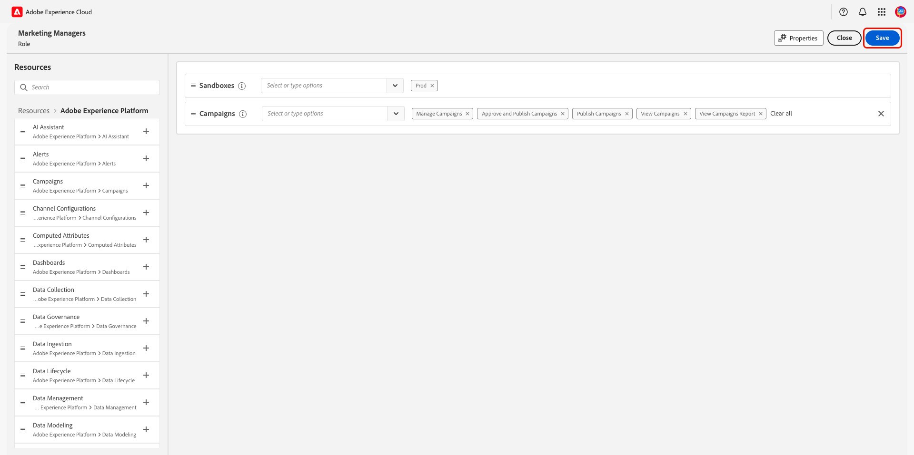
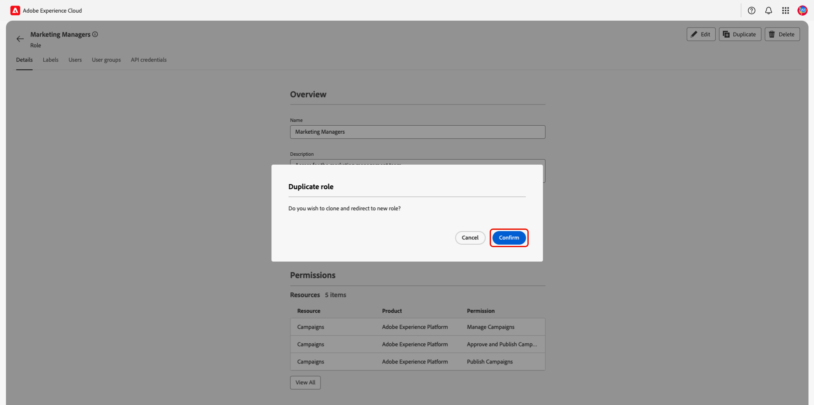

# Rollen beheren

<!-- UPDATE ROLES WITH A MORE COMPREHENSIVE EXPLANATION -->

Beginnen met het beheren van rollen, navigeer aan **[!UICONTROL Permissions]** in [&#x200B; Adobe Experience Cloud &#x200B;](https://experience.adobe.com/){target="_blank"} en selecteer **[!UICONTROL Roles]** in het linkerpaneel.

## Een nieuwe rol maken {#create-new-role}

>[!CONTEXTUALHELP]
>id="platform_permissions_roles_about_create"
>title="Nieuwe rol maken"
>abstract="Maak nieuwe rollen om gebruikers die met uw Experience Platform-instantie werken beter te categoriseren. U kunt bijvoorbeeld een rol maken voor een intern marketingteam en het label Gereglementeerde gezondheidsgegevens (RHD) op die rol toepassen, zodat uw interne marketingteam toegang krijgt tot de beschermde gezondheidsinformatie (PHI). Alternatief, kunt u een rol voor een extern agentschap ook tot stand brengen en die roltoegang tot PHI gegevens ontkennen door het etiket RHD op die rol niet toe te passen."
>additional-url="https://experienceleague.adobe.com/docs/experience-platform/access-control/abac/permissions-ui/roles.html?lang=nl-NL" text="Rollen beheren"
>additional-url="https://experienceleague.adobe.com/nl/docs/experience-platform/access-control/abac/end-to-end-guide#label-roles" text="Labels op een rol toepassen"

Als u een nieuwe rol wilt maken, selecteert u **[!UICONTROL Create role]** .

>[!TIP]
>
>Alleen-lezen rollen zijn beschikbaar buiten de box. Een read-only rol is een rol die een gebruiker de capaciteit verleent om gegevens, configuratie, en eigenschappen UI zonder enige capaciteit te bekijken om systeemstaat te veranderen. Beheerders kunnen deze rollen niet bewerken, maar kunnen gebruikers aan de rollen koppelen.

Het dialoogvenster **[!UICONTROL Create new role]** wordt weergegeven. Voer een **[!UICONTROL Name]** in voor de rol en (optioneel) een **[!UICONTROL Description]** en selecteer vervolgens **[!UICONTROL Confirm]** .

De werkruimte van **[!UICONTROL Resources]** wordt weergegeven. Zoek de gewenste bron door te schuiven of door de naam van de bron in te voeren in de zoekbalk in het linkerdeelvenster. Voeg middelen toe door het  naast de naam van het middel te selecteren.

<!-- ADD IN NOTE ABOUT THE DEFAULT SANDBOX - THIS SHOULD BE MENTIONED IN THE HIGHER LEVEL DOCS, WE MAY BE ABLE TO LINK TO IT -->

De bron wordt toegevoegd aan de hoofdwerkruimte. Selecteer het vervolgkeuzemenu naast de naam van de bron en selecteer de machtigingen die u aan de rol wilt toevoegen. U kunt ze afzonderlijk kiezen, selecteren **[!UICONTROL Add all]** of specifieke machtigingen zoeken door de naam van de machtiging in te voeren op de zoekbalk.

Ga door met het selecteren van alle bronnen en machtigingen die u aan de rol wilt toevoegen. Selecteer **[!UICONTROL Save]** als u klaar bent.

U ontvangt een waarschuwing met de mededeling dat de rol is opgeslagen. Selecteer **[!UICONTROL Close]** om terug te keren naar de werkruimte van **[!UICONTROL Roles]** .

De nieuwe rol is gemaakt en u wordt omgeleid naar de **[!UICONTROL Roles]** -pagina, waar de nieuw gemaakte rol in de lijst wordt weergegeven.

<!-- The following video is intended to support your understanding of creating a new role and managing users for that role.

>[!VIDEO](https://video.tv.adobe.com/v/3475979/?captions=dut&learn=on) -->

## Een rol dupliceren

Als u een rol dupliceert, worden de details, machtigingen, labels en sandboxen gekopieerd. Gebruikers, gebruikersgroepen, en API geloofsbrieven **worden niet** gekopieerd over en zullen manueel aan de rol moeten worden toegevoegd.

Als u een bestaande rol wilt dupliceren, zoekt u de rol die u wilt dupliceren op het tabblad **[!UICONTROL Roles]** . Selecteer  naast de naam van de rol, en selecteer dan **[!UICONTROL Duplicate]** van het dropdown menu.

Het dialoogvenster voor dubbele bevestiging wordt weergegeven. Selecteer **[!UICONTROL Confirm]** om het dupliceren van de rol te voltooien. De nieuwe rol wordt onder dezelfde naam opgeslagen, waarbij `_Copy` als achtervoegsel wordt toegevoegd.

U kunt ook een rol dupliceren vanuit de werkruimte van een individuele rol. Selecteer in de werkruimte **[!UICONTROL Roles]** de rol die u wilt dupliceren en selecteer vervolgens **[!UICONTROL Duplicate]** .

Het dialoogvenster voor dubbele bevestiging wordt weergegeven. Selecteer **[!UICONTROL Confirm]** om het dupliceren van de rol te voltooien. U wordt omgeleid naar de nieuwe rol.

## Een rol verwijderen

Als u een rol wilt verwijderen, zoekt u de rol die u wilt verwijderen op het tabblad **[!UICONTROL Roles]** . Selecteer  naast de naam van de rol, en selecteer dan **[!UICONTROL Delete]** van het dropdown menu.

Het bevestigingsvenster voor verwijderen wordt weergegeven. Selecteer **[!UICONTROL Confirm]** om het verwijderen van de rol te voltooien.

U kunt ook een rol verwijderen vanuit de werkruimte van een individuele rol. Selecteer in de werkruimte **[!UICONTROL Roles]** de rol die u wilt verwijderen en selecteer vervolgens **[!UICONTROL Delete]** .

Het bevestigingsvenster voor verwijderen wordt weergegeven. Selecteer **[!UICONTROL Confirm]** om het verwijderen van de rol te voltooien.

<!-- ADD PERMISSIONS TO THIS PAGE -->

## Volgende stappen

Met een nieuwe gecreeerde rol, kunt u aan de volgende stap te werk gaan [&#x200B; toestemmingen voor een rol &#x200B;](permissions.md) beheren.
