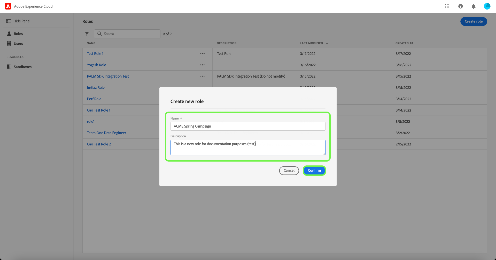

# Rollen beheren

De rollen bepalen de toegang die een beheerder, een specialist, of een eindgebruiker aan middelen in uw organisatie moet hebben. In een op rol-gebaseerd milieu van het toegangsbeheer, is de levering van de gebruikerstoegang groepering door gemeenschappelijke verantwoordelijkheden en behoeften. Een rol heeft een bepaalde reeks toestemmingen en de leden van uw organisatie kunnen aan één of meerdere rollen, afhankelijk van het werkingsgebied van mening worden toegewezen of toegang schrijven zij nodig hebben.

## Een nieuwe rol maken

Als u een nieuwe rol wilt maken, selecteert u de tab **[!UICONTROL Roles]** in het zijpaneel en selecteert u **[!UICONTROL Create Role]** .

Het dialoogvenster **[!UICONTROL Create a new role]** wordt weergegeven, waarin u wordt gevraagd een naam en een optionele beschrijving in te voeren.

Selecteer **[!UICONTROL Confirm]** als u klaar bent.

Selecteer vervolgens de bronmachtigingen die u in de rol wilt opnemen via het vervolgkeuzemenu.

Als u aanvullende bronnen wilt toevoegen, selecteert u **[!UICONTROL Adobe Experience Platform]** in het navigatievenster aan de linkerkant, dat een lijst met bronnen weergeeft. U kunt ook de naam van de bron invoeren in de zoekbalk in het linkernavigatievenster.

Klik op de relevante bron en sleep deze naar het hoofddeelvenster.

Selecteer de bronmachtigingen die u in de rol wilt opnemen via het vervolgkeuzemenu. Herhaal dit voor alle bronnen die u voor de rol wilt opnemen. Selecteer **[!UICONTROL Save and exit]** als u klaar bent.

De nieuwe rol is gemaakt en u wordt omgeleid naar de **[!UICONTROL Roles]** -pagina, waar de nieuw gemaakte rol in de lijst wordt weergegeven.

Zie de secties op [ het leiden toestemmingen voor een rol ](#manage-permissions-for-a-role) voor meer details over hoe te om roltoestemmingen te beheren zodra zij worden gecreeerd.

De volgende video is bedoeld om uw begrip van het creëren van een nieuwe rol en het leiden van gebruikers voor die rol te steunen.

>[!VIDEO](https://video.tv.adobe.com/v/336081/?learn=on)

## Een rol dupliceren

Als u een bestaande rol wilt dupliceren, selecteert u de rol op het tabblad **[!UICONTROL Roles]** . U kunt ook de filteroptie gebruiken om de resultaten te filteren om de rol te zoeken die u wilt dupliceren.

Selecteer vervolgens **[!UICONTROL Duplicate]** in de rechterbovenhoek van het scherm.

Het dialoogvenster **[!UICONTROL Duplicate role]** wordt weergegeven, waarin u wordt gevraagd de duplicatie te bevestigen.

Vervolgens gaat u naar de detailpagina van de rol waar u de naam en machtigingen voor de rol kunt wijzigen. De details, de Etiketten, en de Sandboxen worden gedupliceerd van de vorige rol. Gebruikers moeten via het tabblad Gebruikers worden toegevoegd. U kunt [ bekijken beheert toestemmingen voor een rol ](permissions.md) document om meer over het toevoegen van Details, Etiketten, Sandboxes, en Gebruikers aan een rol te leren.

Klik op de linkerpijl om terug te keren naar de tab **[!UICONTROL Roles]** .

De nieuwe rol wordt weergegeven in de lijst op de pagina **[!UICONTROL Roles]** .

## Een rol verwijderen

Selecteer de ellips (`…`) naast de naam van een rol, en een dropdown vertoningencontroles om, de rol uit te geven te schrappen of te dupliceren. Selecteer Verwijderen in het vervolgkeuzemenu.

Het dialoogvenster **[!UICONTROL Delete user role]** verschijnt waarin u wordt gevraagd de verwijdering te bevestigen.

U wordt teruggestuurd naar het tabblad **[!UICONTROL Roles]** .

## Volgende stappen

Met een nieuwe gecreeerde rol, kunt u aan de volgende stap te werk gaan [ toestemmingen voor een rol ](permissions.md) beheren.
