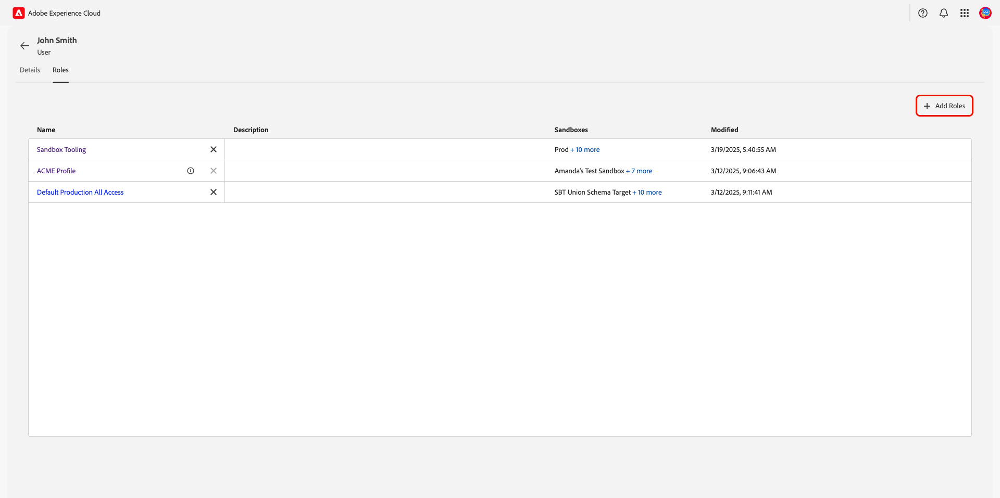
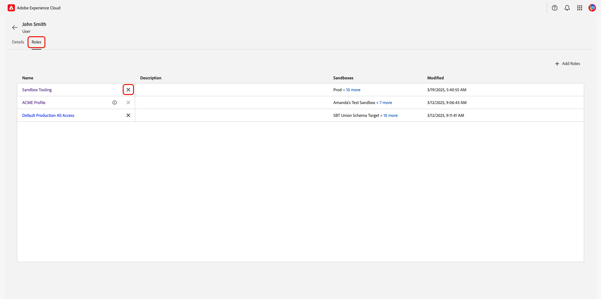
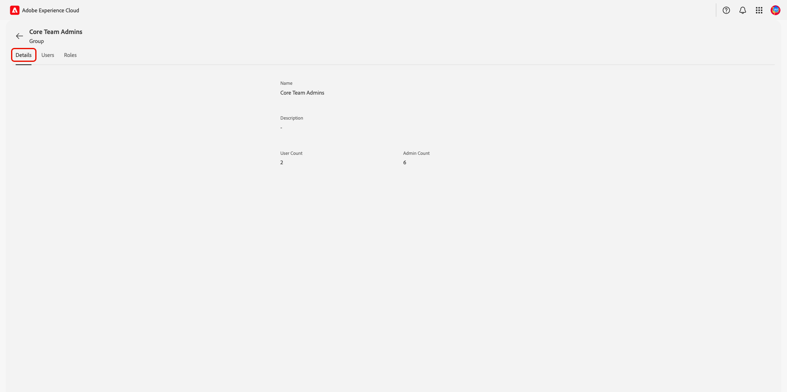
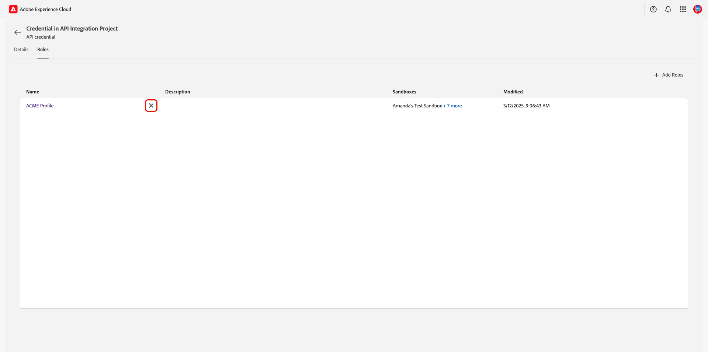
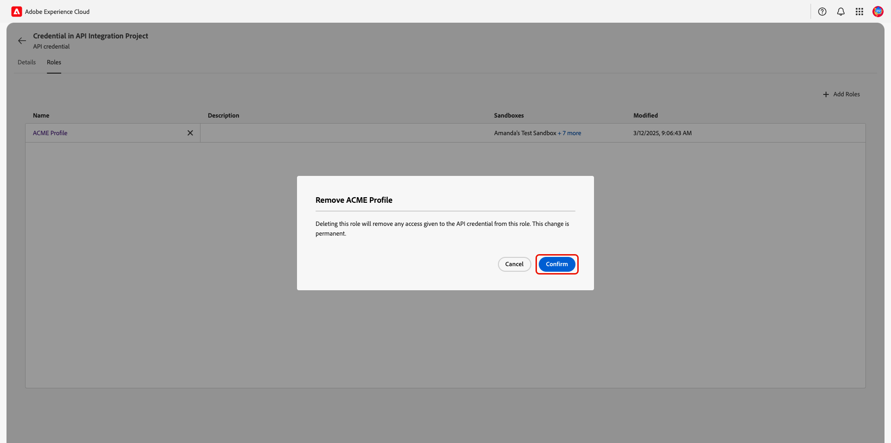

# Gebruikers beheren en gebruikersgroepen toevoegen {#manage-users}

>[!CONTEXTUALHELP]
>id="platform_permissions_users_about"
>title="Wat zijn gebruikers?"
>abstract="Gebruikers zijn de personen die toegang hebben tot Experience Platform. De toegang van een individuele gebruiker tot de middelen van een organisatie wordt beheerd door rollen."
>additional-url="https://experienceleague.adobe.com/en/docs/experience-platform/access-control/abac/permissions-ui/roles" text="Rollen beheren"

Gebruikers zijn de personen die toegang hebben tot Adobe Experience Platform. De toegang van een individuele gebruiker tot de middelen van een organisatie wordt beheerd door [&#x200B; rollen &#x200B;](./roles.md){target="_blank"}. Een organisatie kan [&#x200B; gebruikersgroepen &#x200B;](#user-groups) ook creëren om naadloze toegang tot veelvoudige gebruiker tezelfdertijd te geven. Gebruikers worden beheerd in de Admin Console en gebruikers die zijn gekoppeld aan de Adobe Experience Platform-productkaart worden weergegeven als onderdeel van de gebruikerslijst in Experience Platform.

## Gebruikers beheren

<!-- ADD LINKS INTO IMPORTANT NOTE BELOW
>[!IMPORTANT]
>
>[!UICONTROL Permissions] manages access control for existing Experience Platform users. To add users to Experience Platform, navigate to Adobe Admin Console through the **[!UICONTROL Edit in admin console]** option. To learn how to add users through the Admin Console, follow the [adding users to Experience Platform](...){#target="_blank"} guide.
-->

Om de gebruikers van uw organisatie te bekijken, navigeer aan **[!UICONTROL Permissions]** in [&#x200B; Adobe Experience Cloud &#x200B;](https://experience.adobe.com/){target="_blank"}. Selecteer **[!UICONTROL Users]** in het linkerdeelvenster.

{zoomable="yes"}

Er wordt een lijst met gebruikers weergegeven. Selecteer in de lijst de gebruiker die u wilt weergeven. U kunt ook de zoekbalk gebruiken om naar de gebruiker te zoeken door de naam of het e-mailadres in te voeren.

Het tabblad **[!UICONTROL Details]** biedt een overzicht van de gebruiker. In het overzicht worden de waarden **[!UICONTROL Name]**, **[!UICONTROL Preferred languages]**, **[!UICONTROL Account Type]**, **[!UICONTROL Authentication ID]**, **[!UICONTROL Email]**, **[!UICONTROL Email verified]** status **[!UICONTROL Country code]** en **[!UICONTROL Phone number]** van de gebruiker weergegeven.

{zoomable="yes"}

Selecteer het tabblad **[!UICONTROL Roles]** om de rollen weer te geven waaraan de gebruiker is toegewezen.

{zoomable="yes"}

### Een rol toevoegen aan een gebruiker {#add-user-role}

Selecteer **[!UICONTROL Add Roles]** als u een rol aan de gebruiker wilt toevoegen.

{zoomable="yes"}

Het dialoogvenster **[!UICONTROL Add Roles]** wordt weergegeven. Selecteer de rol(en) die u aan de gebruiker wilt toevoegen en selecteer vervolgens **[!UICONTROL Save]** .

{zoomable="yes"}

### Rollen van gebruikers verwijderen {#remove-user-role}

Om een rol uit de gebruiker te verwijderen, selecteer **X** naast de naam van de rol.

<!-- ADD LINKS INTO IMPORTANT NOTE BELOW

>[!NOTE]
>
>Role's that have been added to a user through a user group cannot be removed through the user's role workspace. Role's that have been added through a user group will have an [!Info icon](/help/images/icons/info.png) beside the **X** containing information about the associated user group. To remove the role, the role would need to be [removed from the user group](#remove-user-group-role).
-->

{zoomable="yes"}

Er wordt een bevestigingsvenster weergegeven. Selecteer **[!UICONTROL Confirm]** om het verwijderen van de rol te voltooien.

{zoomable="yes"}

## Gebruikersgroepen beheren {#user-groups}

Gebruikersgroepen zijn meerdere gebruikers die zijn gegroepeerd en die toegang hebben om dezelfde functies uit te voeren.

<!-- ADD LINKS INTO IMPORTANT NOTE BELOW
>[!IMPORTANT]
>
>[!UICONTROL Permissions] manages access control for existing Experience Platform user groups. To add user groups to Experience Platform, navigate to Admin Console through the **[!UICONTROL Edit in admin console]** option. To learn how to add user groups in the Admin Console, follow the [adding user groups to Experience Platform](...){#target="_blank"} guide.
 -->

Om de gebruikers van uw organisatie te bekijken, navigeer aan **[!UICONTROL Permissions]** in [&#x200B; Adobe Experience Cloud &#x200B;](https://experience.adobe.com/){target="_blank"}.Selecteer **[!UICONTROL Groups]** van de **[!UICONTROL Users]** sectie in het linkerpaneel.

{zoomable="yes"}

Er wordt een lijst met gebruikersgroepen weergegeven. Selecteer in de lijst de groep die u wilt weergeven.

Het tabblad **[!UICONTROL Details]** biedt een overzicht van de gebruikersgroep. In het overzicht worden de deelvensters **[!UICONTROL Name]** , **[!UICONTROL Description]** , **[!UICONTROL User Count]** en **[!UICONTROL Admin count]** van de groepen weergegeven.

{zoomable="yes"}

Selecteer het tabblad **[!UICONTROL Users]** om een lijst weer te geven met gebruikers die aan de groep zijn toegewezen.

{zoomable="yes"}

Selecteer het tabblad **[!UICONTROL Roles]** om de lijst weer te geven met rollen die momenteel aan de groep zijn toegewezen.

{zoomable="yes"}

### Rollen toevoegen aan een gebruikersgroep {#add-user-group-role}

Als u een nieuwe rol aan de groep wilt toevoegen, selecteert u **[!UICONTROL Add Roles]** .

{zoomable="yes"}

Het dialoogvenster **[!UICONTROL Add Roles]** wordt weergegeven. Selecteer de rol(en) die u wilt toevoegen en selecteer vervolgens **[!UICONTROL Save]** . De rollen worden toegevoegd voor alle gebruikers die tot de gebruikersgroep behoren.

{zoomable="yes"}

### Rollen uit een gebruikersgroep verwijderen {#remove-user-group-role}

Om een rol uit de gebruikersgroep te verwijderen, selecteer **X** naast de naam van de rol.

{zoomable="yes"}

Er wordt een bevestigingsvenster weergegeven. Selecteer **[!UICONTROL Confirm]** om het verwijderen van de rol te voltooien.

{zoomable="yes"}

## API-referenties

>[!IMPORTANT]
>
>Alleen systeembeheerders kunnen API-referenties weergeven en beheren in Machtigingen.

Om Experience Platform APIs als gebruiker of ontwikkelaar te gebruiken, moet een systeembeheerder API geloofsbrieven toevoegen naast een rol gegeven reeks toestemmingen. Met machtigingen kunt u eerder gemaakte API-referenties toewijzen die aan het Experience Platform-product zijn toegewezen aan rollen. Voor een volledige gids bij het creëren van en het toewijzen van API geloofsbrieven, evenals de toestemmingen nodig, verwijs naar het geleidelijke leerprogramma in [&#x200B; voor authentiek verklaren en toegang Experience Platform APIs &#x200B;](/help/landing/api-authentication.md){target="_blank"}.

Om uw organisaties API geloofsbrieven te bekijken verbonden aan Experience Platform, navigeer aan **[!UICONTROL Permissions]** in [&#x200B; Adobe Experience Cloud &#x200B;](https://experience.adobe.com/){target="_blank"}. Selecteer **[!UICONTROL API Credentials]** in de sectie **[!UICONTROL Users]** in het linkerdeelvenster.

{zoomable="yes"}

>[!NOTE]
>
> Selecteer **[!UICONTROL Edit in admin console]** als u de API-referenties van uw organisatie voor alle producten in uw organisatie wilt bekijken, of voor meer informatie over de referenties.

Er wordt een lijst met API-referenties weergegeven. Selecteer in de lijst de API-referentie die u wilt weergeven.

Het tabblad **[!UICONTROL Details]** biedt een overzicht van de API-referentie. In het overzicht worden de referenties **[!UICONTROL Name]** , **[!UICONTROL Modified]** date, **[!UICONTROL Modified By]** , **[!UICONTROL Created]** date, **[!UICONTROL Created by]** , **[!UICONTROL API key]** , **[!UICONTROL Technical ID]** en **[!UICONTROL Email]** weergegeven.

{zoomable="yes"}

Selecteer het tabblad **[!UICONTROL Roles]**. Er wordt een lijst weergegeven met rollen die zijn gekoppeld aan de API-referentie.

{zoomable="yes"}

### Een rol toevoegen aan een API-referentie {#add-api-credential-role}

Als u een rol wilt toevoegen aan de API-referentie, selecteert u **[!UICONTROL Add Roles]** .

{zoomable="yes"}

Het dialoogvenster **[!UICONTROL Add Roles]** wordt weergegeven. Selecteer de rol(en) die u aan de gebruiker wilt toevoegen en selecteer vervolgens **[!UICONTROL Save]** .

{zoomable="yes"}

### Rollen verwijderen uit een API-referentie {#remove-api-credential-role}

Om een rol uit de API referentie te verwijderen, selecteer **X** naast de naam van de API referentie.

{zoomable="yes"}

Er wordt een bevestigingsvenster weergegeven. Selecteer **[!UICONTROL Confirm]** om het verwijderen van de rol te voltooien.

{zoomable="yes"}

## Volgende stappen

U weet nu hoe u de details en rollen voor een gebruiker, gebruikersgroep en API-referentie kunt bekijken. Meer over op attribuut-gebaseerde toegangscontrole leren, zie het [&#x200B; op attributen-gebaseerde toegangsbeheeroverzicht &#x200B;](../overview.md).

<!--
The following video is intended to support your understanding of developer and API credentials.

>[!VIDEO](https://video.tv.adobe.com/v/3426407/?learn=on)
-->