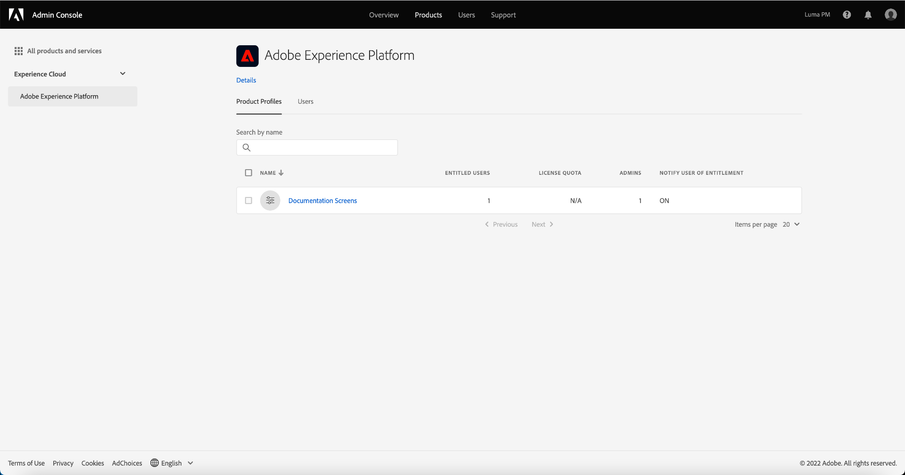

# Selecteer een productprofiel om de toegangsbeheermachtigingen te beheren

Als u toegangsbeheer voor [!DNL Experience Platform] via de Adobe Admin Console wilt configureren, moet u een beheerder zijn voor een organisatie die een abonnement heeft op [!DNL Experience Platform] . Terwijl de Adobe flexibele beheerderhiërarchieën voor organisaties steunt, moet u systeembeheerder, productbeheerder, of de beheerdervoorrechten van het productprofiel hebben om toegangsbeheer te vormen. Zie het artikel van Adobe Help Center op [ administratieve rollen ](https://helpx.adobe.com/enterprise/using/admin-roles.html) voor meer informatie.

Als u geen beheerdersrechten hebt, neemt u contact op met de systeembeheerder om toegang te krijgen.

Zodra u admin voorrechten hebt, ga naar [ Adobe Admin Console ](https://adminconsole.adobe.com) en teken binnen gebruikend uw geloofsbrieven van de Adobe. Nadat u zich hebt aangemeld, wordt de pagina **[!UICONTROL Overview]** weergegeven voor de organisatie waarvoor u beheerdersrechten hebt. Op deze pagina worden de producten weergegeven waarop uw organisatie is geabonneerd, samen met andere besturingselementen voor het toevoegen van gebruikers en beheerders aan de organisatie als geheel. Selecteer **[!UICONTROL Adobe Experience Platform]** om de toegangsbeheerwerkruimte voor uw platformintegratie te openen.

De werkruimte voor toegangsbeheer voor Adobe Experience Platform wordt geopend op het tabblad **[!UICONTROL Product Profiles]** . Op dit tabblad kunt u alle productprofielen weergeven en verschillende instellingen beheren zoals in dit document wordt beschreven.

Deze gebruikershandleiding is vooral gericht op het gebruik van [!DNL Admin Console] om toegangsmachtigingen voor Platform toe te wijzen. Voor meer algemene informatie over hoe te om [!DNL Admin Console] te navigeren, zie de [ gebruikersgids van de Admin Console ](https://helpx.adobe.com/nl/enterprise/using/admin-console.html).

## Volgende stappen

Zodra u de werkruimte van de toegangscontrole hebt genavigeerd, ga aan de volgende stap te werk [ tot een nieuw productprofiel ](create-profile.md) leiden

