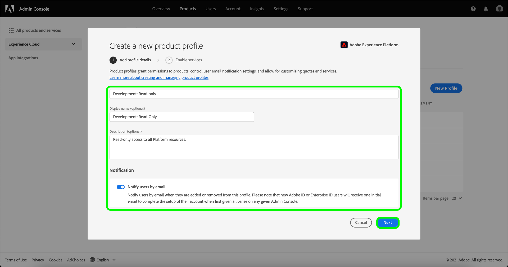

# Een nieuw productprofiel maken in Adobe Admin Console

Als u een nieuw profiel wilt maken, navigeert u naar het tabblad **[!UICONTROL Product Profiles]** en selecteert u **[!UICONTROL New Profile]**.

Het dialoogvenster **[!UICONTROL Create a new product profile]** wordt weergegeven en u wordt gevraagd een profiel, een optionele weergavenaam en een optionele beschrijving in te voeren. Onder **[!UICONTROL User Notifications]** kunt u bepalen of gebruikers via e-mail op de hoogte worden gesteld wanneer ze uit het profiel worden toegevoegd of verwijderd.

Selecteer **[!UICONTROL Next]** als u klaar bent.

In het volgende scherm wordt u gevraagd welke services voor Platforms u in het profiel wilt opnemen. Selecteer de knevelknoop naast de dienst om het onbruikbaar te maken. Als een service is uitgeschakeld, zijn alle functies die aan die service zijn gekoppeld niet beschikbaar voor gebruikers die aan dit productprofiel zijn toegewezen. Selecteer **[!UICONTROL Save]** als u klaar bent.

Klanten die recht hebben op de B2B- of B2P-editie hebben toegang tot de B2B-gebruikersinterface. B2B UI kan voor gebruikers door [!UICONTROL Enable services menu] worden provisioned. Selecteer de schakeloptie naast [!UICONTROL B2B UI] om de service voor een bepaald productprofiel in te schakelen en selecteer **[!UICONTROL Save]**.

Met de schakeloptie B2B-gebruikersinterface kunnen gebruikers B2B-workflows weergeven rondom het beheren van accounts en opportuniteiten en kunnen B2B-gerelateerde segmenten maken. Raadpleeg de documentatie bij [[!DNL Real-time Customer Data Platform B2B Edition]](../../rtcdp/b2b-overview.md) voor meer informatie.

Het nieuwe productprofiel is gemaakt en u wordt omgeleid naar de pagina [bewerkingsmachtigingen van het profiel](#edit-permissions). Zie de secties over [het beheren van toestemmingen](#manage-permissions-for-a-product-profile) en [het beheren van gebruikers](#manage-users-for-a-product-profile) voor meer details over hoe te om productprofielen te beheren zodra zij worden gecreeerd.

## Volgende stappen

Als er een nieuw productprofiel is gemaakt, kunt u verdergaan met de volgende stap om machtigingen voor een productprofiel te beheren.](permissions.md)[
