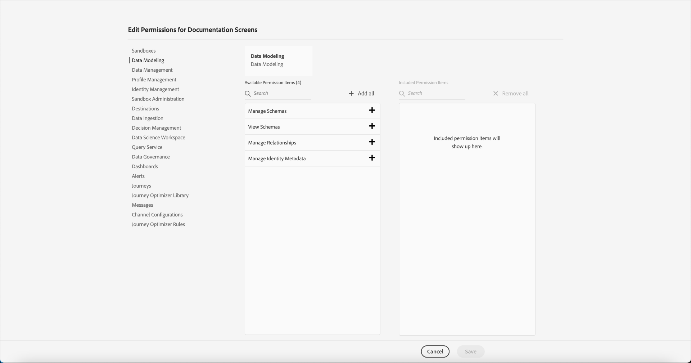
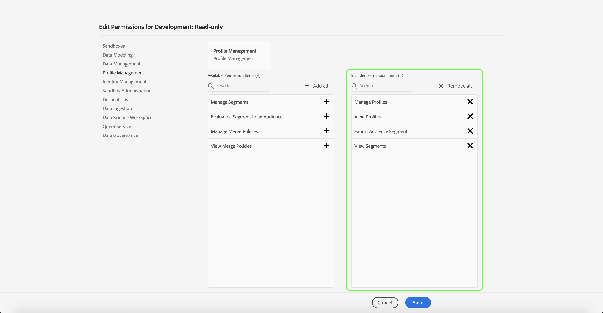
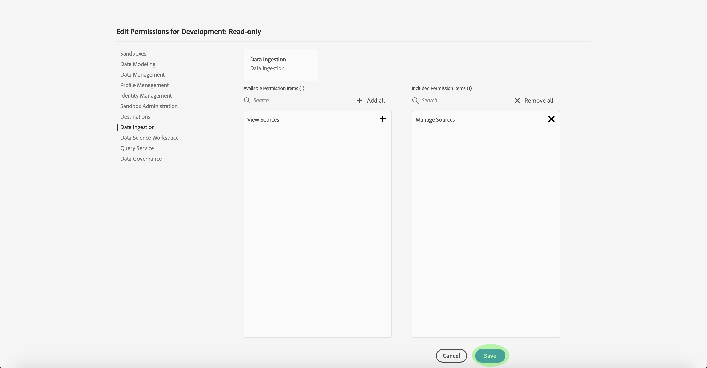

# Rechten voor een productprofiel beheren

Onmiddellijk nadat u een nieuw productprofiel [hebt](#create-a-new-product-profile)gemaakt, wordt u gevraagd om de profielmachtigingen te configureren. Als u machtigingen voor een bestaand profiel bewerkt, selecteert u het profiel op het tabblad *Productprofielen* om de detailpagina van het profiel te openen en klikt u op **Machtigingen**.

Machtigingen worden verdeeld in categorieën en vermeld op deze pagina. De lijst bevat de categorienaam, het aantal machtigingen dat erin staat (en het aantal dat actief is) en de beschrijving ervan.

Klik op een categorie in de lijst om de pagina *Machtigingen* bewerken te openen.

De pagina *Machtigingen* bewerken biedt een werkruimte voor het toevoegen en verwijderen van machtigingen uit het geselecteerde productprofiel. Links in het scherm wordt een lijst met machtigingscategorieën weergegeven. Als u op een categorie klikt, worden de machtigingen gewijzigd die onder *Beschikbare machtigingsitems* worden weergegeven.

Als u een machtiging wilt toevoegen, klikt u op de **plusknop (+)** naast de naam van de machtiging. U kunt ook op Alles **** toevoegen klikken om alle machtigingen onder de huidige categorie aan het profiel toe te voegen. Toegevoegde machtigingen worden weergegeven onder *Opgenomen machtigingsitems*.

>[!NOTE] In de lijst Items *voor* opgenomen machtigingen worden alleen toegevoegde machtigingen weergegeven van de op dat moment geselecteerde categorie.

Als u een machtiging wilt verwijderen, klikt u op het **X** -pictogram naast de naam van de machtiging of selecteert u Alles **** verwijderen om alle machtigingen onder de huidige categorie te verwijderen. Verwijderde machtigingen verschijnen weer onder *Beschikbare machtigingsitems*.

Doorgaan met de beschikbare categorieën en de gewenste machtigingen toevoegen. Klik op **Opslaan** als u klaar bent.

Het tabblad *Machtigingen* voor het productprofiel wordt opnieuw weergegeven en toont dat de geselecteerde machtigingen nu actief zijn.

## Volgende stappen

Met ingestelde machtigingen kunt u doorgaan naar de volgende stap voor het [beheren van details en services voor een productprofiel](details-and-services.md)