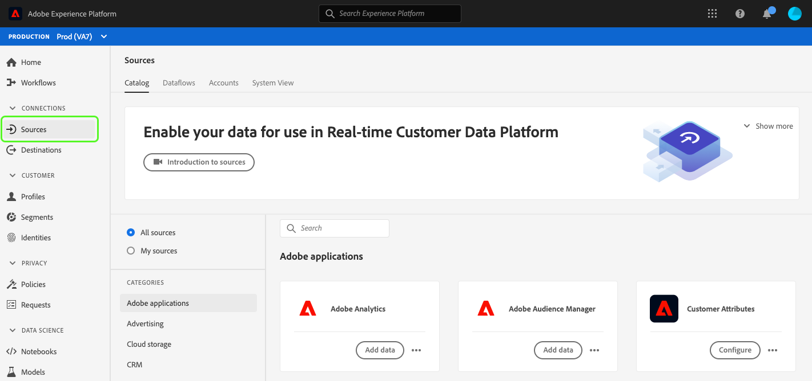

# Aangepaste toegankelijkheidsoplossingen voor Experience Platform

Adobe Experience Platform wordt voortdurend uitgebreid om aan de behoeften van alle soorten gebruikers te voldoen en voldoet aan de wereldwijde normen die personen met een visuele, auditieve, mobiliteitsfunctie of andere handicap omvatten. In dit document worden aangepaste toegankelijkheidsoplossingen in de Experience Platform-gebruikersinterface beschreven.

## Overzicht van homepage en gebruikersinterface

De Experience Platform-gebruikersinterface voldoet aan de vereiste contrastverhoudingen voor normale tekst, afbeeldingen en UI-componenten. De kleuren van de gebruikersinterface zijn ook gekozen om toegankelijkheid voor alle gebruikers te ondersteunen, inclusief gebruikers met een visuele handicap.

In kunnen UI-elementen die kunnen worden aangeklikt of geactiveerd met een aanwijzer, ook worden geactiveerd met een toetsenbord. Dit omvat de linkernavigatie, videospelers, lijsten, en meer.

Experience Platform streeft ernaar te voldoen aan internationale toegankelijkheidsnormen, waaronder de Web Content Accessibility Guidelines 2.1 Level A en Level AA en de Web Accessibility Initiative - Accessible Rich Internet Applications (WAI-ARIA).

## Linkernavigatie

De linkernavigatie in de gebruikersinterface van Experience Platform is toegankelijk voor het toetsenbord en biedt kleurcontrast in normale toestand, bij aanwijzen en in selectiestatus die aan toegankelijkheidsnormen voldoet.

Gebruikers kunnen met de Tab-toets naar links in het scherm Home gaan. Het selecteren van **verschuiving + Lusje** keert de gebruiker aan het scherm van het Huis terug.

Met de linkernavigatie in nadruk, **Lusje** neemt gebruikers aan uit en doen ineenstorten interactie. De capaciteit om de linkernavigatie uit te breiden of samen te vouwen wordt geactiveerd met **binnengaan (Terugkeer)**.

Met de linkernavigatie in focus, navigeren de pijltoetsen omhoog en omlaag naar elk item in de navigatie en doorlopend (met andere woorden, verschuift de focus niet weg totdat de gebruiker met de Tab-toets van de linkernavigatie af gaat). Wanneer deze optie is geselecteerd, wordt de focus voor navigatie-items weergegeven. De huidige selectie wordt weergegeven met een gemarkeerde en bolle tekst. Wanneer het selecteren van een linkernavigatiepunt, **gaat binnen (Terugkeer)** het geselecteerde punt UI in het juiste paneel opent, nochtans blijft de nadruk in linkernavigatie tot de gebruikerslusjes weg.

Sommige functies in Experience Platform zijn niet voor alle gebruikers ingeschakeld. Deze items worden in de navigatie weergegeven, maar kunnen niet worden geselecteerd. Wanneer het navigeren met een toetsenbord, worden deze punten overgeslagen tijdens pijlnavigatie en kunnen niet worden geselecteerd gebruikend **binnengaan (Terugkeer)**.

## Dialoogvenster Ingesloten video

Video&#39;s kunnen in Experience Platform worden weergegeven door toetsenbordnavigatie te gebruiken om een beschikbare videokoppeling te markeren en te selecteren. Hiermee wordt een ingesloten videodialoogvenster geopend in de gebruikersinterface van Experience Platform.

## Toegankelijkheid van het dialoogvenster Video

U kunt ook via het toetsenbord navigeren in het dialoogvenster Ingesloten video. In de volgende tabel wordt de volledige toetsenbordnavigatie beschreven die beschikbaar is voor het ingesloten videodialoogvenster.

| Dialoogelement | Toegankelijkheid toetsenbord | Beschrijving |
|---|---|---|
| Afspelen en pauzeren | Tab   Spatiebalk | Gebruik **Lusje** om nadruk op spelknoop te plaatsen. **Spatiebar** begint videoplayback en pauzeert videoplayback. |
| Scrubber | Tab   Linkerpijl   Juiste pijl | Wanneer de video speelt, gebruik **Lusje** om scrubber te concentreren. Met scrubber in nadruk, **linker en juiste pijlsleutels** overslaan videoplayback vooruit en terug 5 seconden, respectievelijk. |
| Dempen | Tab   Spatiebalk | Gebruik **Lusje** om het dempingsvolumelement te concentreren. Gebruik **spacebar** om videoplayback te dempen of unmute. |
| Volume | Tab   Linkerpijl   Juiste pijl | Gebruik **Lusje** om op volumeelement te concentreren. **Linker en juiste pijlsleutels** bewegen omhoog en neer volume, respectievelijk. |
| [!UICONTROL Closed Captions] (&quot;cc&quot;) | Het lusje   gaat   Omhoog pijl   neer | **Lusje** aan [!UICONTROL Closed Captions] (&quot;cc&quot;) element. Het gebruik **gaat** binnen om het menu te openen, en **omhoog en onderaan pijlsleutels** om een taal voor titels te selecteren. **ga binnen** bevestigt uw selectie. |
| [!UICONTROL Quality] | Het lusje   gaat   Omhoog pijl   neer | Gebruik **Lusje** om het [!UICONTROL Quality] element te concentreren. Het gebruik **gaat** binnen om het menu en **op en neer pijlsleutels** te openen om videokwaliteit te selecteren. **ga binnen** bevestigt uw selectie. |
| Volledig scherm | Het lusje   Spatiebar of gaat   Escape in | Gebruik **Lusje** om het volledig-schermelement te concentreren. Gebruik **spacebar of ga** binnen om het volledig-schermmening te activeren. **Escape** (&quot;esc&quot;) weggaat volledig-schermwijze. |
| Sluiten | Tab   Spatiebar of gaat binnen | Gebruik **Lusje** om de dichte knoop te concentreren. Gebruik **spacebar of ga** sleutel in om de videodialoog weg te gaan. |

>[!NOTE]
>
>Op elk gewenst moment tijdens het afspelen kan de escape-toets (&quot;esc&quot;) worden gebruikt om het ingesloten videodialoogvenster te sluiten.

## Bestanden slepen en neerzetten

In Experience Platform zijn zones voor het slepen en neerzetten van bestanden toegankelijk voor het toetsenbord. Het gebruiken van **Lusje** om **[!UICONTROL Choose files]** te benadrukken en het gebruiken **gaat of spacebar** binnen om het te selecteren haalt het de dossierselectie UI van het werkende systeem aan.

Nadat een bestand is geüpload, kunt u met het toetsenbord navigeren door een verwijderpictogram om het geselecteerde bestand te verwijderen en een nieuw bestand te uploaden. De gebruikers kunnen **Lusje** gebruiken om zich op het schrappingspictogram te concentreren en **binnengaan of ruimtebar** om het te selecteren. Wanneer het bestand is verwijderd, krijgt **[!UICONTROL Choose files]** automatisch de focus en kan het worden geselecteerd.

Als het geüploade bestand niet de juiste indeling heeft, wordt een foutpictogram weergegeven met een foutbericht en is de knop **[!UICONTROL Choose files]** actief en selecteerbaar.

Als u een muis gebruikt om de zone voor slepen en neerzetten te selecteren, wordt ook de gebruikersinterface voor de bestandsselectie aangeroepen, of een muisgebruiker kan een bestand selecteren en naar de zone slepen om te beginnen met uploaden.

## Tabelbladeren

Alle tabellen in de Experience Platform-gebruikersinterface zijn toegankelijk via het toetsenbord. U kunt met een aantal sneltoetsen bladeren door tabelrijen en -kolommen en er met deze rijen en kolommen mee werken:

* Van de lijstkopbal, gebruik **benedenpijl** om de lijst te doorbladeren. De kopballen van de lijst zijn verkiesbaar wanneer het navigeren via **Lusje**, en u kunt de sorterende orde veranderen gebruikend **spacebar**.
* **omhoog en onderaan pijlsleutels** bewegingen omhoog en neer door de rijen in de lijst.
* Wanneer een rij wordt geselecteerd of in nadruk, die **gebruikt gaat** op de rij binnen verstrekt details in het juiste spoor.
* Wanneer een rij wordt geselecteerd of in nadruk, gebruik **pijlsleutels** om door elk punt in de rij te bewegen.
* Het gebruik **gaat** binnen om een punt in de rij te selecteren. Gebruikers met een schermlezer worden gewaarschuwd als een nieuw venster moet worden geopend.
* Wanneer u aan 200% of meer zoomt, kunt u het **pictogram van de spoorinspecteur** zien aangezien de juiste spoorstaaf samenvouwt om meer het bekijken ruimte voor de lijst te verstrekken.

### Toegankelijkheid van tabeltoetsenbord doorbladeren

| Toegankelijkheid toetsenbord | Beschrijving |
|---|---|
| HOME (Function + pijl-links) | Wanneer de rij geconcentreerd is, neemt gebruikers naar het eerste punt in de rij |
| END (Function + pijl-rechts) | Wanneer de rij geconcentreerd is, neemt gebruikers aan het laatste punt in de rij |
| Pagina omhoog | Hiermee verplaatst u tien rijen omhoog in de tabel (per pagina) |
| Page down | Hiermee verplaatst u 10 rijen omlaag in de tabel (per pagina) |
| Control + HOME | Hiermee gaat u naar de eerste rij in de tabel |
| Control + END | Goes to first win table per page |

## Gebruikersinterface van Schema-editor

De UI van de Redacteur van het Schema wordt toegankelijk gemaakt door de volgende functionaliteit:

* De Redacteur van het Schema steunt toetsenbordnavigatie, met inbegrip van gebruik van **Lusje** aan navigatie door elementen UI.
* **Lusje** gaat het onderzoeksgebied, dan in de schemaboom in.
* De boomstructuur van het schema steunt het gebruik van pijlsleutels om door schema boom UI te navigeren
   * **omhoog en onderaan pijlen** kunnen worden gebruikt om de boom over te steken.
   * **Linker en juiste pijlen** kunnen worden gebruikt om knopen uit te breiden en samen te vouwen of zich tussen gealigneerde acties op de schemaboom te bewegen.
* **gaat binnen (Terugkeer)** activeert individuele knoopdetails in het detailpaneel op het recht.
* De **zeer belangrijke terugkeer van het 0&rbrace; Huis &lbrace;aan de bovenkant van de boom.**
* De **sleutel van het Eind** navigeert aan de bodem van de boom.
* De schemastructuur bevat ook ARIA-labels voor schermlezers.

## Gebruikersinterface van Segment Builder

Wanneer u de gebruikersinterface van Segment Builder gebruikt voor het maken, bewerken en gebruiken van segmenten in Experience Platform, verbeteren de volgende functies de toegankelijkheid:

* De gebruikersinterface van Segment Builder is toegankelijk via toetsenbordnavigatie.
* Schermlezers herkennen markeringen voor opmaakcodes voor koppen en kunnen de kop samen met het niveau ervan aankondigen.
* Andere ondersteunende hulpmiddelen kunnen de visuele weergave van een pagina wijzigen door correct gecodeerde koppen te gebruiken om een omtrek of een alternatieve weergave weer te geven.

U kunt nu de linker- en rechterrails van het gesegmenteerde canvas samenvouwen of uitvouwen om meer schermruimte te verkrijgen. Deze functie is vooral handig omdat deze bij 200% zoomen volledige functionaliteit biedt.

## Query Service-editor

De volgende toegankelijkheidsfuncties zijn beschikbaar in de Query Service-editor:

* Het kleurcontrast in de gebruikersinterface van de Query Service voldoet aan toegankelijkheidsvereisten.
* Toetsenbordnavigatie wordt ondersteund buiten de gebruikersinterface van de editor. De editor-gebruikersinterface is een ingesloten codespiegel.

>[!NOTE]
>
>De redacteur van de Vraag behandelt niet de **sleutel van het Lusje** door gebrek. Om **functionaliteit van het Lusje** terwijl in de redacteur aan te halen, moet u de **sleutel van de Vlucht** drukken, en dan **Lusje** direct na het drukken. Druk **Lusje** opnieuw, om nadruk voorbij de redacteur te bewegen.

## Het lusje van de Mening van het systeem in Bronnen en Doelen

Wanneer u in **[!UICONTROL System View]** in Bronnen en doelen bladert, verbetert de volgende functionaliteit de toegankelijkheid:

* **Lusje** plaatst nadruk op de eerste bronverbindingskaart
   * **Lusje** opnieuw om op de knoop binnen de kaart te concentreren
   * Selecteer **binnengaan** om de vraag aan actieknoop binnen de kaart te activeren
* Het selecteren **gaat** op de verbindingskaart binnen activeert ook meer details in het juiste spoor
   * Wanneer de rechterspoorstaaf wordt geactiveerd, wordt de focus op dat gebied ingesteld. **Lusje** concentreert zich op **dicht** voor de juiste spoorruit. Het selecteren van **Lusje** verplaatst opnieuw de nadruk door het juist-spoorpaneel
   * Als er meer dan één bronverbindingskaart is, **Lusje** beweegt zich door de verbindingen
   * Gebruik **pijlsleutels (omhoog, neer, links, en recht)** om zich door de lijst van bronnen te bewegen
   * Selecteer **Lusje** om nadruk op het juist-spoorpaneel te plaatsen
