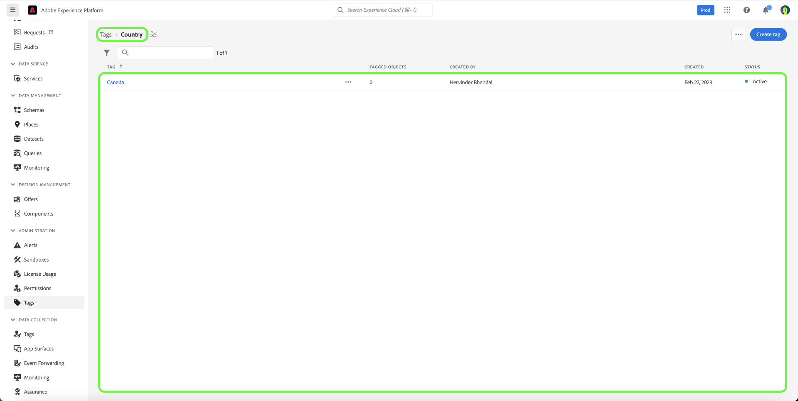
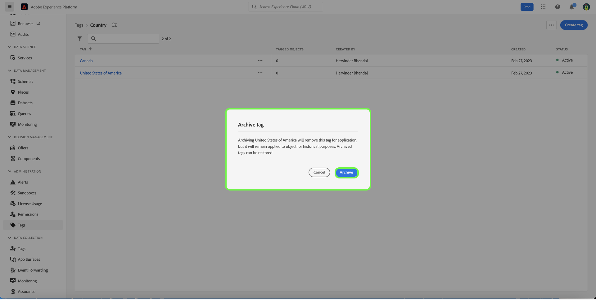

# Handleiding voor tags beheren

Met labels kunt u metagegevenstaxonomieën beheren om bedrijfsobjecten te classificeren voor eenvoudigere detectie en categorisering. Tags kunnen belangrijke taxonomische kenmerken identificeren voor het publiek waarmee uw teams zullen werken, zodat ze deze sneller kunnen vinden en ook het algemene publiek in een descriptor kunnen groeperen. U zou gemeenschappelijke markeringscategorieën zoals geografische gebieden, bedrijfseenheden, productlijnen, projecten, teams, tijdwaaiers (kwarten, maanden, jaren), of om het even wat anders moeten identificeren die betekenis kunnen toepassen en publieksontdekking voor uw team vergemakkelijken. 

## Een tag maken {#create-tag}

Als u een nieuwe tag wilt maken, selecteert u **[!UICONTROL tags]** Selecteer in de linkernavigatie de gewenste tagcategorie.

Selecteren **[!UICONTROL Create tag]** om een nieuwe tag te maken.

De **[!UICONTROL Create tag]** wordt weergegeven en u wordt gevraagd een unieke tagnaam in te voeren. Als u klaar bent, selecteert u **[!UICONTROL Save]**.

De nieuwe tag wordt gemaakt en u wordt omgeleid naar het scherm met tags, waar de nieuwe tag in de lijst wordt weergegeven.

## Een tag bewerken {#edit-tag}

Als u een tag bewerkt, kunt u beter spelfouten, naamgevingsupdates of terminologische updates gebruiken. Als u een tag bewerkt, blijft de koppeling van de tag behouden met alle objecten waarop de tag momenteel is toegepast.

Als u een bestaande tag wilt bewerken, selecteert u in de lijst met tagcategorieën de ellips (`...`) naast de naam van de tag die u wilt bewerken. In een vervolgkeuzelijst worden besturingselementen weergegeven voor het bewerken, verplaatsen of archiveren van de tag. Selecteren **[!UICONTROL Edit]** in de vervolgkeuzelijst.

De **[!UICONTROL Edit tag]** wordt weergegeven en u wordt gevraagd de tagnaam te bewerken. Als u klaar bent, selecteert u **[!UICONTROL Save]**.

De tagnaam wordt bijgewerkt en u wordt omgeleid naar het scherm Tags, waar de bijgewerkte tag in de lijst wordt weergegeven.

## Een tag verplaatsen tussen categorieën {#move-tag}

Tags kunnen naar andere tagcategorieën worden verplaatst. Als u een tag verplaatst, blijft de koppeling van de tag behouden met alle objecten waarop de tag momenteel is toegepast.

Als u een bestaande tag wilt verplaatsen, selecteert u in de lijst met tagcategorieën de ellips (`...`) naast de naam van de tag die u wilt verplaatsen. In een vervolgkeuzelijst worden besturingselementen weergegeven voor het bewerken, verplaatsen of archiveren van de tag. Selecteren **[!UICONTROL Edit]** in de vervolgkeuzelijst.

De **[!UICONTROL Move tag]** wordt weergegeven en u wordt gevraagd de tagcategorie te selecteren waarnaar de geselecteerde tag moet worden verplaatst.

U kunt in de lijst bladeren en selecteren, maar u kunt ook de zoekfunctie gebruiken om de categorienaam in te voeren. Als u klaar bent, selecteert u **[!UICONTROL Move]**.

De tag wordt verplaatst en u wordt omgeleid naar het scherm met tags, waar de bijgewerkte taglijst wordt weergegeven en waar de tag niet meer wordt weergegeven.

De tag wordt nu weergegeven in de eerder geselecteerde tagcategorie.

## Een tag archiveren {#archive-tag}

U kunt de status van een tag wijzigen tussen actief en gearchiveerd. Gearchiveerde labels worden niet verwijderd van objecten waarop ze al zijn toegepast, maar kunnen niet meer worden toegepast op nieuwe objecten. Voor elke tag wordt dezelfde status weerspiegeld in alle objecten. Dit is vooral handig wanneer u de huidige tag-objectkoppelingen wilt behouden, maar niet wilt dat de tag in de toekomst wordt gebruikt.

Als u een bestaande tag wilt archiveren, selecteert u de ellips in de lijst met tagcategorieën (`...`) naast de naam van de tag die u wilt archiveren. In een vervolgkeuzelijst worden besturingselementen weergegeven voor het bewerken, verplaatsen of archiveren van de tag. Selecteren **[!UICONTROL Archive]** in de vervolgkeuzelijst.

De **[!UICONTROL Archive tag]** wordt weergegeven en u wordt gevraagd het tagarchief te bevestigen. Selecteer **[!UICONTROL Archive]**.

De tag wordt gearchiveerd en u wordt omgeleid naar het tagscherm. In de bijgewerkte taglijst wordt nu de status van de tag weergegeven als `Archived`.

## Een gearchiveerde tag herstellen {#restore-archived-tag}

Indien u een `Archived` tag toewijzen aan nieuwe objecten, moet de tag zich in een `Active` status. Als u een gearchiveerde tag herstelt, wordt de tag teruggezet op de tag `Active` status.

Als u een gearchiveerde tag wilt herstellen, selecteert u in de lijst met tagcategorieën de ellips (`...`) naast de naam van de tag die u wilt herstellen. In een vervolgkeuzelijst worden besturingselementen weergegeven om de tag te herstellen of te verwijderen. Selecteren **[!UICONTROL Restore]** in de vervolgkeuzelijst.

De **[!UICONTROL Restore tag]** wordt weergegeven en u wordt gevraagd het herstellen van de tag te bevestigen. Selecteer **[!UICONTROL Restore]**.

De tag wordt hersteld en u wordt omgeleid naar het tagscherm. In de bijgewerkte taglijst wordt nu de status van de tag weergegeven als `Active`.

## Een tag verwijderen {#delete-tag}

>[!NOTE]
>
>Alleen tags in een `Archived` status en zijn niet gekoppeld aan objecten, kunnen worden verwijderd.

Als u een tag verwijdert, wordt deze volledig uit het systeem verwijderd.

Als u een gearchiveerde tag wilt verwijderen, selecteert u in de lijst met tagcategorieën de ellips (`...`) naast de naam van de tag die u wilt verwijderen. In een vervolgkeuzelijst worden besturingselementen weergegeven om de tag te herstellen of te verwijderen. Selecteren **[!UICONTROL Delete]** in de vervolgkeuzelijst.

De **[!UICONTROL Delete tag]** wordt weergegeven, waarin u wordt gevraagd de verwijdering van tags te bevestigen. Selecteer **[!UICONTROL Delete]**.

De tag wordt verwijderd en u wordt omgeleid naar het tagscherm. Het label wordt niet meer in de lijst weergegeven en is volledig verwijderd.

## Gelabelde objecten weergeven {#view-tagged}

Elke tag heeft een detailpagina die toegankelijk is via de taginventaris. Deze pagina bevat een lijst met alle objecten waarop dat label is toegepast, zodat gebruikers gerelateerde objecten van verschillende apps en mogelijkheden in één weergave kunnen bekijken.

Als u de lijst met gelabelde objecten wilt weergeven, zoekt u de tag in een categorie met tags en selecteert u de tag.

De [!UICONTROL Tagged objects] wordt weergegeven met een overzicht van de gelabelde objecten.

## Volgende stappen

U hebt nu geleerd hoe u tags kunt beheren. Voor een overzicht op hoog niveau van tags in Experience Platform raadpleegt u de [documentatie over tags](../overview.md).
