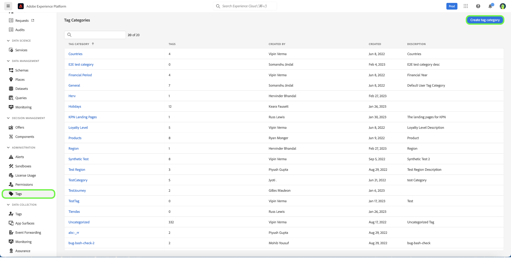
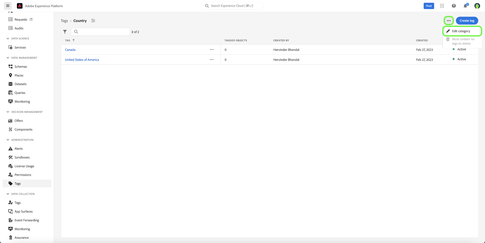
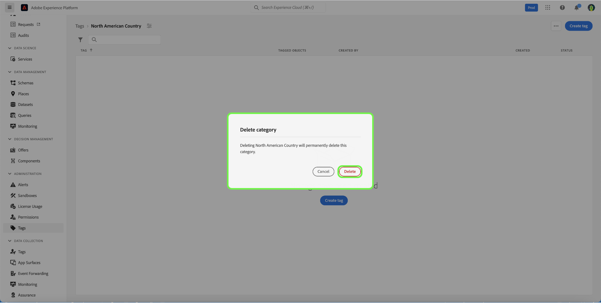

# Hulplijn Tagcategorieën

Codes in categorieën groeperen in betekenisvolle sets om meer context te bieden en het doel van de tag beter te verduidelijken. Voor elke tag met een categorie wordt de tagnaam voorafgegaan door de naam van de categorie en daarna door een dubbele punt.

## Een tagcategorie maken {#create-tag-category}

Als u een nieuwe categorie wilt maken, selecteert u **[!UICONTROL tags]** in de navigatie links en selecteert u [!UICONTROL Create tag category] .

Het dialoogvenster **[!UICONTROL Create tag category]** wordt weergegeven en u wordt gevraagd een unieke categorienaam en optionele beschrijving in te voeren. Selecteer **[!UICONTROL Save]** als u klaar bent.

De nieuwe tagcategorie is gemaakt en u wordt omgeleid naar de pagina voor het maken van tags, waar u nieuwe tags kunt toewijzen. Voor meer informatie over het creëren van markeringen, verwijs naar [ het leiden markeringen ](./managing-tags.md#create-a-tag-create-tag) document.

## Tagcategorie bewerken {#edit-tag-category}

>[!NOTE]
>
>Als u een tagcategorie bewerkt of de naam ervan wijzigt, blijft de tag gekoppeld aan objecten waarop deze momenteel zijn toegepast.

Als u een tagcategorie wilt bewerken, selecteert u **[!UICONTROL tags]** in de linkernavigatie en selecteert u vervolgens de tagcategorie die u wilt bewerken.

 uit

Selecteer in de tagcategorie de ellips (`...`) naast [!UICONTROL Create Tag] . In een vervolgkeuzelijst worden de besturingselementen weergegeven waarmee u de categorie kunt bewerken of verwijderen. Selecteer **[!UICONTROL Edit category]** .

Het dialoogvenster **[!UICONTROL Edit category]** wordt weergegeven, waarin u wordt gevraagd de categorienaam en de optionele beschrijving bij te werken. Selecteer **[!UICONTROL Save]** als u klaar bent.

De tagcategorie is bijgewerkt en u wordt omgeleid naar de tagcategorie.

## Tagcategorie verwijderen {#delete-tag-category}

>[!NOTE]
>
>Voordat een tagcategorie kan worden verwijderd, moet deze leeg zijn en mag deze geen tags bevatten.

Als u een tagcategorie wilt verwijderen, selecteert u **[!UICONTROL tags]** in de linkernavigatie en selecteert u vervolgens de tagcategorie die u wilt verwijderen.

Selecteer in de tagcategorie de ellips (`...`) naast [!UICONTROL Create Tag] . In een vervolgkeuzelijst worden de besturingselementen weergegeven waarmee u de categorie kunt bewerken of verwijderen. Selecteer **[!UICONTROL Delete category]** .

Het dialoogvenster **[!UICONTROL Delete category]** verschijnt waarin u wordt gevraagd het verwijderen van een tagcategorie te bevestigen. Selecteer **[!UICONTROL Delete]** om te bevestigen.

De tagcategorie is verwijderd en u wordt omgeleid naar de overzichtspagina voor de tagcategorie. De tagcategorie wordt niet meer in de lijst weergegeven en is volledig verwijderd.

## Volgende stappen

U hebt nu geleerd hoe u tagcategorieën kunt beheren. U kunt aan de volgende stap [ te werk gaan die markeringen ](./managing-tags.md) beheren.
