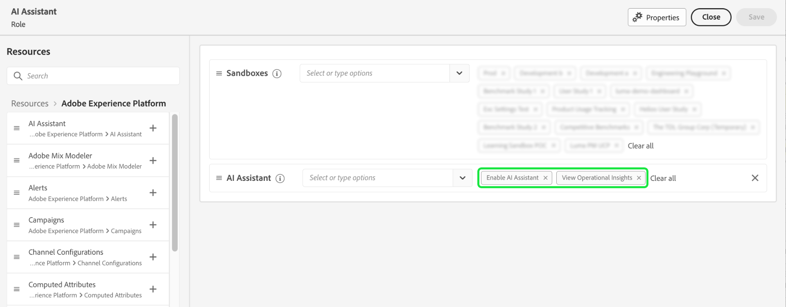
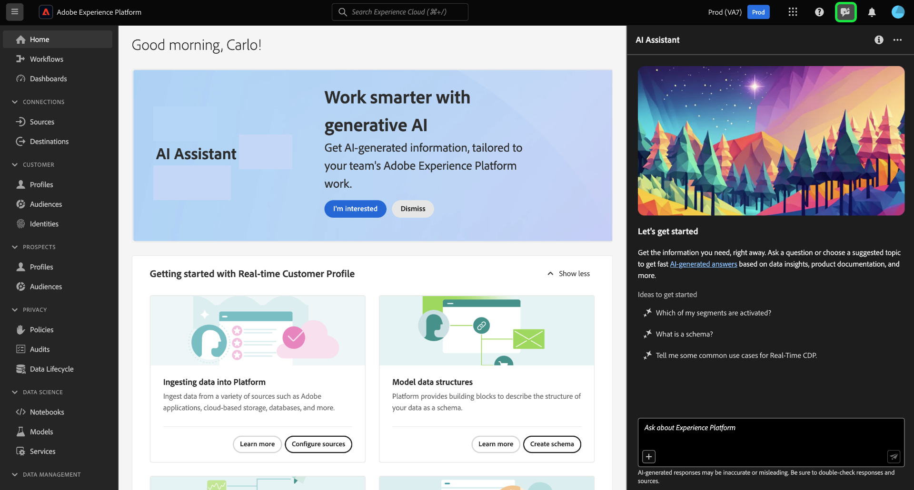

# AI-assistent openen in Experience Platform

In Adobe Experience Cloud hebt u toegang tot AI Assistant voor verschillende toepassingen.

Voor de toegang tot AI Assistant gelden de volgende parameters:

* **Toegang krijgen tot de toepassing:** U hebt toegang tot AI Assistant in Adobe Experience Platform, Adobe Real-Time CDP, Adobe Journey Optimizer en [Customer Journey Analytics](https://experienceleague.adobe.com/en/docs/analytics-platform/using/ai-assistant).
* **Contractuele toegang:** Uw bedrijf moet akkoord gaan met bepaalde [!DNL GenAI]-related legal terms voordat uw organisatie AI Assistant kan gebruiken. Neem contact op met de beheerder van uw organisatie of met uw accountteam voor Adoben als u geen toegang kunt krijgen tot AI Assistant.
* **Rechten:** Gebruik de [Gebruikersinterface voor machtigingen](../access-control/abac/ui/permissions.md) toegang tot AI Assistant in uw organisatie verlenen of intrekken. Als u de AI-assistent wilt gebruiken, moet een bepaalde gebruiker tot een rol behoren die is ingericht met de **AI-assistent inschakelen** en **Operationele inzichten weergeven** machtigingen.
   * Als beheerder kunt u de opdracht **AI-assistent inschakelen** aan een bepaalde rol en voeg een gebruiker aan die rol toe, om hen toe te staan om tot AI Medewerker in uw organisatie toegang te hebben.
   * Als beheerder kunt u de opdracht **Operationele inzichten weergeven** aan een bepaalde rol en voeg een gebruiker aan die rol toe, om hen toe te staan om de operationele mogelijkheden van Inzichten van AI Medewerker te gebruiken. Operationele inzichten bevinden zich momenteel in bèta.

Zodra u de vereiste toestemmingen hebt, kunt u tot AI Medewerker toegang hebben door het AI Hulppictogram op de hoogste kopbal van de toepassing te selecteren die u gebruikt.

## Volgende stappen

Als u volledige toegang hebt tot AI Assistant, kunt u de functie tijdens uw workflows blijven gebruiken. Lees de [Handleiding voor AI Assistant-gebruikersinterface](./ui-guide.md) voor meer informatie .