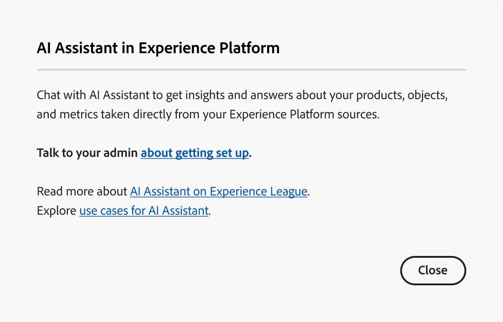

# AI-assistent openen in Experience Platform

In Adobe Experience Cloud hebt u toegang tot AI Assistant voor verschillende toepassingen.

>[!IMPORTANT]
>
>Als u een pop-upbericht ontvangt in de gebruikersinterface voor machtigingen die u laat weten dat uw organisatie eerst akkoord moet gaan met aanvullende juridische voorwaarden om toegang te krijgen tot AI Assistant, neemt u contact op met uw Adobe-accountteam voor instructies over deze voorwaarden.

Voor de toegang tot AI Assistant gelden de volgende parameters:

* **toegang tot de toepassing:** u kunt tot AI Medewerker in Adobe Experience Platform, Adobe Real-Time CDP, Adobe Journey Optimizer, en [ Customer Journey Analytics ](https://experienceleague.adobe.com/en/docs/analytics-platform/using/ai-assistant) toegang hebben.
<!-- * **Contractual access:** Your company must agree to certain [!DNL GenAI]-related legal terms before your organization can use AI Assistant. Contact your organization's administrator or your Adobe Account Team if you are not able to access AI Assistant.  -->
* **Toestemmingen:** gebruik [ Toestemmingen UI ](../access-control/abac/ui/permissions.md) om toegang tot AI Medewerker in uw organisatie te verlenen of te herroepen. Om AI Medewerker te gebruiken, moet een bepaalde gebruiker tot een rol behoren die met **wordt voorzien toelaat AI Medewerker** en **de Operationele toestemmingen van de Mening**.
   * Als beheerder, kunt u **toevoegen toelaat AI Medewerker** aan een bepaalde rol en voegt een gebruiker aan die rol toe, om hen toe te staan om tot AI Medewerker in uw organisatie toegang te hebben.
   * Als beheerder, kunt u de **Operationele Inzichten van de Mening** aan een bepaalde rol toevoegen en een gebruiker toevoegen aan die rol, om hen toe te staan om de operationele mogelijkheden van de Inzichten van AI Medewerker te gebruiken. Operationele inzichten bevinden zich momenteel in bèta.

Gebruik de [ toestemmingen UI ](../access-control/abac/ui/roles.md) om toestemmingen te verlenen om AI Medewerker in Experience Platform en Journey Optimizer te gebruiken. Voor informatie over hoe u toegang kunt krijgen tot AI Assistant in Customer Journey Analytics. Lees de documentatie in [ Customer Journey Analytics ](https://experienceleague.adobe.com/en/docs/analytics-platform/using/ai-assistant).

Er kunnen twee redenen zijn waarom u tot AI Medewerker niet kunt toegang hebben:

1. U gebruikt een organisatie die wettelijk niet gemachtigd is om AI Assistant te gebruiken;
2. Uw beheerders hebben u niet de aangewezen toestemmingen verleend om AI Medewerker te gebruiken.

>[!BEGINTABS]

>[!TAB  Uw organisatie kan geen Medewerker van AI ] gebruiken

Het volgende bericht wordt weergegeven als u een organisatie gebruikt die wettelijk niet gemachtigd is om AI Assistant te gebruiken. In dit scenario moet u contact opnemen met uw Adobe-accountteam om de toegang te regelen.

>[!TAB  u hebt niet de juiste toestemmingen ]

Als uw organisatie wettelijk gemachtigd is om AI Assistant te gebruiken en u nog steeds geen toegang hebt tot de functie, wordt het volgende bericht weergegeven op de gebruikersinterface van Experience Platform. Dit scenario betekent dat u niet de voldoende toestemmingen hebt om tot de eigenschap toegang te hebben en u moet uw beheerders contacteren om toestemmingen op te lossen.

>[!ENDTABS]

Zodra u de vereiste toestemmingen hebt, kunt u tot AI Medewerker toegang hebben door het AI Hulppictogram op de hoogste kopbal van de toepassing te selecteren die u gebruikt.

## Toegang tot AI Assistant verkrijgen

Bekijk de volgende video om te leren hoe u toegang tot AI Assistant voor uw organisaties en gebruikers kunt configureren.

>[!VIDEO](https://video.tv.adobe.com/v/3436470/?learn=on)

## Volgende stappen

Zodra u volledige toegang tot AI Medewerker hebt, kunt u aan het gebruiken van de eigenschap tijdens uw werkschema&#39;s te werk gaan, de [ AI Hulp UI gids ](./ui-guide.md) voor meer informatie lezen.
