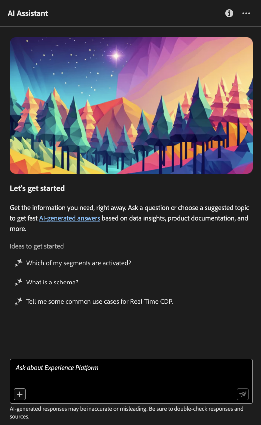

# AI Assistant in Adobe Experience Platform

Lees dit document voor meer informatie over AI Assistant in Adobe Experience Platform.

AI Assistant in Adobe Experience Platform is een conversatie-ervaring die u kunt gebruiken om uw workflows in Adobe-toepassingen te versnellen. U kunt AI Medewerker gebruiken om productkennis beter te begrijpen, problemen problemen op te lossen, of door informatie te zoeken en operationele inzichten te vinden. AI Assistant biedt ondersteuning voor Experience Platform, Real-time Customer Data Platform, Adobe Journey Optimizer en Customer Journey Analytics.

>[!IMPORTANT]
>
>U moet akkoord gaan met een gebruikersovereenkomst voordat u AI Assistant kunt gebruiken. De gebruikersovereenkomst bevat ook de openbare bètaovereenkomst. Dit is zodat u extra eigenschappen van AI Medewerker kunt gebruiken aangezien zij in een bètacapaciteit uitrollen.

+++Selecteren om gebruikersovereenkomstinterface weer te geven

+++

## AI-assistent begrijpen {#understanding-ai-assistant}

De Medewerker van AI antwoordt op uw voorgelegde vragen door een gegevensbestand te vragen en dan gegevens van het gegevensbestand in een leesbaar antwoord te vertalen.

Deze interne representatie van onderliggende gegevens wordt ook wel de **[!DNL Knowledge Graph]** - een uitgebreid web van concepten, gegevens en metagegevens voor een bepaald antwoord.

De [!DNL Knowledge Graph] bestaat uit subgrafieken waarnaar wordt verwezen wanneer query&#39;s worden ingediend:

* Operationele inzichten van de klant.
* Operationele inzichten van de klant in verschillende meta-winkels.
* Documentatie Experience League.

Er zijn twee klassen vragen om te overwegen alvorens AI Medewerker te vragen:

### Productkennis {#product-knowledge}

De kennis van het product verwijst naar concepten en onderwerpen die in de documentatie van het Experience League worden gebaseerd. Vragen over productkennis kunnen nader worden omschreven in de volgende subgroepen:

| Productkennis | Voorbeelden |
| --- | --- |
| Aanbevolen lessen | <ul><li>Wat is het verschil tussen een identiteit en een primaire of buitenlandse sleutel?</li><li>Hoe wordt profielrijkheid berekend?</li></ul> |
| Openbare detectie | <ul><li>Hoe kan ik deze dataset uitvoeren?</li><li>Zijn er regelingen voor klanten in de gezondheidszorg?</li></ul> |
| Problemen oplossen | <ul><li>Waarom kan ik geen schema aanzetten dat door Adobe voor profiel wordt bezeten?</li><li>Waarom kan ik een segment niet verwijderen?</li></ul> |

{style="table-layout:auto"}

### Operationele inzichten {#operational-insights}

>[!IMPORTANT]
>
>De antwoorden van de operationele inzichten zijn in bèta. Iedereen die toegang heeft tot de **Operationele inzichten weergeven** toestemming zal toegang hebben tot antwoorden op operationele inzichten .

De operationele inzichten verwijzen naar antwoorden AI Medewerker produceert over uw voorwerpen van meta- gegevens (attributen, publiek, dataflows, datasets, bestemmingen, reizen, schema&#39;s, en bronnen), met inbegrip van tellingen, raadplegingen, en lijneffect. Er worden geen gegevens in de sandbox weergegeven.

* Hoeveel datasets heb ik?
* Hoeveel schemakenmerken zijn nooit gebruikt?
* Welk publiek is geactiveerd?

U kunt AI Assistant-vragen stellen over uw operationele inzichten in de volgende domeinen:

* Attributen
* Soorten publiek
* Gegevensstromen
* Gegevenssets
* Doelen _(Vragen over accounts en sommige vragen over gegevensstroom kunnen op dit moment niet worden beantwoord.)_
* Journeys
* Schemas _(Op dit moment kunnen vragen met betrekking tot veldgroepen niet worden beantwoord.)_
* Bronnen _(Op dit moment kunnen vragen over de rekeningen niet worden beantwoord.)_

Voor vragen over operationele inzichten weerspiegelen de antwoorden mogelijk niet de huidige status van de gebruikersinterface. De gegevens die deze vragen ondersteunen, worden om de 24 uur bijgewerkt. Zo worden wijzigingen die gebruikers overdag aanbrengen in Real-Time CDP gesynchroniseerd met de gegevensopslag &#39;s nachts, waarna ze &#39;s ochtends beschikbaar komen voor vragen van gebruikers. U moet zich aanmelden bij een sandbox voor informatie over specifieke gegevens die betrekking hebben op objecten.

### Functiebereik {#feature-scope}

Momenteel is het bereik van AI Assistant als volgt:

* [Productkennis](./home.md#product-knowledge): AI Assistant kan vragen over productkennis voor Experience Platform, Real-time Customer Data Platform en Adobe Journey Optimizer beantwoorden. U kunt ook in de onderwerpen van de productkennis voor Customer Journey Analytics, maar slechts door de Customer Journey Analytics UI delven.
* [Operationele inzichten](./home.md#operational-insights): U kunt AI Assistant vragen stellen over operationele inzichten met betrekking tot de volgende gegevensobjecten: attributen, publiek, dataflows, datasets, bestemmingen, reizen, schema&#39;s en bronnen.

## Volgende stappen

Nu u een algemeen begrip van AI Medewerker hebt, kunt u nu te werk gaan en AI Medewerker tijdens uw werkschema&#39;s gebruiken. Raadpleeg de volgende documentatie voor meer informatie:

* [Handleiding voor AI Assistant-gebruikersinterface](./ui-guide.md)
* [Toegang tot functies](./access.md)
* [Vraag](./questions.md)
* [Privacy, beveiliging en bestuur in AI Assistant](./privacy.md)
* [Veelgestelde vragen](./faq.md)
