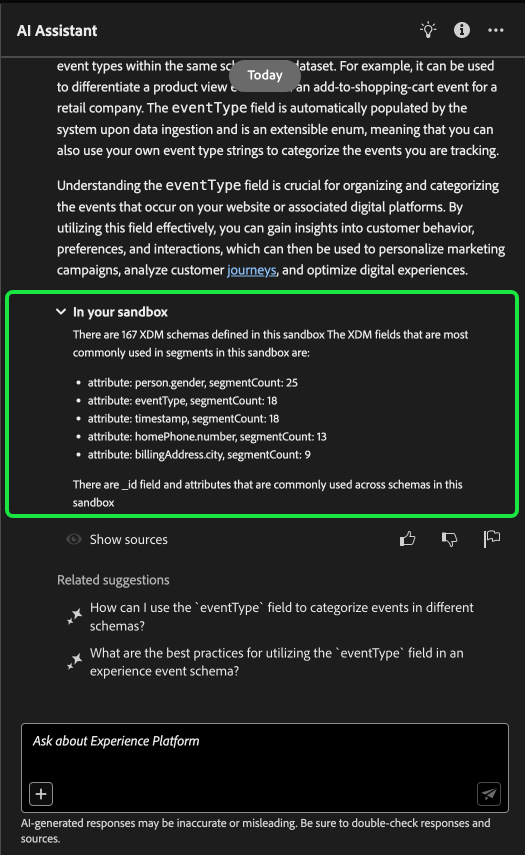
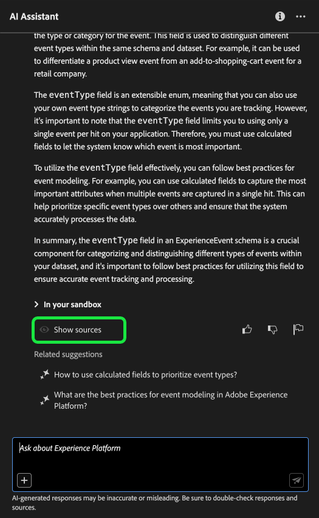
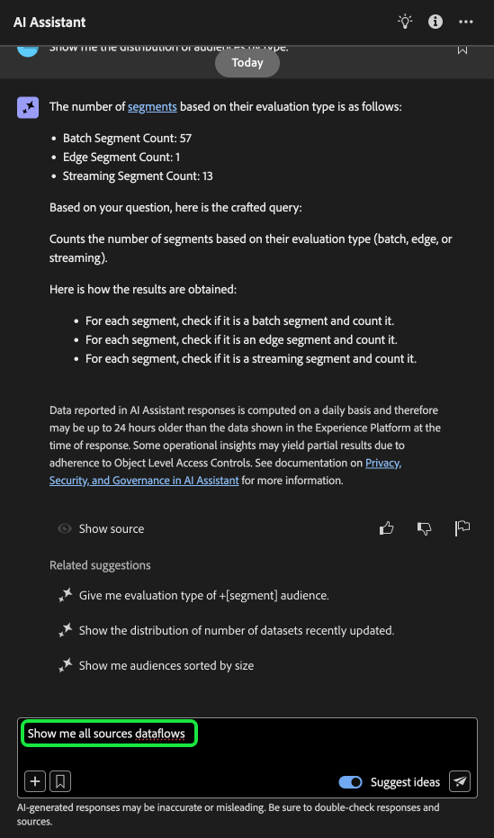
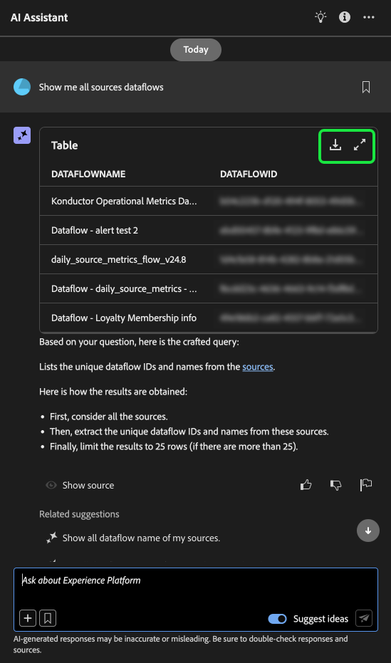
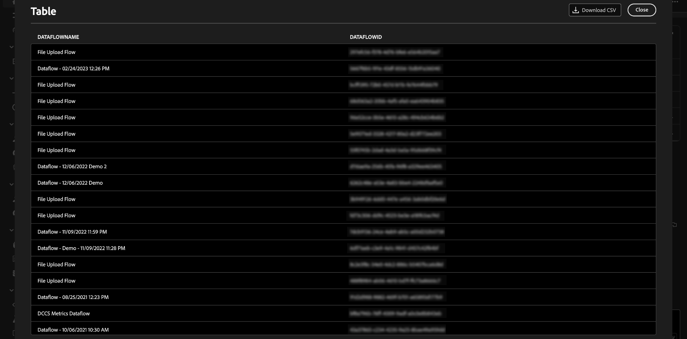
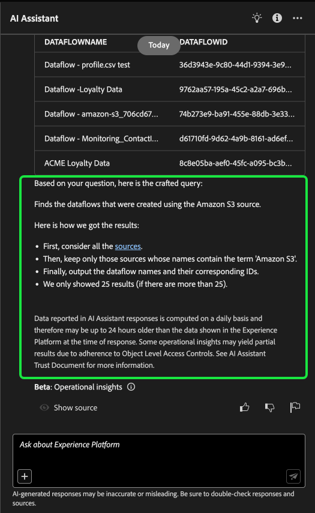
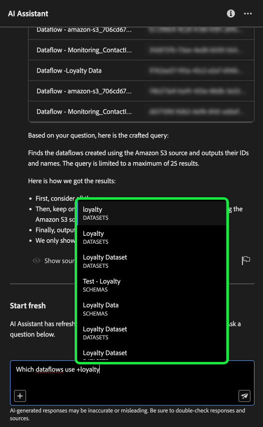
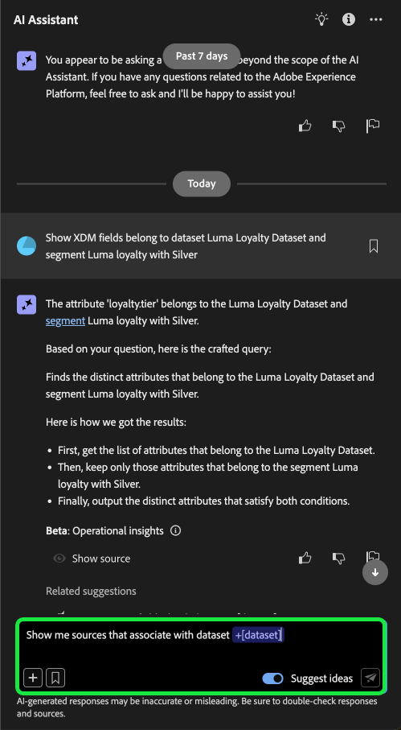

# AI Assistant UI Guide (verouderd)

>[!IMPORTANT]
>
>Dit document is van toepassing op AI Assistant (verouderd). Voor informatie over AI Medewerker (volgende-Gen), lees de [&#x200B; AI HulpUI gids &#x200B;](https://experienceleague.adobe.com/en/docs/experience-cloud-ai/experience-cloud-ai/ai-assistant/ai-assistant-ui) in [&#x200B; AI in Experience Cloud &#x200B;](https://experienceleague.adobe.com/nl/docs/experience-cloud-ai/experience-cloud-ai/home) documentatie.

Raadpleeg de volgende tabel voor een vergelijking van AI Assistant (Legacy) en AI Assistant (Next-Gen):

| Functiegebied | AI Assistant (verouderd) | AI-assistent (Next-Gen) |
| --- | --- | --- |
| Gebruikerservaring | AI Assistant (verouderd) is alleen beschikbaar in een panel voor rechtse spoorwegsystemen. | AI Assistant (Next-Gen) is zowel beschikbaar in het rechterdeelvenster als in een indrukwekkende ervaring op volledig scherm. |
| Toepassingsgebied van de mogelijkheden | U kunt AI Assistant (Verouderd) gebruiken voor zowel productkennis als operationele inzichten. | U kunt de Medewerker van AI (Next-Gen) voor productkennis, operationele inzichten, evenals geavanceerde agentische vaardigheden en multi-step taakuitvoering gebruiken. |
| Platformarchitectuur | AI Assistant (Verouderd) is niet op de Agent Orchestrator-stapel gebaseerd. | De Medewerker van AI (Volgende-Gen) wordt aangedreven door [&#x200B; Adobe Experience Platform Agent Orchestrator &#x200B;](https://experienceleague.adobe.com/nl/docs/experience-cloud-ai/experience-cloud-ai/agents/agent-orchestrator), toelatend rekbaarheid en geavanceerde coördinatie over mogelijkheden. |
| Toepassingsdekking | AI Assistant (Legacy) is een toepassingsspecifieke implementatie. | U kunt AI Assistant (Next-Gen) gebruiken voor een uniforme AI Assistant-ervaring in alle Adobe Experience Cloud-toepassingen. |
| Toegangsmodel en machtigingsmodel | Toepassingsbereik toegangsmodel uitgelijnd op individuele productgrenzen. | Alle gebruikers krijgen toegang tot AI Assistant (Next-Gen) en bijbehorende Experience Platform-agents. **Nota**: <ul><li>**Adobe Experience Manager**: Uw beheerder moet u de toestemming verlenen om tot Medewerker (Volgende-Gen) door [&#x200B; Adobe Admin Console &#x200B;](https://helpx.adobe.com/nl/enterprise/using/admin-console.html) toegang te hebben.</li><li>**Customer Journey Analytics**: Uw beheerder moet u de toestemming verlenen om tot AI Medewerker door [&#x200B; het Toegangsbeheer van Customer Journey Analytics &#x200B;](https://experienceleague.adobe.com/en/docs/analytics-platform/using/technotes/access-control?lang=en) toegang te hebben. Hierdoor kunt u vragen stellen over productkennis en gegevensinzichten. |

Lees deze handleiding voor meer informatie over het gebruik van AI Assistant in de gebruikersinterface van Adobe Experience Platform.

## AI-assistent openen in de gebruikersinterface van Experience Platform

Als u AI Assistant wilt starten, selecteert u de **[!UICONTROL AI Assistant icon]** in de bovenste koptekst van de gebruikersinterface van Experience Platform.

De interface AI Assistant wordt weergegeven en bevat direct informatie die u nodig hebt om aan de slag te gaan. U kunt de opties onder [!UICONTROL Ideas to get started] gebruiken om vragen en opdrachten te beantwoorden, zoals:

* [!UICONTROL Which of my audiences are activated?]
* [!UICONTROL What is a schema?]
* [!UICONTROL Tell me some common use cases for Real-Time CDP]

## Handleiding voor AI Assistant-gebruikersinterface

>[!NOTE]
>
>De volgende workflow is een voorbeeld waarin het proces voor het maken van een ervaringsgebeurtenisschema wordt gebruikt om te laten zien hoe u AI Assistant kunt gebruiken wanneer u de gebruikersinterface van Experience Platform gebruikt.

Overweeg een gebruiksgeval waarin u de Handel van het a **Apparaat in het Schema van de Gebeurtenis** creeert. Tijdens het maken van het gebeurtenisschema komt u tegen het veld `eventType` . &quot;Op dit punt, hebt u de optie om of uw werkschema weg te gaan en naar de [&#x200B; grondbeginselen van een schemacompositie &#x200B;](../xdm/schema/composition.md) documentatie te verwijzen, of u kunt AI Medewerker gebruiken om antwoorden aan uw vragen terug te winnen en extra middelen door de documentatiekoppelingen te vinden die door AI Medewerker worden geadviseerd.&quot;

Om te beginnen voert u uw vraag in het tekstvak in. In het voorbeeld hieronder, wordt AI Medewerker verstrekt de vraag: &quot;**wat het eventType gebied in een schema ExperienceEvent is?**&quot;

AI Assistant zoekt vervolgens naar zijn kennisbasis en berekent een antwoord. AI Assistant retourneert na enkele ogenblikken een antwoord en verwante suggesties die u kunt gebruiken als follow-upaanwijzingen.

Nadat u een reactie hebt ontvangen van AI Assistant, kunt u een aantal opties selecteren om te bepalen hoe u wilt doorgaan.

### AI Assistant-functies {#features}

In deze sectie worden de verschillende functies van AI Assistant beschreven die u kunt gebruiken tijdens uw workflows op Experience Platform.

### Operationele gegevensobjecten weergeven {#view-operational-data-objects}

Afhankelijk van uw query biedt AI Assistant aanvullende informatie over de gegevens in uw sandbox. Selecteer **[!UICONTROL In your sandbox]als u wilt zien hoe de reactie op uw query op uw specifieke sandbox wordt toegepast.**

Wanneer u gegevens met betrekking tot uw sandbox weergeeft, kan AI Assistant directe koppelingen bevatten naar specifieke UI-pagina&#39;s waarop de gevraagde gegevens worden weergegeven.

+++Selecteren om voorbeeld weer te geven

In dit voorbeeld retourneert AI Assistant aanvullende informatie over de bestaande XDM-schema&#39;s in uw sandbox, inclusief het totale aantal en de vijf meest gebruikte velden.

+++

### citaten weergeven {#view-citations}

U kunt antwoorden verifiëren die door AI Assistant aan u zijn geretourneerd door citaten te bekijken die beschikbaar zijn bij elk antwoord op de productkennis.

+++Selecteer deze optie om een voorbeeld weer te geven van hoe u bronnen kunt weergeven

Selecteer **[!UICONTROL Show sources]** als u citaties wilt weergeven en de reactie van AI Assistant wilt valideren.

AI Assistant werkt de interface bij en biedt koppelingen naar documentatie die de eerste reactie bevestigen. Wanneer citaties zijn ingeschakeld, werkt AI Assistant het antwoord bij en worden voetnoten opgenomen om de specifieke delen van het antwoord aan te geven die naar de opgegeven documentatie verwijzen.

+++

### Operationele inzichten {#operational-insights}

AI Assistant moet zich in een actieve sandbox bevinden om voldoende te kunnen reageren op een vraag over uw operationele inzichten.

+++Selecteren om een voorbeeld weer te geven van een vraag over operationele inzichten

In het voorbeeld hieronder, wordt AI Medewerker gevraagd de volgende vraag: **&quot;toon me dataflows die gebruikend de bron van Amazon S3 werden gecreeerd&quot;**.

AI Assistant reageert vervolgens met een tabel waarin uw gegevens en de bijbehorende id&#39;s worden vermeld. Selecteer het downloadpictogram () om de lijst als Csv- dossier te downloaden. Om de volledige lijst te bekijken, selecteer uitvouwen pictogram ( uit).

Er wordt een uitgebreide weergave van de tabel weergegeven, zodat u een uitgebreidere lijst met gegevensstromen krijgt op basis van de parameters van de query.

Als deze wordt gevraagd om een vraag over operationele inzichten, geeft AI Assistant een uitleg van de manier waarop het antwoord is berekend. In het onderstaande voorbeeld geeft AI Assistant een overzicht van de stappen die zijn uitgevoerd om de gegevensstromen te identificeren die zijn gemaakt met de bron [!DNL Amazon S3] .

U kunt ook filters en wijzigingen in uw vragen opgeven en u kunt de AI Assistant de opdracht geven zijn bevindingen te genereren op basis van de filters die u opneemt. Bijvoorbeeld, kunt u AI Medewerker vragen om u een trend van de telling van segmentdefinities in de orde van hun gecreeerde datum te tonen, segmentdefinities met nul totale profielen te verwijderen, en maandnamen in plaats van gehelen te gebruiken wanneer het tonen van de gegevens.

+++

### Reacties met operationele inzichten controleren {#verify-responses}

U kunt elke reactie met betrekking tot operationele vragen van inzichten verifiëren gebruikend een SQL vraag die AI Medewerker verstrekt.

+++Selecteer deze optie om een voorbeeld van het controleren van reacties op operationele inzichten weer te geven

Nadat u een antwoord voor een vraag over operationele inzichten hebt ontvangen, selecteert u **[!UICONTROL Show sources]** en selecteert u vervolgens **[!UICONTROL View source query]** .

Wanneer gevraagd met een operationele inzichten vraag, verstrekt AI Assistant een SQL vraag die u kunt gebruiken om het proces te verifiëren dat het nam om zijn antwoord te berekenen. Deze bronvraag is slechts voor verificatiedoeleinden en wordt niet gesteund op de Dienst van de Vraag.

+++

### Entiteiten automatisch aanvullen {#use-entity-auto-complete}

Met de functie Automatisch aanvullen kunt u een lijst met gegevensobjecten ontvangen die in uw sandbox staan. Er zijn aanbevelingen voor automatisch aanvullen beschikbaar voor de volgende domeinen: publiek, schema&#39;s, datasets, reizen, bronnen en bestemmingen.

+++Selecteren om een voorbeeld van automatisch aanvullen weer te geven

U kunt autocomplete gebruiken door het plusteken (**`+`**) in uw vraag te omvatten. U kunt ook het plusteken (**`+`**) onder aan het tekstinvoervak selecteren. Er wordt een venster weergegeven met een lijst met aanbevolen gegevensobjecten uit uw sandbox.

+++

### Meerdere keren gebruiken {#use-multi-turn}

U kunt de multi-boommogelijkheden van AI Medewerker gebruiken om een natuurlijker gesprek tijdens uw ervaring te hebben. AI Assistant kan vervolgvragen beantwoorden. die context kan worden afgeleid uit een eerdere interactie.

+++Selecteren om een voorbeeld van meerdere keren draaien weer te geven

In het onderstaande voorbeeld wordt AI Assistant eerst gevraagd naar het totale aantal gegevensstromen en wordt vervolgens gevraagd de 10 meest recente gegevensstromen weer te geven.

+++

### Een nieuw gesprek starten

U kunt onderwerpen met AI Medewerker veranderen door opnieuw in te stellen en een nieuw gesprek te beginnen.

+++Selecteer om een voorbeeld te bekijken van het terugstellen van uw gesprek

Om terug te stellen, selecteer de ellipsen (**`...`**) op de interface AI van de Medewerker en selecteer dan **[!UICONTROL Start new conversation]**. Dit informeert AI Medewerker dat u op veranderende onderwerpen van plan bent en kan bijzonder nuttig zijn wanneer het oplossen van problemenvragen die of ontbreken of van verwijzingen voorzien onjuiste informatie.

+++

### Detectie gebruiken {#use-discoverability}

U kunt de ontdekkingsfunctie van AI Assistant gebruiken om een lijst weer te geven met algemene onderwerpen, gegroepeerd in entiteiten, die door AI Assistant worden ondersteund.

+++Selecteren om voorbeeld van ontdekkingsmogelijkheden weer te geven

Selecteer het pictogram met de gloeilamp in de bovenste koptekst van de AI Assistant-interface om de ontdekkingsmogelijkheden weer te geven.

Selecteer vervolgens een categorie en selecteer vervolgens een vraag in de opgegeven lijst. U kunt deze functie gebruiken om een beter idee te krijgen van de typen vragen die AI Assistant kan beantwoorden. U kunt de reeds bestaande herinneringen met specifieke details ook bijwerken die tot uw zandbak gebruikend vrije tekst of [&#x200B; autocomplete &#x200B;](#use-auto-complete) behoren.

+++

### Vraag automatisch aanvullen {#use-question-autocomplete}

Met de functie voor automatisch aanvullen van vragen van AI Assistant kunt u een vraag selecteren in een lijst met aanbevelingen van AI Assistant.

+++Selecteren om voorbeeld van automatisch aanvullen van vragen weer te geven

Als u het deelvenster met voorgestelde vragen wilt weergeven, typt u ten minste 7 (7) tekens in het invoervak. Selecteer vervolgens de vraag die voor u relevant is in het menu dat wordt weergegeven.

Mogelijk moet u tijdelijke aanduidingen bijwerken in sommige gevallen waarin een voorgestelde vraag betrekking heeft op operationele inzichten. U moet bijvoorbeeld mogelijk de specifieke naam van een gegevensset of een publiek toevoegen als de suggestie van AI Assistant plaatsaanduidingen bevat.

Plaatsaanduidingen worden in blauw gemarkeerd. Selecteer de tijdelijke aanduiding om de waarde ervan bij te werken. Voor de beste resultaten bij numerieke plaatsaanduidingen moet u ervoor zorgen dat u cijfers in plaats van tekst gebruikt. U kunt ook de functie voor automatisch aanvullen van de entiteit gebruiken om de waarden van de plaatsaanduiding bij te werken. U kunt geen vraag verzenden die niet-ingevulde plaatsaanduidingen heeft.

**NOTA**: De suggesties worden toegelaten door gebrek. Selecteer de schakeloptie **[!UICONTROL Suggest ideas]** om de functie uit te schakelen.

+++

### Verwante suggesties gebruiken {#use-related-suggestions}

U kunt de verwante suggesties sectie van elke AI Hulp- reactie gebruiken om uw gesprek voort te zetten.

+++Selecteren om voorbeeld van verwante suggesties weer te geven

Verwante suggesties worden geretourneerd bij elke reactie van AI Assistant. Om uw gesprek voort te zetten, selecteer om het even welke suggesties in de verwante suggesties sectie.

Net als voor plaatsaanduidingen in kwestie die automatisch zijn voltooid, moet u plaatsaanduidingen bijwerken die zijn opgenomen in verwante suggesties voordat u de query kunt verzenden.

+++

## Feedback geven {#feedback}

U kunt feedback over uw ervaringen met AI Assistant opgeven met de opties die bij het antwoord worden geleverd.

Als u feedback wilt opgeven, selecteert u duimen omhoog, duimen omlaag of een markering nadat u een reactie van de AI-assistent hebt ontvangen. Vervolgens voert u uw feedback in het opgegeven tekstvak in.

+++Selecteren om meer voorbeelden weer te geven

>[!BEGINTABS]

>[!TAB  duimen omhoog ]

Selecteer het pictogram van duim op om feedback te geven over wat goed met uw ervaring met de AI Assistant is gegaan.

>[!TAB  duimen neer ]

Selecteer het pictogram met de miniaturen omlaag om feedback te geven over de verbeteringen die u kunt aanbrengen op basis van uw ervaring met de AI Assistant. Tijdens deze stap kunt u ook specifieke opmerkingen maken over uw ervaring. De feedback in de opmerkingen wordt dagelijks bekeken.

>[!TAB  Vlag ]

Selecteer het vlagpictogram om verdere rapporten over uw ervaring te verstrekken gebruikend de Medewerker AI.

>[!ENDTABS]

+++
