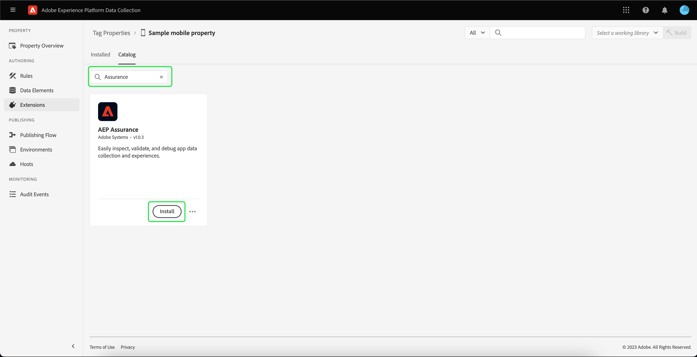

# De Adobe Experience Platform Assurance-extensie implementeren

In deze zelfstudie wordt uitgelegd hoe u de Experience Platform Assurance-extensie installeert en implementeert in de Mobile SDK. Voor instructies bij het toevoegen van de uitbreiding van Assurance aan uw toepassing, gelieve te lezen het [ de uitbreidingsoverzicht van Adobe Experience Platform Assurance ](https://developer.adobe.com/client-sdks/documentation/platform-assurance-sdk/#add-the-aep-assurance-extension-to-your-app).

## Aan de slag

Als u de Assurance-extensie wilt installeren en implementeren, hebt u toegang nodig tot de volgende services:

- De [ UI van de Inzameling van Gegevens van Adobe Experience Platform ](https://experience.adobe.com/#/data-collection/)
- [ Adobe Experience Platform Assurance ](https://experience.adobe.com/assurance)

## Een mobiele eigenschap maken

>[!NOTE]
>
>Als u al een eigenschap voor mobiele apparaten hebt, kunt u verdergaan met de volgende stap.

Selecteer **[!UICONTROL Tags]** in de gebruikersinterface voor gegevensverzameling. Er wordt een lijst met mobiele en wegeigenschappen weergegeven, met informatie over de eigenschappen die bij uw organisatie horen. Selecteer **[!UICONTROL New property]** om een nieuwe eigenschap te maken.

 tot stand te brengen

De pagina **[!UICONTROL Create Property]** wordt weergegeven. Voer de naam voor de nieuwe eigenschap in en selecteer **[!UICONTROL Mobile]** als uw platform. Nadat u de details hebt ingevoegd, selecteert u **[!UICONTROL Save]** om de eigenschap mobile te maken.

>[!NOTE]
>
>Het plaatsen van het mobiele bezit **[!UICONTROL Privacy]** beïnvloedt **niet** de gegevensinzameling van Assurance.

## De Assurance-extensie installeren

Selecteer de eigenschap mobile waarin u de Assurance-extensie wilt installeren.

De **mobiele bezitsdetails** pagina verschijnt. Selecteer **[!UICONTROL Extensions]** om een lijst weer te geven met extensies die momenteel zijn gekoppeld aan uw mobiele eigenschap.

Selecteer **[!UICONTROL Catalog]** om een lijst weer te geven met extensies die u kunt toevoegen aan de eigenschap mobile. Zoek met het filter de extensie **[!UICONTROL AEP Assurance]** en selecteer **[!UICONTROL Install]** .

## Volgende stappen

Nu u de Assurance-extensie in uw mobiele eigenschap hebt geïnstalleerd, kunt u Assurance in uw toepassingen gaan gebruiken. Leer hoe te om de uitbreiding van Assurance aan uw toepassing toe te voegen, te lezen gelieve het [ de uitbreidingsoverzicht van Adobe Experience Platform Assurance ](https://developer.adobe.com/client-sdks/documentation/platform-assurance-sdk/#add-the-aep-assurance-extension-to-your-app). Leren hoe te om Assurance te gebruiken, te lezen gelieve [ gebruikend de gids van Assurance ](./using-assurance.md).
