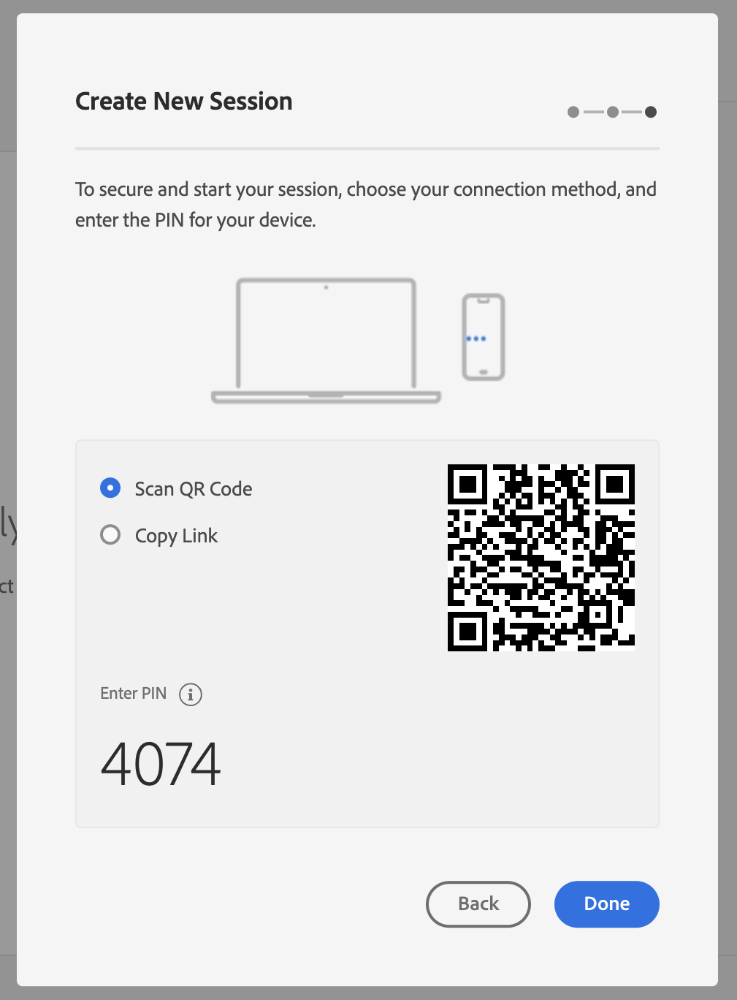

# Adobe Experience Platform Assurance gebruiken

In deze zelfstudie wordt uitgelegd hoe u Adobe Experience Platform Assurance kunt gebruiken. Voor instructies op om de uitbreiding van de Verzekering van Adobe Experience Platform te installeren en uit te voeren, te lezen gelieve het leerprogramma op [ uitvoerend de uitbreiding van de Verzekering ](./implement-assurance.md).

## Sessies maken

Na het registreren in [ Verzekering UI ](https://experience.adobe.com/assurance), kunt u selecteren **[!UICONTROL Create Session]** beginnen creërend een zitting.

Het dialoogvenster **[!UICONTROL Create New Session]** wordt weergegeven. Controleer de gegeven instructies en selecteer **[!UICONTROL Start]** .

U kunt nu een naam invoeren om de sessie te identificeren en vervolgens een **[!UICONTROL Base URL]** (deep linking-URL voor uw app) opgeven. Selecteer **[!UICONTROL Next]** nadat u deze gegevens hebt opgegeven.

>[!INFO]
>
>De basis-URL is de basisdefinitie die wordt gebruikt om uw app via een URL te starten. Er wordt een sessie-URL gegenereerd waarmee u de betrouwbaarheidssessie kunt starten. Een voorbeeldwaarde kan er als volgt uitzien: `myapp://default` Typ in het veld **[!UICONTROL Base URL]** de diepgaande-koppelingsdefinitie van de basis van uw app.

## Verbinding maken met een sessie

Nadat u een sessie hebt gemaakt, controleert u of u in het dialoogvenster **[!UICONTROL Create New Session]** nu een koppeling, een QR-code en een pincode ziet.

Als dit dialoogvenster wordt weergegeven, kunt u de QR-code scannen met de camera-app van uw apparaat en de koppeling openen of kopiëren en openen in uw app. Wanneer uw app wordt gestart, wordt het scherm PIN-invoer weergegeven. Typ de pincode uit de vorige stap en druk op **[!UICONTROL Connect]** .

U kunt controleren of uw app is verbonden met Verzekering wanneer het Adobe Experience Platform-pictogram (rode Adobe &quot;A&quot;) wordt weergegeven op uw app.

## Een sessie exporteren

Als u een betrouwbaarheidssessie wilt exporteren, selecteert u **[!UICONTROL Export to JSON]** in een sessie op de detailpagina van uw app:

De exportoptie respecteert de resultaten van het zoekfilter en exporteert alleen gebeurtenissen die in de gebeurtenisweergave worden weergegeven. Als u bijvoorbeeld hebt gezocht naar gebeurtenissen &#39;track&#39; en vervolgens **[!UICONTROL Export to JSON]** selecteert, worden alleen de resultaten van de gebeurtenis &#39;track&#39; geëxporteerd.
