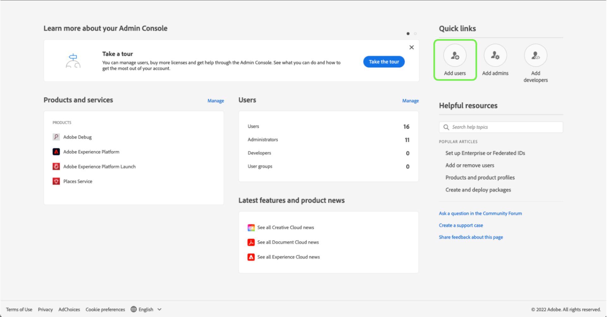

# Toegang van gebruikers

>[!WARNING]
>
>Let op: de gebruikerstoegang tot Betrouwbaarheid verandert. Aangezien de Verzekering bèta (Project Griffon) aan algemeen beschikbaar (als Verzekering) aan alle klanten van Adobe Experience Cloud laat - de toegang tot Verzekering zal door [Admin Console](https://helpx.adobe.com/nl/enterprise/using/admin-console.html).
>
>Neem contact op met de Adobe Experience Cloud-beheerder van uw bedrijf als u hulp nodig hebt.

Om ononderbroken toegang tot Verzekering te ontvangen of te handhaven, zorg ervoor dat de volgende stappen in de Admin Console worden voltooid:

## Gebruikers aan Experience Platform toevoegen via een productprofiel

Als u een gebruiker aan een productprofiel wilt toevoegen, meldt u zich aan bij de Admin Console en selecteert u **Gebruikers toevoegen**.

De **Gebruikers aan uw team toevoegen** wordt weergegeven. In dit dialoogvenster kunt u de gegevens invoeren van de gebruiker die u wilt toevoegen. Voer het e-mailadres, de voornaam (optioneel) en de achternaam (optioneel) van de gebruiker in.

Selecteer het potloodpictogram om de producten en gebruikersgroepen te kiezen. Selecteer **Adobe Experience Platform** vervolgens **AEP-Default-All-Users**, gevolgd door **Opslaan**.

