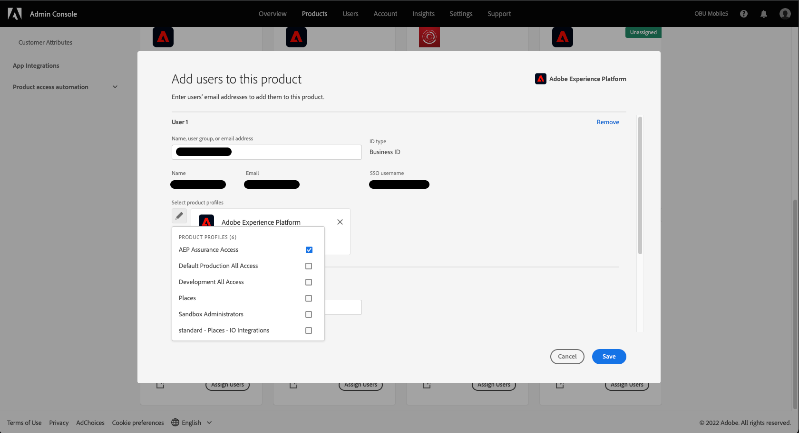

# Toegang van gebruikers

>[!WARNING]
>
>Let op: de gebruikerstoegang tot Betrouwbaarheid verandert. Aangezien de Verzekering bèta (Project Griffon) aan algemeen beschikbaar (als Verzekering) aan alle klanten van Adobe Experience Cloud laat - de toegang tot Verzekering zal door [Admin Console](https://helpx.adobe.com/nl/enterprise/using/admin-console.html).
>
>Neem contact op met de Adobe Experience Cloud-beheerder van uw bedrijf als u hulp nodig hebt.

Om ononderbroken toegang tot Verzekering te ontvangen of te handhaven, zorg ervoor dat de volgende stappen in de Admin Console worden voltooid:

## Een productprofiel maken

>[!NOTE]
>
>Als u een bestaand profiel gebruikt, kunt u naar de volgende sectie overslaan.

Aanmelden bij [Admin Console](https://adminconsole.adobe.com/) en maak een nieuw Adobe Experience Platform-productprofiel.

Selecteer **Producten** , gevolgd door de Adobe Experience Platform-productkaart.

## Gebruikers toevoegen aan het productprofiel

Nadat u de productkaart hebt geopend, geeft u een naam op en selecteert u **Opslaan**.

>[!NOTE]
>
>Het productprofiel dat u wilt gebruiken voor Betrouwbaarheid, heeft geen **niet** aanvullende machtigingen vereisen.

Nu u de productkaart hebt gemaakt, kunt u gebruikers toewijzen aan het Adobe Experience Platform-productprofiel. Selecteer **Producten** tab, gevolgd door **Gebruikers toewijzen** op de Adobe Experience Platform-kaart.

Voeg een of meer gebruikers toe aan het productprofiel en sla het op.

