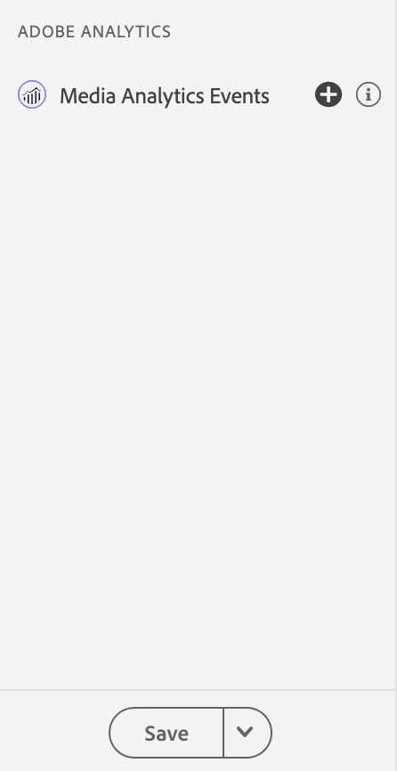

# Adobe Analytics para medios de streaming View in Assurance

Dankzij de integratie tussen Adobe Analytics para medios de streaming en Adobe Experience Platform Assurance kunt u nu de Media Analytics-implementatie in uw mobiele app valideren. In de Media Analytics-weergaven wordt weergegeven wat in de mediasessie wordt bijgehouden, zoals:

- De gebeurtenis van het begin van de zitting die alle inhoud kern, standaardmeta-gegevens, en eigenschappen van douanemeta-gegevens, evenals zittingseind en zitting complete gebeurtenissen bevat.
- Start- en startgebeurtenissen van Ad Break met alle eigenschappen voor advertentie gekoppeld, en gebeurtenissen Skip en Complete voor beide.
- Het begin van het hoofdstuk met alle eigenschappen in bijlage, evenals de gebeurtenissen van de Skip van het Hoofdstuk en van het Hoofdstuk voltooide.
- Alle gebeurtenissen die tijdens het afspelen zijn gewijzigd (afspelen, pauzeren, buffer, fouten, wijziging van bitsnelheid).
- Alle gebeurtenissen voor bijhouden van wijzigingen in spelerstatus (begin, einde).

Zodra de gegevens in Analytics worden verwerkt, zijn de post-verwerkte status en de gegevens, zoals media tijd besteed en totale pauzeduur, ook beschikbaar in de mening van het gebeurtenisdetail.

## Aan de slag

Controleer voordat je doorgaat of je over de volgende services beschikt:

- De [ UI van de Inzameling van Gegevens van Adobe Experience Platform ](https://experience.adobe.com/#/data-collection/)
- [ de Verzekering van Adobe Experience Platform ](https://experience.adobe.com/assurance)

Leren hoe te om Verzekering in uw toepassing te installeren, te lezen gelieve de [ het uitvoeren gids van de Verzekering ](../tutorials/implement-assurance.md).

## Betrouwbaarheid gebruiken met Adobe Analytics para medios de streaming

Nadat u verbinding hebt gemaakt en uw app voor Adobe Analytics hebt ingesteld, kunt u deze configureren voor Streaming Media Analytics. Bij de bodem van het linkerpaneel, uitgezochte **[!UICONTROL Configure]** om de mening van de Gebeurtenissen van de Analyse van Media toe te voegen en **sparen** het.

Nadat u de sessie hebt toegevoegd, selecteert u de **[!UICONTROL Media Analytics Events]** -weergave in de **[!UICONTROL Adobe Analytics]** -sectie om de sessie te volgen.

In de **[!UICONTROL Media Analytics Events]** mening, kunt u zoeken en filtreren door identiteitskaart van de Zitting (VSID) om een specifieke media zitting te bekijken. Selecteer een specifieke gebeurtenis om aanvullende gebeurtenisdetails weer te geven.

Voor een beknopte weergave van API-aanroepen kunt u ook de update-gebeurtenissen van de afspeelkop verbergen door het filter **[!UICONTROL Hide Playhead Update events]** te selecteren.

>[!INFO]
>
>Voor het weergeven van gegevens van nabewerkte mediaanalyses is het gebruik van SDK-versies vereist: Android Media 2.1.2 en iOS AEPMedia 3.0.1 (of hoger)

Als u de gegevens na verwerking wilt weergeven, zoekt u de gebeurtenis start van de sessie en valideert u deze in de statuskolom die de sessie heeft voltooid. Klik op de gebeurtenis als deze is voltooid om een overzicht van een mediasessie weer te geven in de gedetailleerde weergave van de gebeurtenis. Blader omlaag om de details na verwerking te vinden voor meer informatie.

