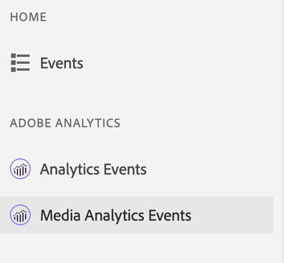

# Adobe Analytics for Streaming Media View in Assurance

Dankzij de integratie tussen Adobe Analytics voor Streaming Media en Adobe Experience Platform Assurance kunt u nu de implementatie van Media Analytics in uw mobiele app valideren. In de Media Analytics-weergaven wordt weergegeven wat in de mediasessie wordt bijgehouden, zoals:

- De gebeurtenis van het begin van de zitting die alle inhoud kern, standaardmeta-gegevens, en eigenschappen van douanemeta-gegevens, evenals zittingseind en zitting complete gebeurtenissen bevat.
- Start- en startgebeurtenissen van Ad Break met alle eigenschappen voor advertentie gekoppeld, en gebeurtenissen Skip en Complete voor beide.
- Het begin van het hoofdstuk met alle eigenschappen in bijlage, evenals de gebeurtenissen van de Skip van het Hoofdstuk en van het Hoofdstuk voltooide.
- Alle gebeurtenissen die tijdens het afspelen zijn gewijzigd (afspelen, pauzeren, buffer, fouten, wijziging van bitsnelheid).
- Alle gebeurtenissen voor bijhouden van wijzigingen in spelerstatus (begin, einde).

Zodra de gegevens in Analytics worden verwerkt, zijn de post-verwerkte status en de gegevens, zoals media tijd besteed en totale pauzeduur, ook beschikbaar in de mening van het gebeurtenisdetail.

## Aan de slag

Controleer voordat je doorgaat of je de volgende services hebt:

- De [UI voor gegevensverzameling van Adobe Experience Platform](https://experience.adobe.com/#/data-collection/)
- [Adobe Experience Platform Assurance](https://experience.adobe.com/assurance)

Als u wilt weten hoe u Verzekering in uw toepassing installeert, leest u de [Implementatie van de betrouwbaarheidsgids](../tutorials/implement-assurance.md).

## Betrouwbaarheid gebruiken met Adobe Analytics voor streaming media

Nadat u verbinding hebt gemaakt en uw app voor Adobe Analytics hebt ingesteld, kunt u deze configureren voor Streaming Media Analytics. Selecteer onder aan het linkerdeelvenster de optie **[!UICONTROL Configure]** om de weergave Gebeurtenissen van Media Analytics toe te voegen en **Opslaan** het.

Selecteer de optie **[!UICONTROL Media Analytics Events]** in de **[!UICONTROL Adobe Analytics]** om de sessie te valideren.

In de **[!UICONTROL Media Analytics Events]** kunt u zoeken en filteren op sessie-id (VSID) om een specifieke mediasessie weer te geven. Selecteer een specifieke gebeurtenis om aanvullende gebeurtenisdetails weer te geven.

Voor een beknopte weergave van API-aanroepen kunt u ook de update-gebeurtenissen van de afspeelkop verbergen door de optie **[!UICONTROL Hide Playhead Update events]** filter.

>[!INFO]
>
>Voor het weergeven van gegevens van de nabewerkte mediaanalyse is het gebruik van SDK-versies vereist: Android Media 2.1.2 en iOS AEPMedia 3.0.1 (of hoger)

Als u de gegevens na verwerking wilt weergeven, zoekt u de gebeurtenis start van de sessie en valideert u deze in de statuskolom die de sessie heeft voltooid. Klik op de gebeurtenis als deze is voltooid om een overzicht van een mediasessie weer te geven in de gedetailleerde weergave van de gebeurtenis. Blader omlaag om de details na verwerking te vinden voor meer informatie.

