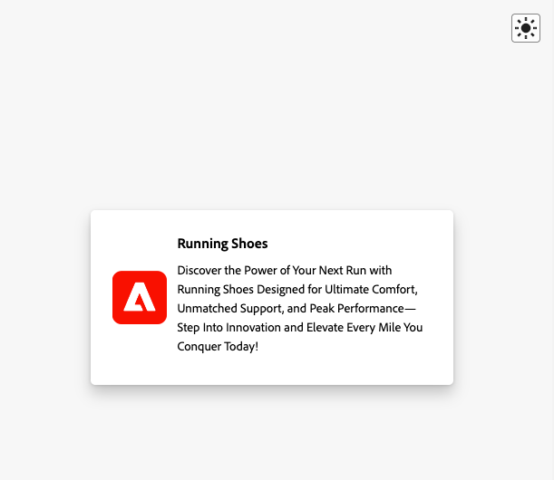

# Weergave Inhoudskaarten in Assurance

In de weergave Berichten in de app in Adobe Experience Platform Assurance kunt u uw app valideren, de inhoudskaarten controleren die aan uw apparaat worden geleverd en voorvertoningskaarten.

## Inhoudskaarten

Boven aan het tabblad **[!UICONTROL Content Cards]** bevindt zich een **[!UICONTROL Content Card]** -vervolgkeuzelijst. Hier worden alle inhoudskaarten weergegeven die in de Assurance-sessie zijn ontvangen. Als een kaart niet in deze lijst voorkomt, betekent dit dat de app deze nooit heeft ontvangen.

 bevat

Als u een inhoudskaart selecteert, wordt veel informatie over die kaart weergegeven, zoals in de onderstaande secties wordt beschreven.

### Kaartvoorvertoning

In het rechterdeelvenster vindt u een deelvenster **[!UICONTROL Card Preview]** waarin wordt weergegeven hoe een kaart wordt weergegeven in algemene sjablonen: Kleine afbeelding, Grote afbeelding en Alleen afbeelding.

Met de schakeloptie **[!UICONTROL Theme]** kunt u de kaart in lichte of donkere modus bekijken.

### Beschikbare tabbladen

In de linkersectie zijn de beschikbare tabbladen afhankelijk van de geselecteerde kaart. Als de kaart regels bevat, ziet u drie tabbladen: **[!UICONTROL Info]**, **[!UICONTROL Interactions]** en **[!UICONTROL Analyze Rules]** .

Als de kaart geen regels bevat, ziet u twee tabbladen: **[!UICONTROL Info]** en **[!UICONTROL Interactions]** .

### Het tabblad Info

Op het tabblad **[!UICONTROL Info]** wordt de sectie **[!UICONTROL Card Properties]** boven weergegeven, inclusief badges voor de **[!UICONTROL Current State]** -component (trigger, display, dismiss, diskwalificeren) plus metagegevens zoals **[!UICONTROL Template]** (Small Image, Large Image of Image Only) **[!UICONTROL Surface]** en eventuele aangepaste sleutel-waardeparen.

Hieronder ziet u in de sectie **[!UICONTROL Campaign Properties]** informatie die is geladen uit Adobe Journey Optimizer (AJO).

U kunt ook **[!UICONTROL View Campaign]** selecteren om de kaart in AJO te openen voor inspectie of bewerking.

### Tabblad Interacties

Het tabblad **[!UICONTROL Interactions]** geeft een overzicht van de levenscyclus van elke kaart als een reeks badges: het begint altijd met **[!UICONTROL trigger]** , gevolgd door het resultaat dat de regels opleveren— **[!UICONTROL display]** , **[!UICONTROL dismiss]** of **[!UICONTROL disqualify]** .

### Het tabblad Regels analyseren

Het tabblad **[!UICONTROL Analyze]** toont een gebeurtenissentabel met maximaal drie regelkolommen— **[!UICONTROL Display]**, **[!UICONTROL Dismiss]** en **[!UICONTROL Disqualify]** - op basis van de regels van de kaart. Als de kaart slechts één regel definieert, wordt alleen die kolom weergegeven.

Elke rij vertegenwoordigt een zittingsgebeurtenis, en elke kolom wijst erop of de regel van de kaart voor de voorwaarden van die gebeurtenis paste. Een 0% score betekent dat er geen voorwaarden zijn die overeenkomen. 100% is een volledige overeenkomst (de regel wordt genegeerd).

Als de gebeurtenis overeenkomt met een voorwaarde, wordt een groen vinkje weergegeven. Als de gebeurtenis niet overeenkomt, wordt er een rood pictogram weergegeven.

Gebruik de schuifregelaar **[!UICONTROL Match Threshold]** om gebeurtenissen te filteren op basis van een minimumpercentage.

Wanneer u een gebeurtenis selecteert, wordt rechts een deelvenster met details geopend met een accordeon met de drie regels: **[!UICONTROL Display]**, **[!UICONTROL Dismiss]** en **[!UICONTROL Disqualify]** .

Breid om het even welke sectie uit om de voorwaarden van de regel te zien, welke voorwaarden, en het berekende gelijke percentage voor dat resultaat aanstemden.

## Tabblad Verzoeken

Op het tabblad **[!UICONTROL Requests]** ziet u welke inhoudskaarten zijn aangevraagd en op welk oppervlak.

Gebruik de knop **[!UICONTROL View Card]** om terug te gaan naar het tabblad Informatie van een specifieke inhoudskaart.

## Tabblad Gebeurtenislijst

Het tabblad **[!UICONTROL Event List]** bevat sessiegebeurtenissen die relevant zijn voor inhoudskaarten, zoals AJO-propositieaanvragen/-reacties, gebeurtenissen over de levenscyclus van kaarten en het bijhouden van interactie. U kunt naar kolommen zoeken, deze filteren, sorteren en aanpassen, en u kunt resultaten exporteren.

Als u een gebeurtenis selecteert, wordt een detailvenster aan de rechterkant geopend met de onbewerkte payload en de belangrijkste kenmerken. U kunt gebeurtenissen ook markeren voor follow-up. Deze weergave is handig voor correlerende verzoeken, regelresultaten en interacties tijdens de sessie.

## Tabblad Validatie

Op het tabblad **[!UICONTROL Validation]** worden validaties uitgevoerd op basis van uw huidige sessie. Hierbij wordt gecontroleerd of de app correct is geconfigureerd voor berichten:

