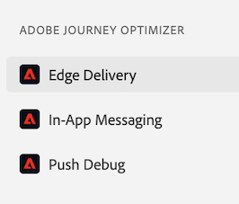
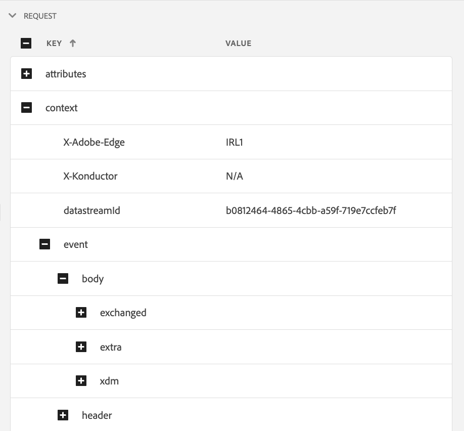

# Edge Delivery View in Assurance

De **[!UICONTROL Edge Delivery]** weergave in **[!UICONTROL Adobe Experience Platform Assurance]** biedt de mogelijkheid om de [!UICONTROL AJO Inbound] randlevering van berichten aan uw web- en mobiele apps te inspecteren en te valideren. Deze weergave is vooral handig voor het oplossen van problemen met de levering van [!UICONTROL AJO Inbound] webcampagnes en mobiele reizen.

## Aan de slag

Controleer voordat u doorgaat of u toegang hebt tot de volgende services:

- De [ UI van de Inzameling van Gegevens van Adobe Experience Platform ](https://experience.adobe.com/#/data-collection/)
- [ de Verzekering van Adobe Experience Platform ](https://experience.adobe.com/assurance)

Leren hoe te om **[!UICONTROL Assurance]** in uw toepassing te installeren, te lezen gelieve de [ het uitvoeren gids van de Verzekering ](../tutorials/implement-assurance.md).

## Betrouwbaarheid gebruiken met Edge Delivery

Nadat u een **[!UICONTROL Assurance]** -sessie hebt geopend, kunt u de **[!UICONTROL Edge Delivery]** weergave toevoegen aan **[!UICONTROL Assurance]** . Bij de bodem van het linkerpaneel, uitgezochte **[!UICONTROL Configure]** om de **[!UICONTROL Edge Delivery]** mening toe te voegen en **sparen** het.

Nadat u de afbeelding hebt toegevoegd, selecteert u de **[!UICONTROL Edge Delivery]** -weergave in de **[!UICONTROL Adobe Journey Optimizer]** -sectie om de levering van de binnenkomende rand te valideren.

## Aanvraaglijst

In het hoofdvenster van de weergave wordt de lijst met aanvragen voor randlevering weergegeven. In deze lijst worden alle [!UICONTROL Inbound AJO] -aanvragen weergegeven die zijn gemaakt voor Experience Edge en die zijn verwerkt door **[!UICONTROL Inbound Delivery Service]** , inclusief aanvragen om personalisatiebeslissingen op te halen en interacties voor het aanpassen van de persoonlijke instellingen (zoals weergave, klikken, activeren of negeren).

Verzoeken worden geordend met een tijdstempel, met de meest recente aanvragen bovenaan. Naast de tijdstempel bevat de lijst ook een kolom met de aanvraag-id en een kolom met het type aanvraag. Dit kan een van de volgende zijn:

- **[!UICONTROL Experience Delivery]**: een verzoek om aanpassingsbeslissingen op te halen
- **[!UICONTROL Experience Interactions]**: een verzoek om interacties met een verpersoonlijkingsvoorstel te volgen
- **[!UICONTROL Experience Delivery & Interactions]**: een verzoek om personalisatiebeslissingen op te halen, inclusief interacties voor personalisatievoorstellen
- **[!UICONTROL Preview Delivery]**: Een verzoek om de beslissingen voor het aanpassen van voorvertoningen op te halen

Verzoeken kunnen ook worden gefilterd door een zoekterm in te voeren in de zoekbalk boven aan de lijst. Dit is nuttig wanneer het filtreren door specifieke waarden, zoals IDs.

## Gedetailleerde aanvraagweergaven

Zodra een verzoek in de belangrijkste mening wordt geselecteerd, wordt gedetailleerde informatie over het geselecteerde verzoek getoond op het recht. Deze weergave bevat de volgende secties:

### Overzicht aanvragen

Deze sectie biedt een overzicht op hoog niveau van de geselecteerde aanvraag, inclusief [!UICONTROL Organization ID] , [!UICONTROL Edge cluster] , [!UICONTROL Request ID] en [!UICONTROL Request type] , [!UICONTROL Sandbox ID] , [!UICONTROL Sandbox name] en [!UICONTROL Datastream ID] , en de lijst met aanvraagoppervlakken voor het geval [!UICONTROL Experience Delivery] -aanvragen worden ingediend.

### Profiel

Deze sectie biedt informatie over de profielgegevens die worden gebruikt tijdens de verwerking van de aanvraag, zoals de identiteitskaart, het lidmaatschap van een segment en de instellingen voor toestemming.\
De sectie [!UICONTROL Profile] is zeer nuttig wanneer het oplossen van problemenkwesties zoals levering niet werkt zoals verwacht wegens ontbrekend of vertraagd segmentlidmaatschap of opt-out toestemmingsmontages.

### Gekwalificeerde activiteiten

Deze sectie verstrekt een lijst van activiteiten die voor het geselecteerde verzoek, met inbegrip van het activiteitstype, IDs, identiteitsnamespace, oppervlakten, programma, en publiek werden gekwalificeerd. De meer gedetailleerde informatie over de activiteit kan in de [ ruwe sectie van het uitvoeringsspoor ](#execution) worden gevonden.

### Ongekwalificeerde activiteiten

Deze sectie bevat een lijst met activiteiten die zijn uitgesloten van kwalificatie. Naast het type activiteit, IDs, identiteitsnamespaces, oppervlakten, programma&#39;s, en publiek, omvat deze sectie ook een lijst van redenen de activiteit niet gekwalificeerd was.

### Berichtdetails

Deze sectie verstrekt gedetailleerde informatie over de berichten die voor het geselecteerde verzoek werden geleverd. Het omvat bericht IDs, fragmenten, besluitvormingsbeleid, [!UICONTROL Offer Decisioning] parameters, evenals de context van de berichtselectie.

### Interacties

Deze sectie bevat gedetailleerde informatie over de interacties die in de geselecteerde aanvraag zijn bijgehouden. Het bevat het interactietype (onder `propositionEventType` ) en de bijbehorende propositiemetagegevens, zoals de metagegevens over de activiteit (onder `scopeDetails.activity` ) en het token voor de propositiegebeurtenis (in `scopeDetails.characteristics.eventToken` ).

### Onbewerkte sporen

In deze sectie ziet u de onbewerkte sporen van de geselecteerde aanvraag. Het omvat het volledige spoor van het verzoek, met inbegrip van het daadwerkelijke verzoek aangezien het in **[!UICONTROL Inbound Delivery Service]** werd ontvangen, uitvoerspoor, en reactiespoor. Dit is nuttig voor geavanceerde probleemoplossing, zoals levering die niet werkt zoals u had verwacht als gevolg van de onbeschikbaarheid van de leveringsservice, ontbrekende of onjuiste gegevens, of voor een beter begrip van de volledige stroom van de aanvraagverwerking.

#### Verzoek

Het aanvraagspoor omvat het volledige verzoek zoals het door **[!UICONTROL Inbound Delivery Service]** **[!UICONTROL Konductor]** upstream werd ontvangen. Het omvat de verzoekkopballen, het lichaam, en andere meta-gegevens. De XDM-lading van de aanvraag kan bijvoorbeeld worden gecontroleerd in het veld `event.body.xdm` .

 worden gevonden

#### Execution

De uitvoeringstrace bevat de volledige tracering van de aanvraag zoals deze is verwerkt door de **[!UICONTROL Inbound Delivery Service]** . Het toont de uitvoeringscontext, activiteitenkwalificatie, berichtselectie, en andere verwerkingsstappen. Eventuele fouten of waarschuwingen die tijdens de verwerking van de aanvraag zijn opgetreden, kunt u vinden in `context.messages` - en `context.exceptions` -velden. Gedetailleerde informatie over de activiteitkwalificatie vindt u in de velden `context.qualifiedActivitiesDetailed` en `context.unqualifiedActivitiesDetailed` .

#### Antwoord

Het reactiespoor omvat de volledige reactie aangezien het door **[!UICONTROL Inbound Delivery Service]** stroomafwaarts aan **[!UICONTROL Konductor]** werd teruggekeerd. Dit omvat de responsheaders, de hoofdtekst en andere metagegevens. De volledige antwoordinstantie kan worden geïnspecteerd door het bericht met id `1` naar het klembord te kopiëren met de knop **[!UICONTROL Copy Value]** en het in een JSON-viewer te plakken.

