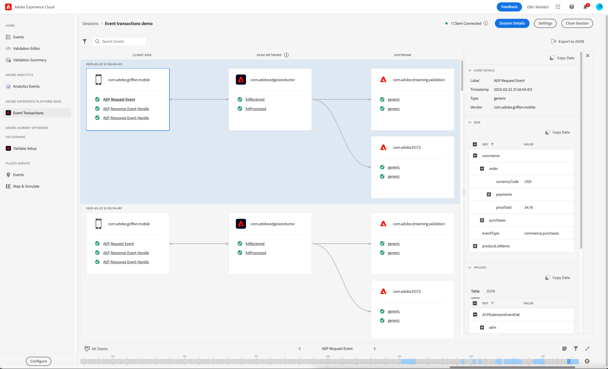

# Gebeurtenistransformaties, weergave

Met de weergave Gebeurtenistransformaties in Adobe Experience Platform Assurance kunt u de clientimplementatie van de Edge Network valideren en er fouten in opsporen. De resultaten van de upstream-validatie worden dan in real-time weergegeven.

## De Verzekering van de opstelling voor het werkschema van de Edge Network

Na [ opstellingsVerzekering ](../tutorials/implement-assurance.md), zorg ervoor dat u de recentste versies van de uitbreidingen van de Verzekering en van de Edge Network in uw app hebt uitgevoerd.

Als u uw gebeurtenissen wilt weergeven, selecteert u in het linkermenu **[!UICONTROL Event Transactions]** onder de sectie **[!UICONTROL Adobe Experience Platform Edge]** .

Als deze optie niet zichtbaar is, selecteert u **[!UICONTROL Configure]** linksonder in het venster, voegt u de **[!UICONTROL Event Transactions]** -weergave toe en selecteert u **[!UICONTROL Save]** .

## Aan de slag met de weergave Gebeurtenistransformaties

In deze sectie leert u vertrouwd te raken met de weergave Gebeurtenistransactie en hoe u deze efficiënt kunt gebruiken voor end-to-end validatie bij workflows van Edge Network.

### Stroom van gebeurtenisverwerking

In de weergave Gebeurtenistransformaties worden drie kolommen weergegeven in de volgorde van de gebeurtenisverwerkingsstroom:

- **[!UICONTROL Client-side]**: In deze kolom worden de gebeurtenissen weergegeven die aan de clientzijde zijn verwerkt of ontvangen en die toegankelijk zijn voor de Mobile SDK. Dit omvat de gebeurtenissen die zijn gemaakt met een API-aanroep, zoals `Edge.sendEvent` , en de gebeurtenishandgrepen voor reacties die de client van de Edge Network-server heeft ontvangen, indien aanwezig. Voorbeelden van gebeurtenissen aan de clientzijde:
   - AEP Request-gebeurtenis is de gebeurtenis die via de Edge-extensie wordt verzonden en bevat de XDM en optionele vrije-formuliergegevens.
   - AEP Response Event Handle is de gebeurtenisgreep die van Edge Network wordt ontvangen als reactie op een AEP Request-gebeurtenis. Een aanvraaggebeurtenis kan geen, één of meerdere handvatten van de reactiegebeurtenis ontvangen.
   - De Respons van de Fout van AEP kan in het geval van een fout worden gezien, bijvoorbeeld als de nuttige lading XDM niet kon worden verwerkt of als één van de stroomopwaartse diensten een fout of een waarschuwing teruggaf.
- **[!UICONTROL Edge Network]**: in deze kolom wordt de gebeurtenis weergegeven die de Edge Network via een netwerkaanvraag heeft ontvangen en welke gegevens en metagegevens de gebeurtenis bevat.
- **[!UICONTROL Upstream]**: In deze kolom worden de gebeurtenissen weergegeven die door de geconfigureerde upstream-services zijn ontvangen, inclusief gedetailleerde informatie over de verwerking en/of validatieresultaten voor de binnenkomende gebeurtenis.
Deze kolom is dynamisch en kan verschillende soorten informatie weergeven, afhankelijk van twee belangrijke factoren:
   - De configuratie van de gegevensstroom en de diensten die op het worden toegelaten.
   - Het type gebeurtenis dat naar de Edge Network wordt verzonden.

### Inspect-gebeurtenissen

De gebeurtenissen die worden weergegeven in de weergave Gebeurtenistransacties bieden informatie over de indeling en inhoud van de gegevens die worden verwerkt in elk frame, en bevatten inzichtelijke details over waarschuwingen of fouten die optreden wanneer de gegevens upstream worden verwerkt. De weergave helpt de foutopsporingsinformatie op het niveau van de gebeurtenis/aanvraag te vernauwen en fouten in een vroeg stadium in de ontwikkelingscyclus te identificeren.

#### De gebeurtenisdetails uitbreiden

Als u een gebeurtenis wilt inspecteren, selecteert u de gewenste gebeurtenis in de weergave. Met deze handeling wordt de weergave **[!UICONTROL Event Details]** aan de rechterkant van het scherm uitgebreid.
Geneste gegevens worden weergegeven in een boomstructuur. U kunt geneste sleutel-waarden inspecteren door **+** (plus) knoop links van de zeer belangrijke naam te selecteren.

#### Inspect-waarschuwingen of -fouten

Elke gebeurtenisnaam wordt voorafgegaan door een pictogram dat de status op hoog niveau van de verwerking voor die gebeurtenis aangeeft:

- Als de gebeurtenis correct is verwerkt, wordt een groen vinkje weergegeven.
- Als er waarschuwingen of fouten zijn gedetecteerd, wordt een waarschuwingsteken weergegeven. Selecteer de gerelateerde gebeurtenis als u meer wilt weten over de oorzaak van de waarschuwing of fout in de weergave **[!UICONTROL Event Details]** .

### Configuratie-instellingen

U kunt de huidige ID van de gegevensstroom controleren door info tooltip naast de **[!UICONTROL Edge Network]** kolomkopbal te selecteren.

>[!INFO]
>
>Wanneer de veelvoudige cliënten met de zelfde zitting van de Verzekering en verschillende datastream IDs verbinden wordt gebruikt, zult u alle hier getoond hen zien. Nochtans, betekent dit niet dat uw huidige implementatie veelvoudige gegevensstromen gebruikt. Alleen de huidige gegevensstroom-id die is ingesteld in de tag (eigenschap mobile) die door de app wordt gebruikt, wordt gebruikt voor het verwerken van nieuwe gebeurtenissen van die client. Wanneer het testen van meer gecompliceerde gebruik-gevallen met verschillende configuratiemontages en veelvoudige verbonden cliënten, kan het nuttig zijn om afzonderlijke zittingen van de Verzekering te gebruiken om het bevestigingsproces te vereenvoudigen.
