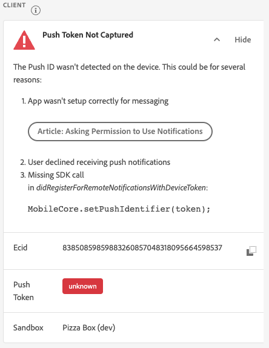
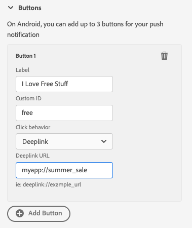
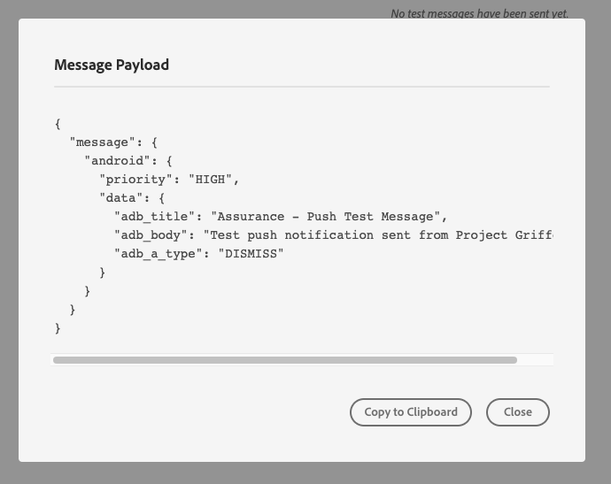

# Foutopsporingsweergave duwen

Met de Push Debug View in Adobe Experience Platform Assurance kunt u de Push-instelling voor uw app valideren en een testbericht naar uw apparaat verzenden.

## Clients

Het vervolgkeuzemenu voor de client bevat een lijst met elke unieke client die verbinding heeft met deze betrouwbaarheidssessie. Een client is een uniek apparaat of een unieke toepassing die voor een apparaat wordt geïnstalleerd. Als bijvoorbeeld een Android-apparaat en een iOS-apparaat met de sessie zijn verbonden, worden deze clients weergegeven in het vervolgkeuzemenu Clients.

Nadat u de app opnieuw hebt geïnstalleerd en opnieuw hebt aangesloten op een apparaat, wordt een andere client weergegeven. Als er al een apparaat met die naam bestaat, wordt #2 aan de naam toegevoegd.

Deze weergave is slechts ingeschakeld voor één client. Als u dus een andere client selecteert, worden de details op het scherm gewijzigd.

## Setup valideren

Het tabblad **[!UICONTROL Validate Setup]** valideert en biedt aanvullende informatie over de pushinstellingen van de app. Er zijn drie deelvensters die validaties uitvoeren. Ze geven een groen vinkje weer als alle validaties succesvol zijn. Als er drie groene vinkjes zijn, is app correct gevormd voor duw overseinen, schrijft duptokens aan het gebruikersprofiel, en heeft een bijbehorende kanaalconfiguratie gevormd.

Als iets niet werkt zoals verwacht, zal er een alarm met details over hoe te om dat probleem op te lossen zijn:

### Clientgegevens

Dit deelvenster controleert of het apparaat correct is geconfigureerd. Dit omvat het vormen van de uitbreiding in UI van de Inzameling van Gegevens, het initialiseren van de uitbreiding en zijn eerste vereisten in uw toepassing, en het vangen van het duptoken van het apparaat.

Als dit geldig is, worden in het deelvenster de ECID voor het apparaat, het pushtoken en de naam en het type van de Edge-sandbox weergegeven.

### Profieldetails

Wanneer de client op de juiste wijze is ingesteld, controleert dit deelvenster of het apparaat naar profiel schrijft. Ook wordt gecontroleerd of de pushtoken in het profiel overeenkomt met de token op het apparaat.

Indien geldig, zal het paneel ECID voor het apparaat, het duptoken, app identiteitskaart van uw toepassing, het overseinenplatform tonen, en of het duptoken is vermeld. Het token kan om verschillende redenen worden geweigerd, zoals dat de gebruiker de app heeft verwijderd of dat de gebruiker pushberichten voor de app heeft uitgeschakeld.

Tot slot bevindt zich onder aan het deelvenster een koppeling waarmee dit specifieke profiel op een nieuw tabblad wordt geopend.

### Inloggegevens en configuratie van AppStore

In dit deelvenster wordt gecontroleerd of voor de toepassings-id en het berichtplatform dat in het profiel is opgeslagen, een overeenkomende kanaalconfiguratie is gemaakt. In een kanaalconfiguratie worden de pushgegevens voor de toepassing geüpload.

Indien geldig, zal het profiel de naam van de kanaalconfiguratie, toepassings identiteitskaart, en de naam van de overseinendienst tonen.

## Test push verzenden

U kunt het tabblad **[!UICONTROL Send Test Push]** gebruiken om een testbericht naar het apparaat te verzenden.

Er zijn verschillende deelvensters die kunnen worden geconfigureerd om verschillende iOS- en Android-pushfuncties te testen. Selecteer **[!UICONTROL Send Test Push Notification]** als u uw bericht wilt verzenden.

### Bericht

In het deelvenster **[!UICONTROL Message]** kunt u een titel en tekst voor het bericht opgeven. De functie voor stille meldingen kan hier ook worden ingeschakeld.

### Push-doel

In het deelvenster **[!UICONTROL Push Target]** kunt u aanpassen welke push-token en kanaalconfiguratie moeten worden gebruikt bij het verzenden van het pushbericht.

Deze informatie wordt standaard verschaft als op het tabblad **[!UICONTROL Validate Setup]** drie groene vinkjes worden weergegeven. Nochtans, kunt u uw eigen duptoken en kanaalconfiguratie verstrekken, zelfs als uw app niet volledig wordt gevormd.

### Klikken, gedrag

In het deelvenster **[!UICONTROL Click Behavior]** kunt u kiezen wat het gedrag moet zijn wanneer op het apparaat op de pushmelding wordt geklikt. De toepassing wordt standaard geopend, maar er kan een koppeling of een webpagina worden geopend.

Als u ervoor kiest een deplink te gebruiken, moet de ontwikkelaar van de app er een voor u maken.

### Rijke media

In het deelvenster **[!UICONTROL Rich Media]** kunt u extra media toevoegen aan uw bericht, zoals een afbeelding, video of GIF. De ontwikkelaar van de app moet code aan de app toevoegen om deze functie in te schakelen.

### Knoppen

In het deelvenster **[!UICONTROL Buttons]** kunt u extra knoppen toevoegen aan de pushmelding. Met elke knop kunt u de app openen, een koppeling naar de app openen of een webpagina openen.

De ontwikkelaar van de app moet code aan de app toevoegen om deze functie in te schakelen.

### Aangepaste gegevens

In het deelvenster **[!UICONTROL Custom Data]** kunt u aangepaste gegevens toevoegen aan de pushmelding. Elk sleutel/waardepaar wordt verzonden als meta-gegevens samen met het bericht en kan door ontwikkelaars worden gebruikt om krachtige ervaringen tot stand te brengen en extra het volgen toe te voegen.

## Testresultaten

Nadat u een bericht hebt verzonden, ontvangt de sectie **[!UICONTROL Test Results]** gegevens van de pushservices voor het bericht. Hier kunt u zien of heeft het bericht aan de Google/iOS overseinendiensten gemaakt:

Als er problemen zijn opgetreden, worden deze hier weergegeven:

## Geavanceerd

### Berichtlading weergeven

Naast de knop **[!UICONTROL Send Test Push Notification]** bevindt zich een reeks ovalen met een pop-upmenu. Van hier, kunt u de berichtlading bekijken. Dit laat u het nauwkeurige bericht zien dat naar de verre overseinendienst zal worden verzonden. U kunt deze lading controleren of zelfs kopiëren en kleven het in een Desktop duw testend hulpmiddel.

