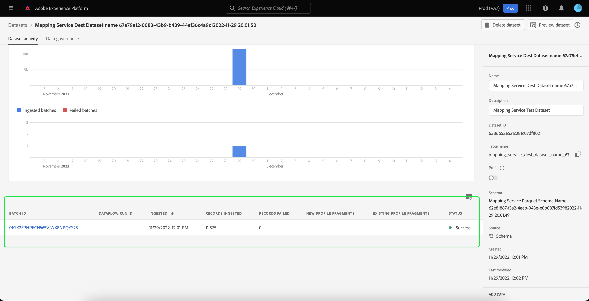
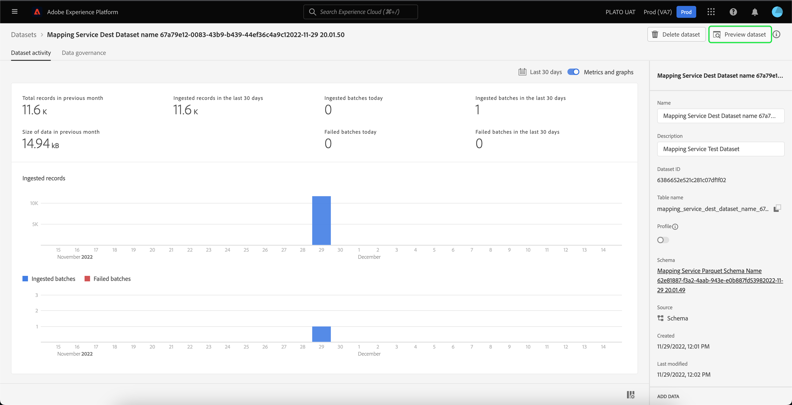
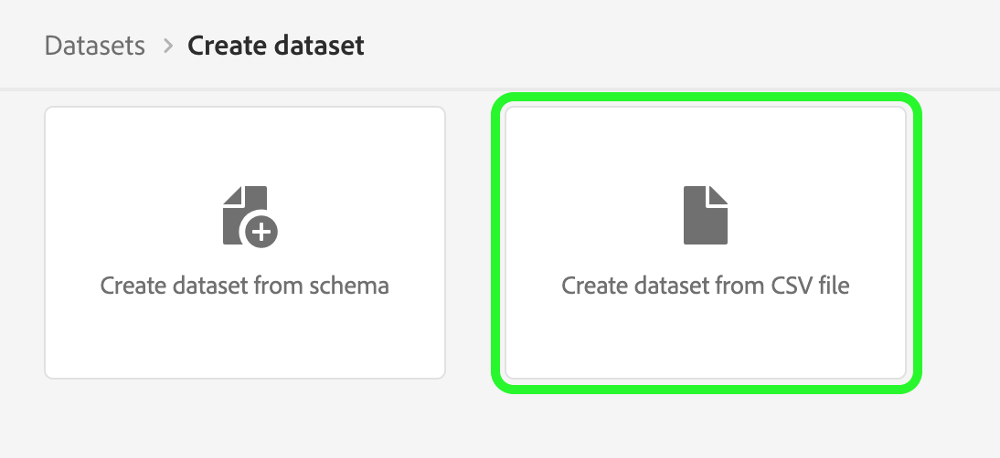

# UI-gids voor gegevensbestanden

Deze gebruikershandleiding bevat instructies voor het uitvoeren van veelvoorkomende handelingen bij het werken met gegevenssets in de gebruikersinterface van Adobe Experience Platform.

## Aan de slag

Deze gebruikershandleiding vereist een goed begrip van de volgende onderdelen van Adobe Experience Platform:

* [Gegevenssets](overview.md): De opslag- en beheerconstructie voor gegevenspersistentie in [!DNL Experience Platform].
* [[!DNL Experience Data Model (XDM) System]](../../xdm/home.md): Het gestandaardiseerde kader waardoor [!DNL Experience Platform] organiseert de gegevens van de klantenervaring.
   * [Basisbeginselen van de schemacompositie](../../xdm/schema/composition.md): Leer over de basisbouwstenen van schema&#39;s XDM, met inbegrip van zeer belangrijke principes en beste praktijken in schemacompositie.
   * [Schema-editor](../../xdm/tutorials/create-schema-ui.md): Leer hoe u uw eigen aangepaste XDM-schema&#39;s maakt met de [!DNL Schema Editor] binnen de [!DNL Platform] gebruikersinterface.
* [[!DNL Real-time Customer Profile]](../../profile/home.md): Verstrekt een verenigd, real-time consumentenprofiel dat op bijeengevoegde gegevens van veelvoudige bronnen wordt gebaseerd.
* [[!DNL Adobe Experience Platform Data Governance]](../../data-governance/home.md): Ervoor zorgen dat de regels, beperkingen en beleidsregels betreffende het gebruik van klantgegevens worden nageleefd.

## Gegevensbestanden weergeven {#view-datasets}

>[!CONTEXTUALHELP]
>id="platform_datasets_negative_numbers"
>title="Negatieve getallen in gegevenssetactiviteit"
>abstract="Negatieve getallen in geneste records betekenen dat een gebruiker bepaalde batches in een geselecteerd tijdbereik heeft verwijderd."
>text="Learn more in documentation"

In de [!DNL Experience Platform] UI, selecteer **[!UICONTROL Datasets]** in de linkernavigatie om het dialoogvenster **[!UICONTROL Datasets]** dashboard. Het dashboard maakt een lijst van alle beschikbare datasets voor uw organisatie. De details worden getoond voor elke vermelde dataset, met inbegrip van zijn naam, het schema de dataset zich aan, en status van de meest recente versiereeks houdt.

Door gebrek, slechts worden de datasets die u hebt ingebed in getoond. Als u de systeem-geproduceerde datasets wilt zien, laat toe **[!UICONTROL Show system datasets]** schakelen. Door het systeem gegenereerde gegevenssets worden alleen gebruikt om andere componenten te verwerken. De door het systeem gegenereerde profielexportgegevensset wordt bijvoorbeeld gebruikt om het profieldashboard te verwerken.

Selecteer de naam van een dataset om tot zijn toegang te hebben **[!UICONTROL Dataset activity]** scherm en zie details van de dataset u selecteerde. Het activiteitenlusje omvat een grafiek die het tarief visualiseert van berichten die worden verbruikt evenals een lijst van succesvolle en ontbroken partijen.

## Een voorbeeld van een gegevensset bekijken

Van de **[!UICONTROL Dataset activity]** scherm, selecteren **[!UICONTROL Preview dataset]** in de rechterbovenhoek van het scherm om maximaal 100 rijen met gegevens voor te vertonen. Als de dataset leeg is, zal de voorproefverbinding worden gedeactiveerd en in plaats daarvan zal zeggen dat de voorproef niet beschikbaar is.

In het voorproefvenster, wordt de hiërarchische mening van het schema voor de dataset getoond op het recht.

Voor robuustere methoden om toegang te krijgen tot uw gegevens, [!DNL Experience Platform] levert downstreamdiensten zoals [!DNL Query Service] en [!DNL JupyterLab] gegevens te verkennen en te analyseren. Raadpleeg de volgende documenten voor meer informatie:

* [Overzicht van Query Service](../../query-service/home.md)
* [Gebruikershandleiding voor JupyterLab](../../data-science-workspace/jupyterlab/overview.md)

## Een gegevensset maken {#create}

Om een nieuwe dataset tot stand te brengen, begin door te selecteren **[!UICONTROL Create dataset]** in de **[!UICONTROL Datasets]** dashboard.

In het volgende scherm, wordt u voorgesteld met de volgende twee opties om een nieuwe dataset tot stand te brengen:

* [Gegevensset maken van schema](#schema)
* [Gegevensset maken van CSV-bestand](#csv)

### Creeer een dataset met een bestaand schema {#schema}

In de **[!UICONTROL Create dataset]** scherm, selecteren **[!UICONTROL Create dataset from schema]** om een nieuwe lege dataset tot stand te brengen.

De **[!UICONTROL Select schema]** wordt weergegeven. Blader door de schemalijst en selecteer het schema dat de dataset alvorens zal volgen te selecteren **[!UICONTROL Next]**.

De **[!UICONTROL Configure dataset]** wordt weergegeven. Geef de gegevensset een naam en een optionele beschrijving en selecteer **[!UICONTROL Finish]** om de dataset tot stand te brengen.

### Een gegevensset maken met een CSV-bestand {#csv}

Wanneer een dataset gebruikend een Csv- dossier wordt gecreeerd, wordt een ad hoc schema gecreeerd om de dataset van een structuur te voorzien die het verstrekte Csv- dossier aanpast. In de **[!UICONTROL Create dataset]** scherm, selecteren **[!UICONTROL Create dataset from CSV file]**.

De **[!UICONTROL Configure]** wordt weergegeven. Geef de gegevensset een naam en een optionele beschrijving en selecteer **[!UICONTROL Next]**.

De **[!UICONTROL Add data]** wordt weergegeven. Upload het CSV-bestand door het naar het midden van het scherm te slepen of selecteer **[!UICONTROL Browse]** om uw bestandsmap te verkennen. Het bestand kan maximaal tien gigabyte groot zijn. Selecteer **[!UICONTROL Save]** om de dataset tot stand te brengen.

>[!NOTE]
>
>CSV-kolomnamen moeten beginnen met alfanumerieke tekens en mogen alleen letters, cijfers en onderstrepingstekens bevatten.

## Een gegevensset inschakelen voor realtime klantprofiel {#enable-profile}

Elke dataset heeft de capaciteit om klantenprofielen met zijn ingebedde gegevens te verrijken. Om dit te doen, moet het schema dat de dataset hanteert voor gebruik binnen compatibel zijn [!DNL Real-time Customer Profile]. Een compatibel schema voldoet aan de volgende vereisten:

* Het schema heeft minstens één die attribuut als identiteitseigenschap wordt gespecificeerd.
* Het schema heeft een identiteitseigenschap die als primaire identiteit wordt bepaald.

Voor meer informatie over het inschakelen van een schema voor [!DNL Profile], zie de [Gebruikershandleiding voor Schema-editor](../../xdm/tutorials/create-schema-ui.md).

Om een dataset voor Profiel toe te laten, heb tot zijn toegang **[!UICONTROL Dataset activity]** en selecteert u de **[!UICONTROL Profile]** schakelen binnen de **[!UICONTROL Properties]** kolom. Zodra toegelaten, zullen de gegevens die in de dataset worden opgenomen ook worden gebruikt om klantenprofielen te bevolken.

>[!NOTE]
>
>Als een dataset reeds gegevens bevat en dan toegelaten voor [!DNL Profile], worden de bestaande gegevens niet automatisch verbruikt door [!DNL Profile]. Nadat een dataset wordt toegelaten voor [!DNL Profile], wordt u aangeraden alle bestaande gegevens opnieuw in te voeren om ervoor te zorgen dat deze bijdragen aan de profielen van klanten.

## Beheer van gegevens beheren en afdwingen op een gegevensset

Met labels voor gegevensgebruik kunt u gegevenssets en velden categoriseren op basis van het gebruiksbeleid dat op die gegevens van toepassing is. Zie de [Overzicht van gegevensbeheer](../../data-governance/home.md) voor meer informatie over labels, of raadpleegt u de [gebruikershandleiding voor gegevensgebruikslabels](../../data-governance/labels/overview.md) voor instructies over hoe te om etiketten op datasets toe te passen.

## Een gegevensset verwijderen

U kunt een dataset schrappen door tot zijn eerst toegang te hebben **[!UICONTROL Dataset activity]** scherm. Selecteer vervolgens **[!UICONTROL Delete dataset]** om deze te verwijderen.

>[!NOTE]
>
>Datasets die zijn gemaakt en gebruikt door Adobe-toepassingen en -services (zoals Adobe Analytics, Adobe Audience Manager of [!DNL Offer Decisioning]) kan niet worden verwijderd.

Er verschijnt een bevestigingsvak. Selecteren **[!UICONTROL Delete]** om de schrapping van de gegevensset te bevestigen.

## Een voor profiel ingeschakelde gegevensset verwijderen

Als een dataset voor Profiel wordt toegelaten, zal het schrappen van die dataset door UI het van gegevens meer, de Dienst van de Identiteit, en de opslag van het Profiel binnen Platform schrappen.

U kunt een dataset van [!DNL Profile] alleen opslaan (en de gegevens in het Data Lake bewaren) met behulp van de Real-time Customer Profile API. Zie voor meer informatie de [API-eindgids voor profielsysteemtaken](../../profile/api/profile-system-jobs.md).

## Gegevens bijhouden

In de [!DNL Experience Platform] UI, selecteren **[!UICONTROL Monitoring]** in de linkernavigatie. De **[!UICONTROL Monitoring]** in het dashboard kunt u de status van binnenkomende gegevens van batch- of streaming invoer bekijken. Als u de status van afzonderlijke batches wilt weergeven, selecteert u **[!UICONTROL Batch end-to-end]** of **[!UICONTROL Streaming end-to-end]**. De dashboards maken een lijst van alle partij of het stromen ingangen, met inbegrip van die die succesvol zijn, ontbroken, of nog lopend. Elke lijst verstrekt details van de partij, met inbegrip van partijidentiteitskaart, de naam van de doeldataset, en het aantal verslagen die worden opgenomen. Als de doeldataset wordt toegelaten voor [!DNL Profile], wordt ook het aantal opgenomen identiteits- en profielrecords weergegeven.

U kunt op een individu selecteren **[!UICONTROL Batch ID]** toegang tot **[!UICONTROL Batch overview]** dashboard en zie details voor de partij, met inbegrip van foutenlogboeken als de partij niet opneemt.

Als u de batch wilt verwijderen, selecteert u **[!UICONTROL Delete batch]** bevindt zich rechts boven in het dashboard. Dit zal ook zijn verslagen uit de dataset verwijderen de partij oorspronkelijk aan werd opgenomen.

## Volgende stappen

Deze gebruikershandleiding bevat instructies voor het uitvoeren van algemene handelingen bij het werken met gegevenssets in het dialoogvenster [!DNL Experience Platform] gebruikersinterface. Voor stappen om gemeenschappelijk uit te voeren [!DNL Platform] de werkschema&#39;s die datasets impliceren, te verwijzen naar de volgende leerprogramma&#39;s:

* [Een gegevensset maken met behulp van API&#39;s](create.md)
* [De gegevens van de dataset van de vraag gebruikend de Toegang API van Gegevens](../../data-access/home.md)
* [Een gegevensset configureren voor realtime profiel en identiteitsservice van klanten met behulp van API&#39;s](../../profile/tutorials/dataset-configuration.md)
