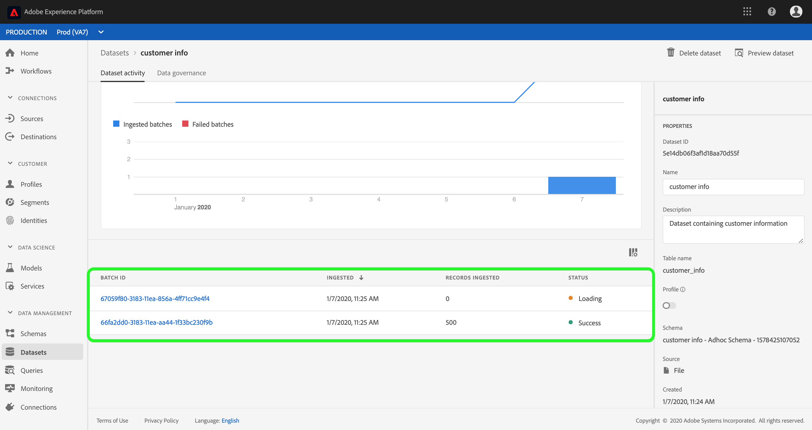
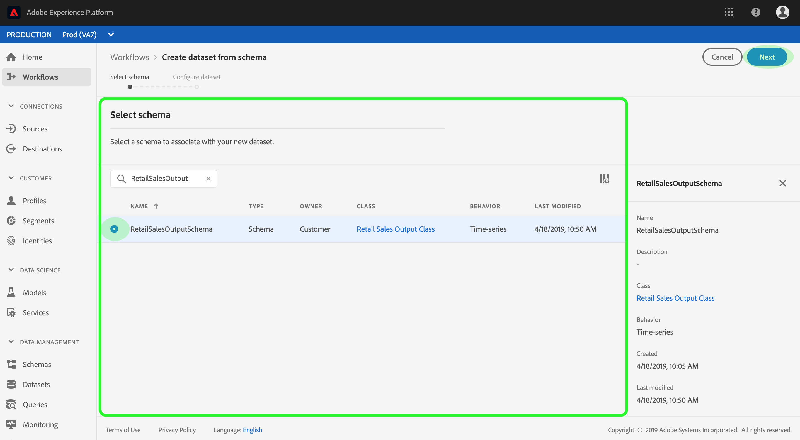

# Gebruikershandleiding voor gegevensbestanden

Deze gebruikershandleiding bevat instructies voor het uitvoeren van veelvoorkomende acties bij het werken met gegevenssets in de gebruikersinterface van het Adobe Experience Platform.

## Aan de slag

Deze gebruikershandleiding vereist een goed begrip van de volgende componenten van het Adobe Experience Platform:

* [Gegevenssets](overview.md): De opslag- en beheerconstructie voor gegevenspersistentie in het Experience Platform.
* [XDM-systeem](../../xdm/home.md)(Experience Data Model): Het gestandaardiseerde kader waardoor het Platform van de Ervaring gegevens van de klantenervaring organiseert.
   * [Basisbeginselen van de schemacompositie](../../xdm/schema/composition.md): Leer over de basisbouwstenen van schema&#39;s XDM, met inbegrip van zeer belangrijke principes en beste praktijken in schemacompositie.
   * [Schema-editor](../../xdm/tutorials/create-schema-ui.md): Leer hoe te om uw eigen douaneXDM schema&#39;s te bouwen gebruikend de Redacteur van het Schema binnen het gebruikersinterface van het Platform.
* [Klantprofiel](../../profile/home.md)in realtime: Verstrekt een verenigd, real-time consumentenprofiel dat op bijeengevoegde gegevens van veelvoudige bronnen wordt gebaseerd.
* [Gegevensbeheer](../../data-governance/home.md): Ervoor zorgen dat de regels, beperkingen en beleidsregels betreffende het gebruik van klantgegevens worden nageleefd.

## Gegevensbestanden weergeven

In het Platform van de Ervaring UI, klik **Datasets** in de linkernavigatie om het dashboard van *Datasets* te openen. Het dashboard maakt een lijst van alle beschikbare datasets voor uw organisatie. De details worden getoond voor elke vermelde dataset, met inbegrip van zijn naam, het schema de dataset zich aan, en status van de meest recente versiereeks houdt.

Klik de naam van een dataset om tot zijn de activiteitenscherm van de *Dataset* toegang te hebben en details van de dataset te zien u selecteerde. Het activiteitenlusje omvat een grafiek die het tarief visualiseert van berichten die worden verbruikt evenals een lijst van succesvolle en ontbroken partijen.

## Een voorbeeld van een gegevensset bekijken

Klik in het scherm *Dataset-activiteit* op Gegevensset **voorvertonen** in de rechterbovenhoek van het scherm om maximaal 100 rijen gegevens voor te vertonen. Als de dataset leeg is, zal de voorproefverbinding worden gedeactiveerd en in plaats daarvan zal zeggen **Voorproef niet beschikbaar**.

In het voorproefvenster, wordt de hiërarchische mening van het schema voor de dataset getoond op het recht.

Voor robuustere methodes om tot uw gegevens toegang te hebben, verleent het Platform van de Ervaring de stroomafwaartse diensten zoals de Dienst van de Vraag en JupyterLab om gegevens te onderzoeken en te analyseren. Raadpleeg de volgende documenten voor meer informatie:

* [Overzicht van Query Service](../../query-service/home.md)
* [Gebruikershandleiding voor JupyterLab](../../data-science-workspace/jupyterlab/overview.md)

## Een gegevensset maken

Om een nieuwe dataset tot stand te brengen, begin door **Create dataset** in het dashboard van *Datasets* te klikken.

In het volgende scherm, wordt u voorgesteld met de volgende twee opties om een nieuwe dataset tot stand te brengen:

* [Gegevensset maken van schema](#create-a-dataset-with-an-existing-schema)
* [Gegevensset maken van CSV-bestand](#create-a-dataset-with-a-csv-file)

### Creeer een dataset met een bestaand schema

In het *Create scherm van de dataset* , leidt de klik **dataset van schema** tot om een nieuwe lege dataset tot stand te brengen.

De stap Schema ** selecteren wordt weergegeven. Blader door het schema en selecteer het schema waaraan de dataset zich zal houden voordat u op **Volgende** klikt.

De stap Gegevensset ** configureren wordt weergegeven. Geef de gegevensset een naam en een optionele beschrijving en klik op **Voltooien** om de gegevensset te maken.

### Een gegevensset maken met een CSV-bestand

Wanneer een dataset gebruikend een Csv- dossier wordt gecreeerd, wordt een ad hoc schema gecreeerd om de dataset van een structuur te voorzien die het verstrekte Csv- dossier aanpast. Klik in het scherm *Gegevensset* maken op het vakje Gegevensset **maken van CSV-bestand**.

De stap *Configureren* wordt weergegeven. Geef de gegevensset een naam en een optionele beschrijving en klik op **Volgende**.

De stap Gegevens ** toevoegen wordt weergegeven. Upload het CSV-bestand door het naar het midden van het scherm te slepen of klik op **Bladeren** om de bestandsmap te verkennen. Het bestand kan maximaal tien gigabyte groot zijn. Nadat het CSV-bestand is geüpload, klikt u op **Opslaan** om de gegevensset te maken.

>[!NOTE] CSV-kolomnamen moeten beginnen met alfanumerieke tekens en mogen alleen letters, cijfers en onderstrepingstekens bevatten.

## Een gegevensset inschakelen voor realtime klantprofiel

Elke dataset heeft de capaciteit om klantenprofielen met zijn ingebedde gegevens te verrijken. Om dit te doen, moet het schema dat de dataset aanhoudt compatibel voor gebruik in het Profiel van de Klant in real time zijn. Een compatibel schema voldoet aan de volgende vereisten:

* Het schema heeft minstens één die attribuut als identiteitseigenschap wordt gespecificeerd.
* Het schema heeft een identiteitseigenschap die als primaire identiteit wordt bepaald.

Voor meer informatie bij het toelaten van een schema voor Profiel, zie de de gebruikersgids [van de Redacteur van het](../../xdm/tutorials/create-schema-ui.md)Schema.

Als u een gegevensset voor Profiel wilt inschakelen, opent u het *scherm Gegevensset-activiteit* en klikt u op de schakeloptie **Profiel** in de kolom *Eigenschappen* . Zodra toegelaten, zullen de gegevens die in de dataset worden opgenomen ook worden gebruikt om klantenprofielen te bevolken.

Als een dataset reeds gegevens bevat en dan voor Profiel wordt toegelaten, worden de bestaande gegevens niet verbruikt door Profiel. Nadat een dataset voor Profiel wordt toegelaten, adviseert men dat u om het even welke bestaande gegevens opnieuw inneemt om hen te hebben klantenprofielen bevolken.

## Beheer van gegevens beheren en afdwingen op een gegevensset

De Etikettering en de Handhaving van het Gebruik van gegevens (DULE) is het belangrijkste gegevensbeheersmechanisme voor het Platform van de Ervaring. De etiketten van DULE staan u toe om datasets en gebieden volgens gebruiksbeleid te categoriseren die op die gegevens van toepassing zijn. Zie het overzicht [van het Beheer van](../../data-governance/home.md) Gegevens om meer over etiketten te leren, of naar de de etiketteringsgebruikersgids [van het](../../data-governance/labels/overview.md) gegevensgebruik voor instructies te verwijzen over hoe te om etiketten op datasets toe te passen.

## Een gegevensset verwijderen

U kunt een dataset schrappen door tot zijn de activiteitenscherm van de *Dataset eerst toegang te hebben* . Klik vervolgens op Gegevensset **** verwijderen om deze te verwijderen.

>[!NOTE] Datasets die zijn gemaakt en gebruikt door Adobe-toepassingen en -services (zoals Adobe Analytics, Adobe Audience Manager of Decisioning Service), kunnen niet worden verwijderd.

Er verschijnt een bevestigingsvak. Klik **Schrapping** om de schrapping van de dataset te bevestigen.

## Een voor profiel ingeschakelde gegevensset verwijderen

Als een dataset voor Profiel wordt toegelaten, die het door UI schrapt maakt de dataset voor opname onbruikbaar, maar schrapt niet automatisch de dataset in het achterste eind. Om de dataset met inbegrip van het profiel en de identiteitsgegevens volledig te schrappen die het verstrekt, moet een extra schrappingsverzoek worden gedaan. Zie de [subhandleiding Real-time Customer Profile API voor taken van profielsystemen, ook wel &quot;delete request&quot;](../../profile/api/profile-system-jobs.md)genoemd, voor informatie over het correct verwijderen van gegevens uit het profielarchief.

## Gegevens bijhouden

In het Platform van de Ervaring UI, klik **Controle** in de linkernavigatie. Met het *dashboard Bewaking* kunt u de status van binnenkomende gegevens van batch- of streaming invoer bekijken. Als u de status van afzonderlijke batches wilt weergeven, klikt u op Van begin tot eind ** batch of op Van begin tot eind ** streaming. De dashboards maakt een lijst van alle partij of het stromen ingangen, met inbegrip van die die succesvol zijn, ontbroken, of nog lopend. Elke lijst verstrekt details van de partij, met inbegrip van partijidentiteitskaart, de naam van de doeldataset, en het aantal verslagen die worden opgenomen. Als de doeldataset voor Profiel wordt toegelaten, wordt het aantal ingebedde identiteits en profielverslagen ook getoond.

U kunt op een individuele identiteitskaart **van de** Partij klikken om tot het *Batch overzichtdashboard* toegang te hebben en details voor de partij zien, met inbegrip van foutenlogboeken als de partij er niet in slaagt op te nemen.

Als u de batch wilt verwijderen, kunt u dit doen door te klikken op batch **** verwijderen rechtsboven in het dashboard. Dit zal ook zijn verslagen uit de dataset verwijderen de partij oorspronkelijk aan werd opgenomen.

## Volgende stappen

Deze gebruikersgids verstrekte instructies voor het uitvoeren van gemeenschappelijke acties wanneer het werken met datasets in het gebruikersinterface van het Platform van de Ervaring. Raadpleeg de volgende zelfstudies voor stappen voor het uitvoeren van gemeenschappelijke platformworkflows met datasets:

* [Een gegevensset maken met behulp van API&#39;s](create.md)
* [De gegevens van de dataset van de vraag gebruikend de Toegang API van Gegevens](../../data-access/home.md)
* [Een gegevensset configureren voor realtime profiel en identiteitsservice van klanten met behulp van API&#39;s](../../profile/tutorials/dataset-configuration.md)