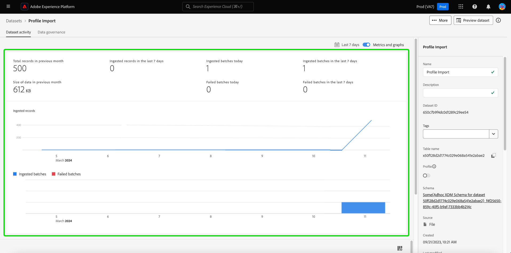

# UI-gids voor gegevensbestanden

Deze gebruikershandleiding bevat instructies voor het uitvoeren van veelvoorkomende handelingen bij het werken met gegevenssets in de gebruikersinterface van Adobe Experience Platform.

## Aan de slag

Deze gebruikershandleiding vereist een goed begrip van de volgende onderdelen van Adobe Experience Platform:

* [ Datasets ](overview.md): De opslag en beheersconstructie voor gegevenspersistentie in [!DNL Experience Platform].
* [[!DNL Experience Data Model (XDM) System]](../../xdm/home.md): Het gestandaardiseerde framework waarmee [!DNL Experience Platform] gegevens voor de klantervaring indeelt.
   * [ Grondbeginselen van schemacompositie ](../../xdm/schema/composition.md): Leer over de basisbouwstenen van schema&#39;s XDM, met inbegrip van zeer belangrijke principes en beste praktijken in schemacompositie.
   * [ Redacteur van het Schema ](../../xdm/tutorials/create-schema-ui.md): Leer hoe te om uw eigen schema&#39;s te bouwen XDM gebruikend [!DNL Schema Editor] binnen het [!DNL Platform] gebruikersinterface.
* [[!DNL Real-Time Customer Profile]](../../profile/home.md): biedt een uniform, real-time consumentenprofiel dat is gebaseerd op geaggregeerde gegevens van meerdere bronnen.
* [[!DNL Adobe Experience Platform Data Governance]](../../data-governance/home.md): zorg ervoor dat de regels, beperkingen en beleidsregels betreffende het gebruik van klantgegevens worden nageleefd.

## Gegevensbestanden weergeven {#view-datasets}

>[!CONTEXTUALHELP]
>id="platform_datasets_negative_numbers"
>title="Negatieve getallen in gegevenssetactiviteit"
>abstract="Negatieve getallen in geneste records betekenen dat een gebruiker bepaalde batches in een geselecteerd tijdbereik heeft verwijderd."
>text="Learn more in documentation"

>[!CONTEXTUALHELP]
>id="platform_datasets_browse_daysRemaining"
>title="Vervaldatum gegevensset"
>abstract="Deze kolom wijst op het aantal dagen dat de doeldataset heeft verlaten alvorens het automatisch verloopt."

>[!CONTEXTUALHELP]
>id="platform_datasets_browse_datalakeretention"
>title="Behoud van gegevensopslag"
>abstract="Toont het huidige bewaarbeleid voor elke dataset. Deze waarde kan in de bewaarmontages van elke dataset worden gewijzigd. U kunt retentietijd alleen instellen voor de ExperienceEvent-gegevensset."

>[!CONTEXTUALHELP]
>id="platform_datasets_browse_profileretention"
>title="Behoud van profiel"
>abstract="Toont het huidige bewaarbeleid voor elke dataset. Deze waarde kan in de bewaarmontages van elke dataset worden gewijzigd. U kunt retentietijd alleen instellen voor een ExperienceEvent-gegevensset."

>[!CONTEXTUALHELP]
>id="platform_datasets_datalakesettings_datasetretention"
>title="Bewaring van gegevensset"
>abstract="Datalake bewaart regels voor hoe lang gegevens worden opgeslagen en wanneer het in de verschillende diensten zou moeten worden geschrapt. Dit zorgt voor naleving van de regelgeving, het beheer van opslagkosten en het behoud van de gegevenskwaliteit."

Selecteer in de gebruikersinterface van [!DNL Experience Platform] de optie **[!UICONTROL Datasets]** in de linkernavigatie om het dashboard van **[!UICONTROL Datasets]** te openen. Het dashboard maakt een lijst van alle beschikbare datasets voor uw organisatie. De details worden getoond voor elke vermelde dataset, met inbegrip van zijn naam, het schema de dataset zich aan, en status van de meest recente versiereeks houdt.

Selecteer de naam van een gegevensset op het tabblad [!UICONTROL Browse] om het **[!UICONTROL Dataset activity]** -scherm te openen en details weer te geven van de gegevensset die u hebt geselecteerd. Het activiteitenlusje omvat een grafiek die het tarief visualiseert van berichten die worden verbruikt evenals een lijst van succesvolle en ontbroken partijen.

## Meer handelingen {#more-actions}

U kunt [!UICONTROL Delete] of [!UICONTROL Enable a dataset for Profile] vanuit de gedetailleerde weergave [!UICONTROL Dataset] . Selecteer **[!UICONTROL ... More]** in de rechterbovenhoek van de gebruikersinterface om de beschikbare acties weer te geven. Het vervolgkeuzemenu wordt weergegeven.

![ de werkruimte van Datasets met [!UICONTROL ... More] benadrukt dropdown menu.](../images/datasets/user-guide/more-actions.png)

Als u **[!UICONTROL Enable a dataset for Profile]** selecteert, verschijnt er een bevestigingsvenster. Selecteer **[!UICONTROL Enable]** om uw keuze te bevestigen.

>[!NOTE]
>
>Om een dataset voor Profiel toe te laten, moet het schema dat de dataset zich aan voor gebruik in het Profiel van de Klant in real time aansluit compatibel zijn. Zie [ een dataset voor profiel ](#enable-profile) sectie voor meer informatie toelaten.

Als u **[!UICONTROL Delete]** selecteert, wordt het bevestigingsvenster van [!UICONTROL Delete dataset] weergegeven. Selecteer **[!UICONTROL Delete]** om uw keuze te bevestigen.

>[!NOTE]
>
>U kunt geen systeemdatasets schrappen.

U kunt een dataset of een dataset voor gebruik met het Profiel van de Klant in real time van de gealigneerde acties ook schrappen die op het [!UICONTROL Browse] lusje worden gevonden. Zie de [ gealigneerde actiessectie ](#inline-actions) voor meer informatie.

## Handelingen voor inline-gegevenssets {#inline-actions}

De datasets UI biedt nu een inzamelingen van gealigneerde acties voor elke beschikbare dataset aan. Selecteer de ellips (...) van een dataset die u wilt leiden om de beschikbare opties in een pop-up menu te zien. De beschikbare acties omvatten:

* [[!UICONTROL Preview dataset]](#preview) ,
* [[!UICONTROL Manage data and access labels]](#manage-and-enforce-data-governance)
* [[!UICONTROL Enable unified profile]](#enable-profile)
* [[!UICONTROL Manage tags]](#manage-tags)
* [[!UICONTROL Move to folders]](#move-to-folders)
* [[!UICONTROL Delete]](#delete).

Meer informatie over deze beschikbare acties vindt u in de desbetreffende secties. Leren hoe te om grote aantallen datasets gelijktijdig te beheren, verwijs naar de [ bulkacties ](#bulk-actions) sectie.

### Een voorbeeld van een gegevensset bekijken {#preview}

U kunt voorbeeldgegevens van gegevenssets voorvertonen via zowel de inlineopties van het tabblad [!UICONTROL Browse] als de weergave [!UICONTROL Dataset activity] . Selecteer op het tabblad [!UICONTROL Browse] de ovalen (...) naast de naam van de gegevensset die u wilt voorvertonen. Er wordt een menulijst met opties weergegeven. Selecteer vervolgens **[!UICONTROL Preview dataset]** in de lijst met beschikbare opties. Als de dataset leeg is, zal de voorproefverbinding worden gedeactiveerd en in plaats daarvan zal zeggen dat de voorproef niet beschikbaar is.

Dit opent het voorproefvenster, waar de hiërarchische mening van het schema voor de dataset op het recht wordt getoond.

>[!NOTE]
>
>Het schemadiagram op de linkerkant van de mening toont slechts gebieden die gegevens bevatten. Velden zonder gegevens worden automatisch verborgen om de interface te stroomlijnen en de focus op relevante informatie te richten.

U kunt ook **[!UICONTROL Preview dataset]** in de rechterbovenhoek van het scherm selecteren in het **[!UICONTROL Dataset activity]** -scherm om een voorvertoning weer te geven van maximaal 100 rijen gegevens.

Voor robuustere methoden voor toegang tot uw gegevens biedt [!DNL Experience Platform] downstreamservices, zoals [!DNL Query Service] en [!DNL JupyterLab] , voor het verkennen en analyseren van gegevens. Raadpleeg de volgende documenten voor meer informatie:

* [Overzicht van Query Service](../../query-service/home.md)
* [Gebruikershandleiding voor JupyterLab](../../data-science-workspace/jupyterlab/overview.md)

### Beheer van gegevens beheren en afdwingen op een gegevensset {#manage-and-enforce-data-governance}

U kunt de labels voor gegevensbeheer voor een dataset beheren door de inlineopties van het tabblad [!UICONTROL Browse] te selecteren. Selecteer de ovalen (...) naast de naam van de gegevensset die u wilt beheren, gevolgd door **[!UICONTROL Manage data and access labels]** in het vervolgkeuzemenu.

Met labels voor gegevensgebruik, toegepast op schemaniveau, kunt u gegevenssets en velden categoriseren volgens het gebruiksbeleid dat van toepassing is op die gegevens. Zie het [ overzicht van het Beleid van Gegevens ](../../data-governance/home.md) om meer over etiketten te leren, of naar de [ gids van de de etikettengebruiker van het gegevensgebruik ](../../data-governance/labels/overview.md) voor instructies op te verwijzen hoe te om etiketten op schema&#39;s voor propagatie op datasets toe te passen.

## Een gegevensset inschakelen voor realtime-klantprofiel {#enable-profile}

Elke dataset heeft de capaciteit om klantenprofielen met zijn ingebedde gegevens te verrijken. Hiervoor moet het schema dat de dataset naleeft, compatibel zijn voor gebruik in [!DNL Real-Time Customer Profile]. Een compatibel schema voldoet aan de volgende vereisten:

* Het schema heeft minstens één die attribuut als identiteitseigenschap wordt gespecificeerd.
* Het schema heeft een identiteitseigenschap die als primaire identiteit wordt bepaald.

Voor meer informatie bij het toelaten van een schema voor [!DNL Profile], zie de [ gebruikersgids van de Redacteur van het Schema ](../../xdm/tutorials/create-schema-ui.md).

U kunt een dataset voor Profiel van zowel de gealigneerde opties van het [!UICONTROL Browse] lusje als van de [!UICONTROL Dataset activity] mening toelaten. Selecteer op het tabblad [!UICONTROL Browse] van de [!UICONTROL Datasets] -werkruimte de ellips van een gegevensset die u wilt inschakelen voor Profiel. Er wordt een menulijst met opties weergegeven. Selecteer vervolgens **[!UICONTROL Enable unified profile]** in de lijst met beschikbare opties.

U kunt ook in het scherm **[!UICONTROL Dataset activity]** van de gegevensset de **[!UICONTROL Profile]** -schakeloptie selecteren in de kolom **[!UICONTROL Properties]** . Zodra toegelaten, zullen de gegevens die in de dataset worden opgenomen ook worden gebruikt om klantenprofielen te bevolken.

>[!NOTE]
>
>Als een gegevensset al gegevens bevat en vervolgens is ingeschakeld voor [!DNL Profile] , worden de bestaande gegevens niet automatisch verbruikt door [!DNL Profile] . Nadat een dataset voor [!DNL Profile] wordt toegelaten, adviseert men dat u om het even welke bestaande gegevens opnieuw inneemt om het aan klantenprofielen te hebben bijdragen.

Datasets die voor Profiel zijn ingeschakeld, kunnen ook op deze criteria worden gefilterd. Zie de sectie op hoe te [ toegelaten de datasets van het filterProfiel ](#filter-profile-enabled-datasets) voor meer informatie.

### Gegevenssetcodes beheren {#manage-tags}

Voeg aangepaste gemaakte tags toe om gegevenssets te ordenen en zoek-, filter- en sorteermogelijkheden te verbeteren. Selecteer op het tabblad [!UICONTROL Browse] van de [!UICONTROL Datasets] -werkruimte de ellips van een gegevensset die u wilt beheren, gevolgd door **[!UICONTROL Manage tags]** in het vervolgkeuzemenu.

Het dialoogvenster [!UICONTROL Manage tags] wordt weergegeven. Voer een korte beschrijving in om een aangepaste tag te maken of kies een reeds bestaande tag om uw gegevensset een label te geven. Selecteer **[!UICONTROL Save]** om uw instellingen te bevestigen.

Het dialoogvenster [!UICONTROL Manage tags] kan ook bestaande tags uit een gegevensset verwijderen. Selecteer gewoon de &#39;x&#39; naast de tag die u wilt verwijderen en selecteer **[!UICONTROL Save]** .

Zodra een markering aan een dataset is toegevoegd, kunnen de datasets worden gefiltreerd gebaseerd op de overeenkomstige markering. Zie de sectie op hoe te [ filterdatasets door markeringen ](#enable-profile) voor meer informatie.

Voor meer informatie over hoe te om bedrijfsvoorwerpen voor gemakkelijkere ontdekking en categorisering te classificeren, zie de gids op [ het leiden meta-gegevenstaxonomieën ](../../administrative-tags/ui/managing-tags.md). In deze handleiding wordt beschreven hoe een gebruiker met de juiste machtigingen vooraf gedefinieerde tags kan maken, categorieën aan tags kan toewijzen en alle gerelateerde CRUD-bewerkingen kan uitvoeren op tags en tagcategorieën in de gebruikersinterface van het platform.

### Verplaatsen naar mappen {#move-to-folders}

U kunt datasets binnen omslagen voor beter gegevenssetbeheer plaatsen. Als u een gegevensset naar een map wilt verplaatsen, selecteert u de ovalen (...) naast de naam van de gegevensset die u wilt beheren, gevolgd door **[!UICONTROL Move to folder]** in het keuzemenu.

![ het [!UICONTROL Datasets] dashboard met de ellipsen en [!UICONTROL Move to folder] benadrukte.](../images/datasets/user-guide/move-to-folder.png)

Het dialoogvenster [!UICONTROL Move] Gegevensset naar map wordt weergegeven. Selecteer de map waarnaar u het publiek wilt verplaatsen en selecteer vervolgens **[!UICONTROL Move]** . Een popup bericht deelt u mee dat de datasetbeweging succesvol is geweest.

![ de [!UICONTROL Move] dialoog van de dataset met [!UICONTROL Move] benadrukte.](../images/datasets/user-guide/move-dialog.png)

>[!TIP]
>
>U kunt mappen ook rechtstreeks maken vanuit het dialoogvenster Gegevensset verplaatsen. Om een omslag tot stand te brengen, selecteer het creeer omslagpictogram ( ) rechtsboven in het dialoogvenster.
>
>![ de [!UICONTROL Move] dialoog van de dataset met creeer benadrukt omslagpictogram.](/help/catalog/images/datasets/user-guide/create-folder.png)

Zodra de dataset in een omslag is, kunt u verkiezen om datasets slechts te tonen die tot een specifieke omslag behoren. Om uw omslagstructuur te openen, selecteer het pictogram van showomslagen (). Vervolgens selecteert u de gekozen map om alle bijbehorende gegevenssets weer te geven.

![ de [!UICONTROL Datasets] dashboards met de getoonde de omslagstructuur van datasets, het pictogram van showomslagen, en een geselecteerde benadrukte omslag.](../images/datasets/user-guide/folder-structure.png)

### Een gegevensset verwijderen {#delete}

U kunt een dataset van of de dataset gealigneerde acties in het [!UICONTROL Browse] lusje of het hoogste recht van de [!UICONTROL Dataset activity] mening schrappen. Selecteer in de weergave [!UICONTROL Browse] de ovalen (...) naast de naam van de gegevensset die u wilt verwijderen. Er wordt een menulijst met opties weergegeven. Selecteer vervolgens **[!UICONTROL Delete]** in het vervolgkeuzemenu.

Er wordt een bevestigingsvenster weergegeven. Selecteer **[!UICONTROL Delete]** om te bevestigen.

U kunt ook **[!UICONTROL Delete dataset]** selecteren in het **[!UICONTROL Dataset activity]** -scherm.

>[!NOTE]
>
>Datasets die zijn gemaakt en gebruikt door Adobe-toepassingen en -services (zoals Adobe Analytics, Adobe Audience Manager of [!DNL Offer Decisioning]), kunnen niet worden verwijderd.

Er verschijnt een bevestigingsvak. Selecteer **[!UICONTROL Delete]** om de verwijdering van de gegevensset te bevestigen.

### Een voor profiel ingeschakelde gegevensset verwijderen

Als een dataset voor Profiel wordt toegelaten, zal het schrappen van die dataset door UI het van het gegevensmeer, de Dienst van de Identiteit, en ook om het even welke profielgegevens verbonden aan die dataset in de opslag van het Profiel schrappen.

U kunt profielgegevens die zijn gekoppeld aan een gegevensset verwijderen uit de [!DNL Profile] store (en de gegevens in het datumpomeer laten) met behulp van de Real-Time Customer Profile API. Voor meer informatie, zie de [ API eindpuntgids van de banen van het profielsysteem ](../../profile/api/profile-system-jobs.md).

## Gegevensbestanden zoeken en filteren {#search-and-filter}

Om de lijst van beschikbare datasets te zoeken of te filtreren, selecteer het filterpictogram ( ) linksboven in de werkruimte. Er wordt een set filteropties weergegeven in de linkertrack. Er zijn verscheidene methodes om uw beschikbare datasets te filtreren. Deze omvatten: [[!UICONTROL Show System Datasets]](#show-system-datasets), [[!UICONTROL Included in profile]](#filter-profile-enabled-datasets), [[!UICONTROL Tags]](#filter-by-tag), [[!UICONTROL Creation date]](#filter-by-creation-date), [[!UICONTROL Modified date], [!UICONTROL Created by]](#filter-by-creation-date) en [[!UICONTROL Schema]](#filter-by-schema) .

De lijst met toegepaste filters wordt boven de gefilterde resultaten weergegeven.

### Systeemgegevenssets tonen {#show-system-datasets}

Door gebrek, slechts worden de datasets die u gegevens hebt ingebed in getoond. Als u de door het systeem gegenereerde gegevenssets wilt zien, schakelt u het selectievakje **[!UICONTROL Yes]** in de sectie [!UICONTROL Show system datasets] in. Door het systeem gegenereerde gegevenssets worden alleen gebruikt om andere componenten te verwerken. De door het systeem gegenereerde profielexportgegevensset wordt bijvoorbeeld gebruikt om het profieldashboard te verwerken.

![ de filteropties van de werkruimte van Datasets met de [!UICONTROL Show system datasets] benadrukte sectie.](../images/datasets/user-guide/show-system-datasets.png)

### Gegevenssets voor filterprofiel {#filter-profile-enabled-datasets}

De datasets die voor de gegevens van het Profiel zijn toegelaten worden gebruikt om klantenprofielen te bevolken nadat de gegevens zijn opgenomen. Zie de sectie op [ toelatend datasets voor Profiel ](#enable-profile) om meer te leren.

Als u uw gegevensset wilt filteren op basis van de vraag of deze zijn ingeschakeld voor Profiel, schakelt u het selectievakje [!UICONTROL Yes] in bij de filteropties.

![ de filteropties van de werkruimte van Datasets met de [!UICONTROL Included in Profile] benadrukte sectie.](../images/datasets/user-guide/included-in-profile.png)

### Gegevenssets filteren op tag {#filter-by-tag}

Voer in de invoer [!UICONTROL Tags] de naam van uw aangepaste tag in en selecteer vervolgens de tag in de lijst met beschikbare opties voor het zoeken naar en filteren van gegevenssets die overeenkomen met die tag.

![ de filteropties van de werkruimte van Datasets met het [!UICONTROL Tags] benadrukte input en filterpictogram.](../images/datasets/user-guide/filter-tags.png)

### Gegevensbestanden filteren op aanmaakdatum {#filter-by-creation-date}

Datasets kunnen worden gefilterd op aanmaakdatum over een aangepaste tijdsperiode. Dit kan worden gebruikt om historische gegevens uit te sluiten of specifieke chronologische gegevens en rapportage te genereren. Kies een [!UICONTROL Start date] en een [!UICONTROL End date] door het kalenderpictogram voor elk veld te selecteren. Daarna, slechts datasets die aan die criteria voldoen zullen op het Browse lusje verschijnen.

### Gegevenssets filteren op gewijzigde datum {#filter-by-modified-date}

Net als bij het filter voor de aanmaakdatum kunt u de gegevenssets filteren op basis van de datum waarop deze voor het laatst zijn gewijzigd. Kies in de sectie [!UICONTROL Modified date] een [!UICONTROL Start date] en een [!UICONTROL End date] door het kalenderpictogram voor elk veld te selecteren. Daarna, slechts zullen de datasets die tijdens die periode werden gewijzigd in het Browse lusje verschijnen.

### Filteren op schema {#filter-by-schema}

U kunt datasets filtreren die op het schema worden gebaseerd dat hun structuur bepaalt. Selecteer het vervolgkeuzepictogram of voer de schemanaam in het tekstveld in. Er wordt een lijst weergegeven met mogelijke overeenkomsten. Selecteer het gewenste schema in de lijst.

## Bulkacties {#bulk-actions}

De bulkacties van het gebruik om uw operationele efficiency te verbeteren en veelvoudige acties op talrijke datasets gelijktijdig uit te voeren. U kunt tijd besparen en een georganiseerde gegevensstructuur met bulkacties zoals [ Beweging aan omslag ](#move-to-folders) handhaven, [ markeringen ](#manage-tags) uitgeven, en [ schrapt ](#delete) datasets.

Om op meer dan één dataset tezelfdertijd te handelen, selecteer individuele datasets met checkbox op elke rij, of selecteer een volledige pagina met het vakje van de kolomkopbal. Als deze optie is geselecteerd, wordt de algemene actiebalk weergegeven.

Wanneer u bulkacties op datasets toepast, zijn de volgende voorwaarden van toepassing:

* U kunt datasets van verschillende pagina&#39;s van UI selecteren.
* Als u een filter selecteert, worden de geselecteerde datasets opnieuw ingesteld.

## Gegevenssets sorteren op gemaakte datum {#sort}

Datasets op het tabblad [!UICONTROL Browse] kunnen worden gesorteerd op oplopende of aflopende datums. Selecteer de kolomkoppen [!UICONTROL Created] of [!UICONTROL Last updated] om te schakelen tussen oplopend en aflopend. Als deze optie is geselecteerd, geeft de kolom dit aan met een pijl-omhoog of een pijl-omlaag naar de zijkant van de kolomkop.

## Een gegevensset maken {#create}

Als u een nieuwe gegevensset wilt maken, selecteert u eerst **[!UICONTROL Create dataset]** in het dashboard van **[!UICONTROL Datasets]** .

In het volgende scherm, wordt u voorgesteld met de volgende twee opties om een nieuwe dataset tot stand te brengen:

* [Gegevensset maken van schema](#schema)
* [Gegevensset maken van CSV-bestand](#csv)

### Creeer een dataset met een bestaand schema {#schema}

Selecteer in het scherm **[!UICONTROL Create dataset]** de optie **[!UICONTROL Create dataset from schema]** om een nieuwe, lege gegevensset te maken.

De stap **[!UICONTROL Select schema]** wordt weergegeven. Blader door het schema en selecteer het schema waaraan de dataset zich zal houden voordat u **[!UICONTROL Next]** selecteert.

De stap **[!UICONTROL Configure dataset]** wordt weergegeven. Geef de gegevensset een naam en een optionele beschrijving en selecteer vervolgens **[!UICONTROL Finish]** om de gegevensset te maken.

Datasets kunnen van de lijst van beschikbare datasets in UI met de schemafilter worden gefiltreerd. Zie de sectie op hoe te [ filterdatasets door schema ](#filter-by-schema) voor meer informatie.

### Een gegevensset maken met een CSV-bestand {#csv}

Wanneer een dataset gebruikend een Csv- dossier wordt gecreeerd, wordt een ad hoc schema gecreeerd om de dataset van een structuur te voorzien die het verstrekte Csv- dossier aanpast. Selecteer **[!UICONTROL Create dataset from CSV file]** in het **[!UICONTROL Create dataset]** -scherm.

De stap **[!UICONTROL Configure]** wordt weergegeven. Geef de gegevensset een naam en een optionele beschrijving en selecteer vervolgens **[!UICONTROL Next]** .

De stap **[!UICONTROL Add data]** wordt weergegeven. Upload het CSV-bestand door het naar het midden van het scherm te slepen of selecteer **[!UICONTROL Browse]** om de bestandsmap te verkennen. Het bestand kan maximaal tien gigabyte groot zijn. Nadat het CSV-bestand is geüpload, selecteert u **[!UICONTROL Save]** om de gegevensset te maken.

>[!NOTE]
>
>CSV-kolomnamen moeten beginnen met alfanumerieke tekens en mogen alleen letters, cijfers en onderstrepingstekens bevatten.

## Gegevens bijhouden

Selecteer **[!UICONTROL Monitoring]** in de gebruikersinterface van [!DNL Experience Platform] in de linkernavigatie. Met het dashboard **[!UICONTROL Monitoring]** kunt u de status van binnenkomende gegevens van batch- of streaming invoer bekijken. Als u de status van afzonderlijke batches wilt weergeven, selecteert u **[!UICONTROL Batch end-to-end]** of **[!UICONTROL Streaming end-to-end]** . De dashboards maken een lijst van alle partij of het stromen ingangen, met inbegrip van die die succesvol zijn, ontbroken, of nog lopend. Elke lijst verstrekt details van de partij, met inbegrip van partijidentiteitskaart, de naam van de doeldataset, en het aantal verslagen die worden opgenomen. Als de doeldataset voor [!DNL Profile] wordt toegelaten, wordt het aantal ingebedde identiteit en profielverslagen ook getoond.

U kunt op een individu **[!UICONTROL Batch ID]** selecteren om toegang te krijgen tot het **[!UICONTROL Batch overview]** -dashboard en details voor de batch bekijken, inclusief foutlogboeken als de batch niet wordt opgenomen.

Als u de batch wilt verwijderen, selecteert u **[!UICONTROL Delete batch]** rechtsboven in het dashboard. Als u een batch verwijdert, verwijdert u ook de records uit de gegevensset waarin de batch oorspronkelijk was opgenomen.

>[!NOTE]
>
>Als de ingesloten gegevens zijn ingeschakeld voor Profiel en zijn verwerkt, worden deze gegevens niet verwijderd wanneer u een batch verwijdert uit het archief Profiel.

## Volgende stappen

Deze gebruikershandleiding bevat instructies voor het uitvoeren van veelvoorkomende handelingen bij het werken met gegevenssets in de gebruikersinterface van [!DNL Experience Platform] . Raadpleeg de volgende zelfstudies voor informatie over het uitvoeren van veelvoorkomende [!DNL Platform] -workflows met datasets:

* [Een gegevensset maken met behulp van API&#39;s](create.md)
* [De gegevens van de dataset van de vraag gebruikend de Toegang API van Gegevens](../../data-access/home.md)
* [Een gegevensset configureren voor realtime profiel en identiteitsservice van klanten met behulp van API&#39;s](../../profile/tutorials/dataset-configuration.md)
