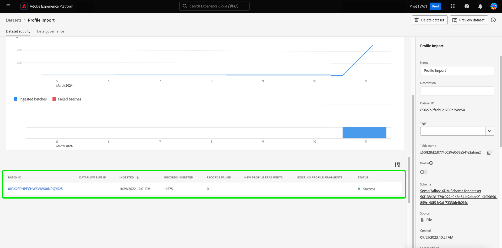

# UI-gids voor gegevensbestanden

Deze gebruikershandleiding bevat instructies voor het uitvoeren van veelvoorkomende handelingen bij het werken met gegevenssets in de gebruikersinterface van Adobe Experience Platform.

## Aan de slag

Deze gebruikershandleiding vereist een goed begrip van de volgende onderdelen van Adobe Experience Platform:

* [Gegevenssets](overview.md): De opslag- en beheerconstructie voor gegevenspersistentie in [!DNL Experience Platform].
* [[!DNL Experience Data Model (XDM) System]](../../xdm/home.md): Het gestandaardiseerde kader waardoor [!DNL Experience Platform] organiseert de gegevens van de klantenervaring.
   * [Basisbeginselen van de schemacompositie](../../xdm/schema/composition.md): Leer over de basisbouwstenen van schema&#39;s XDM, met inbegrip van zeer belangrijke principes en beste praktijken in schemacompositie.
   * [Schema-editor](../../xdm/tutorials/create-schema-ui.md): Leer hoe u uw eigen aangepaste XDM-schema&#39;s maakt met de [!DNL Schema Editor] binnen de [!DNL Platform] gebruikersinterface.
* [[!DNL Real-Time Customer Profile]](../../profile/home.md): Verstrekt een verenigd, real-time consumentenprofiel dat op bijeengevoegde gegevens van veelvoudige bronnen wordt gebaseerd.
* [[!DNL Adobe Experience Platform Data Governance]](../../data-governance/home.md): Ervoor zorgen dat de regels, beperkingen en beleidsregels betreffende het gebruik van klantgegevens worden nageleefd.

## Gegevensbestanden weergeven {#view-datasets}

>[!CONTEXTUALHELP]
>id="platform_datasets_negative_numbers"
>title="Negatieve getallen in gegevenssetactiviteit"
>abstract="Negatieve getallen in geneste records betekenen dat een gebruiker bepaalde batches in een geselecteerd tijdbereik heeft verwijderd."
>text="Learn more in documentation"

>[!CONTEXTUALHELP]
>id="platform_datasets_browse_daysRemaining"
>title="Vervaldatum gegevensset"
>abstract="Deze kolom wijst op het aantal dagen dat de doeldataset heeft verlaten alvorens het automatisch verloopt."

In de [!DNL Experience Platform] UI, selecteer **[!UICONTROL Datasets]** in de linkernavigatie om het dialoogvenster **[!UICONTROL Datasets]** dashboard. Het dashboard maakt een lijst van alle beschikbare datasets voor uw organisatie. De details worden getoond voor elke vermelde dataset, met inbegrip van zijn naam, het schema de dataset zich aan, en status van de meest recente versiereeks houdt.

Selecteer de naam van een gegevensset in het menu [!UICONTROL Browse] tabblad om toegang te krijgen tot **[!UICONTROL Dataset activity]** scherm en zie details van de dataset u selecteerde. Het activiteitenlusje omvat een grafiek die het tarief visualiseert van berichten die worden verbruikt evenals een lijst van succesvolle en ontbroken partijen.

## Handelingen voor inline-gegevenssets {#inline-actions}

De datasets UI biedt nu een inzamelingen van gealigneerde acties voor elke beschikbare dataset aan. Selecteer de ellips van een dataset die u wilt leiden om de beschikbare opties in een pop-up menu te zien. De beschikbare acties omvatten: [[!UICONTROL Preview dataset]](#preview), [[!UICONTROL Manage data and access labels]](#manage-and-enforce-data-governance), [[!UICONTROL Enable unified profile]](#enable-profile), [[!UICONTROL Manage tags]](#add-tags), en [[!UICONTROL Delete]](#delete). Meer informatie over deze beschikbare acties vindt u in de desbetreffende secties.

### Gegevenssetcodes toevoegen {#add-tags}

Voeg aangepaste gemaakte tags toe om gegevenssets te ordenen en zoek-, filter- en sorteermogelijkheden te verbeteren. Van de [!UICONTROL Browse] tabblad van het dialoogvenster [!UICONTROL Datasets] werkruimte, selecteer de ellips van een dataset die u wilt leiden gevolgd door **[!UICONTROL Manage tags]** in het vervolgkeuzemenu.

De [!UICONTROL Manage tags] wordt weergegeven. Voer een korte beschrijving in om een aangepaste tag te maken of kies een reeds bestaande tag om uw gegevensset een label te geven. Selecteren **[!UICONTROL Save]** om uw instellingen te bevestigen.

De [!UICONTROL Manage tags] kan de dialoog ook bestaande markeringen uit een dataset verwijderen. Selecteer gewoon de &#39;x&#39; naast de tag die u wilt verwijderen en selecteer **[!UICONTROL Save]**.

Zodra een markering aan een dataset is toegevoegd, kunnen de datasets worden gefiltreerd gebaseerd op de overeenkomstige markering. Zie de sectie over hoe te [filteren, gegevenssets op tags](#enable-profile) voor meer informatie .

Voor meer informatie over hoe te om bedrijfsvoorwerpen voor gemakkelijkere ontdekking en categorisering te classificeren, zie de gids over [beheren van metagegevenstaxonomieën](../../administrative-tags/ui/managing-tags.md). In deze handleiding wordt beschreven hoe een gebruiker met de juiste machtigingen vooraf gedefinieerde tags kan maken, categorieën aan tags kan toewijzen en alle gerelateerde CRUD-bewerkingen kan uitvoeren op tags en tagcategorieën in de gebruikersinterface van het Platform.

## Gegevensbestanden zoeken en filteren {#search-and-filter}

Om de lijst van beschikbare datasets te zoeken of te filtreren, selecteer het filterpictogram () linksboven in de werkruimte. Er wordt een set filteropties weergegeven in de linkertrack. Er zijn verscheidene methodes om uw beschikbare datasets te filtreren. Deze omvatten: [[!UICONTROL Show System Datasets]](#show-system-datasets), [[!UICONTROL Included in profile]](#filter-profile-enabled-datasets), [[!UICONTROL Tags]](#filter-by-tag), [[!UICONTROL Creation date]](#filter-by-creation-date), [[!UICONTROL Modified date], [!UICONTROL Created by]](#filter-by-creation-date), en [[!UICONTROL Schema]](#filter-by-schema).

De lijst met toegepaste filters wordt boven de gefilterde resultaten weergegeven.

### Systeemgegevenssets tonen {#show-system-datasets}

Door gebrek, slechts worden de datasets die u gegevens hebt ingebed in getoond. Als u de systeem-geproduceerde datasets wilt zien, selecteer **[!UICONTROL Yes]** Selectievakje in het dialoogvenster [!UICONTROL Show system datasets] sectie. Door het systeem gegenereerde gegevenssets worden alleen gebruikt om andere componenten te verwerken. De door het systeem gegenereerde profielexportgegevensset wordt bijvoorbeeld gebruikt om het profieldashboard te verwerken.

![De filteropties van de werkruimte Datasets met de [!UICONTROL Show system datasets] gemarkeerd.](../images/datasets/user-guide/show-system-datasets.png)

### Gegevenssets voor filterprofiel {#filter-profile-enabled-datasets}

De datasets die voor de gegevens van het Profiel zijn toegelaten worden gebruikt om klantenprofielen te bevolken nadat de gegevens zijn opgenomen. Zie de sectie over [gegevenssets inschakelen voor profiel](#enable-profile) voor meer informatie.

Om uw dataset te filtreren die op of zij voor Profiel zijn toegelaten, selecteer [!UICONTROL Yes] van de filteropties.

![De filteropties van de werkruimte Datasets met de [!UICONTROL Included in Profile] gemarkeerd.](../images/datasets/user-guide/included-in-profile.png)

### Gegevenssets filteren op tag {#filter-by-tag}

Voer in het dialoogvenster [!UICONTROL Tags] invoer, dan selecteer uw markering van de lijst van beschikbare opties aan onderzoek en filterdatasets die aan die markering beantwoorden.

![De filteropties van de werkruimte Datasets met de [!UICONTROL Tags] invoer- en filterpictogram gemarkeerd.](../images/datasets/user-guide/filter-tags.png)

### Gegevensbestanden filteren op aanmaakdatum {#filter-by-creation-date}

Datasets kunnen worden gefilterd op aanmaakdatum over een aangepaste tijdsperiode. Dit kan worden gebruikt om historische gegevens uit te sluiten of specifieke chronologische gegevens en rapportage te genereren. Kies een [!UICONTROL Start date] en [!UICONTROL End date] door het kalenderpictogram voor elk gebied te selecteren. Daarna, slechts datasets die aan die criteria voldoen zullen op het Browse lusje verschijnen.

### Gegevenssets filteren op gewijzigde datum {#filter-by-modified-date}

Net als bij het filter voor de aanmaakdatum kunt u de gegevenssets filteren op basis van de datum waarop deze voor het laatst zijn gewijzigd. In de [!UICONTROL Modified date] sectie, kies een [!UICONTROL Start date] en [!UICONTROL End date] door het kalenderpictogram voor elk gebied te selecteren. Daarna, slechts zullen de datasets die tijdens die periode werden gewijzigd in het Browse lusje verschijnen.

### Filteren op schema {#filter-by-schema}

U kunt datasets filtreren die op het schema worden gebaseerd dat hun structuur bepaalt. Selecteer het vervolgkeuzepictogram of voer de schemanaam in het tekstveld in. Er wordt een lijst weergegeven met mogelijke overeenkomsten. Selecteer het gewenste schema in de lijst.

## Gegevenssets sorteren op gemaakte datum {#sort}

Gegevensbestanden in het dialoogvenster [!UICONTROL Browse] kan worden gesorteerd op oplopende of aflopende datums. Selecteer [!UICONTROL Created] of [!UICONTROL Last updated] kolomkoppen die u wilt afwisselen tussen oplopend en aflopend. Als deze optie is geselecteerd, geeft de kolom dit aan met een pijl-omhoog of een pijl-omlaag naar de zijkant van de kolomkop.

## Een voorbeeld van een gegevensset bekijken {#preview}

U kunt voorbeeldgegevens van gegevenssets voorvertonen met de inline-opties van het dialoogvenster [!UICONTROL Browse] en ook de [!UICONTROL Dataset activity] weergeven. Van de [!UICONTROL Browse] selecteert u de ovalen naast de naam van de gegevensset waarvan u een voorvertoning wilt weergeven. Er wordt een menulijst met opties weergegeven. Selecteer vervolgens **[!UICONTROL Preview dataset]** in de lijst met beschikbare opties. Als de dataset leeg is, zal de voorproefverbinding worden gedeactiveerd en in plaats daarvan zal zeggen dat de voorproef niet beschikbaar is.

Dit opent het voorproefvenster, waar de hiërarchische mening van het schema voor de dataset op het recht wordt getoond.

Alternatief, van **[!UICONTROL Dataset activity]** scherm, selecteren **[!UICONTROL Preview dataset]** in de rechterbovenhoek van het scherm om maximaal 100 rijen met gegevens voor te vertonen.

Voor robuustere methoden om toegang te krijgen tot uw gegevens, [!DNL Experience Platform] levert downstreamdiensten zoals [!DNL Query Service] en [!DNL JupyterLab] gegevens te verkennen en te analyseren. Raadpleeg de volgende documenten voor meer informatie:

* [Overzicht van Query Service](../../query-service/home.md)
* [Gebruikershandleiding voor JupyterLab](../../data-science-workspace/jupyterlab/overview.md)

## Een gegevensset maken {#create}

Om een nieuwe dataset tot stand te brengen, begin door te selecteren **[!UICONTROL Create dataset]** in de **[!UICONTROL Datasets]** dashboard.

In het volgende scherm, wordt u voorgesteld met de volgende twee opties om een nieuwe dataset tot stand te brengen:

* [Gegevensset maken van schema](#schema)
* [Gegevensset maken van CSV-bestand](#csv)

### Creeer een dataset met een bestaand schema {#schema}

In de **[!UICONTROL Create dataset]** scherm, selecteren **[!UICONTROL Create dataset from schema]** om een nieuwe lege dataset tot stand te brengen.

De **[!UICONTROL Select schema]** wordt weergegeven. Blader door de schemalijst en selecteer het schema dat de dataset alvorens zal volgen te selecteren **[!UICONTROL Next]**.

De **[!UICONTROL Configure dataset]** wordt weergegeven. Geef de gegevensset een naam en een optionele beschrijving en selecteer **[!UICONTROL Finish]** om de dataset tot stand te brengen.

Datasets kunnen van de lijst van beschikbare datasets in UI met de schemafilter worden gefiltreerd. Zie de sectie over hoe te [filterdatasets per schema](#filter-by-schema) voor meer informatie .

### Een gegevensset maken met een CSV-bestand {#csv}

Wanneer een dataset gebruikend een Csv- dossier wordt gecreeerd, wordt een ad hoc schema gecreeerd om de dataset van een structuur te voorzien die het verstrekte Csv- dossier aanpast. In de **[!UICONTROL Create dataset]** scherm, selecteren **[!UICONTROL Create dataset from CSV file]**.

De **[!UICONTROL Configure]** wordt weergegeven. Geef de gegevensset een naam en een optionele beschrijving en selecteer **[!UICONTROL Next]**.

De **[!UICONTROL Add data]** wordt weergegeven. Upload het CSV-bestand door het naar het midden van het scherm te slepen of selecteer **[!UICONTROL Browse]** om uw bestandsmap te verkennen. Het bestand kan maximaal tien gigabyte groot zijn. Selecteer **[!UICONTROL Save]** om de dataset tot stand te brengen.

>[!NOTE]
>
>CSV-kolomnamen moeten beginnen met alfanumerieke tekens en mogen alleen letters, cijfers en onderstrepingstekens bevatten.

## Een gegevensset inschakelen voor realtime-klantprofiel {#enable-profile}

Elke dataset heeft de capaciteit om klantenprofielen met zijn ingebedde gegevens te verrijken. Om dit te doen, moet het schema dat de dataset hanteert voor gebruik binnen compatibel zijn [!DNL Real-Time Customer Profile]. Een compatibel schema voldoet aan de volgende vereisten:

* Het schema heeft minstens één die attribuut als identiteitseigenschap wordt gespecificeerd.
* Het schema heeft een identiteitseigenschap die als primaire identiteit wordt bepaald.

Voor meer informatie over het inschakelen van een schema voor [!DNL Profile], zie de [Gebruikershandleiding voor Schema-editor](../../xdm/tutorials/create-schema-ui.md).

U kunt een dataset voor Profiel van zowel de gealigneerde opties van toelaten [!UICONTROL Browse] en ook de [!UICONTROL Dataset activity] weergeven. Van de [!UICONTROL Browse] tabblad van het dialoogvenster [!UICONTROL Datasets] de werkruimte, selecteer de ellips van een dataset die u voor Profiel wilt toelaten. Er wordt een menulijst met opties weergegeven. Selecteer vervolgens **[!UICONTROL Enable unified profile]** in de lijst met beschikbare opties.

Alternatief, van de dataset **[!UICONTROL Dataset activity]** scherm, selecteert u de **[!UICONTROL Profile]** schakelen binnen de **[!UICONTROL Properties]** kolom. Zodra toegelaten, zullen de gegevens die in de dataset worden opgenomen ook worden gebruikt om klantenprofielen te bevolken.

>[!NOTE]
>
>Als een dataset reeds gegevens bevat en dan toegelaten voor [!DNL Profile], worden de bestaande gegevens niet automatisch verbruikt door [!DNL Profile]. Nadat een dataset wordt toegelaten voor [!DNL Profile], wordt u aangeraden alle bestaande gegevens opnieuw in te voeren om ervoor te zorgen dat deze bijdragen aan de profielen van klanten.

Datasets die voor Profiel zijn ingeschakeld, kunnen ook op deze criteria worden gefilterd. Zie de sectie over hoe te [gegevenssets waarvoor filterprofiel is ingeschakeld](#filter-profile-enabled-datasets) voor meer informatie .

## Beheer van gegevens beheren en afdwingen op een gegevensset {#manage-and-enforce-data-governance}

U kunt de labels voor gegevensbeheer voor een dataset beheren door de inlineopties van het dialoogvenster [!UICONTROL Browse] tab. Selecteer de ovalen naast de naam van de gegevensset die u wilt beheren, gevolgd door **[!UICONTROL Manage data and access labels]** in het vervolgkeuzemenu.

Met labels voor gegevensgebruik, toegepast op schemaniveau, kunt u gegevenssets en velden categoriseren volgens het gebruiksbeleid dat van toepassing is op die gegevens. Zie de [Overzicht van gegevensbeheer](../../data-governance/home.md) voor meer informatie over labels, of raadpleegt u de [gebruikershandleiding voor gegevensgebruikslabels](../../data-governance/labels/overview.md) voor instructies op hoe te om etiketten op schema&#39;s voor propagatie op datasets toe te passen.

## Een gegevensset verwijderen {#delete}

U kunt een dataset van of de dataset gealigneerde acties in de dataset schrappen [!UICONTROL Browse] of de rechterbovenhoek van de [!UICONTROL Dataset activity] weergeven. Van de [!UICONTROL Browse] Selecteer de ovalen naast de naam van de gegevensset die u wilt verwijderen. Er wordt een menulijst met opties weergegeven. Selecteer vervolgens **[!UICONTROL Delete]** in het vervolgkeuzemenu.

Er verschijnt een bevestigingsvenster. Selecteren **[!UICONTROL Delete]** ter bevestiging.

U kunt ook **[!UICONTROL Delete dataset]** van de **[!UICONTROL Dataset activity]** scherm.

>[!NOTE]
>
>Datasets die zijn gemaakt en gebruikt door Adobe-toepassingen en -services (zoals Adobe Analytics, Adobe Audience Manager of [!DNL Offer Decisioning]) kan niet worden verwijderd.

Er verschijnt een bevestigingsvak. Selecteren **[!UICONTROL Delete]** om de schrapping van de gegevensset te bevestigen.

## Een voor profiel ingeschakelde gegevensset verwijderen

Als een dataset voor Profiel wordt toegelaten, zal het schrappen van die dataset door UI het van gegevens meer, de Dienst van de Identiteit, en de opslag van het Profiel binnen Platform schrappen.

U kunt een dataset van [!DNL Profile] Alleen opslaan (waarbij de gegevens in het Data Lake blijven) met behulp van de Real-Time Customer Profile API. Zie voor meer informatie de [API-eindgids voor profielsysteemtaken](../../profile/api/profile-system-jobs.md).

## Gegevens bijhouden

In de [!DNL Experience Platform] UI, selecteer **[!UICONTROL Monitoring]** in de linkernavigatie. De **[!UICONTROL Monitoring]** in het dashboard kunt u de status van binnenkomende gegevens van batch- of streaming invoer bekijken. Als u de status van afzonderlijke batches wilt weergeven, selecteert u **[!UICONTROL Batch end-to-end]** of **[!UICONTROL Streaming end-to-end]**. De dashboards maken een lijst van alle partij of het stromen ingangen, met inbegrip van die die succesvol zijn, ontbroken, of nog lopend. Elke lijst verstrekt details van de partij, met inbegrip van partijidentiteitskaart, de naam van de doeldataset, en het aantal verslagen die worden opgenomen. Als de doeldataset wordt toegelaten voor [!DNL Profile], wordt ook het aantal opgenomen identiteits- en profielrecords weergegeven.

U kunt op een individu selecteren **[!UICONTROL Batch ID]** toegang tot **[!UICONTROL Batch overview]** dashboard en zie details voor de partij, met inbegrip van foutenlogboeken als de partij niet opneemt.

Als u de batch wilt verwijderen, selecteert u **[!UICONTROL Delete batch]** in de buurt van de rechterbovenhoek van het dashboard. Als u een batch verwijdert, verwijdert u ook de records uit de gegevensset waarin de batch oorspronkelijk was opgenomen.

## Volgende stappen

Deze gebruikershandleiding bevat instructies voor het uitvoeren van algemene handelingen bij het werken met gegevenssets in het dialoogvenster [!DNL Experience Platform] gebruikersinterface. Voor stappen om gemeenschappelijk uit te voeren [!DNL Platform] de werkschema&#39;s die datasets impliceren, te verwijzen naar de volgende leerprogramma&#39;s:

* [Een gegevensset maken met behulp van API&#39;s](create.md)
* [De gegevens van de dataset van de vraag gebruikend de Toegang API van Gegevens](../../data-access/home.md)
* [Een gegevensset configureren voor realtime profiel en identiteitsservice van klanten met behulp van API&#39;s](../../profile/tutorials/dataset-configuration.md)
