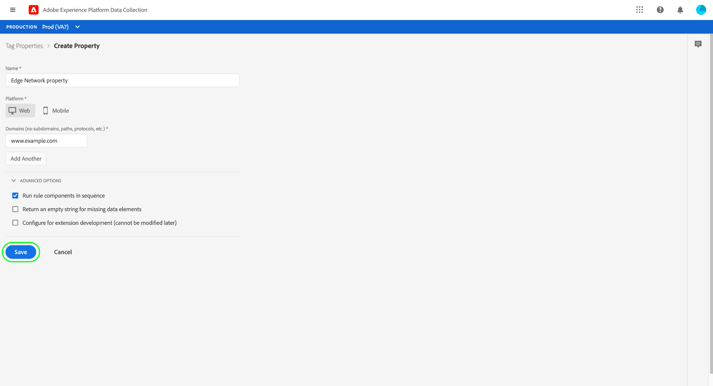

# Overzicht van end-to-end gegevensverzameling

Adobe Experience Platform verzamelt en stuurt uw gegevens naar andere Adobe-producten en andere bestemmingen. Als u gebeurtenisgegevens van uw toepassing naar de Experience Platform Edge Network wilt verzenden, is het belangrijk dat u deze kerntechnologieën begrijpt en weet hoe u ze configureert om uw gegevens te leveren aan de bestemmingen die u nodig hebt, wanneer u deze nodig hebt.

Deze handleiding bevat een zelfstudie op hoog niveau over het verzenden van een gebeurtenis via de Edge Network met behulp van Experience Platform-mogelijkheden voor gegevensverzameling. Specifiek, doorloopt het leerprogramma de stappen om de de marktextensie van Adobe Experience Platform Web SDK binnen de UI van de Inzameling van Gegevens (vroeger Adobe Experience Platform Launch) te installeren en te vormen.

>[!NOTE]
>
>U kunt er ook voor kiezen om de SDK handmatig te installeren en te configureren als u geen tags wilt gebruiken, maar de omringende stappen moeten nog steeds worden uitgevoerd zoals hieronder wordt beschreven.
>
>Alle stappen met betrekking tot de UI van de Inzameling van Gegevens kunnen ook in Experience Platform UI worden uitgevoerd.

## Vereisten

Dit leerprogramma gebruikt UI van de Inzameling van Gegevens om een schema tot stand te brengen, een gegevensstroom te vormen, en het Web SDK te installeren. Om deze acties in UI uit te voeren, moet u toegang tot minstens één Webbezit samen met de volgende [&#x200B; bezitsrechten &#x200B;](../tags/ui/administration/user-permissions.md#property-rights) worden verleend:

* Ontwikkelen
* Extensies beheren

Zie de gids over [&#x200B; het leiden toestemmingen voor gegevensinzameling &#x200B;](./permissions.md) leren hoe te om toegang tot eigenschappen en bezitsrechten te verlenen.

Om de diverse producten van de Inzameling van Gegevens te gebruiken die in deze gids worden vermeld, moet u toegang tot gegevensstromen en de capaciteit ook hebben om schema&#39;s tot stand te brengen en te beheren. Als u toegang tot een van deze functies nodig hebt, neemt u contact op met uw Adobe-accountteam om u te helpen de benodigde toegang te krijgen. Houd er rekening mee dat als u Adobe Experience Platform niet hebt aangeschaft, Adobe u zonder extra kosten toegang biedt tot de SDK.

Als u reeds toegang tot Experience Platform hebt, moet u ervoor zorgen dat u alle [&#x200B; toestemmingen &#x200B;](../access-control/home.md#permissions) onder de volgende toegelaten categorieën hebt:

* Gegevensmodellering
* Identiteiten

Zie het [&#x200B; overzicht van toegangsbeheer UI &#x200B;](../access-control/ui/overview.md) leren hoe te om toestemmingen voor de mogelijkheden van Experience Platform aan gebruikers te verlenen.

## Procesoverzicht

Het proces om gegevensinzameling voor uw website te vormen kan als volgt worden samengevat:

1. [&#x200B; creeer een schema &#x200B;](#schema) om te bepalen hoe uw gegevens wanneer verzonden naar Edge Network zullen worden gestructureerd.
1. [&#x200B; creeer een datastream &#x200B;](#datastream) om te vormen welke bestemmingen u uw gegevens wilt worden verzonden naar.
1. [&#x200B; installeer en vorm het Web SDK &#x200B;](#sdk) om gegevens naar de gegevensstroom te verzenden wanneer bepaalde gebeurtenissen op uw website voorkomen.

Zodra u gegevens naar Edge Network kunt verzenden, kunt u naar keuze [&#x200B; gebeurtenis ook vormen door:sturen &#x200B;](#event-forwarding) als uw organisatie een vergunning voor het heeft.

## Een schema maken {#schema}

[&#x200B; Model van de Gegevens van de Ervaring (XDM) &#x200B;](../xdm/home.md) is een open-bronspecificatie die gemeenschappelijke structuren en definities voor gegevens in de vorm van schema&#39;s verstrekt. Met andere woorden, XDM is een manier om uw gegevens op een manier te structureren en te formatteren die door de Edge Network en andere toepassingen van Adobe Experience Cloud kan actie ondernemen.

De eerste stap in vestiging uw verrichtingen van de gegevensinzameling is een schema te creëren XDM om uw gegevens te vertegenwoordigen. In een latere stap in deze zelfstudie wijst u de gegevens toe die u naar de structuur van dit schema wilt verzenden.

>[!NOTE]
>
>XDM-schema&#39;s zijn zeer aanpasbaar. In plaats van al te veel regels te stellen, richten de hieronder geschetste stappen zich specifiek op de schemavereisten voor het Web SDK. Buiten deze parameters kunt u de resterende structuur van uw gegevens definiëren, hoe u dat ook wilt.

Selecteer in de gebruikersinterface **[!UICONTROL Schemas]** in de linkernavigatie. Van hier, kunt u een lijst van eerder gecreeerd schema&#39;s zien die tot uw organisatie behoren. Selecteer **[!UICONTROL Create schema]** en selecteer vervolgens **[!UICONTROL XDM ExperienceEvent]** in het vervolgkeuzemenu om door te gaan.


Er wordt een dialoogvenster weergegeven waarin u wordt gevraagd veldgroepen aan het schema toe te voegen. Als u gebeurtenissen wilt verzenden met de Web SDK, moet u de veldgroep **[!UICONTROL AEP Web SDK ExperienceEvent Mixin]** toevoegen. Deze veldgroep bevat definities voor gegevenskenmerken die automatisch worden verzameld door de SDK-bibliotheek van het Web.

Gebruik de zoekbalk om de lijst te versmallen, zodat u deze veldgroep gemakkelijker kunt vinden. Nadat u deze hebt gevonden, selecteert u deze in de lijst voordat u **[!UICONTROL Add field groups]** selecteert.


Het schemacanvas verschijnt, tonend een boomstructuur van uw schema XDM met inbegrip van de gebieden die door de het gebiedsgroep van SDK van het Web worden verstrekt.


Selecteer het basisveld in de boomstructuur dat u **[!UICONTROL Schema properties]** wilt openen in de rechtertrack, waar u een naam en een optionele beschrijving voor het schema kunt opgeven.


Als u meer velden aan het schema wilt toevoegen, selecteert u **[!UICONTROL Add]** onder de sectie **[!UICONTROL Field groups]** in de linkertrack.

 toe

>[!NOTE]
>
>Zie de gids op [&#x200B; toevoegend gebiedsgroepen &#x200B;](../xdm/ui/resources/schemas.md#add-field-groups) in de documentatie XDM voor gedetailleerde stappen op hoe te om naar verschillende gebiedsgroepen te zoeken om uw gebruiksgevallen aan te passen.
>
>U kunt het beste alleen velden toevoegen voor gegevens die u wilt verzenden via de Edge Network. Nadat u velden hebt toegevoegd aan een schema en dit hebt opgeslagen, kunnen alleen aanvullende wijzigingen in het schema worden aangebracht. Zie de sectie over de [&#x200B; regels van schemaevolutie &#x200B;](../xdm/schema/composition.md#evolution) voor meer informatie.

Nadat u de gewenste velden hebt toegevoegd, selecteert u **[!UICONTROL Save]** om het schema op te slaan.


## Een gegevensstroom maken {#datastream}

Een gegevensstroom is een configuratie die de Edge Network vertelt waar u uw gegevens wilt worden verzonden. Specifiek, specificeert een gegevensstroom welke producten van Experience Cloud u de gegevens naar wilt verzenden, en hoe u de gegevens wilt worden behandeld en in elk product worden opgeslagen.

>[!NOTE]
>
>Als u [&#x200B; gebeurtenis wilt gebruiken door:sturen &#x200B;](../tags/ui/event-forwarding/overview.md) (veronderstellend uw organisatie voor de functionaliteit) vergunning wordt gegeven, moet u het voor een gegevensstroom op de zelfde manier toelaten dat u de producten van Adobe toelaat. De details op dit proces worden behandeld in a [&#x200B; recentere sectie &#x200B;](#event-forwarding).

Selecteer **[!UICONTROL Datastreams]** in de linkernavigatie. Van hier, kunt u een bestaande gegevensstroom van de lijst selecteren om uit te geven, of u kunt een nieuwe configuratie tot stand brengen door **[!UICONTROL New Datastream]** te selecteren.


De configuratievereisten voor een gegevensstroom hangen af van welke producten en mogelijkheden u gegevens naar verzendt. Voor gedetailleerde informatie over de configuratieopties voor elk product, verwijs naar het [&#x200B; overzicht van gegevensstromen &#x200B;](../datastreams/overview.md).

## De Web SDK installeren en configureren {#install}

Nadat u een schema en een gegevensstroom hebt gemaakt, moet u eerst de Experience Platform Web SDK installeren en configureren om gegevens naar de Edge Network te verzenden.

>[!NOTE]
>
>Deze sectie gebruikt de UI van de Inzameling van Gegevens om de de markeringsuitbreiding van SDK van het Web te vormen, maar u kunt het ook installeren en vormen gebruikend ruwe code in plaats daarvan. Raadpleeg de volgende hulplijnen voor meer informatie:
>
>* [&#x200B; installeer SDK &#x200B;](/help/web-sdk/install/overview.md)
>* [&#x200B; vorm SDK &#x200B;](/help/web-sdk/commands/configure/overview.md)
>
>Merk ook op dat zelfs als u gebeurtenis slechts wilt gebruiken door:sturen, u nog moet installeren en SDK vormen zoals die vóór het vormen gebeurtenis die bij a [&#x200B; wordt door:sturen stap &#x200B;](#event-forwarding) wordt beschreven.

Het proces kan als volgt worden samengevat:

1. [&#x200B; installeer het Web SDK van Adobe Experience Platform op een markeringsbezit &#x200B;](#install-sdk) om toegang tot zijn mogelijkheden te krijgen.
1. [&#x200B; creeer een XDM gegevenselement van Objecten &#x200B;](#data-element) om variabelen op uw website aan de structuur van het XDM schema in kaart te brengen u eerder creeerde.
1. [&#x200B; creeer een regel &#x200B;](#rule) om SDK te vertellen wanneer het gegevens naar Edge Network zou moeten verzenden.
1. [&#x200B; bouwt en installeert een bibliotheek &#x200B;](#library) om de regel op uw website uit te voeren.

### De SDK op een tag-eigenschap installeren {#install-sdk}

Selecteer **[!UICONTROL Tags]** in de linkernavigatie om een lijst met eigenschappen van tags weer te geven. U kunt desgewenst een bestaande eigenschap kiezen die u wilt bewerken, of u kunt **[!UICONTROL New Property]** selecteren.


Als u een nieuwe eigenschap maakt, geeft u een beschrijvende naam op en stelt u [!UICONTROL Platform] in op **[!UICONTROL Web]** . Geef het volledige domein voor de webeigenschap op en selecteer vervolgens **[!UICONTROL Save]** .



De overzichtspagina voor de eigenschap wordt weergegeven. Selecteer hier **[!UICONTROL Extensions]** in de navigatie links en selecteer vervolgens **[!UICONTROL Catalog]** . Zoek de vermelding voor de Experience Platform Web SDK (optioneel met de zoekbalk) en selecteer **[!UICONTROL Install]** .


De configuratiepagina voor de SDK wordt weergegeven. De meeste vereiste waarden worden automatisch ingevuld met standaardwaarden die u desgewenst kunt wijzigen.


Voordat u de SDK kunt installeren, moet u echter een gegevensstroom selecteren, zodat deze weet waarnaar u de gegevens wilt verzenden. Onder **[!UICONTROL Datastreams]**, gebruik het dropdown menu om de gegevensstroom te selecteren die u bij een [&#x200B; vroegere stap &#x200B;](#datastream) vormde. Nadat u de gegevensstroom hebt ingesteld, selecteert u **[!UICONTROL Save]** om de installatie van de SDK op de eigenschap te voltooien.


### Een XDM-gegevenselement maken {#data-element}

Opdat SDK gegevens naar Edge Network verzendt, moeten die gegevens aan het schema worden in kaart gebracht XDM u in a [&#x200B; vorige stap &#x200B;](#schema) creeerde. Deze toewijzing wordt verwezenlijkt door het gebruik van een gegevenselement.

Selecteer in de gebruikersinterface **[!UICONTROL Data Elements]** en selecteer vervolgens **[!UICONTROL Create New Data Element]** .


Selecteer in het volgende scherm **[!UICONTROL Adobe Experience Platform Web SDK]** onder het vervolgkeuzemenu [!UICONTROL Extension] en selecteer vervolgens **[!UICONTROL XDM object]** voor het type gegevenselement.


Het configuratiedialoogvenster wordt weergegeven voor het XDM-objecttype. Het dialoogvenster selecteert automatisch uw Experience Platform-sandbox en vanaf deze locatie kunt u alle schema&#39;s zien die in die sandbox zijn gemaakt. Selecteer het XDM-schema dat u eerder in de lijst hebt gemaakt.


De structuur van het schema wordt weergegeven. Alle gebieden met een asterisk (**\***) wijzen op gebieden die automatisch bevolken wanneer de gebeurtenissen brand. Voor alle andere gebieden, kunt u de structuur van het schema onderzoeken en de rest gegevens invullen.


>[!NOTE]
>
>De screenshot hierboven toont hoe u een algemeen toegankelijke variabele van de clientzijde van uw website (`cartAbandonsTotal`) aan een XDM-veld kunt toewijzen door naar de naam ervan te verwijzen in het [!UICONTROL Value] -veld, omringd door procentuele tekens (`%`).
>
>U kunt ook andere eerder gemaakte gegevenselementen gebruiken om deze velden te vullen. Zie de verwijzing op [&#x200B; gegevenselementen &#x200B;](../tags/ui/managing-resources/data-elements.md) in de markeringsdocumentatie voor meer informatie.

Nadat u de gegevens aan het schema hebt toegewezen, geeft u een naam voor het gegevenselement op voordat u **[!UICONTROL Save]** selecteert.


### Een regel maken

Nadat u het gegevenselement hebt opgeslagen, is de volgende stap een regel te creëren die het naar Edge Network zal verzenden wanneer een bepaalde gebeurtenis op uw website (zoals wanneer een klant een product aan een karretje toevoegt) voorkomt.

U kunt regels instellen voor vrijwel elke gebeurtenis die op uw website kan plaatsvinden. In deze sectie wordt bijvoorbeeld getoond hoe u een regel maakt die wordt geactiveerd wanneer een klant een formulier verzendt. De volgende HTML staat voor een eenvoudige webpagina met het formulier &quot;Toevoegen aan winkelwagentje&quot;, waarop de regel van toepassing is:

```html
<!DOCTYPE html>
<html>
<body>

  <form id="add-to-cart-form">
    <label for="item">Product:</label><br>
    <input type="text" id="item" name="item"><br>
    <label for="amount">Amount:</label><br>
    <input type="number" id="amount" name="amount" value="1"><br><br>
    <input type="submit" value="Add to Cart">
  </form> 

</body>
</html>
```

Selecteer in de gebruikersinterface voor gegevensverzameling **[!UICONTROL Rules]** in de linkernavigatie en selecteer vervolgens **[!UICONTROL Create New Rule]** .


Geef in het volgende scherm een naam voor de regel op. Van hier, is de volgende stap de gebeurtenis voor de regel (met andere woorden, wanneer de regel zal in brand steken). Selecteer **[!UICONTROL Add]** onder [!UICONTROL Events] .


De pagina voor gebeurtenisconfiguratie wordt weergegeven. Als u een gebeurtenis wilt configureren, moet u eerst het gebeurtenistype selecteren. Gebeurtenistypen worden geleverd door extensies. Als u bijvoorbeeld een gebeurtenis &quot;form submit&quot; wilt instellen, selecteert u de extensie **[!UICONTROL Core]** en vervolgens het gebeurtenistype **[!UICONTROL Submit]** onder de categorie **[!UICONTROL Form]** .

>[!NOTE]
>
>Voor meer informatie over de verschillende gebeurtenistypen die door het Webuitbreidingen van Adobe worden verstrekt, met inbegrip van hoe te om hen te vormen, zie de [&#x200B; de uitbreidingsverwijzing van Adobe &#x200B;](../tags/extensions/client/overview.md) in de tagdocumentatie.

De vorm voorlegt gebeurtenis staat u toe om a [&#x200B; CSS selecteur &#x200B;](https://www.w3schools.com/css/css_selectors.asp) te gebruiken om een specifiek element voor de regel van verwijzingen te voorzien om op te slaan. In het onderstaande voorbeeld wordt de id `add-to-cart-form` gebruikt, zodat deze regel alleen geldt voor het formulier &quot;Toevoegen aan winkelwagentje&quot;. Selecteer **[!UICONTROL Keep Changes]** om de gebeurtenis aan de regel toe te voegen.


De pagina voor regelconfiguratie wordt opnieuw weergegeven en toont dat de gebeurtenis is toegevoegd. U kunt onderaan &quot;[!UICONTROL If]&quot;versmallen door verdere voorwaarden aan de regel toe te voegen.

Anders, is de volgende stap een actie voor de regel toe te voegen om uit te voeren wanneer het brandt. Selecteer **[!UICONTROL Add]** onder **[!UICONTROL Actions]** om door te gaan.

 toe

De pagina voor actieconfiguratie wordt weergegeven. Als u de regel wilt gebruiken om gegevens naar de Edge Network te verzenden, selecteert u **[!UICONTROL Adobe Experience Platform Web SDK]** voor de extensie en **[!UICONTROL Send event]** voor het actietype.


Het scherm wordt bijgewerkt om extra opties te tonen om de send gebeurtenisactie te vormen. Onder **[!UICONTROL Type]** kunt u een aangepaste typewaarde opgeven om het `eventType` XDM-veld te vullen. Onder **[!UICONTROL XDM data]**, verstrek de naam van het XDM gegevenstype u vroeger (omringd door percententekens) creeerde, of selecteer het gegevensbestandpictogram () om het van een lijst te selecteren. Dit zijn de gegevens die uiteindelijk naar de Edge Network worden verzonden.

Selecteer **[!UICONTROL Keep Changes]** wanneer u klaar bent.


Nadat u de regel hebt geconfigureerd, selecteert u **[!UICONTROL Save]** om het proces te voltooien.


### Bibliotheek maken en installeren {#library}

Nadat de regel is gevormd, bent u bereid om het aan een markeringsbibliotheek toe te voegen, die bibliotheek aan een milieu te bouwen, en die bouwt op uw website te installeren.

>[!NOTE]
>
>Als u nog geen milieu in de Inzameling van Gegevens UI opstelling hebt, moet u dit doen alvorens u een bouwstijl kunt tot stand brengen. Zie de sectie op [&#x200B; vormend een milieu voor een Webbezit &#x200B;](../tags/ui/publishing/environments.md#web-configuration) in de markeringsdocumentatie voor meer informatie.

Leren hoe te om een bibliotheek tot stand te brengen, uitbreidingen en regels aan de bibliotheek toe te voegen, en die bibliotheek aan een milieu te bouwen, zie de gids op [&#x200B; het leiden bibliotheken &#x200B;](../tags/ui/publishing/libraries.md) in de tagdocumentatie. Wanneer u de bibliotheek maakt, moet u de extensie Experience Platform Web SDK en de regels voor gegevensverzameling die u eerder hebt gemaakt, opnemen.

Nadat u de bibliotheek hebt gemaakt en de build ervan aan een omgeving is toegewezen, kunt u die omgeving op de client van uw website installeren. Zie de sectie over [&#x200B; het installeren van milieu&#39;s &#x200B;](../tags/ui/publishing/environments.md#installation) voor meer informatie.

Nadat u het milieu op uw website hebt geïnstalleerd, kunt u [&#x200B; uw implementatie &#x200B;](../tags/ui/publishing/embed-code-testing.md) testen gebruikend Adobe Experience Platform Debugger.

## Gebeurtenis door:sturen configureren (optioneel) {#event-forwarding}

>[!NOTE]
>
>Het doorsturen van gebeurtenissen is alleen beschikbaar voor organisaties die hiervoor een licentie hebben gekregen.

Als u de SDK hebt geconfigureerd om gegevens naar de Edge Network te verzenden, kunt u een gebeurtenis instellen die wordt doorgestuurd om aan de Edge Network te laten weten waar u die gegevens wilt ontvangen.

Om gebeurtenis te gebruiken door:sturen, moet u eerst een gebeurtenis creëren door:sturen bezit. Selecteer **[!UICONTROL Event Forwarding]** in de linkernav en selecteer vervolgens **[!UICONTROL New Property]** . Geef een naam op voor de eigenschap voordat u **[!UICONTROL Save]** selecteert.

Zodra u een gebeurtenis creeert die bezit door:sturen, moet de volgende stap een regel tot stand brengen die bepaalt waar de gegevens zouden moeten worden verzonden. De regels voor gebeurtenis die eigenschappen door:sturen worden geconstrueerd op ongeveer de zelfde manier zoals markeringseigenschappen, met uitzondering dat geen gebeurtenissen kunnen worden gespecificeerd (aangezien gebeurtenis die slechts gebeurtenissen door:sturen behandelt het direct van de datastream ontvangt). Voor de actie van de regel, kunt u gebruik maken van één van de beschikbare gebeurtenis die uitbreidingen door:sturen, of douanecode gebruiken om de gebeurtenis in plaats daarvan te leveren.


Gelijkaardig aan vroeger, zodra u de regel hebt gevormd, moet u het aan een bibliotheek toevoegen en die bibliotheek aan een milieu bouwen.

Nadat de bouwstijl volledig is, moet de definitieve stap de datastream bijwerken u [&#x200B; eerder &#x200B;](#datastream) vormde en gebeurtenis toelaten door:sturen. Navigeer naar **[!UICONTROL Datastreams]** en selecteer de desbetreffende gegevensstroom in de lijst om te beginnen. Van hier, laat knevel voor gebeurtenis toe door:sturen, en verstrek de namen van het bezit en het milieu dat u enkel vormde.


## Volgende stappen

Deze gids verstrekte een high-level overzicht van begin tot eind van hoe te om gegevens naar Edge Network te verzenden gebruikend het Web SDK van Experience Platform. Raadpleeg de documentatie bij deze handleiding voor meer informatie over de verschillende onderdelen en services in kwestie.
