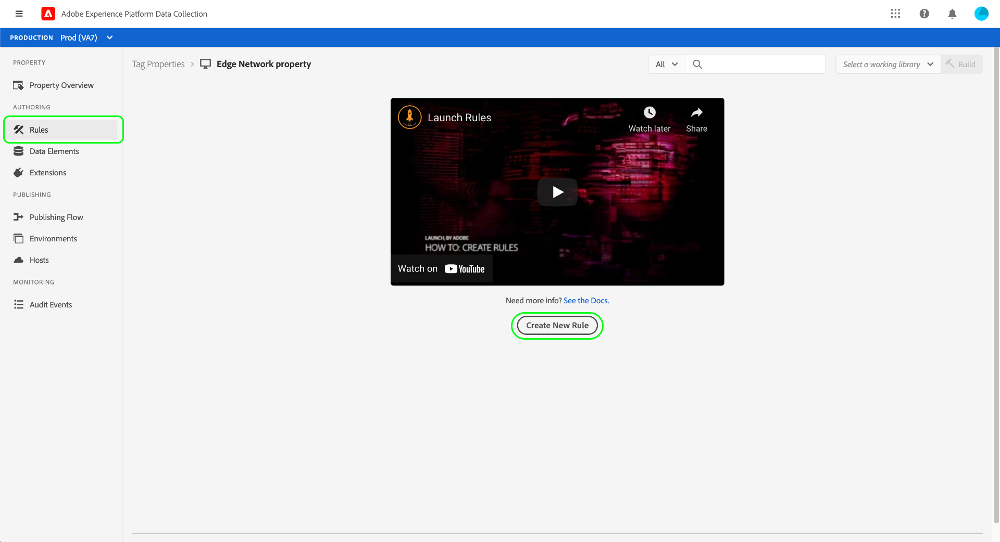

# Overzicht van end-to-end gegevensverzameling

Adobe Experience Platform verzamelt en stuurt uw gegevens naar andere Adobe-producten en andere bestemmingen. Om gebeurtenisgegevens van uw toepassing naar het Netwerk van de Rand van het Experience Platform te verzenden, is het belangrijk om deze kerntechnologieën te begrijpen en hoe te om hen te vormen om uw gegevens aan de bestemmingen te leveren u vereist, wanneer u het vereist.

Deze gids verstrekt een zelfstudie op hoog niveau van hoe te om een gebeurtenis door het Netwerk van de Rand te verzenden gebruikend de mogelijkheden van de gegevensinzameling van het Platform. Specifiek, doorloopt het leerprogramma de stappen om de de marktextensie van SDK van het Web van Adobe Experience Platform binnen UI van de Inzameling van Gegevens (vroeger Adobe Experience Platform Launch) te installeren en te vormen.

>[!NOTE]
>
>U kunt er ook voor kiezen om de SDK handmatig te installeren en te configureren als u geen tags wilt gebruiken, maar de omringende stappen moeten nog steeds worden uitgevoerd zoals hieronder wordt beschreven.

## Vereisten

Dit leerprogramma gebruikt UI van de Inzameling van Gegevens om een schema tot stand te brengen, een gegevensstroom te vormen, en SDK van het Web te installeren. Om deze acties in UI uit te voeren, moet u toegang tot minstens één Webbezit samen met het volgende worden verleend [eigendomsrechten](../tags/ui/administration/user-permissions.md#property-rights):

* Ontwikkelen
* Extensies beheren

Zie de handleiding op [machtigingen voor gegevensverzameling beheren](./permissions.md) leren hoe u toegang tot eigendommen en eigendomsrechten kunt verlenen.

Om de diverse producten van de Inzameling van Gegevens te gebruiken die in deze gids worden vermeld, moet u toegang tot gegevensstromen en de capaciteit ook hebben om schema&#39;s tot stand te brengen en te beheren. Als u toegang tot één van deze eigenschappen nodig hebt, gelieve uw CSM te contacteren om u te helpen de noodzakelijke toegang krijgen. Houd er rekening mee dat als u Adobe Experience Platform niet hebt aangeschaft, Adobe u zonder extra kosten toegang krijgt tot de SDK.

Als u al toegang tot Platform hebt, moet u ervoor zorgen dat u allen hebt [machtigingen](../access-control/home.md#permissions) onder de volgende categorieën ingeschakeld:

* Gegevensmodellering
* Identiteiten

Zie de [overzicht van de interface voor toegangsbeheer](../access-control/ui/overview.md) om te leren hoe te om toestemmingen voor de mogelijkheden van het Platform aan gebruikers te verlenen.

## Procesoverzicht

Het configureren van gegevensverzameling voor uw website kan als volgt worden samengevat:

1. [Een schema maken](#schema) om te bepalen hoe uw gegevens zullen worden gestructureerd wanneer wordt verzonden naar het Netwerk van de Rand.
1. [Een gegevensstroom maken](#datastream) om te vormen welke bestemmingen u uw gegevens wilt worden verzonden naar.
1. [De SDK van het Web installeren en configureren](#sdk) om gegevens naar de gegevensstroom te verzenden wanneer bepaalde gebeurtenissen op uw website voorkomen.

Zodra u gegevens naar het Netwerk van de Rand kunt verzenden, kunt u naar keuze ook [gebeurtenis doorsturen](#event-forwarding) als uw organisatie hiervoor een licentie heeft.

## Een schema maken {#schema}

[Experience Data Model (XDM)](../xdm/home.md) is een open-bronspecificatie die gemeenschappelijke structuren en definities voor gegevens in de vorm van schema&#39;s verstrekt. Met andere woorden, XDM is een manier om uw gegevens op een manier te structureren en te formatteren die door het Netwerk van de Rand en andere toepassingen van Adobe Experience Cloud kan actie ondernemen.

De eerste stap in vestiging uw verrichtingen van de gegevensinzameling is een schema te creëren XDM om uw gegevens te vertegenwoordigen. In een latere stap in deze zelfstudie wijst u de gegevens toe die u naar de structuur van dit schema wilt verzenden.

>[!NOTE]
>
>XDM-schema&#39;s zijn zeer aanpasbaar. In plaats van overdreven voorschrijvend te zijn, concentreren de hieronder geschetste stappen zich specifiek op de schemavereisten voor het Web SDK. Buiten deze parameters kunt u de resterende structuur van uw gegevens definiëren, hoe u dat ook wilt.

Selecteer in de gebruikersinterface voor gegevensverzameling de optie **[!UICONTROL Schemas]** in de linkernavigatie. Van hier, kunt u een lijst van eerder gecreeerd schema&#39;s zien die tot uw organisatie behoren. Selecteer **[!UICONTROL Create schema]** selecteert u vervolgens **[!UICONTROL XDM ExperienceEvent]** in het vervolgkeuzemenu.


Er verschijnt een dialoogvenster waarin u wordt gevraagd veldgroepen aan het schema toe te voegen. Om gebeurtenissen te verzenden die SDK van het Web gebruiken, moet u de gebiedsgroep toevoegen **[!UICONTROL AEP Web SDK ExperienceEvent Mixin]**. Deze gebiedsgroep bevat definities voor gegevensattributen die automatisch door de bibliotheek van SDK van het Web worden verzameld.

Gebruik de zoekbalk om de lijst te versmallen, zodat u deze veldgroep gemakkelijker kunt vinden. Nadat u deze hebt gevonden, selecteert u deze in de lijst voordat u de optie selecteert **[!UICONTROL Add field groups]**.


Het schemacanvas verschijnt, tonend een boomstructuur van uw schema XDM met inbegrip van de gebieden die door de het gebiedsgroep van SDK van het Web worden verstrekt.


Het hoofdveld in de structuur selecteren dat u wilt openen **[!UICONTROL Schema properties]** in het rechterspoor, waar u een naam en facultatieve beschrijving voor het schema kunt verstrekken.


Als u meer velden aan het schema wilt toevoegen, selecteert u **[!UICONTROL Add]** onder de **[!UICONTROL Field groups]** in de linkerspoorstaaf.


>[!NOTE]
>
>Zie de handleiding op [veldgroepen toevoegen](../xdm/ui/resources/schemas.md#add-field-groups) in de XDM documentatie voor gedetailleerde stappen op hoe te om naar verschillende gebiedsgroepen te zoeken om uw gebruiksgevallen aan te passen.
>
>De beste praktijken moeten slechts gebieden voor gegevens toevoegen u op het verzenden door het Netwerk van de Rand van plan bent. Nadat u velden hebt toegevoegd aan een schema en dit hebt opgeslagen, kunnen alleen aanvullende wijzigingen in het schema worden aangebracht. Zie de sectie over de [regels voor schemaontwikkeling](../xdm/schema/composition.md#evolution) voor meer informatie .

Nadat u de gewenste velden hebt toegevoegd, selecteert u **[!UICONTROL Save]** om het schema op te slaan.


## Een gegevensstroom maken {#datastream}

Een gegevensstroom is een configuratie die het Netwerk van de Rand vertelt waar u uw gegevens wilt worden verzonden. Specifiek, specificeert een gegevensstroom welke producten van Experience Cloud u de gegevens naar wilt verzenden, en hoe u de gegevens wilt worden behandeld en in elk product worden opgeslagen.

>[!NOTE]
>
>Als u wilt gebruiken [gebeurtenis doorsturen](../tags/ui/event-forwarding/overview.md) (ervan uitgaande dat uw organisatie een licentie heeft voor de functionaliteit), moet u deze voor een gegevensstroom inschakelen, op dezelfde manier als u Adobe-producten inschakelt. Details over dit proces worden besproken in een [sectie later](#event-forwarding).

Selecteer in de gebruikersinterface voor gegevensverzameling de optie **[!UICONTROL Datastreams]**. Van hier kunt u een bestaande gegevensstroom van de lijst selecteren om uit te geven, of u kunt een nieuwe configuratie tot stand brengen door te selecteren **[!UICONTROL New Datastream]**.


De configuratievereisten voor een gegevensstroom hangen af van welke producten en mogelijkheden u gegevens naar verzendt. Voor gedetailleerde informatie over de configuratieopties voor elk product raadpleegt u de [datastreams, overzicht](../edge/datastreams/overview.md).

## De SDK van het Web installeren en configureren {#install}

Zodra u een schema en een gegevensstroom hebt gecreeerd, moet de volgende stap het Web SDK van het Platform installeren en vormen beginnen gegevens naar het Netwerk van de Rand te verzenden.

>[!NOTE]
>
>Deze sectie gebruikt de UI van de Inzameling van Gegevens om de de markeringsuitbreiding van SDK van het Web te vormen, maar u kunt het ook installeren en vormen gebruikend ruwe code in plaats daarvan. Raadpleeg de volgende hulplijnen voor meer informatie:
>
>* [De SDK installeren](../edge/fundamentals/installing-the-sdk.md)
>* [De SDK configureren](../edge/fundamentals/configuring-the-sdk.md)
>
>Merk ook op dat zelfs als u slechts gebeurtenis wilt gebruiken die door:sturen, u SDK moet nog installeren en vormen zoals die vóór het vormen gebeurtenis die bij a door:sturen wordt beschreven [latere stap](#event-forwarding).

Het proces kan als volgt worden samengevat:

1. [De SDK van Adobe Experience Platform Web installeren op een tag-eigenschap](#install-sdk) toegang te krijgen tot zijn mogelijkheden.
1. [Een XDM Object-gegevenselement maken](#data-element) om variabelen op uw website aan de structuur van het XDM schema toe te wijzen u eerder creeerde.
1. [Een regel maken](#rule) om SDK te vertellen wanneer het gegevens naar het Netwerk van de Rand zou moeten verzenden.
1. [Bibliotheek maken en installeren](#library) om de regel op uw website te implementeren.

### De SDK installeren op een tag-eigenschap {#install-sdk}

Selecteren **[!UICONTROL Tags]** in de linkernavigatie om een lijst van markeringseigenschappen te tonen. U kunt desgewenst een bestaande eigenschap kiezen die u wilt bewerken, of u kunt **[!UICONTROL New Property]** in plaats daarvan.


Geef bij het maken van een nieuwe eigenschap een beschrijvende naam op en stel de [!UICONTROL Platform] tot **[!UICONTROL Web]**. Geef het volledige domein voor de webeigenschap op en selecteer **[!UICONTROL Save]**.


De overzichtspagina voor de eigenschap wordt weergegeven. Selecteer **[!UICONTROL Extensions]** in de linkernavigatie selecteert u vervolgens **[!UICONTROL Catalog]**. Vind de lijst voor het Web SDK van het Platform (naar keuze gebruikend de onderzoeksbar om resultaten te beperken) en selecteer **[!UICONTROL Install]**.


De configuratiepagina voor de SDK wordt weergegeven. De meeste vereiste waarden worden automatisch ingevuld met standaardwaarden die u desgewenst kunt wijzigen.


Voordat u de SDK kunt installeren, moet u echter een gegevensstroom selecteren, zodat deze weet waarnaar de gegevens moeten worden verzonden. Onder **[!UICONTROL Datastreams]** gebruikt u het vervolgkeuzemenu om de gegevensstroom te selecteren die u in een [eerdere stap](#datastream). Als u de gegevensstroom hebt ingesteld, selecteert u **[!UICONTROL Save]** om de SDK naar de eigenschap te installeren.


### Een XDM-gegevenselement maken {#data-element}

De SDK kan alleen gegevens naar het Edge-netwerk verzenden als die gegevens zijn toegewezen aan het XDM-schema dat u hebt gemaakt in een [vorige stap](#schema). Deze toewijzing wordt verwezenlijkt door het gebruik van een gegevenselement.

Selecteer in de gebruikersinterface de optie **[!UICONTROL Data Elements]** selecteert u vervolgens **[!UICONTROL Create New Data Element]**.


Selecteer in het volgende scherm de optie **[!UICONTROL Adobe Experience Platform Web SDK]** onder de [!UICONTROL Extension] vervolgkeuzelijst, selecteert u vervolgens **[!UICONTROL XDM object]** voor het gegevenstype data.


Het configuratiedialoogvenster wordt weergegeven voor het XDM-objecttype. Het dialoogvenster selecteert automatisch de sandbox van uw Platform en vanaf deze locatie ziet u alle schema&#39;s die in die sandbox zijn gemaakt. Selecteer het XDM-schema dat u eerder in de lijst hebt gemaakt.


De structuur van het schema wordt weergegeven. Alle velden met een sterretje (**\***) geeft velden aan die automatisch worden ingevuld wanneer gebeurtenissen worden gestart. Voor alle andere gebieden, kunt u de structuur van het schema onderzoeken en de rest gegevens invullen.


>[!NOTE]
>
>In de bovenstaande schermafbeelding ziet u hoe u een algemeen toegankelijke variabele kunt toewijzen aan de clientzijde van uw website (`cartAbandonsTotal`) naar een XDM-veld door naar de naam ervan in het veld [!UICONTROL Value] veld, omgeven door procenttekens (`%`).
>
>U kunt ook andere eerder gemaakte gegevenselementen gebruiken om deze velden te vullen. Zie de referentie op [gegevenselementen](../tags/ui/managing-resources/data-elements.md) in de tagdocumentatie voor meer informatie.

Nadat u de gegevens hebt toegewezen aan het schema, geeft u een naam voor het gegevenselement op voordat u selecteert **[!UICONTROL Save]**.


### Een regel maken

Nadat u het gegevenselement hebt opgeslagen, is de volgende stap een regel te creëren die het naar het Netwerk van de Rand zal verzenden wanneer een bepaalde gebeurtenis op uw website (zoals wanneer een klant een product aan een karretje toevoegt) voorkomt.

U kunt regels instellen voor vrijwel elke gebeurtenis die op uw website kan plaatsvinden. In deze sectie wordt bijvoorbeeld getoond hoe u een regel maakt die wordt geactiveerd wanneer een klant een formulier verzendt. De volgende HTML vertegenwoordigt een eenvoudige webpagina met het formulier &quot;Toevoegen aan winkelwagentje&quot;, waarop de regel van toepassing is:

```html
<!DOCTYPE html>
<html>
<body>

  <form id="add-to-cart-form">
    <label for="item">Product:</label><br>
    <input type="text" id="item" name="item"><br>
    <label for="amount">Amount:</label><br>
    <input type="number" id="amount" name="amount" value="1"><br><br>
    <input type="submit" value="Add to Cart">
  </form> 

</body>
</html>
```

Selecteer in de gebruikersinterface voor gegevensverzameling de optie **[!UICONTROL Rules]** in de linkernavigatie selecteert u vervolgens **[!UICONTROL Create New Rule]**.



Geef in het volgende scherm een naam voor de regel op. Van hier, is de volgende stap de gebeurtenis voor de regel (met andere woorden, wanneer de regel zal in brand steken). Selecteren **[!UICONTROL Add]** krachtens [!UICONTROL Events].


De pagina voor gebeurtenisconfiguratie wordt weergegeven. Als u een gebeurtenis wilt configureren, moet u eerst het gebeurtenistype selecteren. Gebeurtenistypen worden geleverd door extensies. Als u bijvoorbeeld een gebeurtenis &quot;form submit&quot; wilt instellen, selecteert u de optie **[!UICONTROL Core]** en selecteert u vervolgens de extensie **[!UICONTROL Submit]** gebeurtenistype onder de **[!UICONTROL Form]** categorie.

>[!NOTE]
>
>Zie voor meer informatie over de verschillende gebeurtenistypen die worden geleverd door Adobe-webextensies, zoals hoe u ze kunt configureren de [Referentie voor Adobe-extensies](../tags/extensions/web/overview.md) in de tagdocumentatie.

Met de gebeurtenis voor het verzenden van formulieren kunt u een [CSS-kiezer](https://www.w3schools.com/css/css_selectors.asp) om naar een specifiek element te verwijzen waarop de regel moet worden geactiveerd. In het onderstaande voorbeeld wordt de id `add-to-cart-form` wordt gebruikt, zodat deze regel alleen wordt geactiveerd voor het formulier &quot;Toevoegen aan winkelwagentje&quot;. Selecteren **[!UICONTROL Keep Changes]** om de gebeurtenis aan de regel toe te voegen.


De pagina voor regelconfiguratie wordt opnieuw weergegeven en toont dat de gebeurtenis is toegevoegd. U kunt de &quot;[!UICONTROL If]&quot; door aan de regel aanvullende voorwaarden toe te voegen.

Anders, is de volgende stap een actie voor de regel toe te voegen om uit te voeren wanneer het brandt. Selecteren **[!UICONTROL Add]** krachtens **[!UICONTROL Actions]** om door te gaan.


De pagina voor actieconfiguratie wordt weergegeven. Om de regel te krijgen om gegevens naar het Netwerk van de Rand te verzenden, selecteer **[!UICONTROL Adobe Experience Platform Web SDK]** voor de verlenging, en **[!UICONTROL Send event]** voor het actietype.


Het scherm wordt bijgewerkt om extra opties te tonen om de send gebeurtenisactie te vormen. Onder **[!UICONTROL Type]** kunt u een aangepaste typewaarde opgeven om de kleur `eventType` XDM-veld. Onder **[!UICONTROL XDM data]**, geef de naam op van het XDM-gegevenstype dat u eerder hebt gemaakt (omringd door percentagetekens) of selecteer het databasepictogram () om deze in een lijst te selecteren. Dit zijn de gegevens die uiteindelijk naar het Edge-netwerk worden verzonden.

Selecteren **[!UICONTROL Keep Changes]** wanneer gereed.


Zodra u klaar bent met het configureren van de regel, selecteert u **[!UICONTROL Save]** om het proces te voltooien.


### Bibliotheek maken en installeren {#library}

Nadat de regel is gevormd, bent u bereid om het aan een markeringsbibliotheek toe te voegen, die bibliotheek aan een milieu te bouwen, en die bouwt op uw website te installeren.

>[!NOTE]
>
>Als u nog geen milieu in de Inzameling van Gegevens UI opstelling hebt, moet u dit doen alvorens u een bouwstijl kunt tot stand brengen. Zie de sectie over [een omgeving configureren voor een webeigenschap](../tags/ui/publishing/environments.md#web-configuration) in de tagdocumentatie voor meer informatie.

Zie de handleiding voor meer informatie over het maken van een bibliotheek, het toevoegen van extensies en regels aan de bibliotheek en het bouwen van die bibliotheek aan een omgeving. [bibliotheken beheren](../tags/ui/publishing/libraries.md) in de tagdocumentatie. Wanneer u de bibliotheek creeert, zorg ervoor dat u de uitbreiding van SDK van het Web van het Platform en de regels van de gegevensinzameling omvat u eerder creeerde.

Nadat u de bibliotheek hebt gemaakt en de build ervan aan een omgeving is toegewezen, kunt u die omgeving op de client van uw website installeren. Zie de sectie over [installeren, omgevingen](../tags/ui/publishing/environments.md#installation) voor meer informatie .

Nadat u de omgeving op uw website hebt geïnstalleerd, kunt u [uw implementatie testen](../tags/ui/publishing/embed-code-testing.md) Adobe Experience Platform Debugger gebruiken.

## Gebeurtenis door:sturen configureren (optioneel) {#event-forwarding}

>[!NOTE]
>
>Het doorsturen van gebeurtenissen is alleen beschikbaar voor organisaties die hiervoor een licentie hebben gekregen.

Zodra u SDK hebt gevormd om gegevens naar het Netwerk van de Rand te verzenden, kunt u opstelling gebeurtenis door:sturen om het Netwerk van de Rand te vertellen waar u dat gegevens wilt worden geleverd.

Om gebeurtenis te gebruiken door:sturen, moet u eerst een gebeurtenis creëren door:sturen bezit. Selecteren **[!UICONTROL Event Forwarding]** in de linkernav selecteert u vervolgens **[!UICONTROL New Property]**. Geef een naam op voor de eigenschap voordat u deze selecteert **[!UICONTROL Save]**.

Zodra u een gebeurtenis creeert die bezit door:sturen, moet de volgende stap een regel tot stand brengen die bepaalt waar de gegevens zouden moeten worden verzonden. De regels voor gebeurtenis die eigenschappen door:sturen worden geconstrueerd op ongeveer de zelfde manier zoals markeringseigenschappen, met uitzondering dat geen gebeurtenissen kunnen worden gespecificeerd (aangezien gebeurtenis die slechts gebeurtenissen door:sturen behandelt het direct van de datastream ontvangt). Voor de actie van de regel, kunt u gebruik maken van één van de beschikbare gebeurtenis die uitbreidingen door:sturen, of douanecode gebruiken om de gebeurtenis in plaats daarvan te leveren.


Gelijkaardig aan vroeger, zodra u de regel hebt gevormd, moet u het aan een bibliotheek toevoegen en die bibliotheek aan een milieu bouwen.

Nadat de build is voltooid, bestaat de laatste stap uit het bijwerken van de gegevensstroom die u [eerder geconfigureerd](#datastream) en laat gebeurtenis toe door:sturen. Navigeer naar **[!UICONTROL Datastreams]** en selecteer de desbetreffende gegevensstroom in de lijst. Van hier, laat knevel voor gebeurtenis toe door:sturen, en verstrek de namen van het bezit en het milieu dat u enkel vormde.


## Volgende stappen

Deze gids verstrekte een overzicht op hoog niveau van begin tot eind van hoe te om gegevens naar het Netwerk van de Rand te verzenden gebruikend het Web SDK van het Platform. Raadpleeg de documentatie bij deze handleiding voor meer informatie over de verschillende onderdelen en services in kwestie.
