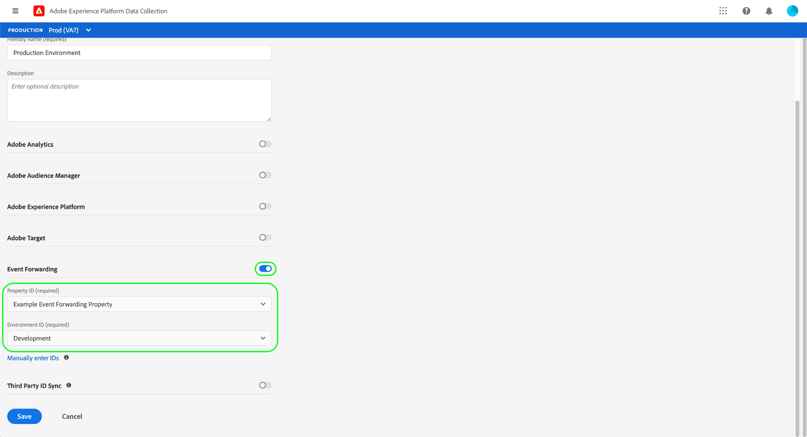

# Overzicht van end-to-end gegevensverzameling

In Adobe Experience Platform, verwijst de gegevensinzameling naar verscheidene technologieën die samenwerken om uw gegevens naar andere producten van de Adobe of derde bestemmingen over te brengen. Als u gebeurtenisgegevens van uw toepassing naar het Adobe Experience Platform Edge-netwerk wilt verzenden, is het belangrijk dat u deze kerntechnologieën begrijpt en weet hoe u ze configureert om uw gegevens te leveren aan de doelen die u nodig hebt, wanneer u deze nodig hebt.

Deze gids verstrekt een zelfstudie op hoog niveau van hoe te om een gebeurtenis door het Netwerk van de Rand te verzenden gebruikend de technologieën van de gegevensinzameling. Specifiek, loopt het leerprogramma door de stappen om de de marktextensie van SDK van het Web van Adobe Experience Platform binnen UI van de Inzameling van Gegevens te installeren en te vormen.

>[!NOTE]
>
>U kunt er ook voor kiezen om de SDK handmatig te installeren en te configureren als u geen tags wilt gebruiken, maar de omringende stappen moeten nog steeds worden uitgevoerd zoals hieronder wordt beschreven.

## Vereisten

Dit leerprogramma gebruikt UI van de Inzameling van Gegevens om een schema tot stand te brengen, een gegevensstroom te vormen, en SDK van het Web te installeren. Om deze acties in UI uit te voeren, moet u toegang tot minstens één Webbezit samen met de volgende [bezitsrechten](../tags/ui/administration/user-permissions.md#property-rights) worden verleend:

* Ontwikkelen
* Extensies beheren

Zie de gids op [het beheren van toestemmingen voor markeringen](../tags/ui/administration/manage-permissions.md) leren hoe te om toegang tot eigenschappen en bezitsrechten te verlenen.

Om de diverse producten van de Inzameling van Gegevens te gebruiken die in deze gids worden vermeld, moet u toegang tot gegevensstromen en de capaciteit ook hebben om schema&#39;s tot stand te brengen en te beheren. Als u toegang tot één van deze eigenschappen nodig hebt, gelieve uw CSM te contacteren om u te helpen de noodzakelijke toegang krijgen. Houd er rekening mee dat als u Adobe Experience Platform niet hebt aangeschaft, Adobe u zonder extra kosten toegang krijgt tot de SDK.

Als u reeds toegang tot Platform hebt, moet u ervoor zorgen dat u alle [toestemmingen](../access-control/home.md#permissions) onder de volgende toegelaten categorieën hebt:

* Gegevensmodellering
* Identiteiten

Zie [toegangsbeheer UI overzicht](../access-control/ui/overview.md) leren hoe te om toestemmingen voor Platform mogelijkheden aan gebruikers te verlenen.

## Procesoverzicht

Het configureren van Edge Network voor uw website kan als volgt worden samengevat:

1. [Creeer een ](#schema) schema bepalen hoe uw gegevens wanneer verzonden naar het Netwerk van de Rand zullen worden gestructureerd.
1. [Creeer een ](#datastream) gegevensstroom om te vormen welke bestemmingen u uw gegevens wilt worden verzonden naar.
1. [Installeer en vorm het Web ](#sdk) SDK om gegevens naar de gegevensstroom te verzenden wanneer bepaalde gebeurtenissen op uw website voorkomen.

Zodra u gegevens naar het Netwerk van de Rand kunt verzenden, kunt u naar keuze [gebeurtenis ook vormen door:sturen](#event-forwarding) als uw organisatie een vergunning voor het heeft.

## Een schema maken {#schema}

[Het Model van Gegevens van de ervaring (XDM)](../xdm/home.md) is een open-bronspecificatie die gemeenschappelijke structuren en definities voor gegevens in de vorm van schema&#39;s verstrekt. Met andere woorden, XDM is een manier om uw gegevens op een manier te structureren en te formatteren die door het Netwerk van de Rand en andere toepassingen van Adobe Experience Cloud kan actie ondernemen.

De eerste stap in vestiging uw verrichtingen van de gegevensinzameling is een schema te creëren XDM om uw gegevens te vertegenwoordigen. In een latere stap in deze zelfstudie wijst u de gegevens toe die u naar de structuur van dit schema wilt verzenden.

>[!NOTE]
>
>XDM-schema&#39;s zijn zeer aanpasbaar. In plaats van overdreven voorschrijvend te zijn, concentreren de hieronder geschetste stappen zich specifiek op de schemavereisten voor het Web SDK. Buiten deze parameters kunt u de resterende structuur van uw gegevens definiëren, hoe u dat ook wilt.

Selecteer **[!UICONTROL Schemas]** in de linkernavigatie in de UI voor gegevensverzameling. Van hier, kunt u een lijst van eerder gecreeerd schema&#39;s zien die tot uw organisatie behoren. Als u wilt doorgaan, selecteert u **[!UICONTROL Create schema]** en selecteert u **[!UICONTROL XDM ExperienceEvent]** in het vervolgkeuzemenu.

Er verschijnt een dialoogvenster waarin u wordt gevraagd veldgroepen aan het schema toe te voegen. Als u gebeurtenissen wilt verzenden met de SDK van het web, moet u de veldgroep **[!UICONTROL AEP Web SDK ExperienceEvent Mixin]** toevoegen. Deze gebiedsgroep bevat definities voor gegevensattributen die automatisch door de bibliotheek van SDK van het Web worden verzameld.

Gebruik de zoekbalk om de lijst te versmallen, zodat u deze veldgroep gemakkelijker kunt vinden. Nadat u deze hebt gevonden, selecteert u deze in de lijst voordat u **[!UICONTROL Add field groups]** selecteert.

Het schemacanvas verschijnt, tonend een boomstructuur van uw schema XDM met inbegrip van de gebieden die door de het gebiedsgroep van SDK van het Web worden verstrekt.

Selecteer het basisveld in de boomstructuur dat **[!UICONTROL Schema properties]** moet worden geopend in de rechtertrack. Hier kunt u een naam en een optionele beschrijving voor het schema opgeven.

Als u meer gebieden aan het schema wilt toevoegen, kunt u dit doen door **[!UICONTROL Add]** onder **[!UICONTROL Field groups]** sectie in de linkerspoorstaaf te selecteren.

>[!NOTE]
>
>Zie de handleiding op [het toevoegen van gebiedsgroepen](../xdm/ui/resources/schemas.md#add-field-groups) in de XDM documentatie voor gedetailleerde stappen op hoe te om naar verschillende gebiedsgroepen te zoeken om uw gebruiksgevallen aan te passen.
>
>De beste praktijken moeten slechts gebieden voor gegevens toevoegen u op het verzenden door het Netwerk van de Rand van plan bent. Nadat u velden hebt toegevoegd aan een schema en dit hebt opgeslagen, kunnen alleen aanvullende wijzigingen in het schema worden aangebracht. Zie de sectie over [regels van schemaevolutie](../xdm/schema/composition.md#evolution) voor meer informatie.

Nadat u de gewenste velden hebt toegevoegd, selecteert u **[!UICONTROL Save]** om het schema op te slaan.

## Een gegevensstroom maken {#datastream}

Een gegevensstroom is een configuratie die het Netwerk van de Rand vertelt waar u uw gegevens wilt worden verzonden. Specifiek, specificeert een gegevensstroom welke producten van Experience Cloud u de gegevens naar wilt verzenden, en hoe u de gegevens wilt worden behandeld en in elk product worden opgeslagen.

>[!NOTE]
>
>Als u [gebeurtenis wilt gebruiken door:sturen](../tags/ui/event-forwarding/overview.md) (veronderstellend uw organisatie voor de functionaliteit) vergunning heeft, moet u het voor een gegevensstroom op de zelfde manier toelaten dat u de producten van Adobe toelaat. Details over dit proces worden besproken in [latere sectie](#event-forwarding).

Selecteer **[!UICONTROL Datastreams]** in de UI voor gegevensverzameling. Van hier, kunt u een bestaande gegevensstroom van de lijst selecteren om uit te geven, of u kunt een nieuwe configuratie tot stand brengen door **[!UICONTROL New Datastream]** te selecteren.

De configuratievereisten voor een gegevensstroom hangen af van welke producten en mogelijkheden u gegevens naar verzendt. Voor gedetailleerde informatie over de configuratieopties voor elk product, verwijs naar [gegevensstromen overzicht](../edge/fundamentals/datastreams.md).

## De SDK van het Web installeren en configureren

Zodra u een schema en een gegevensstroom hebt gecreeerd, moet de volgende stap het Web SDK van het Platform installeren en vormen beginnen gegevens naar het Netwerk van de Rand te verzenden.

>[!NOTE]
>
>Deze sectie gebruikt de UI van de Inzameling van Gegevens om de de markeringsuitbreiding van SDK van het Web te vormen, maar u kunt het ook installeren en vormen gebruikend ruwe code in plaats daarvan. Raadpleeg de volgende hulplijnen voor meer informatie:
>
>* [De SDK installeren](../edge/fundamentals/installing-the-sdk.md)
>* [De SDK configureren](../edge/fundamentals/configuring-the-sdk.md)

>
>Merk ook op dat zelfs als u slechts gebeurtenis het door:sturen wilt gebruiken, u nog SDK moet installeren en vormen zoals die vóór het vormen gebeurtenis het door:sturen bij een [recentere stap](#event-forwarding) wordt beschreven.

Het proces kan als volgt worden samengevat:

1. [Installeer de SDK van Adobe Experience Platform Web op een tag-](#install-sdk) eigenschap om toegang te krijgen tot de mogelijkheden van de SDK.
1. [Maak een XDM Object-](#data-element) gegevenselement om variabelen op uw website toe te wijzen aan de structuur van het XDM-schema dat u eerder hebt gemaakt.
1. [Creeer een regel ](#rule) om SDK te vertellen wanneer het gegevens naar het Netwerk van de Rand zou moeten verzenden.
1. [Stel een bibliotheek samen en installeer deze ](#library) om de regel op uw website te implementeren.

### De SDK installeren op een tag-eigenschap {#install-sdk}

Selecteer **[!UICONTROL Tags]** in de linkernavigatie om een lijst van markeringseigenschappen te tonen. U kunt een bestaande eigenschap kiezen die u wilt bewerken, of u kunt **[!UICONTROL New Property]** selecteren.

Als u een nieuwe eigenschap maakt, geeft u een beschrijvende naam op en stelt u [!UICONTROL Platform] in op **[!UICONTROL Web]**. Geef het volledige domein voor de webeigenschap op en selecteer **[!UICONTROL Save]**.

De overzichtspagina voor de eigenschap wordt weergegeven. Van hier, selecteer **[!UICONTROL Extensions]** in de linkernavigatie, dan uitgezocht **[!UICONTROL Catalog]**. Zoek de lijst voor het Web SDK van het Platform (naar keuze gebruikend de onderzoeksbar om resultaten te beperken) en selecteer **[!UICONTROL Install]**.

De configuratiepagina voor de SDK wordt weergegeven. De meeste vereiste waarden worden automatisch ingevuld met standaardwaarden die u desgewenst kunt wijzigen.

Voordat u de SDK kunt installeren, moet u echter een gegevensstroom selecteren, zodat deze weet waarnaar de gegevens moeten worden verzonden. Onder **[!UICONTROL Datastreams]**, gebruik dropdown menu om de gegevensstroom te selecteren die u bij een [vroegere stap](#datastream) vormde. Nadat u de gegevensstroom hebt ingesteld, selecteert u **[!UICONTROL Save]** om de installatie van de SDK op de eigenschap te voltooien.

### Een XDM-gegevenselement maken {#data-element}

Opdat SDK gegevens naar het Netwerk van de Rand verzendt, moeten die gegevens aan het schema worden in kaart gebracht XDM u in een [vorige stap](#schema) creeerde. Deze toewijzing wordt verwezenlijkt door het gebruik van een gegevenselement.

Selecteer **[!UICONTROL Data Elements]** in de UI en selecteer **[!UICONTROL Create New Data Element]**.

Selecteer in het volgende scherm **[!UICONTROL Adobe Experience Platform Web SDK]** onder het vervolgkeuzemenu [!UICONTROL Extension] en selecteer **[!UICONTROL XDM object]** voor het elementtype data.

Het configuratiedialoogvenster wordt weergegeven voor het XDM-objecttype. Het dialoogvenster selecteert automatisch de sandbox van uw Platform en vanaf deze locatie ziet u alle schema&#39;s die in die sandbox zijn gemaakt. Selecteer het XDM-schema dat u eerder in de lijst hebt gemaakt.

De structuur van het schema wordt weergegeven. Alle velden met een sterretje (**\***) geven velden aan die automatisch worden gevuld wanneer gebeurtenissen worden gestart. Voor alle andere gebieden, kunt u de structuur van het schema onderzoeken en de rest gegevens invullen.

>[!NOTE]
>
>In de bovenstaande schermafbeelding ziet u hoe u een algemeen toegankelijke variabele van de clientzijde van uw website (`cartAbandonsTotal`) toewijst aan een XDM-veld door naar de naam ervan te verwijzen in het veld [!UICONTROL Value], omringd door percentagetekens (`%`).
>
>U kunt ook andere eerder gemaakte gegevenselementen gebruiken om deze velden te vullen. Zie de referentie over [gegevenselementen](../tags/ui/managing-resources/data-elements.md) in de tagdocumentatie voor meer informatie.

Nadat u de gegevens aan het schema hebt toegewezen, geeft u een naam voor het gegevenselement op voordat u **[!UICONTROL Save]** selecteert.

### Een regel maken

Nadat u het gegevenselement hebt opgeslagen, is de volgende stap een regel te creëren die het naar het Netwerk van de Rand zal verzenden wanneer een bepaalde gebeurtenis op uw website (zoals wanneer een klant een product aan een karretje toevoegt) voorkomt.

Als voorbeeld, toont deze sectie hoe te om een regel tot stand te brengen die zal teweegbrengen wanneer een klant een punt aan een karretje toevoegt. U kunt echter regels instellen voor vrijwel elke gebeurtenis die op uw website kan plaatsvinden.

Selecteer **[!UICONTROL Rules]** in de linkernavigatie, dan uitgezocht **[!UICONTROL Create New Rule]**.

Geef in het volgende scherm een naam voor de regel op. Van hier, is de volgende stap de gebeurtenis voor de regel (met andere woorden, wanneer de regel zal in brand steken). Selecteer **[!UICONTROL Add]** onder [!UICONTROL Events].

De pagina voor gebeurtenisconfiguratie wordt weergegeven. Als u een gebeurtenis wilt configureren, moet u eerst het gebeurtenistype selecteren. Gebeurtenistypen worden geleverd door extensies. Als u bijvoorbeeld een gebeurtenis &quot;form submit&quot; wilt instellen, selecteert u de extensie **[!UICONTROL Core]** en vervolgens het gebeurtenistype **[!UICONTROL Submit]** onder de categorie **[!UICONTROL Form]**. In het configuratievenster dat wordt weergegeven, kunt u de CSS-kiezer opgeven voor het formulier waarop u deze regel wilt toepassen.

>[!NOTE]
>
>Zie de [referentie voor Adobe-extensies](../tags/extensions/web/overview.md) in de tagdocumentatie voor meer informatie over de verschillende gebeurtenistypen die worden geleverd door Adobe-webextensies, inclusief hoe u deze kunt configureren.

Selecteer **[!UICONTROL Keep Changes]** om de gebeurtenis aan de regel toe te voegen.

De pagina voor regelconfiguratie wordt opnieuw weergegeven en toont dat de gebeurtenis is toegevoegd. U kunt onderaan &quot;[!UICONTROL If]&quot;versmallen door verdere voorwaarden aan de regel toe te voegen.

Anders, is de volgende stap een actie voor de regel toe te voegen om uit te voeren wanneer het brandt. Selecteer **[!UICONTROL Add]** onder **[!UICONTROL Actions]** om verder te gaan.

De pagina voor actieconfiguratie wordt weergegeven. Om de regel te krijgen om gegevens naar het Netwerk van de Rand te verzenden, selecteer **[!UICONTROL Adobe Experience Platform Web SDK]** voor de uitbreiding, en **[!UICONTROL Send event]** voor het actietype.

Het scherm wordt bijgewerkt om extra opties te tonen om de send gebeurtenisactie te vormen. Onder **[!UICONTROL Type]**, kunt u een waarde van het douanetype verstrekken om het `eventType` XDM gebied te bevolken. Geef onder **[!UICONTROL XDM data]** de naam op van het XDM-gegevenstype dat u eerder hebt gemaakt (omringd door percentagetekens) of selecteer het databasepictogram () om dit te selecteren in een lijst. Dit zijn de gegevens die uiteindelijk naar het Edge-netwerk worden verzonden.

Selecteer **[!UICONTROL Keep Changes]** wanneer gebeëindigd.

Nadat u de regel hebt geconfigureerd, selecteert u **[!UICONTROL Save]** om het proces te voltooien.

### Bibliotheek maken en installeren {#library}

Nadat de regel is gevormd, bent u bereid om het aan een markeringsbibliotheek toe te voegen, die bibliotheek aan een milieu te bouwen, en die bouwt op uw website te installeren.

>[!NOTE]
>
>Als u nog geen milieu in de Inzameling van Gegevens UI opstelling hebt, moet u dit doen alvorens u een bouwstijl kunt tot stand brengen. Zie de sectie over [het vormen van een milieu voor een Web-bezit](../tags/ui/publishing/environments.md#web-configuration) in de tagdocumentatie voor meer informatie.

Leer hoe te om een bibliotheek tot stand te brengen, uitbreidingen en regels aan de bibliotheek toe te voegen, en die bibliotheek aan een milieu te bouwen, zie de gids op [het beheren van bibliotheken](../tags/ui/publishing/libraries.md) in de tagdocumentatie. Wanneer u de bibliotheek creeert, zorg ervoor dat u de uitbreiding van SDK van het Web van het Platform en de regels van de gegevensinzameling omvat u eerder creeerde.

Nadat u de bibliotheek hebt gemaakt en de build ervan aan een omgeving is toegewezen, kunt u die omgeving op de client van uw website installeren. Zie het gedeelte over [het installeren van omgevingen](../tags/ui/publishing/environments.md#installation) voor meer informatie.

Nadat u de omgeving op uw website hebt geïnstalleerd, kunt u [de implementatie testen](../tags/ui/publishing/embed-code-testing.md) met Adobe Experience Platform Debugger.

## Gebeurtenis door:sturen configureren (optioneel) {#event-forwarding}

>[!NOTE]
>
>Het doorsturen van gebeurtenissen is alleen beschikbaar voor organisaties die hiervoor een licentie hebben gekregen.

Zodra u SDK hebt gevormd om gegevens naar het Netwerk van de Rand te verzenden, kunt u opstelling gebeurtenis door:sturen om het Netwerk van de Rand te vertellen waar u dat gegevens wilt worden geleverd.

Om gebeurtenis te gebruiken door:sturen, moet u eerst een gebeurtenis creëren door:sturen bezit. Selecteer **[!UICONTROL Event Forwarding]** in de linkernav en selecteer **[!UICONTROL New Property]**. Geef een naam voor de eigenschap op voordat u **[!UICONTROL Save]** selecteert.

Zodra u een gebeurtenis creeert die bezit door:sturen, moet de volgende stap een regel tot stand brengen die bepaalt waar de gegevens zouden moeten worden verzonden. De regels voor gebeurtenis die eigenschappen door:sturen worden geconstrueerd op ongeveer de zelfde manier zoals markeringseigenschappen, met uitzondering dat geen gebeurtenissen kunnen worden gespecificeerd (aangezien gebeurtenis die slechts gebeurtenissen door:sturen behandelt het direct van de datastream ontvangt). Voor de actie van de regel, kunt u gebruik maken van één van de beschikbare gebeurtenis die uitbreidingen door:sturen, of douanecode gebruiken om de gebeurtenis in plaats daarvan te leveren.

Gelijkaardig aan vroeger, zodra u de regel hebt gevormd, moet u het aan een bibliotheek toevoegen en die bibliotheek aan een milieu bouwen.

Nadat de bouwstijl volledig is, moet de definitieve stap de gegevensstroom bijwerken u [eerder gevormd ](#datastream) en gebeurtenis toelaten door:sturen. Navigeer naar **[!UICONTROL Datastreams]** en selecteer de desbetreffende gegevensstroom in de lijst om te beginnen. Van hier, laat knevel voor gebeurtenis toe door:sturen, en verstrek de namen van het bezit en het milieu dat u enkel vormde.

## Volgende stappen

Deze gids verstrekte een overzicht op hoog niveau van begin tot eind van hoe te om gegevens naar het Netwerk van de Rand te verzenden gebruikend het Web SDK van het Platform. Raadpleeg de documentatie bij deze handleiding voor meer informatie over de verschillende onderdelen en services in kwestie.
