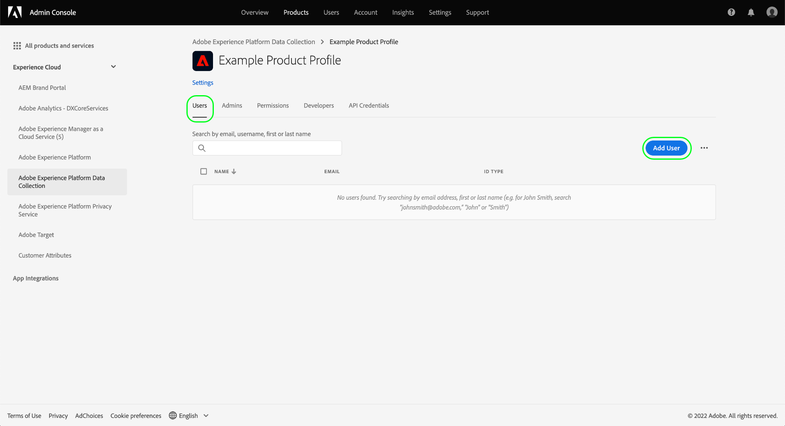

# Machtigingsbeheer voor gegevensverzameling in Experience Platform {#permission-management}

>[!CONTEXTUALHELP]
>id="platform_tags_permissions"
>title="Machtigingen"
>abstract="Begrijp de belangrijkste toestemmingen die voor het werken met gegevensstromen, schema&#39;s, identiteiten, en zandbakken binnen Adobe Experience Platform worden vereist."

[ de inzameling van Gegevens in Adobe Experience Platform ](./home.md) wordt samengesteld van verscheidene verschillende technologieën die samenwerken om uw gegevens te verzamelen en over te brengen. De toegang tot deze technologieën wordt gecontroleerd door granulaire op rol-gebaseerde toestemmingen in Adobe Admin Console.

Deze gids toont u hoe te om toestemmingen voor de eigenschappen van de gegevensinzameling te beheren.

## Aan de slag

Om toegangsbeheer voor gegevensinzameling te vormen, moet u beheerdervoorrechten voor een organisatie hebben die een productintegratie met de Inzameling van Gegevens van Adobe Experience Platform heeft. De minimumrol die toestemmingen kan verlenen of terugtrekken is de beheerder van het a **productprofiel**. Andere beheerderrollen die toestemmingen kunnen beheren zijn **productbeheerders** (kan alle profielen binnen een product beheren) en **systeembeheerders** (geen beperkingen). Zie het artikel op [ administratieve rollen ](https://helpx.adobe.com/nl/enterprise/using/admin-roles.html) in de het beleidsgids van de Onderneming van Adobe voor meer informatie.

In deze handleiding wordt ervan uitgegaan dat u bekend bent met de basisbeginselen van Admin Console, zoals productprofielen en hoe u productmachtigingen toekent aan individuele gebruikers en groepen. Voor meer informatie, zie de [ gebruikersgids van Admin Console ](https://helpx.adobe.com/nl/enterprise/using/admin-console.html).

## Beschikbare machtigingen

De relevante toestemmingen voor de Inzameling van Gegevens worden verstrekt door twee productaanwijzingen in Admin Console: **Adobe Experience Platform** en **de Inzameling van Gegevens van Adobe Experience Platform**. In de volgende secties worden de machtigingen beschreven die onder elk product worden verleend, en worden beschrijvingen gegeven van de specifieke mogelijkheden waartoe deze toegang verlenen.

### Adobe Experience Platform-machtigingen

De toestemmingen onder Adobe Experience Platform omvatten toegang tot gegevensstromen, identiteiten, schema&#39;s, en zandbakken. Voor stappen op hoe te om de toestemmingen van Adobe Experience Platform te vormen, zie de [ gebruikershandleiding van de toegangscontrole ](../access-control/ui/overview.md).

| Categorie | Machtiging | Beschrijving |
| --- | --- | --- |
| Sandboxes | (N.v.t.) | Afhankelijk van de [ zandbakken ](../sandboxes/home.md) die onder uw organisatie zijn gecreeerd, kunt u toegang tot elk van hen door deze toestemmingscategorie in Admin Console controleren. |
| Gegevensmodellering | Schema&#39;s beheren | Verleent de capaciteit om, [ schema&#39;s van de Gegevens van de Ervaring te bekijken tot stand te brengen en uit te geven (XDM) ](../xdm/home.md). |
| Gegevensmodellering | Schema&#39;s weergeven | Hiermee verleent u alleen-lezen toegang tot schema&#39;s. |
| Identity Management | Naamruimten beheren | Verleent de capaciteit om te bekijken, tot stand te brengen en uit te geven [ identiteit namespaces ](../identity-service/features/namespaces.md). |
| Identity Management | Identiteitsnaamruimten weergeven | Hiermee wordt alleen-lezen toegang verleend tot naamruimten. |
| Dataverzameling | Gegevensstromen beheren | Verleent de capaciteit om te bekijken, tot stand te brengen en uit te geven [ gegevensstromen ](../datastreams/overview.md). |
| Dataverzameling | Gegevensstromen weergeven | Biedt alleen-lezen toegang tot gegevensstreams. |

{style="table-layout:auto"}

### Machtigingen voor Adobe Experience Platform-gegevensverzameling

Machtigingen onder Adobe Experience Platform Data Collection beheren toegang tot tags en mogelijkheden voor het doorsturen van gebeurtenissen, waaronder eigenschappen, extensies en omgevingen. Voor stappen op hoe te om de toestemmingen van de Inzameling van Gegevens van Adobe Experience Platform te vormen, zie de [ hieronder sectie ](#manage).

| Categorie | Machtiging | Beschrijving |
| --- | --- | --- |
| Platforms | Web | Verleent toegang tot [ Webeigenschappen ](../tags/ui/administration/companies-and-properties.md) wanneer gecombineerd met andere bezitsrechten. |
| Platforms | Mobiel | Verleent toegang tot [ mobiele eigenschappen ](../tags/ui/administration/companies-and-properties.md) wanneer gecombineerd met andere bezitsrechten. |
| Platforms | Edge | Verleent toegang tot [ Gebeurtenis die de eigenschappen van Edge ](../tags/ui/event-forwarding/getting-started.md) door:sturen wanneer gecombineerd met andere bezitsrechten. |
| Properties | (N.v.t.) | Afhankelijk van de eigenschappen die onder uw organisatie zijn gecreeerd, kunt u toegang tot elk van hen controleren door deze toestemmingencategorie in Admin Console.   de toegewezen bezitsrechten van A gebruiker zijn slechts op de eigenschappen van toepassing zij toegang tot door deze toestemmingscategorie zijn verleend. |
| Eigendomsrechten | Goedkeuren | Verleent de capaciteit om een bibliotheek goed te keuren bouwt als deel van de [ het publiceren stroom ](../tags/ui/publishing/publishing-flow.md). |
| Eigendomsrechten | Ontwikkelen | Verleent de capaciteit om een bibliotheek te ontwikkelen bouwt als deel van de [ het publiceren stroom ](../tags/ui/publishing/publishing-flow.md). |
| Eigendomsrechten | Eigenschap bewerken | Biedt de mogelijkheid om de basisconfiguratie te bewerken voor de eigenschappen waartoe een gebruiker toegang heeft. |
| Eigendomsrechten | Omgevingen beheren | Verleent de capaciteit om de [ milieu&#39;s ](../tags/ui/publishing/environments.md) voor de eigenschappen te beheren een gebruiker heeft toegang tot. |
| Eigendomsrechten | Extensies beheren | Verleent de capaciteit om de [ uitbreidingen ](../tags/ui/managing-resources/extensions/overview.md) voor de eigenschappen te beheren een gebruiker heeft toegang tot. |
| Eigendomsrechten | Publiceren | Verleent de capaciteit om een bibliotheek te publiceren bouwt als deel van de [ het publiceren stroom ](../tags/ui/publishing/publishing-flow.md). |
| Bedrijfsrechten | Extensies ontwikkelen | Biedt de mogelijkheid extensiepakketten te maken en te wijzigen die eigendom zijn van uw organisatie, inclusief persoonlijke releases en verzoeken om openbare release. |
| Bedrijfsrechten | App Configurations beheren | Deze machtiging is alleen van toepassing als u een licentie voor Adobe Journey Optimizer hebt of een andere oplossing die toegang biedt tot mobiele berichten in de app en via pushberichten. Op deze manier kunt u de apps beheren die Adobe Experience Cloud kent, samen met de vereiste pushgegevens die nodig zijn om te communiceren met de Firebase Cloud Messaging-service en de Apple Push Notification-service. |
| Bedrijfsrechten | Eigenschappen beheren | Hiermee kunt u tags (webeigenschap), gebeurtenissen doorsturen (eigenschap edge) en mobiele eigenschappen maken en beheren. |

{style="table-layout:auto"}

>[!NOTE]
>
>Voor meer informatie over hoe deze toestemmingen mogelijkheden in markeringen beïnvloeden, met inbegrip van beleidsstrategieën voor gemeenschappelijke scenario&#39;s, zie de codedocumentatie op [ gebruikerstoestemmingen ](../tags/ui/administration/user-permissions.md).

## Machtigingen beheren {#manage}

De toestemmingen voor gegevensinzameling worden beheerd door twee productbenamingen: **Adobe Experience Platform** en **de Inzameling van Gegevens van Adobe Experience Platform**.

Raadpleeg de onderstaande subsecties voor informatie over het beheren van de relevante rechten onder elk product in Admin Console:

* [Adobe Experience Platform-machtigingen](#manage-platform)
* [Machtigingen voor Adobe Experience Platform-gegevensverzameling](#manage-collection)

### Rechten beheren onder Adobe Experience Platform {#manage-platform}

>[!NOTE]
>
>Om toestemmingen voor een rol te beheren, zult u beheerderrechten vereisen. Neem contact op met de systeembeheerder als u geen beheerdersrechten hebt.

In de sectie Experience Cloud **[!UICONTROL Permissions]** kunt u gebruikersrollen en beleid definiëren voor het beheren van de toegang voor functies en objecten in een producttoepassing.

Via [!UICONTROL Permissions] kunt u rollen maken en beheren en de gewenste resourcemachtigingen voor deze rollen toewijzen.

Als u toegang wilt tot functies voor gegevensverzameling, moet u alle machtigingen inschakelen in de categorieën **[!UICONTROL Sandboxes]** , **[!UICONTROL Data Modeling]** , **[!UICONTROL Identity Management]** en **[!UICONTROL Data Collection]** .

Zie de [ gids van de toegangscontrole UI ](../access-control/ui/overview.md) voor gedetailleerde instructies bij het beheren van de toestemmingen van Experience Platform.

>[!NOTE]
>
>Afhankelijk van de product-SKU&#39;s waartoe uw organisatie toegang heeft, beschikt u mogelijk niet over alle Experience Platform-machtigingen die voor u beschikbaar zijn.

### Rechten beheren in Adobe Experience Platform Data Collection {#manage-collection}

Als u deze machtigingen wilt beheren, meldt u zich aan bij Admin Console en selecteert u **[!UICONTROL Products]** in de bovenste navigatie en selecteert u vervolgens **[!UICONTROL Adobe Experience Platform Data Collection]** .

#### Een productprofiel selecteren of maken

In het volgende scherm ziet u een lijst met beschikbare productprofielen voor gegevensverzameling onder uw organisatie. Het standaardprofiel is **[!DNL Default Data Collection All Access]** . U kunt desgewenst het standaardproductprofiel bewerken of u kunt **[!UICONTROL New Profile]** selecteren om een profiel te maken. Als u veelvoudige rollen of gebruikersgroepen in uw organisatie hebt die verschillende niveaus van toegang vereisen, zou u een afzonderlijk productprofiel voor elk van hen moeten creëren.

Na het selecteren van of het creëren van een productprofiel, kunt u de **[!UICONTROL Edit]** pictogrammen gebruiken om [ het uitgeven toestemmingen ](#edit-permissions) voor het profiel te beginnen, of het **[!UICONTROL Users]** lusje te selecteren om [ te beginnen toewijzend gebruikers ](#assign-users) aan het profiel.

#### Machtigingen voor het productprofiel bewerken {#edit-permissions}

Wanneer u machtigingen voor een profiel bewerkt, worden in de linkerkolom de beschikbare machtigingen vermeld, terwijl de machtigingen die in het profiel zijn opgenomen in de rechterkolom worden weergegeven. Selecteer de vermelde toestemmingen om hen tussen één van beide kolom te bewegen.

Machtigingen zijn ingedeeld in categorieën. Als u wilt schakelen tussen categorieën, selecteert u de gewenste categorie in de linkernavigatie.

Selecteer **[!UICONTROL Save]** nadat u de machtigingen hebt geconfigureerd.

De weergave van het productprofiel wordt opnieuw weergegeven met de toegevoegde machtigingen weergegeven.

 toont

#### Gebruikers toewijzen aan het productprofiel {#assign-users}

Als u gebruikers wilt toewijzen aan het productprofiel (en hun de geconfigureerde machtigingen van het profiel wilt verlenen), selecteert u het tabblad **[!UICONTROL Users]** , gevolgd door **[!UICONTROL Add user]** .

Voor meer informatie bij het beheren van gebruikers voor een productprofiel, zie de [ documentatie van Admin Console ](https://helpx.adobe.com/nl/enterprise/using/manage-product-profiles.html).

## Volgende stappen

Deze gids behandelde de beschikbare toestemmingen voor de Inzameling van Gegevens en hoe te om hen door Admin Console te beheren. Voor meer informatie bij het beheren van toestemmingen voor andere mogelijkheden van Adobe Experience Platform, verwijs naar de [ documentatie van de toegangscontrole ](../access-control/home.md).
