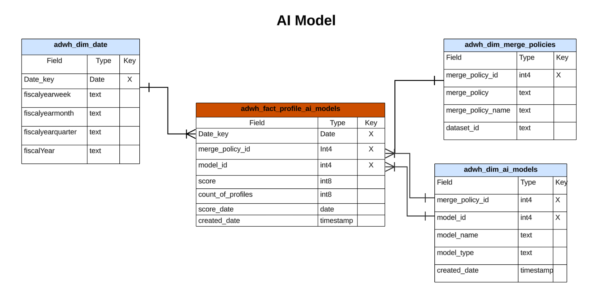

# Real-time Customer Data Platform Insights-gegevensmodel

De functie Real-time Customer Data Platform Insights Data Model stelt de gegevensmodellen en SQL beschikbaar die de inzichten voor verschillende profiel-, doel- en segmentatiewidgets kracht geven. U kunt deze SQL vraagmalplaatjes aanpassen om de rapporten van Real-Time CDP voor uw marketing en belangrijkste het gebruiksgevallen van de prestatiesindicator (KPI) tot stand te brengen. Deze inzichten kunnen dan als douanewidgets voor uw user-defined dashboards worden gebruikt. Zie de vraag versnelde opslag die inzichten documentatie rapporteert om te leren [hoe te om een rapporterend gegevensmodel van inzichten door de Dienst van de Vraag voor gebruik met versnelde opslaggegevens en user-defined dashboards te bouwen](../query-service/data-distiller/customizable-insights/reporting-insights-data-model.md).

>[!NOTE]
>
>De term &#39;segment&#39; is bijgewerkt naar &#39;publiek&#39; in Adobe Experience Platform-systemen. Sommige verwijzingen naar segmenten blijven in gebruik voor bestandspaden en naamgevingsconventies voor gegevenssets.

## Vereisten

Deze handleiding vereist een goed begrip van de [door de gebruiker gedefinieerde dashboardfunctie](./user-defined-dashboards.md). Lees de documentatie voordat u verdergaat met deze handleiding.

## Real-Time CDP inzichtsrapporten en gebruiksgevallen

Rapportering door Real-Time CDP biedt inzicht in uw profielgegevens en de relatie ervan met doelgroepen en doelgroepen. Er zijn verschillende sterschemamodellen ontwikkeld om een aantal veelvoorkomende gevallen van marketinggebruik te beantwoorden en elk gegevensmodel kan meerdere gebruiksgevallen ondersteunen.

>[!IMPORTANT]
>
>De gegevens die worden gebruikt voor Real-Time CDP-rapportage zijn nauwkeurig voor een gekozen samenvoegingsbeleid en van de meest recente dagelijkse momentopname.

### Profielmodel {#profile-model}

Het profielmodel bestaat uit drie datasets:

- `adwh_dim_date`
- `adwh_fact_profile`
- `adwh_dim_merge_policies`

De afbeelding hieronder bevat de relevante gegevensvelden in elke gegevensset.


#### Het gebruikte hoofdlettergebruik voor het aantal profielen {#profile-count}

De logica die wordt gebruikt voor de [!UICONTROL Profile count] widget retourneert het totale aantal samengevoegde profielen in de profielopslag op het moment dat de momentopname werd gemaakt. Zie de [[!UICONTROL Profile count] widget-documentatie](./guides/profiles.md#profile-count) voor meer informatie .

De SQL die de [!UICONTROL Profile count] De widget wordt weergegeven in de sectie hieronder die kan worden samengevouwen.

+++SQL-query

```sql
SELECT qsaccel.profile_agg.adwh_dim_merge_policies.merge_policy_name,
       sum(qsaccel.profile_agg.adwh_fact_profile.count_of_profiles) CNT
  FROM qsaccel.profile_agg.adwh_fact_profile
  LEFT OUTER JOIN qsaccel.profile_agg.adwh_dim_merge_policies ON qsaccel.profile_agg.adwh_dim_merge_policies.merge_policy_id=adwh_fact_profile.merge_policy_id
  WHERE qsaccel.profile_agg.adwh_fact_profile.date_key='2024-01-10'
    AND qsaccel.profile_agg.adwh_fact_profile.merge_policy_id = 2027892989
  GROUP BY qsaccel.profile_agg.adwh_dim_merge_policies.merge_policy_name;
```

+++

#### Het gebruik van hoofdletters en kleine letters in één identiteitsprofiel {#single-identity-profiles}

De logica die wordt gebruikt voor de [!UICONTROL Single identity profiles] widget bevat een aantal profielen van uw organisatie die slechts één type id hebben waarmee hun identiteit wordt gemaakt. Zie de[[!UICONTROL Single identity profiles] widget-documentatie](./guides/profiles.md#single-identity-profiles) voor meer informatie .

De SQL die de [!UICONTROL Single identity profiles] De widget wordt weergegeven in de sectie hieronder die kan worden samengevouwen.

+++SQL-query

```sql
SELECT qsaccel.profile_agg.adwh_dim_merge_policies.merge_policy_name,
       sum(qsaccel.profile_agg.adwh_fact_profile.count_of_Single_Identity_profiles) CNT
  FROM qsaccel.profile_agg.adwh_fact_profile
  LEFT OUTER JOIN qsaccel.profile_agg.adwh_dim_merge_policies ON qsaccel.profile_agg.adwh_dim_merge_policies.merge_policy_id=adwh_fact_profile.merge_policy_id
  WHERE qsaccel.profile_agg.adwh_fact_profile.date_key='2024-01-10'
    AND qsaccel.profile_agg.adwh_fact_profile.merge_policy_id = 2027892989
  GROUP BY qsaccel.profile_agg.adwh_dim_merge_policies.merge_policy_name;
```

+++

### Namespace-model {#namespace-model}

Het naamruimtemodel bestaat uit de volgende gegevenssets:

- `adwh_dim_date`
- `adwh_fact_profile_by_namespace`
- `adwh_dim_merge_policies`
- `adwh_dim_namespaces`

De afbeelding hieronder bevat de relevante gegevensvelden in elke gegevensset.


#### Profielen op basis van hoofdlettergebruik {#profiles-by-identity}

De [!UICONTROL Profiles by identity] widget geeft de indeling van de identiteiten in alle samengevoegde profielen in uw profielarchief weer. Zie de [[!UICONTROL Profiles by identity] widget-documentatie](./guides/profiles.md#profiles-by-identity) voor meer informatie .

De SQL die de [!UICONTROL Profiles by identity] De widget wordt weergegeven in de sectie hieronder die kan worden samengevouwen.

+++SQL-query

```sql
SELECT qsaccel.profile_agg.adwh_dim_namespaces.namespace_description,
        sum(qsaccel.profile_agg.adwh_fact_profile_by_namespace_trendlines.count_of_profiles) count_of_profiles
  FROM qsaccel.profile_agg.adwh_fact_profile_by_namespace_trendlines
  LEFT OUTER JOIN qsaccel.profile_agg.adwh_dim_namespaces ON qsaccel.profile_agg.adwh_fact_profile_by_namespace_trendlines.namespace_id = qsaccel.profile_agg.adwh_dim_namespaces.namespace_id
  AND qsaccel.profile_agg.adwh_fact_profile_by_namespace_trendlines.merge_policy_id = qsaccel.profile_agg.adwh_dim_namespaces.merge_policy_id
  WHERE qsaccel.profile_agg.adwh_fact_profile_by_namespace_trendlines.merge_policy_id = 2027892989
    AND qsaccel.profile_agg.adwh_fact_profile_by_namespace_trendlines.date_key = '2024-01-10'
  GROUP BY qsaccel.profile_agg.adwh_fact_profile_by_namespace_trendlines.date_key,
          qsaccel.profile_agg.adwh_fact_profile_by_namespace_trendlines.merge_policy_id,
          qsaccel.profile_agg.adwh_dim_namespaces.namespace_description
  ORDER BY count_of_profiles DESC;
```

+++

#### Individuele identiteitsprofielen per geval van identiteitsgebruik {#single-identity-profiles-by-identity}

De logica die wordt gebruikt voor de [!UICONTROL Single identity profiles by identity] widget illustreert het totale aantal profielen dat met slechts één unieke id wordt geïdentificeerd. Zie de [Eén identiteitsprofiel op basis van documentatie voor een identiteitswidget](./guides/profiles.md#single-identity-profiles-by-identity) voor meer informatie .

De SQL die de [!UICONTROL Single identity profiles by identity] De widget wordt weergegeven in de sectie hieronder die kan worden samengevouwen.

+++SQL-query

```sql
SELECT qsaccel.profile_agg.adwh_dim_namespaces.namespace_description,
        sum(qsaccel.profile_agg.adwh_fact_profile_by_namespace_trendlines.count_of_Single_Identity_profiles) count_of_Single_Identity_profiles
  FROM qsaccel.profile_agg.adwh_fact_profile_by_namespace_trendlines
  LEFT OUTER JOIN qsaccel.profile_agg.adwh_dim_namespaces ON qsaccel.profile_agg.adwh_fact_profile_by_namespace_trendlines.namespace_id = qsaccel.profile_agg.adwh_dim_namespaces.namespace_id
  AND qsaccel.profile_agg.adwh_fact_profile_by_namespace_trendlines.merge_policy_id = qsaccel.profile_agg.adwh_dim_namespaces.merge_policy_id
  WHERE qsaccel.profile_agg.adwh_fact_profile_by_namespace_trendlines.merge_policy_id = 2027892989
    AND qsaccel.profile_agg.adwh_fact_profile_by_namespace_trendlines.date_key = '2024-01-10'
  GROUP BY qsaccel.profile_agg.adwh_fact_profile_by_namespace_trendlines.date_key,
          qsaccel.profile_agg.adwh_fact_profile_by_namespace_trendlines.merge_policy_id,
          qsaccel.profile_agg.adwh_dim_namespaces.namespace_description;
```

+++

### Auditiemodel {#audience-model}

Het publieksmodel bestaat uit de volgende datasets:

- `adwh_dim_date`
- `adwh_fact_profile_by_segment`
- `adwh_dim_merge_policies`
- `adwh_dim_segments`
- `adwh_dim_br_segment_destinations`
- `adwh_dim_destination`
- `adwh_dim_destination_platform`

De afbeelding hieronder bevat de relevante gegevensvelden in elke gegevensset.


#### Gebruiksscenario voor grootte publiek {#audience-size}

De logica die wordt gebruikt voor de [!UICONTROL Audience size] widget retourneert het totale aantal samengevoegde profielen in het geselecteerde publiek op het moment van de meest recente opname. Zie de [[!UICONTROL Audience size] widget-documentatie](./guides/audiences.md#audience-size) voor meer informatie .

De SQL die de [!UICONTROL Audience size] De widget wordt weergegeven in de sectie hieronder die kan worden samengevouwen.

+++SQL-query

```sql
SELECT
  sum(
    qsaccel.profile_agg.adwh_fact_profile_by_segment_trendlines.count_of_profiles
  ) count_of_profiles
FROM
  qsaccel.profile_agg.adwh_fact_profile_by_segment_trendlines
  LEFT OUTER JOIN qsaccel.profile_agg.adwh_dim_segments ON qsaccel.profile_agg.adwh_fact_profile_by_segment_trendlines.segment_id = qsaccel.profile_agg.adwh_dim_segments.segment_id
WHERE
  qsaccel.profile_agg.adwh_fact_profile_by_segment_trendlines.segment_id = -1323307941
  AND qsaccel.profile_agg.adwh_fact_profile_by_segment_trendlines.merge_policy_id = 1914917902
  AND qsaccel.profile_agg.adwh_fact_profile_by_segment_trendlines.date_key = '2024-01-12';
```

+++

#### Omvang van het publiek omwenteling trend gebruikscase {#audience-size-change-trend}

De logica die wordt gebruikt voor de [!UICONTROL Audience size change trend] widget geeft een lijngrafiekillustratie van het verschil tussen de meest recente dagelijkse momentopnamen in het totale aantal profielen dat voor een bepaald publiek is gekwalificeerd . Zie de [[!UICONTROL Audience size change trend] widget-documentatie](./guides/audiences.md#audience-size-change-trend) voor meer informatie .

De SQL die de [!UICONTROL Audience size change trend] De widget wordt weergegeven in de sectie hieronder die kan worden samengevouwen.

+++SQL-query

```sql
SELECT date_key,
      Profiles_added
  FROM
    (SELECT rn_num,
            date_key,
            (count_of_profiles-lag(count_of_profiles, 1, 0) over(
                                                                ORDER BY date_key))Profiles_added
    FROM
      (SELECT date_key,
              sum(x.count_of_profiles)count_of_profiles,
              row_number() OVER (
                                  ORDER BY date_key) rn_num
        FROM qsaccel.profile_agg.adwh_fact_profile_by_segment_trendlines x
        INNER JOIN
          (SELECT MAX(process_date) last_process_date,
                  merge_policy_id
          FROM qsaccel.profile_agg.adwh_lkup_process_delta_log
          WHERE process_name = 'FACT_TABLES_PROCESSING'
            AND process_status = 'SUCCESSFUL'
          GROUP BY merge_policy_id) y ON x.merge_policy_id = y.merge_policy_id
        WHERE segment_id = 1333234510
          AND x.date_key >= dateadd(DAY, -30 -1, y.last_process_date)
        GROUP BY x.date_key) a)b
  WHERE rn_num > 1;
```

+++

#### De meeste gebruikte bestemmingen gebruiken case {#most-used-destinations}

De logica die wordt gebruikt in de [!UICONTROL Most used destinations] widget geeft een overzicht van de meest gebruikte doelen van uw organisatie op basis van het aantal soorten publiek dat aan hen is toegewezen. Deze rangschikking biedt inzicht in welke bestemmingen worden gebruikt en toont mogelijk ook de bestemmingen die mogelijk onderbenut zijn. Zie de documentatie op de [[!UICONTROL Most used destinations] widget](./guides/destinations.md#most-used-destinations) voor meer informatie .

De SQL die de [!UICONTROL Most used destinations] De widget wordt weergegeven in de sectie hieronder die kan worden samengevouwen.

+++SQL-query

```sql
SELECT qsaccel.profile_agg.adwh_dim_destination.destination_name,
       qsaccel.profile_agg.adwh_dim_destination.destination_id,
       qsaccel.profile_agg.adwh_dim_destination.destination,
       count(DISTINCT qsaccel.profile_agg.adwh_dim_br_segment_destinations.segment_id) segment_count
  FROM qsaccel.profile_agg.adwh_dim_destination
  JOIN qsaccel.profile_agg.adwh_dim_br_segment_destinations ON qsaccel.profile_agg.adwh_dim_destination.destination_id = qsaccel.profile_agg.adwh_dim_br_segment_destinations.destination_id
  WHERE qsaccel.profile_agg.adwh_dim_destination.destination_name IS NOT NULL
  GROUP BY qsaccel.profile_agg.adwh_dim_destination.destination_name,
           qsaccel.profile_agg.adwh_dim_destination.destination,
           qsaccel.profile_agg.adwh_dim_destination.destination_id
  ORDER BY segment_count DESC
  LIMIT 20;
```

+++

#### Recentelijk geactiveerd publiek gebruikt draagtas {#recently-activated-audiences}

De logica voor de [!UICONTROL Recently activated audiences] widget bevat een lijst met de soorten publiek die het laatst aan een doel zijn toegewezen. Deze lijst verstrekt een momentopname van het publiek en de bestemmingen die actief in gebruik in het systeem zijn en in het oplossen van problemen kunnen helpen om het even welke onjuiste afbeeldingen. Zie de [[!UICONTROL Recently activated audiences] widget-documentatie](./guides/destinations.md#recently-activated-audiences) voor meer informatie .

De SQL die de [!UICONTROL Recently activated audiences] De widget wordt weergegeven in de sectie hieronder die kan worden samengevouwen.

+++SQL-query

```sql
SELECT
  segment_name,
  segment,
  destination_name,
  a.create_time create_time
FROM
  qsaccel.profile_agg.adwh_dim_br_segment_destinations a
  INNER JOIN qsaccel.profile_agg.adwh_dim_segments b ON a.segment_id = b.segment_id
  INNER JOIN qsaccel.profile_agg.adwh_dim_destination c ON a.destination_id = c.destination_id
ORDER BY
  create_time DESC,
  segment
LIMIT
  20;
```

+++

### Naamruimte-publieksmodel {#namespace-audience-model}

Het namespace-publiek model wordt samengesteld uit de volgende datasets:

- `adwh_dim_date`
- `adwh_dim_namespaces`
- `adwh_fact_profile_by_segment_and_namespace`
- `adwh_dim_merge_policies`
- `adwh_dim_segments`
- `adwh_dim_br_segment_destinations`
- `adwh_dim_destination`
- `adwh_dim_destination_platform`

De afbeelding hieronder bevat de relevante gegevensvelden in elke gegevensset.


#### Profielen op identiteit voor gebruik van hoofdletters voor een publiek {#audience-profiles-by-identity}

De logica die wordt gebruikt in de [!UICONTROL Profiles by identity] widget geeft een overzicht van de identiteiten in alle samengevoegde profielen in uw profielenarchief voor een bepaald publiek. Zie de [[!UICONTROL Profiles by identity] widget-documentatie](./guides/audiences.md#profiles-by-identity) voor meer informatie .

De SQL die de [!UICONTROL Profiles by identity] De widget wordt weergegeven in de sectie hieronder die kan worden samengevouwen.

+++SQL-query

```sql
SELECT qsaccel.profile_agg.adwh_dim_namespaces.namespace_description,
        sum(qsaccel.profile_agg.adwh_fact_profile_by_segment_and_namespace_trendlines.count_of_profiles) count_of_profiles
  FROM qsaccel.profile_agg.adwh_fact_profile_by_segment_and_namespace_trendlines
  LEFT OUTER JOIN qsaccel.profile_agg.adwh_dim_namespaces ON qsaccel.profile_agg.adwh_fact_profile_by_segment_and_namespace_trendlines.namespace_id = qsaccel.profile_agg.adwh_dim_namespaces.namespace_id
  AND qsaccel.profile_agg.adwh_fact_profile_by_segment_and_namespace_trendlines.merge_policy_id = qsaccel.profile_agg.adwh_dim_namespaces.merge_policy_id
  WHERE qsaccel.profile_agg.adwh_fact_profile_by_segment_and_namespace_trendlines.segment_id = 1333234510
    AND qsaccel.profile_agg.adwh_fact_profile_by_segment_and_namespace_trendlines.merge_policy_id = 1709997014
    AND qsaccel.profile_agg.adwh_fact_profile_by_segment_and_namespace_trendlines.date_key = '2024-01-10'
  GROUP BY qsaccel.profile_agg.adwh_dim_namespaces.namespace_description
  ORDER BY count_of_profiles DESC;
```

+++

### Naamruimtemodel overlappen

Het model van overlappende naamruimte bestaat uit de volgende gegevenssets:

- `adwh_dim_date`
- `adwh_dim_overlap_namespaces`
- `adwh_fact_profile_overlap_of_namespace`
- `adwh_dim_merge_policies`

De afbeelding hieronder bevat de relevante gegevensvelden in elke gegevensset.


#### Identiteitsoverlapping (profielen) gebruikt hoofdletters/kleine letters {#profiles-identity-overlap}

De logica die wordt gebruikt in de [!UICONTROL Identity overlap] widget geeft de overlapping van profielen in uw **Profielopslag** die de twee geselecteerde identiteiten bevatten. Zie de klasse [[!UICONTROL Identity overlap] widgetsectie van het dialoogvenster [!UICONTROL Profiles] dashboarddocumentatie](./guides/profiles.md#identity-overlap).

De SQL die de [!UICONTROL Identity overlap] De widget wordt weergegeven in de sectie hieronder die kan worden samengevouwen.

+++SQL-query

```sql
SELECT Sum(overlap_col1) overlap_col1,
        Sum(overlap_col2) overlap_col2,
        coalesce(Sum(overlap_count), 0) overlap_count
  FROM
    (SELECT 0 overlap_col1,
            0 overlap_col2,
            Sum(count_of_profiles) overlap_count
    FROM qsaccel.profile_agg.adwh_fact_profile_overlap_of_namespace
    WHERE qsaccel.profile_agg.adwh_fact_profile_overlap_of_namespace.merge_policy_id = 2027892989
      AND qsaccel.profile_agg.adwh_fact_profile_overlap_of_namespace.date_key = '2024-01-10'
      AND qsaccel.profile_agg.adwh_fact_profile_overlap_of_namespace.overlap_id IN
        (SELECT a.overlap_id
          FROM
            (SELECT qsaccel.profile_agg.adwh_dim_overlap_namespaces.overlap_id overlap_id,
                    count(*) cnt_num
            FROM qsaccel.profile_agg.adwh_dim_overlap_namespaces
            WHERE qsaccel.profile_agg.adwh_dim_overlap_namespaces.merge_policy_id = 2027892989
              AND qsaccel.profile_agg.adwh_dim_overlap_namespaces.overlap_namespaces in ('avid',
                                                                                          'crmid')
            GROUP BY qsaccel.profile_agg.adwh_dim_overlap_namespaces.overlap_id)a
          WHERE a.cnt_num>1 )
    UNION ALL SELECT count_of_profiles overlap_col1,
                      0 overlap_col2,
                      0 overlap_count
    FROM qsaccel.profile_agg.adwh_fact_profile_by_namespace_trendlines
    JOIN qsaccel.profile_agg.adwh_dim_namespaces ON qsaccel.profile_agg.adwh_fact_profile_by_namespace_trendlines.namespace_id = qsaccel.profile_agg.adwh_dim_namespaces.namespace_id
    AND qsaccel.profile_agg.adwh_fact_profile_by_namespace_trendlines.merge_policy_id = qsaccel.profile_agg.adwh_dim_namespaces.merge_policy_id
    WHERE qsaccel.profile_agg.adwh_fact_profile_by_namespace_trendlines.merge_policy_id = 2027892989
      AND qsaccel.profile_agg.adwh_fact_profile_by_namespace_trendlines.date_key = '2024-01-10'
      AND qsaccel.profile_agg.adwh_dim_namespaces.namespace_description = 'avid'
    UNION ALL SELECT 0 overlap_col1,
                      count_of_profiles overlap_col2,
                      0 Overlap_count
    FROM qsaccel.profile_agg.adwh_fact_profile_by_namespace_trendlines
    JOIN qsaccel.profile_agg.adwh_dim_namespaces ON qsaccel.profile_agg.adwh_fact_profile_by_namespace_trendlines.namespace_id = qsaccel.profile_agg.adwh_dim_namespaces.namespace_id
    AND qsaccel.profile_agg.adwh_fact_profile_by_namespace_trendlines.merge_policy_id = qsaccel.profile_agg.adwh_dim_namespaces.merge_policy_id
    WHERE qsaccel.profile_agg.adwh_fact_profile_by_namespace_trendlines.merge_policy_id = 2027892989
      AND qsaccel.profile_agg.adwh_fact_profile_by_namespace_trendlines.date_key = '2024-01-10'
      AND qsaccel.profile_agg.adwh_dim_namespaces.namespace_description = 'crmid' )a;
```

+++

### Naamruimte door publieksmodel overlappen {#overlap-namespace-by-audience-model}

De overlappende naamruimte door het publieksmodel bestaat uit de volgende datasets:

- `adwh_dim_date`
- `adwh_dim_overlap_namespaces`
- `adwh_fact_profile_overlap_of_namespace_by_segment`
- `adwh_dim_merge_policies`
- `adwh_dim_segments`
- `adwh_dim_br_segment_destinations`
- `adwh_dim_destination`
- `adwh_dim_destination_platform`

De afbeelding hieronder bevat de relevante gegevensvelden in elke gegevensset.


#### Identiteitsoverlapping (publiek) gebruikt hoofdletters/kleine letters {#audiences-identity-overlap}

De logica die wordt gebruikt in de [!UICONTROL Audiences] dashboard [!UICONTROL Identity overlap] widget illustreert de overlapping van profielen die de twee geselecteerde identiteiten voor een bepaald publiek bevatten. Zie de klasse [[!UICONTROL Identity overlap] widgetsectie van het dialoogvenster [!UICONTROL Audiences] dashboarddocumentatie](./guides/audiences.md#identity-overlap).

De SQL die de [!UICONTROL Identity overlap] De widget wordt weergegeven in de sectie hieronder die kan worden samengevouwen.

+++SQL-query

```sql
SELECT Sum(overlap_col1) overlap_col1,
        Sum(overlap_col2) overlap_col2,
        Sum(overlap_count) Overlap_count
  FROM
    (SELECT 0 overlap_col1,
            0 overlap_col2,
            Sum(count_of_profiles) Overlap_count
    FROM qsaccel.profile_agg.adwh_fact_profile_overlap_of_namespace_by_segment
    WHERE qsaccel.profile_agg.adwh_fact_profile_overlap_of_namespace_by_segment.segment_id = 1333234510
      AND qsaccel.profile_agg.adwh_fact_profile_overlap_of_namespace_by_segment.merge_policy_id = 1709997014
      AND qsaccel.profile_agg.adwh_fact_profile_overlap_of_namespace_by_segment.date_key = '2024-01-10'
      AND qsaccel.profile_agg.adwh_fact_profile_overlap_of_namespace_by_segment.overlap_id IN
        (SELECT a.overlap_id
          FROM
            (SELECT qsaccel.profile_agg.adwh_dim_overlap_namespaces.overlap_id overlap_id,
                    count(*) cnt_num
            FROM qsaccel.profile_agg.adwh_dim_overlap_namespaces
            WHERE qsaccel.profile_agg.adwh_dim_overlap_namespaces.merge_policy_id = 1709997014
              AND qsaccel.profile_agg.adwh_dim_overlap_namespaces.overlap_namespaces in ('crmid',
                                                                                          'email')
            GROUP BY qsaccel.profile_agg.adwh_dim_overlap_namespaces.overlap_id)a
          WHERE a.cnt_num>1 )
    UNION ALL SELECT count_of_profiles overlap_col1,
                      0 overlap_col2,
                      0 Overlap_count
    FROM qsaccel.profile_agg.adwh_fact_profile_by_segment_and_namespace_trendlines
    LEFT OUTER JOIN qsaccel.profile_agg.adwh_dim_namespaces ON qsaccel.profile_agg.adwh_fact_profile_by_segment_and_namespace_trendlines.namespace_id = qsaccel.profile_agg.adwh_dim_namespaces.namespace_id
    AND qsaccel.profile_agg.adwh_fact_profile_by_segment_and_namespace_trendlines.merge_policy_id = qsaccel.profile_agg.adwh_dim_namespaces.merge_policy_id
    WHERE qsaccel.profile_agg.adwh_dim_namespaces.namespace_description = 'crmid'
      AND qsaccel.profile_agg.adwh_fact_profile_by_segment_and_namespace_trendlines.segment_id = 1333234510
      AND qsaccel.profile_agg.adwh_fact_profile_by_segment_and_namespace_trendlines.merge_policy_id = 1709997014
      AND qsaccel.profile_agg.adwh_fact_profile_by_segment_and_namespace_trendlines.date_key = '2024-01-10'
    UNION ALL SELECT 0 overlap_col1,
                      count_of_profiles overlap_col2,
                      0 Overlap_count
    FROM qsaccel.profile_agg.adwh_fact_profile_by_segment_and_namespace_trendlines
    LEFT OUTER JOIN qsaccel.profile_agg.adwh_dim_namespaces ON qsaccel.profile_agg.adwh_fact_profile_by_segment_and_namespace_trendlines.namespace_id = qsaccel.profile_agg.adwh_dim_namespaces.namespace_id
    AND qsaccel.profile_agg.adwh_fact_profile_by_segment_and_namespace_trendlines.merge_policy_id = qsaccel.profile_agg.adwh_dim_namespaces.merge_policy_id
    WHERE qsaccel.profile_agg.adwh_dim_namespaces.namespace_description = 'email'
      AND qsaccel.profile_agg.adwh_fact_profile_by_segment_and_namespace_trendlines.segment_id = 1333234510
      AND qsaccel.profile_agg.adwh_fact_profile_by_segment_and_namespace_trendlines.merge_policy_id = 1709997014
      AND qsaccel.profile_agg.adwh_fact_profile_by_segment_and_namespace_trendlines.date_key = '2024-01-10' ) a;
```

+++

<!-- Commented out as Anil wanted to add something but did not provide information yet:
### Overlap Namespace-Audience model {#overlap-namespace-audience-model}

The overlap namespace-audience model is comprised of the following datasets: 

- `adwh_fact_profile_overlap_by_namespace_and_segment`
- `adwh_dim_date`
- `adwh_dim_namespace`
- `adwh_dim_overlap_namespaces`
- `adwh_dim_merge_policies`
- `adwh_dim_segments`
- `adwh_dim_br_segment_destinations`
- `adwh_dim_destination`
- `adwh_dim_destination_platform`

 -->

<!-- What insights are gathered from this particular data model? -->

<!-- Commented out as Anil wanted to add something but did not provide information yet:
### AI model {#ai-model}

The AI model is comprised of the following datasets: 

- `adwh_fact_profile_ai_models`
- `adwh_dim_date`
- `adwh_dim_merge_policies`
- `adwh_dim_ai_models`

 -->

<!-- What insights are gathered from this particular data model? -->

