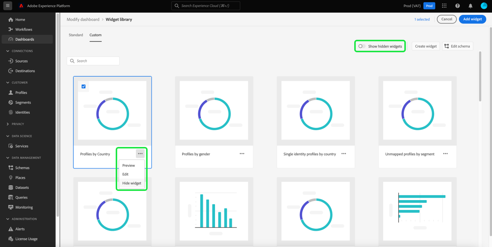

# Aangepaste widgets maken voor dashboards

In Adobe Experience Platform kunt u de gegevens van uw organisatie bekijken en ermee communiceren met behulp van meerdere dashboards. U kunt bepaalde dashboards ook bijwerken door nieuwe widgets aan uw dashboardmening toe te voegen. Naast de standaardwidgets die Adobe biedt, kunt u ook aangepaste widgets maken en deze delen in uw hele organisatie.

Deze handleiding bevat stapsgewijze instructies voor het maken en toevoegen van aangepaste widgets aan de dashboards [!UICONTROL Profiles] , [!UICONTROL Segments] en [!UICONTROL Destinations] in de Experience Platform-gebruikersinterface.

>[!NOTE]
>
>Alle updates van de dashboards worden uitgevoerd per organisatie en per sandbox.

Meer over standaard widgets leren, gelieve te verwijzen naar de gids voor [ toevoegend standaardwidgets aan uw dashboards ](standard-widgets.md).

## Widget-bibliotheek {#widget-library}

Deze handleiding vereist toegang tot de [!UICONTROL Widget library] in Experience Platform. Meer over de widgetbibliotheek leren, en hoe te om tot het binnen UI toegang te hebben, gelieve te beginnen door het [ overzicht van de widgetbibliotheek te lezen ](widget-library.md).

## Aan de slag met aangepaste widgets

In de widgetbibliotheek kunt u op het tabblad **[!UICONTROL Custom]** widgets maken en deze delen met andere gebruikers in uw organisatie om de weergave van uw dashboards aan te passen.

>[!IMPORTANT]
>
>Uw organisatie kan maximaal twintig aangepaste widgets maken in de widgetbibliotheek.

Selecteer het tabblad **[!UICONTROL Custom]** om aangepaste widgets te maken of om aangepaste widgets weer te geven die uw organisatie al heeft gemaakt.

## Een aangepaste widget maken

Als u een aangepaste widget wilt maken, selecteert u **[!UICONTROL Create widget]** in de rechterbovenhoek van de widgetbibliotheek of selecteert u **[!UICONTROL Create]** in het midden van de widgetbibliotheek als dit de eerste aangepaste widget van uw organisatie is.

Geef in het dialoogvenster **[!UICONTROL Create widget]** een titel en een beschrijving voor de nieuwe widget op en kies het kenmerk dat u de widget wilt weergeven.

>[!NOTE]
>
>De lijst van beschikbare attributen hangt van het schema af dat voor uw organisatie is gevormd. Om meer over attributenselectie en schemaconfiguratie te leren, lees de gids bij [ het uitgeven van het schema om douanewidgets ](edit-schema.md) tot stand te brengen.

Als u een kenmerk wilt kiezen, selecteert u het keuzerondje naast het kenmerk dat u wilt toevoegen.

>[!NOTE]
>
>Per widget kan slechts één kenmerk worden geselecteerd en per kenmerk kan slechts één widget worden gemaakt. Als er al een widget is gemaakt voor een kenmerk, wordt het kenmerk grijs weergegeven.

## Selecteer een visualisatie

Nadat u een kenmerk hebt geselecteerd, wordt een voorvertoning van de nieuwe widget weergegeven in het dialoogvenster. Kunstmatige intelligentie wordt gebruikt om automatisch een visualisatie te selecteren die de attributengegevens het best past, en om extra visualisatieopties te verstrekken die u manueel kunt selecteren.

Afhankelijk van het kenmerk raadt de AI verschillende visualisatieopties aan. De volledige lijst met visualisaties bevat:

* Horizontaal staafdiagram: horizontale lijnen worden gebruikt om waarden te vertegenwoordigen.
* Verticaal staafdiagram: verticale lijnen worden gebruikt om waarden te vertegenwoordigen.
* Donut-diagram: waarden worden net als een cirkeldiagram weergegeven als delen of delen van een geheel.
* Spreiding: gebruikt een horizontale en verticale as om waarden aan te geven.
* Lijndiagram: waarden worden weergegeven met één regel om wijzigingen gedurende een tijdsperiode weer te geven.
* Nummer kaart: geeft een samenvattingsnummer weer dat een enkele sleutelwaarde vertegenwoordigt.
* Gegevenstabel: waarden worden weergegeven als rijen in een tabel.

>[!NOTE]
>
>De enige metrische waarde die momenteel voor alle kenmerken wordt ondersteund, is het aantal profielen.
>
>De gegevens in de voorbeeldwidget dienen alleen ter illustratie. In de voorvertoning worden geen feitelijke gegevens van uw organisatie weergegeven.

Selecteer **[!UICONTROL Create]** om de nieuwe widget op te slaan en terug te keren naar de tab [!UICONTROL Custom] .

Uw nieuwe widget kan nu aan een dashboard worden toegevoegd door de widget in de bibliotheek te kiezen en **[!UICONTROL Add widget]** te selecteren.

## Een aangepaste widget verbergen

Nadat een widget aan de bibliotheek is toegevoegd, kan deze worden verborgen door de ellipsen (`...`) op de widget-kaart te selecteren en vervolgens **[!UICONTROL Hide widget]** te selecteren. U kunt de widget ook voorvertonen en bewerken vanuit dezelfde vervolgkeuzelijst.

Als u verborgen widgets wilt weergeven, selecteert u **[!UICONTROL Show hidden widgets]** in de rechterbovenhoek van de widgetbibliotheek.

>[!WARNING]
>
>Als u een widget verbergt in de bibliotheek, wordt de widget niet verwijderd uit de dashboards van individuele gebruikers. Als een widget niet meer in uw organisatie mag worden gebruikt, moet u dit rechtstreeks doorgeven aan alle Experience Platform-gebruikers, omdat deze de widget uit hun dashboards moeten verwijderen.

## Een aangepaste widget bewerken

U kunt aangepaste widgets in de widgetbibliotheek bewerken door de ellipsen (`...`) op de widgetkaart te selecteren en vervolgens **[!UICONTROL Edit]** te selecteren in het vervolgkeuzemenu.

In het dialoogvenster **[!UICONTROL Edit widget]** kunt u de titel en beschrijving van de widget bewerken, en een voorvertoning weergeven van verschillende visualisaties en deze selecteren. Nadat u de gewenste wijzigingen hebt aangebracht, selecteert u **[!UICONTROL Save]** om de wijzigingen op te slaan en terug te keren naar het tabblad Aangepaste widgets.

>[!WARNING]
>
>Als u een widget in de bibliotheek bewerkt, wordt de widget niet voor individuele gebruikers bijgewerkt. Als een widget is bijgewerkt, moet u dit rechtstreeks doorgeven aan alle Experience Platform-gebruikers, aangezien deze de verouderde widget uit hun dashboards moeten verwijderen en vervolgens de bijgewerkte widget uit de widgetbibliotheek moeten selecteren en toevoegen.

## Volgende stappen

Nadat u dit document hebt gelezen, hebt u toegang tot de widgetbibliotheek en kunt u deze gebruiken om aangepaste widgets voor uw organisatie te maken en toe te voegen. Om de grootte en de plaats van widgets te wijzigen die in het dashboard verschijnen, gelieve te verwijzen naar [ wijzigen dashboardgids ](modify.md).
