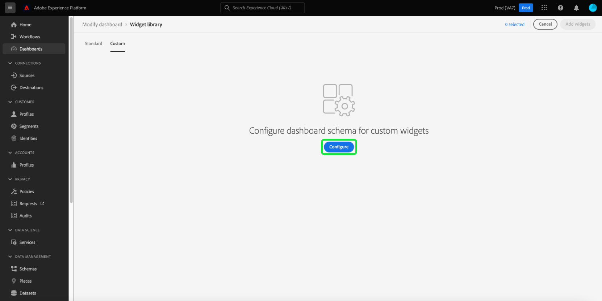

# Schema bewerken om aangepaste widgets te maken

Als u aangepaste widgets voor Adobe Experience Platform-dashboards wilt maken, moet u eerst de realtime kenmerken van het klantprofiel identificeren waarop de widgets worden gebaseerd.

Deze handleiding bevat stapsgewijze instructies voor het bewerken van het schema van uw organisatie door kenmerken te selecteren om aangepaste dashboardwidgets te maken.

Zodra de attributen zijn geselecteerd en het schema is gevormd, kunt u met de stappen te werk gaan voor [aangepaste widgets maken voor uw dashboards](custom-widgets.md).

>[!NOTE]
>
>Gebruikers moeten de machtiging &quot;Standaarddashboards beheren&quot; hebben om het schema te kunnen bewerken. Voor stappen bij het verlenen van toegangsmachtigingen voor dashboards raadpleegt u de [Handleiding voor dashboardmachtigingen](../permissions.md).

## Widget-bibliotheek {#widget-library}

Deze gids vereist toegang tot [!UICONTROL Widget library] in Experience Platform. Als u meer wilt weten over de widgetbibliotheek en hoe u deze kunt openen in de gebruikersinterface, leest u eerst de [Overzicht van widgetbibliotheek](widget-library.md).

## Schema bewerken

In de widgetbibliotheek **[!UICONTROL Custom]** kunt u widgets maken en deze delen met andere gebruikers in uw organisatie om de weergave van uw dashboards aan te passen.

Voordat u aangepaste widgets kunt maken, moeten de kenmerken van het profiel van de klant in realtime worden geselecteerd om ervoor te zorgen dat de gegevens worden opgenomen als onderdeel van de dagelijkse momentopname.

>[!IMPORTANT]
>
>Uw organisatie kan maximaal 20 kenmerken selecteren.

Als uw organisatie geen profielkenmerken heeft geselecteerd, selecteert u eerst **[!UICONTROL Configure]** in het midden van het scherm.

Wanneer ten minste één aangepast kenmerk is gemaakt, selecteert u **[!UICONTROL Edit schema]** om de geselecteerde kenmerken weer te geven en meer toe te voegen.

## Een kenmerk selecteren

Als u een kenmerk wilt selecteren in het dialoogvenster **[!UICONTROL Select union schema field]** , navigeert u naar het kenmerk in het vakbondschema (of gebruikt u zoekopdracht) en schakelt u het selectievakje naast het kenmerk in. Als u het selectievakje inschakelt, wordt het kenmerk ook toegevoegd aan de **[!UICONTROL Selected Attributes]** aan de rechterkant van het dialoogvenster.

>[!NOTE]
>
>Een kenmerk is alleen zichtbaar voor selectie als het een van de volgende kenmerken is: Tekenreeks, datum, datum en tijd, Boolean, kort, lang, geheel getal of byte. De gegevenstypen Map en Double worden niet ondersteund en worden grijs weergegeven zodat ze niet kunnen worden geselecteerd.

Nadat u de kenmerken hebt gekozen die u wilt toevoegen, selecteert u **[!UICONTROL Save]** om uw kenmerken op te slaan en terug te keren naar het tabblad Aangepaste widgets.

>[!WARNING]
>Nieuw geselecteerde kenmerken worden beschikbaar na de volgende dagelijkse momentopname wanneer de gegevens worden vernieuwd.

## Volgende stappen

Na het lezen van deze gids kunt u aan de widgetbibliotheek navigeren en de attributen van het Profiel van de Klant in real time selecteren om uw schema te vormen. Als Profielkenmerken zijn geselecteerd, kunt u beginnen [aangepaste widgets maken voor uw dashboards](custom-widgets.md).
