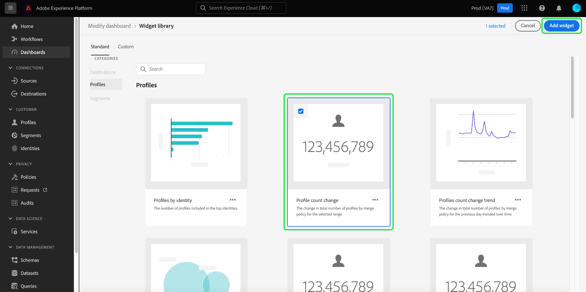

# Overzicht van widgetbibliotheek

In de Adobe Experience Platform-gebruikersinterface kunt u de gegevens van uw organisatie bekijken en ermee werken met meerdere dashboards. U kunt bepaalde dashboards ook bijwerken door widgets aan uw dashboardmening toe te voegen.

Deze handleiding bevat stapsgewijze instructies voor toegang tot [!UICONTROL Widget library] in het Experience Platform, waar u standaardwidgets kunt selecteren en aangepaste widgets kunt maken om de informatie die in uw dashboards wordt weergegeven, aan te passen.

>[!NOTE]
>
>Alle updates van de dashboards worden uitgevoerd per organisatie en per sandbox.

Voor informatie over hoe te om de plaats en de grootte van widgets te wijzigen die reeds in uw dashboards worden getoond, gelieve te verwijzen naar [ wijzigen dashboardgids ](modify.md).

## De widgetbibliotheek openen {#access}

Van om het even welk dashboard (bijvoorbeeld, het dashboard van Profielen), selecteer **[!UICONTROL Add widget]** om direct aan de widgetbibliotheek te navigeren waar u widgets [&#128279;](#add-widgets) aan uw dashboard kunt toevoegen.

Selecteer **[!UICONTROL Modify dashboard]** om widgets van het dashboard te verplaatsen, te vergroten of te verkleinen of te verwijderen. Van deze vertoning kunt u **[!UICONTROL Widget library]** ook selecteren om te doorbladeren en [ widgets ](#add-widgets) toevoegen. Leren hoe te om widgetgrootte en lay-out uit te geven, zie [ dashboarddocumentatie wijzigen ](./modify.md).

Selecteer **[!UICONTROL Widget library]** om de widgetbibliotheek te openen en alle beschikbare standaardmetriek weer te geven of om aangepaste widgets te maken.

## Widgets toevoegen {#add-widgets}

Selecteer in het [!UICONTROL Widget library] een widget uit de lijst met beschikbare standaard- of aangepaste widgets. Een vinkje in de hoek van de widget geeft de selectie aan.

### Label tijdens gebruik {#in-use-label}

Aan widgets die al aan een dashboard zijn toegevoegd, is een label [!UICONTROL In-use] gekoppeld wanneer deze in de widgetbibliotheek worden weergegeven. Met dit label worden widgets gemarkeerd die al aan het dashboard zijn toegevoegd om dubbel werk te voorkomen. U kunt desgewenst nog steeds dezelfde widget meerdere keren toevoegen.

Nadat u alle vereiste widgets hebt geselecteerd, selecteert u **[!UICONTROL Add widgets]** om uw keuze te bevestigen en de widgets aan het dashboard toe te voegen.

## Standaard- en aangepaste widgets {#standard-and-custom}

[!UICONTROL Widget library] bevat twee tabbladen:

* **[!UICONTROL Standard]:** Het standaardlusje bevat widgets die door Adobe worden verstrekt. U kunt de dashboards bijwerken gebruikend om het even welk van deze standaardmetriek. Meer leren over het toevoegen van standaard widgets aan uw dashboard, verwijs naar de gids voor [ gebruikend standaardwidgets in dashboards ](standard-widgets.md).
* **[!UICONTROL Custom]:** Met het aangepaste tabblad kunt u widgets maken en delen binnen uw organisatie. Voor volledige stappen aan het creëren van uw eigen widgets, verwijs naar [ douanewidgets voor dashboardgids ](custom-widgets.md).

## Volgende stappen

Nadat u dit document hebt gelezen, hebt u nu toegang tot de widgetbibliotheek in de interface van het Experience Platform. Om de grootte en de plaats van widgets te wijzigen die in het dashboard verschijnen, gelieve te verwijzen naar [ wijzigen dashboardgids ](modify.md).
