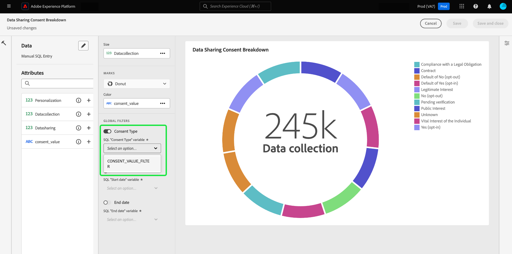
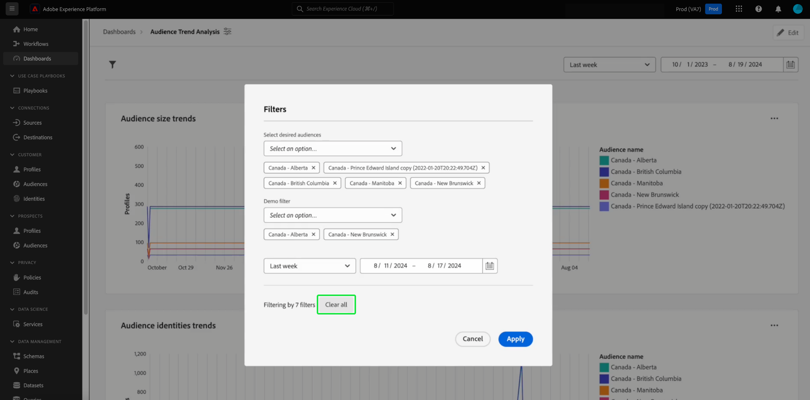

# Een algemeen filter maken {#create-global-filter}

Als u een algemeen filter wilt maken, selecteert u eerst **[!UICONTROL Add filter]** in de dashboardweergave en vervolgens **[!UICONTROL Global filter]** in het vervolgkeuzemenu.

>[!IMPORTANT]
>
>Zorg ervoor dat u de algemene filters toewijst aan al uw diagrammen. Dit is geen automatisch proces. Om een globaal filter te gebruiken, moet u a [ vraagparameter ](../../../../query-service/ui/parameterized-queries.md) in SQL van uw grafiek omvatten, [ laat de globale filter ](#enable-global-filter) in widgetcomposer toe, en [ selecteert een runtime waarde ](#select-global-filter) voor de parameter in de globale filterdialoog. Zie de vraag pro gids om te leren hoe te om uw SQL uit te geven als u een vraagparameter moet opnemen.

U kunt de inzichten die door uw SQL met aangepaste globale filters worden verstrekt snel veranderen.

Het dialoogvenster [!UICONTROL Create a global filter] wordt geopend. Het maken van een algemeen filter volgt hetzelfde proces als het maken van inzicht in SQL. Eerst, selecteer een gegevensbestand (het gegevensmodel van inzichten) aan vraag, dan input uw douane SQL in de Redacteur van de Vraag, en selecteer definitief het looppaspictogram ().

>[!IMPORTANT]
>
>Wanneer u een algemeen filter maakt, moet u een id en een waarde opnemen. Met de voorbeeldwaarden kunt u de SQL-instructie uitvoeren en het diagram samenstellen. De voorbeeldwaarden die u opgeeft bij het samenstellen van de instructie, worden vervangen door de werkelijke waarden die u tijdens runtime voor de datum of het algemene filter selecteert.

Nadat de query is uitgevoerd, worden de resultaten weergegeven op het tabblad Resultaten. Selecteer **[!UICONTROL Next]**.

![ [!UICONTROL Create a global filter dialog] met het dataset dropdown menu, het looppaspictogram en daarna benadrukte.](../../../images/query-pro-mode/global-filter.png)

In de laatste stap van de algemene workflow voor het maken van filters moet u een label voor het filter toevoegen. Voeg een label toe aan het tekstveld **[!UICONTROL Filter label]** en selecteer een filtertype in het vervolgkeuzemenu.

>[!NOTE]
>
>Momenteel wordt alleen de filtertypeoptie [!UICONTROL Combo box] ondersteund.

Selecteer ten slotte **[!UICONTROL Select]** om terug te keren naar de dashboardweergave.

![ [!UICONTROL Create a global filter dialog] met Uitgezocht en de benadrukte het etikettekstinput van de Filter.](../../../images/query-pro-mode/global-filter-label.png)

## Globaal filter inschakelen voor elk inzicht {#enable-global-filter}

>[!TIP]
>
>Schakel de algemene filters in elk diagram dat u maakt in. Op deze manier weet u zeker dat de waarden die u kiest als algemeen filter, in al uw grafieken worden weerspiegeld.

Nadat u het algemene filter voor het dashboard hebt gemaakt, wordt de schakeloptie voor dat algemene filter beschikbaar als onderdeel van de widgetcomposer.

>[!IMPORTANT]
>
>Zorg ervoor dat de algemene filterparameter is opgenomen in de SQL van elk inzicht.

## Een algemeen filter selecteren {#select-global-filter}

Om de [!UICONTROL Filters] dialoog te openen die van elk van uw douanefilters een lijst maakt, selecteer het filterpictogram ( ) links van het dashboard. Als u vervolgens de effecten op uw dashboardinzichten wilt toepassen, kiest u een optie in het vervolgkeuzemenu van het algemene filter en selecteert u vervolgens **[!UICONTROL Apply]** .

## Globaal filter wissen {#clear-global-filter}

Als u al uw aangepaste globale filters wilt wissen, selecteert u **[!UICONTROL Clear all]** in het dialoogvenster [!UICONTROL Filters] .

