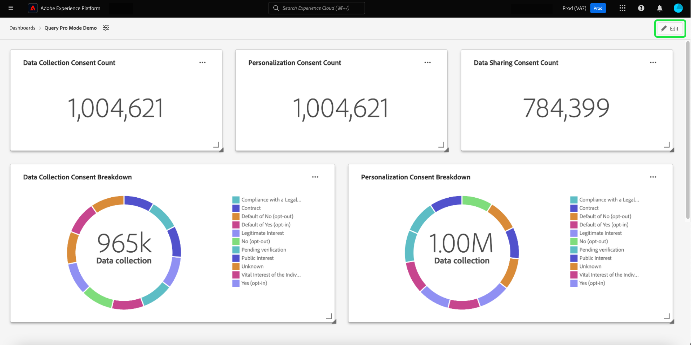

# Overzicht van de modus Query Pro {#query-pro-mode}

De modus Query Pro is een op SQL-editors gebaseerde workflow die u begeleidt bij het genereren van inzichten met aangepaste SQL-query&#39;s in de gebruikersinterface van Adobe Experience Platform. Alvorens u inzichten met douaneSQL vragen kunt produceren, moet u eerst [ een dashboard ](./overview.md#create-custom-dashboard) creëren.

## SQL samenstellen {#compose-sql}

Nadat u hebt opgegeven dat u een dashboard met de modus Query Pro wilt maken, wordt het dialoogvenster **[!UICONTROL Enter SQL]** weergegeven. Selecteer een gegevensbestand (gegevensmodel van inzichten) aan vraag van het drop-down menu, en input een geschikte vraag voor uw dataset in de vraag pro redacteur.

>[!NOTE]
>
>De modus Query Pro is alleen beschikbaar voor gebruikers die de Data Distiller SKU hebben aangeschaft. [[!UICONTROL Guided design mode]](../../user-defined-dashboards.md) is beschikbaar voor alle gebruikers om inzichten van een bestaand gegevensmodel tot stand te brengen.

Zie de [ gebruikersgids van de Redacteur van de Vraag ](../../../query-service/ui/user-guide.md#query-authoring) voor informatie over zijn elementen UI.

![ De [!UICONTROL Enter SQL] dialoog met het Datumet dropdown menu en in werking gestelde pictogram benadrukte, heeft de dialoog een bevolkte SQL vraag en de getoonde vraagparameters tabel.](../../images/sql-insights/enter-sql-database-dropdown.png)

### Query-parameters {#query-parameters}

Om [ globale ](./filters/global-filter.md) of [ datumfilters ](./filters/date-filter.md) te omvatten uw vraag **moet** de parameters van de gebruiksvraag. Wanneer het samenstellen van uw verklaring op vraag pro wijze, moet u steekproefwaarden verstrekken als uw vraag vraagparameters gebruikt. Met de voorbeeldwaarden kunt u de SQL-instructie uitvoeren en het diagram samenstellen. De voorbeeldwaarden die u opgeeft bij het samenstellen van de instructie, worden vervangen door de werkelijke waarden die u tijdens runtime voor de datum of het algemene filter selecteert.

>[!IMPORTANT]
>
>Als u een algemeen filter wilt gebruiken, moet u een vraagparameter in uw SQL plaatsen en dan die vraagparameter verbinden met het globale filter in widgetcomposer. In de onderstaande schermafbeelding wordt `CONSENT_VALUE_FILTER` in de SQL gebruikt als een queryparameter voor een algemeen filter. Zie de [ globale filterdocumentatie ](./filters/global-filter.md#enable-global-filter) voor meer informatie over hoe te om dit te doen.

Om uw vraag uit te voeren, selecteer het looppaspictogram (). De Redacteur van de Vraag toont de resultaten tabel. Selecteer vervolgens **[!UICONTROL Select]** om uw configuratie te bevestigen en de widgetcomposer te openen.

>[!TIP]
>
>Als uw vraag vraagparameters gebruikt, stel de vraag eens in werking om alle gebruikte sleutels van de vraagparameter vooraf in te vullen. De query zal mislukken, maar de gebruikersinterface geeft automatisch het tabblad Query-parameters weer en geeft alle opgenomen toetsen weer. Voeg de juiste waarden voor de toetsen toe.

![ het [!UICONTROL Enter SQL] dialoog met SQL input, het getoonde resultatenlusje, en Uitgezochte benadrukte.](../../images/sql-insights/enter-sql-select.png)

## Widget vullen {#populate-widget}

De widgetcomposer wordt nu gevuld met de kolommen van de uitgevoerde SQL. Het type dashboard wordt linksboven aangegeven, in dit geval [!UICONTROL Manual SQL Entry] . Selecteer het potloodpictogram ( ) om de SQL op elk gewenst moment te bewerken.

>[!TIP]
>
>De beschikbare kenmerken zijn kolommen die zijn opgehaald uit de uitgevoerde SQL.

Als u een widget wilt maken, gebruikt u de kenmerken in de kolom [!UICONTROL Attributes] . Met de zoekbalk kunt u naar kenmerken zoeken of door de lijst bladeren.

### Kenmerken toevoegen {#add-attributes}

Om een attribuut aan uw widget toe te voegen, selecteer het plusteken ( ) naast een kenmerknaam. In het vervolgkeuzemenu dat wordt weergegeven, kunt u een kenmerk aan het diagram toevoegen op basis van de opties die door de SQL worden bepaald. Verschillende diagramtypen hebben verschillende opties, zoals een vervolgkeuzelijst op de X- en Y-as.

In dit voorbeeld van het donutdiagram zijn de opties grootte en kleur. Kleuren worden verdeeld in de resultaten van het donutdiagram en de grootte is de werkelijk gebruikte metrische waarde. Voeg een attribuut aan het [!UICONTROL Color] gebied toe om de resultaten in verschillende kleuren te verdelen die op hun samenstelling van dat attribuut worden gebaseerd.

>[!TIP]
>
>Selecteer omhoog en benedenpijlpictogram () om de rangschikking van de X- en Y-as op staaf- of lijngrafieken te wijzigen.

Als u het type grafiek of grafiek van de widget wilt wijzigen, selecteert u een van de beschikbare opties in het vervolgkeuzemenu [!UICONTROL Marks] . De opties zijn [!UICONTROL Line] , [!UICONTROL Donut] , [!UICONTROL Big number] en [!UICONTROL Bar] . Als deze optie is geselecteerd, wordt een voorvertoning van de huidige instellingen van de widget gegenereerd.

## Eigenschappen van Widget {#properties}

Selecteer het eigenschappen pictogram ( ) in de rechterrail om het deelvenster Eigenschappen te openen. Typ in het deelvenster [!UICONTROL Properties] een naam voor de widget in het tekstveld **[!UICONTROL Widget title]** . U kunt ook de naam wijzigen van verschillende aspecten van uw diagram.

>[!NOTE]
>
>Welke specifieke velden beschikbaar zijn in de zijbalk Eigenschappen, is afhankelijk van het diagramtype dat u bewerkt.

## Uw widget opslaan {#save-widget}

Als u de widget opslaat in de widgetcomposer, wordt de widget lokaal op het dashboard opgeslagen. Selecteer **[!UICONTROL Save]** als u uw werk wilt opslaan en later wilt hervatten. Een tikpictogram onder de widgetnaam geeft aan dat de widget is opgeslagen. Als u tevreden bent met de widget, selecteert u **[!UICONTROL Save and close]** om de widget beschikbaar te maken voor alle andere gebruikers die toegang hebben tot het dashboard. Selecteer Annuleren om uw werk te verlaten en terug te keren naar het aangepaste dashboard.

## Uw dashboard en grafieken bewerken {#edit}

Selecteer **[!UICONTROL Edit]** om het hele dashboard of een van uw inzichten te bewerken. In de bewerkingsmodus kunt u widgets vergroten of verkleinen, uw SQL bewerken of algemene en tijdelijke filters maken en toepassen. Deze filters beperken de gegevens die in uw dashboardwidgets worden weergegeven. Dit is een handige manier om uw inzichten voor verschillende gebruiksgevallen snel bij te werken en af te stemmen.

Selecteer **[!UICONTROL Add filter]** om een [[!UICONTROL Date filter]](#create-date-filter) of een [[!UICONTROL Global filter]](#create-global-filter) -element te maken. Zodra gecreeerd, zijn alle globale en datumfilters beschikbaar van [ het filterpictogram ](#select-global-filter) ( ) van het dashboard.

## Een inzicht bewerken, dupliceren of verwijderen

Zie de gids van het dashboard van de Douane voor instructies op hoe te [ uitgeven, dupliceren, of schrappen een bestaande widget ](../../user-defined-dashboards.md#duplicate).

## Volgende stappen

Nadat u dit document hebt gelezen, weet u nu hoe u SQL-query&#39;s kunt schrijven in de gebruikersinterface van Adobe Experience Platform om grafieken te genereren voor uw aangepaste dashboards. Daarna, zou u moeten leren hoe te om uw gegevens verder te verrijken door [ een datumfilter ](./filters/date-filter.md) te creëren, of [ creërend een globale filter ](./filters/global-filter.md).

U kunt meer over andere Aangepaste eigenschappen van Inzichten met inbegrip van [ ook leren de verschillende het bekijken opties voor u SQL analyseerde gegevens ](./view-more.md) of hoe te [ om SQL achter uw douaneinzichten ](./view-sql.md) te bekijken.
