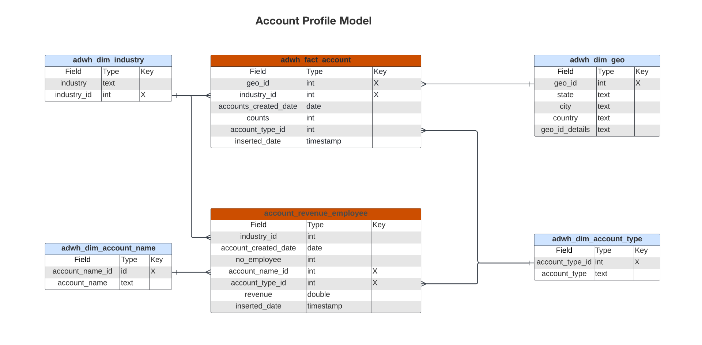

# Real-Time CDP Insights-gegevensmodel B2B edition

Het de gegevensmodel van Inzichten van Real-Time CDP voor B2B edition stelt de gegevensmodellen en SQL bloot die de inzichten voor [&#x200B; rekeningsprofielen &#x200B;](https://experienceleague.adobe.com/nl/docs/experience-platform/rtcdp/account/account-profile-overview) aandrijven. U kunt deze SQL vraagmalplaatjes aanpassen om de rapporten van Real-Time CDP voor uw B2B marketing en belangrijkste het gebruiksgevallen van de prestatiesindicator (KPI) tot stand te brengen. Deze inzichten kunnen dan als douanewidgets voor uw dashboards worden gebruikt.

>[!AVAILABILITY]
>
>Deze functionaliteit is beschikbaar voor klanten die het pakket Real-Time CDP Prime en Ultimate hebben aangeschaft. Zie de documentatie over beschikbare [&#x200B; uitgaven van Real-Time CDP &#x200B;](../../rtcdp/overview.md#rtcdp-editions) voor meer informatie, of contacteer uw vertegenwoordiger van Adobe.

<!-- 
See the query accelerated store reporting insights documentation to learn [how to build a reporting insights data model through Query Service for use with accelerated store data and user-defined dashboards](../../query-service/data-distiller/sql-insights/reporting-insights-data-model.md).
 -->

## Vereisten

Deze handleiding vereist een goed begrip van aangepaste dashboards. Lees de documentatie op [&#x200B; hoe te om een douanedashboard &#x200B;](../standard-dashboards.md) tot stand te brengen alvorens met deze gids verder te gaan.

## Real-Time CDP B2B insight rapporteert en gebruikt {#B2B-insight-reports-and-use-cases}

Real-Time CDP B2B-rapporten bieden inzichten in de gegevens van uw accountprofielen en de relatie tussen accounts en mogelijkheden. De volgende sterschemamodellen werden ontwikkeld om een verscheidenheid van gemeenschappelijk marketing gebruiksgevallen te antwoorden en elk gegevensmodel kan verscheidene gebruiksgevallen steunen.

>[!IMPORTANT]
>
>De gegevens die voor Real-Time CDP B2B-rapportage worden gebruikt, zijn nauwkeurig voor een gekozen samenvoegingsbeleid en op basis van de meest recente dagelijkse momentopname.

### Accountprofielmodel {#account-profile-model}

Het model van het Profiel van de Rekening bestaat uit acht datasets:

- `adwh_dim_industry`
- `adwh_dim_account_name`
- `adwh_dim_geo`
- `adwh_dim_account_type`
- `adwh_fact_account`
- `account_revenue_employee`

In het onderstaande diagram worden de relevante gegevensvelden in elke gegevensset weergegeven, evenals het gegevenstype ervan en de externe sleutels die de gegevenssets aan elkaar koppelen.



#### De nieuwe rekeningen per bedrijfstak gebruiken de zaak {#accounts-by-industry}

De logica die wordt gebruikt voor de [!UICONTROL New accounts by industry] insight retourneert de vijf belangrijkste sectoren op basis van hun aantal accountprofielen en hun relatieve grootte ten opzichte van elkaar. Zie de [[!UICONTROL New accounts By Industry] widgetdocumentatie &#x200B;](../guides/account-profiles.md#accounts-by-industry) voor meer informatie.

>[!TIP]
>
>U kunt deze SQL-query aanpassen om meer of minder dan de vijf belangrijkste bedrijfstakken te retourneren.

De SQL die de [!UICONTROL New accounts by industry] insight genereert, wordt weergegeven in de inklapbare sectie hieronder.

+++SQL-query

```sql
WITH RankedIndustries AS (
    SELECT
        i.industry,
        SUM(f.counts) AS total_accounts,
        ROW_NUMBER() OVER (ORDER BY SUM(f.counts) DESC) AS industry_rank
    FROM
        adwh_fact_account f
    INNER JOIN adwh_dim_industry i ON f.industry_id = i.industry_id
    WHERE f.accounts_created_date between UPPER(COALESCE('$START_DATE', '')) and UPPER(COALESCE('$END_DATE', ''))
    GROUP BY
        i.industry
)
SELECT
    CASE
        WHEN industry_rank <= 5 THEN industry
        ELSE 'Others'
    END AS industry_group,
    SUM(total_accounts) AS total_accounts
FROM
    RankedIndustries
GROUP BY
    CASE
        WHEN industry_rank <= 5 THEN industry
        ELSE 'Others'
    END
ORDER BY
    total_accounts DESC
LIMIT 5000;
```

+++

#### Nieuwe accounts per type use case {#accounts-by-type}

De logica die wordt gebruikt voor de [!UICONTROL New accounts by type] insight retourneert de numerieke uitsplitsing van accounts op basis van het type. Deze insight kan helpen bedrijfsstrategie en verrichtingen, met inbegrip van middeltoewijzing of marketing strategieën te begeleiden. Zie de [[!UICONTROL New accounts by type] widgetdocumentatie &#x200B;](../guides/account-profiles.md#accounts-by-type) voor meer informatie.

De SQL die de [!UICONTROL New accounts by type] insight genereert, wordt weergegeven in de inklapbare sectie hieronder.

+++SQL-query

```sql
SELECT t.account_type,
       Sum(f.counts) AS account_count
FROM   adwh_fact_account f
       JOIN adwh_dim_account_type t
         ON f.account_type_id = t.account_type_id
WHERE  accounts_created_date BETWEEN Upper(Coalesce('$START_DATE', '')) AND
                                     Upper(
                                     Coalesce('$END_DATE', ''))
GROUP  BY t.account_type
LIMIT  5000; 
```

+++

### Opportuniteitsmodel {#opportunity-model}

Het model van de Kans bestaat uit zeven datasets:

- `adwh_dim_opportunity_stage`
- `adwh_dim_person_role`
- `adwh_dim_opportunity_source_type`
- `adwh_dim_opportunity_name`
- `adwh_fact_opportunity`
- `adwh_opportunity_amount`
- `adwh_fact_opportunity_person`

In het onderstaande diagram worden de relevante gegevensvelden in elke gegevensset weergegeven.


