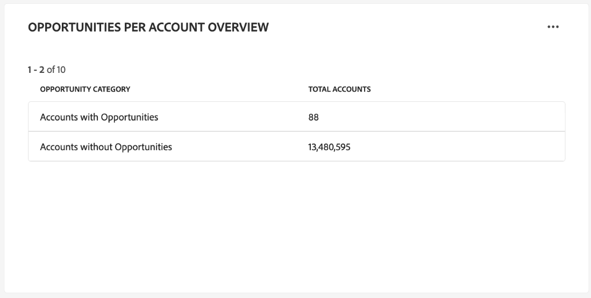
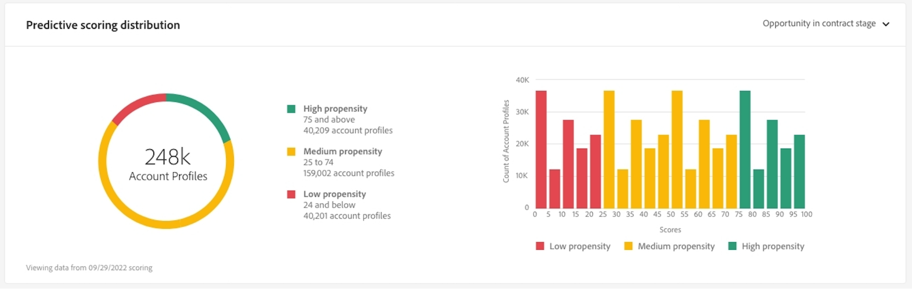

# Het dashboard Accountprofielen

De gebruikersinterface van Adobe Experience Platform (UI) biedt een dashboard waarmee u belangrijke informatie over uw accountprofielen kunt bekijken, zoals vastgelegd tijdens een dagelijkse momentopname. In deze handleiding wordt beschreven hoe u het dashboard [!UICONTROL Account Profiles] in de gebruikersinterface kunt openen en gebruiken en wordt meer informatie gegeven over de visualisaties die in het dashboard worden weergegeven.

Dit document biedt een overzicht van de functies in het dashboard van [!UICONTROL Account Profiles] en geeft details over de beschikbare standaardinzichten. Zie de [[!UICONTROL Account Profiles] gids UI ](../../rtcdp/accounts/account-profile-ui-guide.md) voor uitvoerige details over zijn beschikbare eigenschappen.

## Aan de slag

U moet aan [ Adobe Real-time Customer Data Platform B2B edition ](../../rtcdp/b2b-overview.md) gerechtigd zijn om tot het B2B [!UICONTROL Account Profiles] dashboard toegang te hebben.

## Gegevens van accountprofielen {#data}

Op het dashboard van [!UICONTROL Account Profiles] wordt een momentopname van de gegevens van uw geconsolideerde account weergegeven. Deze rekeningsinformatie komt uit de veelvoudige bronnen over uw marketing kanalen en de diverse systemen die uw organisatie momenteel gebruikt om de informatie van de klantenrekening op te slaan.

De profielgegevens in de momentopname geven de gegevens precies zo weer als op het specifieke tijdstip waarop de momentopname is gemaakt. Met andere woorden, de momentopname is geen benadering of voorbeeld van de gegevens en het dashboard van [!UICONTROL Account Profiles] wordt niet in real-time bijgewerkt.

>[!NOTE]
>
>Wijzigingen of updates die zijn aangebracht in de gegevens nadat de momentopname is gemaakt, worden pas in het dashboard weergegeven als de volgende momentopname is gemaakt.

## Het dashboard van [!UICONTROL Account Profiles] verkennen {#explore}

Als u naar het [!UICONTROL Account Profiles] -dashboard in de gebruikersinterface van het platform wilt navigeren, selecteert u **[!UICONTROL Profiles]** onder [!UICONTROL Accounts] in het navigatievenster aan de linkerkant.

Van het [!UICONTROL Account Profiles] dashboard, kunt u of [ de rekeningsprofielen doorbladeren die in uw organisatie ](#browse-account-profiles) worden opgenomen, of [ bekijken de volledige gegevens van uw rekeningsprofiel bij een blik gebruikend widgets ](#standard-widgets).

### Datumfilter {#date-filter}

Het tabblad [!UICONTROL Overview] is samengesteld uit widgets die alleen-lezen gegevens bieden waarmee belangrijke informatie over uw accountprofielen wordt overgebracht. Selecteer het kalenderpictogram of de data om het globale datumfilter voor uw widgets te veranderen.

>[!IMPORTANT]
>
>De datumwaaier die u in de dropdown kalender selecteert beïnvloedt alle inzichten behalve de twee vooruitlopende het noteren widgets ([ distributie ](#predictive-scoring-distribution) en [ hoogste invloedrijke factoren ](#predictive-scoring-top-influential-factors)).

### Configureer de lead in account matching-service {#lead-to-account-matching-service}

Selecteer **[!UICONTROL Settings]** om in het dialoogvenster [!UICONTROL Account settings] de service voor lead to account matching te configureren. Voor volledige details op hoe te om uw lood aan rekening aanpassing te vormen, zie de [ gids UI ](../../rtcdp/accounts/account-profile-ui-guide.md#configure-lead-to-account-matching). Meer leren over lood aan rekening aanpassing, verwijs naar [ leiden tot rekening die in de documentatie van Real-Time CDP B2B ](../../rtcdp/b2b-ai-ml-services/lead-to-account-matching.md) aanpassen.

## Accountprofielen zoeken {#browse-account-profiles}

Via het tabblad [!UICONTROL Browse] kunt u zoeken naar de alleen-lezen accountprofielen die in uw organisatie worden opgenomen. Gebruik een account-id van een verbonden onderneming of voer de brongegevens rechtstreeks in. Vanuit deze werkruimte kunt u belangrijke informatie zien die bij het accountprofiel hoort, zoals naam, industrie, inkomsten en het publiek.

Selecteer in de resultaten op het tabblad [!UICONTROL Browse] de optie [!UICONTROL Profile ID] om het tabblad [!UICONTROL Details] voor het accountprofiel te openen.

De accountprofielgegevens die op het tabblad [!UICONTROL Details] worden weergegeven, zijn samengevoegd vanuit meerdere profielfragmenten tot één weergave van het individuele account. Zie de documentatie bij [ doorbladerend rekeningsprofielen in Adobe Real-time Customer Data Platform ](../../rtcdp/accounts/account-profile-ui-guide.md#browse-account-profiles) om meer over de mogelijkheden van het rekeningsprofiel te leren bekijken in Platform UI.

## Standaardwidgets {#standard-widgets}

>[!CONTEXTUALHELP]
>id="platform_dashboards_accountprofiles_customersperaccountoverview"
>title="Overzicht van klanten per account"
>abstract="Deze boor-door widget verstrekt inzicht in de structuur van uw B2B gegevens. Hiermee kunt u bepalen hoeveel accountprofielen geen gekoppelde profielen van klanten hebben of aan welke profielen van klanten een of meer profielen van klanten zijn gekoppeld.<ul><li>Directe klanten: zijn klantprofielen die via de `personComponents` -route rechtstreeks aan een account zijn gekoppeld.</li><li>Indirecte klanten: zijn klantprofielen die via de `Account-Person` -route zijn gekoppeld aan een account.</li></ul>"

Adobe biedt standaardwidgets die u kunt gebruiken voor het visualiseren van verschillende meetgegevens die betrekking hebben op uw accountprofielen.

>[!IMPORTANT]
>
>Als u geen datumfilter aanbiedt, analyseert het standaardgedrag van inzichten de gegevens die van het vorige jaar tot vandaag zijn toegevoegd.

Als u meer wilt weten over elk van de beschikbare standaardwidgets, selecteert u de naam van een widget in de volgende lijst:

* [Accountprofielen toegevoegd](#account-profiles-added)
* [Overzicht van klanten per account](#customers-per-account-overview)
   * [Overzicht van mogelijkheden per account](#opportunities-per-account-overview)
   * [Opportuniteiten per rekeningdetail](#opportunities-per-account-detail)
   * [Klanten per accountdetails](#customers-per-account-detail)
* [Nieuwe rekeningen van de industrie](#accounts-by-industry)
* [Nieuwe accounts per type](#accounts-by-type)
* [Nieuwe mogelijkheden per persoonlijke rol](#opportunities-by-person-role)
* [Nieuwe mogelijkheden door inkomsten](#opportunities-by-revenue)
* [Nieuwe mogelijkheden per status en podium](#opportunities-by-status-&-stage)
* [Nieuwe kansen gewonnen](#opportunities-won)
* [Opportuniteiten toegevoegd](#opportunities-added)
* [Predictieve spreiding van scores](#predictive-scoring-distribution)
* [Predictieve scoring van invloedrijke factoren](#predictive-scoring-top-influential-factors)

### Accountprofielen toegevoegd {#account-profiles-added}

De widget [!UICONTROL Account profiles added] gebruikt een lijngrafiek om het aantal accountprofielen weer te geven dat elke dag wordt toegevoegd over een bepaalde tijdsperiode. Gebruik het globale datumfilter dat zich boven aan het dashboard bevindt om de analyseperiode te bepalen. Als er geen datumfilter is opgegeven, worden in het standaardgedrag de accountprofielen weergegeven die zijn toegevoegd voor het jaar vóór vandaag. De resultaten kunnen worden gebruikt om een trend in het aantal toegevoegde accountprofielen af te leiden.

### Overzicht van klanten per account {#customers-per-account-overview}

Het [!UICONTROL Customers per account overview] -diagram bevat een overzicht van accounts op basis van de klanttypen. Er wordt een tabel met vier rijen weergegeven waarin accounts worden ingedeeld als direct of indirect klanten of als klanten zonder klanten. Het geeft het totale aantal rekeningen voor elke categorie aan. De grafiekhulp identificeert de distributie van rekeningen die directe of indirecte klanten hebben.

Directe klanten zijn klantprofielen die via de `personComponents` -route rechtstreeks aan een account zijn gekoppeld. Deze relatie is eenvoudiger en omvat een directe, expliciete verbinding tussen de klant en de account.

Indirecte klanten zijn klantprofielen die via de `Account-Person` -route aan een account zijn gekoppeld. Deze relatie is minder eenvoudig en omvat een intermediaire entiteit of een complexere verbinding tussen de klant en de account, doorgaans via andere accounts of relaties.

Voor toegang tot meer gedetailleerde inzichten, selecteer de ellips (**...**) op de [!UICONTROL Customers per account overview] grafiek en kies **[!UICONTROL Drill through]** van het dropdown menu.

De boor door mening verschijnt. Verken daarna de beschikbare boor-door grafieken om een dieper inzicht in de structuur van uw B2B gegevens te verkrijgen. U kunt deze doorbodgrafieken gebruiken om te bepalen hoeveel accountprofielen geen klantprofielen hebben of waaraan een of meer klantenprofielen zijn gekoppeld. U kunt ze ook gebruiken om te bepalen hoeveel directe of indirecte klanten aan uw accounts zijn gekoppeld.

* [[!UICONTROL Customers per account detail]](#customers-per-account-detail)
* [[!UICONTROL Accounts per opportunity overview]](#accounts-per-opportunity-overview)
* [[!UICONTROL Opportunities per account detail]](#accounts-per-opportunity-detail)

### [!UICONTROL Navigate between dashboard views] {#dashboard-view-navigation}

Om tussen de boor en het dashboard van Profielen van de Rekening te schakelen, selecteer het omslagpictogram () gevolgd door de juiste weergave in het vervolgkeuzemenu.

Meer over boorproductie in Platform UI leren, zie de [ Boren door gids ](../sql-insights-query-pro-mode/drill-through.md).

#### [!UICONTROL Customers per account detail] {#customers-per-account-detail}

Het [!UICONTROL Customers per account detail] -diagram bevat gedetailleerdere informatie over het aantal accounts dat aan verschillende klanttypen is gekoppeld. Er wordt een tabel met drie kolommen weergegeven waarin het aantal accounts per type klant (direct of indirect) wordt weergegeven en het bereik van de klanten die aan deze accounts zijn gekoppeld. Dit diagram helpt u te begrijpen hoe de klanten over verschillende klantencategorieën en het totale aantal rekeningen verbonden aan elk worden verdeeld.

#### [!UICONTROL Opportunities per account overview] {#opportunities-per-account-overview}

Het [!UICONTROL Opportunities per account overview] -diagram bevat een overzicht van accounts die mogelijkheden hebben of niet. Deze twee-rij lijst helpt om het aantal rekeningen snel te bepalen die met kansen worden geassocieerd, die een momentopname van opportuniteitsbetrokkenheid over rekeningen verstrekken.

#### [!UICONTROL Opportunities per account detail] {#opportunities-per-account-detail}

Het [!UICONTROL Opportunities per account detail] -diagram biedt een gedetailleerdere indeling van accounts op basis van het aantal mogelijkheden dat ze hebben. De lijst toont het aantal rekeningen die door de waaiers van de opportuniteitstelling, zoals 1-10 kansen of 100+ kansen worden gegroepeerd. Deze grafiek helpt u om te identificeren hoe de rekeningen door het aantal kansen worden verdeeld zij leiden.

### Nieuwe rekeningen van de industrie {#accounts-by-industry}

Met de widget [!UICONTROL New accounts by industry] wordt het totale aantal accounts in één meting in een donutgrafiek weergegeven. Het donutdiagram illustreert de relatieve samenstelling van verschillende industrieën waaruit dit totaal bestaat. Een kleurgecodeerde sleutel geeft een indeling van alle opgenomen industrieën. Individuele tellingen voor elke industrie worden getoond in een dialoog wanneer de curseur over de respectieve sectie van de donutgrafiek beweegt.

### Nieuwe accounts per type {#accounts-by-type}

Met de widget [!UICONTROL New accounts by type] wordt het totale aantal accounts in één meting in een donutgrafiek weergegeven. Het donutdiagram illustreert de relatieve samenstelling van verschillende accounttypen waaruit dit totaal bestaat. Een kleurgecodeerde sleutel geeft een indeling van alle opgenomen accounttypen. Individuele tellingen voor elk type van rekening worden getoond in een dialoog wanneer de curseur over de respectieve sectie van de donutgrafiek beweegt.

### Nieuwe mogelijkheden per persoonlijke rol {#opportunities-by-person-role}

Met de widget [!UICONTROL New opportunities by person role] wordt het totale aantal mogelijkheden in één meting in een donutgrafiek weergegeven. Het donutdiagram illustreert de relatieve samenstelling van rollen die uit dit totale aantal kansen bestaan. Een kleurgecodeerde sleutel geeft een indeling van alle opgenomen rollen. Individuele tellingen voor elke rol worden getoond in een dialoog wanneer de curseur over de respectieve sectie van de donutgrafiek beweegt.

>[!NOTE]
>
>De fout [!UICONTROL No data found] of [!UICONTROL Unable to load] wordt veroorzaakt wanneer de de brug-lijst van de &quot;opportuniteit-Persoon&quot;niet in uw schema wordt gebruikt. Als uw inzicht één van deze fouten toont, controleer uw verenigingsschema en zorg ervoor dat de &quot;opportuniteit-Persoon&quot;gebiedsgroep gegevens opneemt.

### Nieuwe mogelijkheden door inkomsten {#opportunities-by-revenue}

De [!UICONTROL New opportunities by revenue] -widget gebruikt een staafdiagram om de totale geschatte hoeveelheid opbrengsten te illustreren die door uw mogelijkheden wordt gegenereerd. De widget biedt ondersteuning voor maximaal zes mogelijkheden.

Om een dialoog te zien die het specifieke opbrengsttotaal voor een kans bevat, gebruik de curseur om over individuele bars te bewegen.

### Nieuwe mogelijkheden per status en werkgebied {#opportunities-by-status-&-stage}

Deze widget gebruikt een staafdiagram om het aantal kansen te illustreren die of open of gesloten zijn in alle stadia van de marketing/verkooptrechter. De widget gebruikt kleuren om het werkgebied van de mogelijkheden te onderscheiden. Een kleurcoderingssleutel geeft de beschikbare stadia voor mogelijkheden aan.

### Nieuwe kansen gewonnen {#opportunities-won}

De [!UICONTROL New opportunities won] widget geeft het totale aantal kansen weer dat met succes is voltooid in één meting binnen een donutgrafiek. Het donutdiagram illustreert de relatieve samenstelling van kansen die of worden gewonnen of niet. Bij een kleurcoderingssleutel wordt onderscheid gemaakt tussen de wel en niet-gewonnen mogelijkheden. Individuele tellingen voor elke rol worden getoond in een dialoog wanneer de curseur over de respectieve sectie van de donutgrafiek beweegt.

### Opportuniteiten toegevoegd {#opportunities-added}

De widget [!UICONTROL Opportunities added] gebruikt een lijngrafiek om het aantal kansen weer te geven dat elke dag over een tijdsperiode wordt toegevoegd. Gebruik het globale datumfilter dat zich boven aan het dashboard bevindt om de analyseperiode te bepalen. Als geen datumfilter wordt verstrekt, maakt een lijst het standaardgedrag van de kansen die voor het jaar voorafgaand aan vandaag worden toegevoegd. De resultaten kunnen worden gebruikt om een trend in het aantal toegevoegde kansen af te leiden.

<!-- Link to date filter documentation from Annamalai -->

### Predictieve spreiding van scores {#predictive-scoring-distribution}

De [!UICONTROL Predictive scoring distribution] widget geeft de score weer van alle accountprofielen, zodat u in één oogopslag de gezondheid van uw verkooppijplijn kunt begrijpen. De het scoren gegevens worden overgebracht door een donutgrafiek en een kolomgrafiek.

Het donutdiagram toont het aandeel van uw totale accountprofielen in elk van de sterke, gemiddelde en lage neiging om emmers te kopen. De sleutel bevat meer details over de secties met kleurcodes, waaronder de bereiken van het scoremmer en het aantal accountprofielen in dat bereik.

De kolomgrafiek verstrekt een meer korrelige het scoren mislukking. Elke kolom toont het aantal rekeningsprofielen in elk van de 20 5-punt verhogende emmers.

Met het vervolgkeuzemenu in de widget kunt u het accountscoremodel selecteren.

>[!NOTE]
>
>Filters voor het algemene datumbereik zijn niet van toepassing op voorspellende scoring-inzichten. Met widgets voor voorspellende scoring worden gegevens geanalyseerd op basis van het accountscoremodel dat is geselecteerd in de vervolgkeuzelijst.

### Predictieve scoring van invloedrijke factoren {#predictive-scoring-top-influential-factors}

Met de widget [!UICONTROL Predictive scoring top influential factors] krijgt u inzicht in de belangrijkste factoren die de scores voor elk eigenschapemmertje bepalen.

Deze widget toont de belangrijkste invloedrijke factoren voor elk van de hoge, gemiddelde, en lage aandrijvingsemmers. Een staaf voor elke invloedrijke factor geeft het percentage aan van de accountprofielen in dat eigenschapssemmer dat de specifieke invloedrijke factor bevat.

Met het vervolgkeuzemenu in de widget kunt u het accountscoremodel selecteren.

>[!NOTE]
>
>Filters voor het algemene datumbereik zijn niet van toepassing op voorspellende scoring-inzichten. Met widgets voor voorspellende scoring worden gegevens geanalyseerd op basis van het accountscoremodel dat is geselecteerd in de vervolgkeuzelijst.

## Kan gegevensfout niet laden {#errors}

Als een widget *[!UICONTROL Unable to load. Try again.]* weergeeft, is dit omdat er geen gegevens beschikbaar zijn voor de B2B-entiteit. De widget die bijvoorbeeld onder [!UICONTROL New opportunities by person role] wordt weergegeven, toont het bericht &quot; [!UICONTROL Unable to load. Try again.]&quot; omdat deze sandbox geen opportuniteitsgegevens bevat.

Om de kwestie op te lossen, moet u B2B entiteitsgegevens, zoals *opportunitypersoon* gegevens, in de zandbak innemen. Na 48 uur worden de gegevens weerspiegeld in de widgets.

## Volgende stappen

Als u dit document volgt, moet u nu weten hoe u het dashboard van [!UICONTROL Account Profiles] kunt vinden en welke maatstaven in de beschikbare widgets worden weergegeven. Meer over het werken met rekeningsprofielen als deel van uw B2B- gegevens in het Experience Platform UI leren, gelieve te verwijzen naar het [ overzicht van rekeningsprofielen ](../../rtcdp/accounts/account-profile-overview.md) voor Adobe Real-Time CDP, B2B edition.
