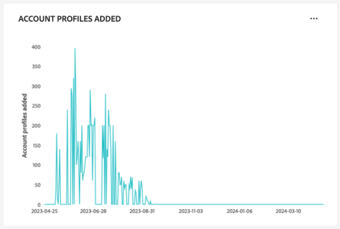
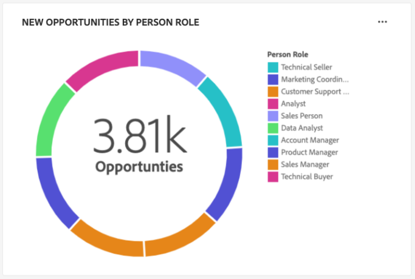

# [!UICONTROL Account Profiles] dashboard

De gebruikersinterface van Adobe Experience Platform (UI) biedt een dashboard waarmee u belangrijke informatie over uw accountprofielen kunt bekijken, zoals vastgelegd tijdens een dagelijkse momentopname. In deze handleiding wordt beschreven hoe u de [!UICONTROL Account Profiles] dashboard in UI en verstrekt meer informatie over de visualisaties die in het dashboard worden getoond.

Dit document biedt een overzicht van de functies in het [!UICONTROL Account Profiles] dashboard en geeft details over de beschikbare standaardinzichten. Zie de [[!UICONTROL Account Profiles] UI-hulplijn](../../rtcdp/accounts/account-profile-ui-guide.md) voor uitgebreide informatie over de beschikbare functies.

## Aan de slag

U moet recht hebben op [Adobe Real-time Customer Data Platform B2B Edition](../../rtcdp/b2b-overview.md) toegang tot B2B [!UICONTROL Account Profiles] dashboard.

## Gegevens van accountprofielen {#data}

De [!UICONTROL Account Profiles] op het dashboard wordt een momentopname van de gegevens van uw geconsolideerde account weergegeven. Deze rekeningsinformatie komt uit de veelvoudige bronnen over uw marketing kanalen en de diverse systemen die uw organisatie momenteel gebruikt om de informatie van de klantenrekening op te slaan.

De profielgegevens in de momentopname geven de gegevens precies zo weer als op het specifieke tijdstip waarop de momentopname is gemaakt. Met andere woorden, de momentopname is geen benadering of voorbeeld van de gegevens en de [!UICONTROL Account Profiles] het dashboard wordt niet in real-time bijgewerkt.

>[!NOTE]
>
>Wijzigingen of updates die zijn aangebracht in de gegevens nadat de momentopname is gemaakt, worden pas in het dashboard weergegeven als de volgende momentopname is gemaakt.

## Ontdek de [!UICONTROL Account Profiles] dashboard {#explore}

Ga naar de [!UICONTROL Account Profiles] het dashboard binnen UI van het Platform, uitgezocht **[!UICONTROL Profiles]** krachtens [!UICONTROL Accounts] in het linkernavigatievenster.

Van de [!UICONTROL Account Profiles] dashboard, u kunt of [door de accountprofielen bladeren die in uw organisatie worden opgenomen](#browse-account-profiles), of [de volledige gegevens van uw accountprofiel in één oogopslag weergeven met widgets](#standard-widgets).

### Datumfilter {#date-filter}

De [!UICONTROL Overview] tab bestaat uit widgets die alleen-lezen gegevens bieden om belangrijke informatie over uw accountprofielen over te brengen. Selecteer het kalenderpictogram of de data om het globale datumfilter voor uw widgets te veranderen.

>[!IMPORTANT]
>
>Het datumbereik dat u in de vervolgkeuzelijst selecteert, beïnvloedt alle inzichten, behalve de twee widgets voor voorspellende scoring ([distributie](#predictive-scoring-distribution) en [invloedrijke factoren](#predictive-scoring-top-influential-factors)).

### Configureer de lead in account matching-service {#lead-to-account-matching-service}

Selecteren **[!UICONTROL Settings]** om de lead to account matching service van de [!UICONTROL Account settings] in. Voor volledige details over hoe te om uw lood te vormen aan rekening aanpassen, zie [UI-hulplijn](../../rtcdp/accounts/account-profile-ui-guide.md#configure-lead-to-account-matching). Als u meer wilt weten over &#39;lead to account matching&#39;, raadpleegt u de [leiden tot account-overeenkomsten in Real-Time CDP B2B-documentatie](../../rtcdp/b2b-ai-ml-services/lead-to-account-matching.md).

## Accountprofielen zoeken {#browse-account-profiles}

Van de [!UICONTROL Browse] kunt u de alleen-lezen accountprofielen die in uw organisatie worden ingevoerd, doorzoeken en bekijken. Gebruik een account-id van een verbonden onderneming of voer de brongegevens rechtstreeks in. Vanuit deze werkruimte kunt u belangrijke informatie zien die bij het accountprofiel hoort, zoals naam, industrie, inkomsten en het publiek.

Selecteer de [!UICONTROL Profile ID] uit de resultaten die worden weergegeven op de [!UICONTROL Browse] om de [!UICONTROL Details] voor het accountprofiel.

De accountprofielgegevens die worden weergegeven op het tabblad [!UICONTROL Details] tabblad is samengevoegd vanuit meerdere profielfragmenten om een enkele weergave van de afzonderlijke account te vormen. Zie de documentatie op [bladeren door accountprofielen in Adobe Real-time Customer Data Platform](../../rtcdp/accounts/account-profile-ui-guide.md#browse-account-profiles) voor meer informatie over de weergavemogelijkheden van het accountprofiel in de gebruikersinterface van het platform.

## Standaardwidgets {#standard-widgets}

Adobe biedt standaardwidgets die u kunt gebruiken voor het visualiseren van verschillende meetgegevens die betrekking hebben op uw accountprofielen.

>[!IMPORTANT]
>
>Als u geen datumfilter aanbiedt, analyseert het standaardgedrag van inzichten de gegevens die van het vorige jaar tot vandaag zijn toegevoegd.

Als u meer wilt weten over elk van de beschikbare standaardwidgets, selecteert u de naam van een widget in de volgende lijst:

* [Accountprofielen toegevoegd](#account-profiles-added)
* [Nieuwe rekeningen van de industrie](#accounts-by-industry)
* [Nieuwe accounts per type](#accounts-by-type)
* [Opportuniteiten toegevoegd](#opportunities-added)
* [Nieuwe mogelijkheden per persoonlijke rol](#opportunities-by-person-role)
* [Nieuwe mogelijkheden door inkomsten](#opportunities-by-revenue)
* [Nieuwe mogelijkheden per status en podium](#opportunities-by-status-&-stage)
* [Nieuwe kansen gewonnen](#opportunities-won)
* [Predictieve spreiding van scores](#predictive-scoring-distribution)
* [Predictieve scoring van invloedrijke factoren](#predictive-scoring-top-influential-factors)
* [Totaal rekeningen per bedrijfstak](#total-accounts-by-industry)

### Accountprofielen toegevoegd {#account-profiles-added}

De [!UICONTROL Account profiles added] widget gebruikt een lijngrafiek om het aantal rekeningsprofielen te tonen die elke dag over een tijdspanne worden toegevoegd. Gebruik het globale datumfilter dat zich boven aan het dashboard bevindt om de analyseperiode te bepalen. Als er geen datumfilter is opgegeven, worden in het standaardgedrag de accountprofielen weergegeven die zijn toegevoegd voor het jaar vóór vandaag. De resultaten kunnen worden gebruikt om een trend in het aantal toegevoegde accountprofielen af te leiden.

### Nieuwe rekeningen van de industrie {#accounts-by-industry}

De [!UICONTROL New accounts by industry] widget geeft het totale aantal accounts in één meting in een donutgrafiek weer. Het donutdiagram illustreert de relatieve samenstelling van verschillende industrieën waaruit dit totaal bestaat. Een kleurgecodeerde sleutel geeft een indeling van alle opgenomen industrieën. Individuele tellingen voor elke industrie worden getoond in een dialoog wanneer de curseur over de respectieve sectie van de donutgrafiek beweegt.

### Nieuwe accounts per type {#accounts-by-type}

De [!UICONTROL New accounts by type] widget geeft het totale aantal accounts in één meting in een donutgrafiek weer. Het donutdiagram illustreert de relatieve samenstelling van verschillende accounttypen waaruit dit totaal bestaat. Een kleurgecodeerde sleutel geeft een indeling van alle opgenomen accounttypen. Individuele tellingen voor elk type van rekening worden getoond in een dialoog wanneer de curseur over de respectieve sectie van de donutgrafiek beweegt.

### Opportuniteiten toegevoegd {#opportunities-added}

De [!UICONTROL Opportunities added] widget gebruikt een lijngrafiek om het aantal kansen te tonen die elke dag over een periode worden toegevoegd. Gebruik het globale datumfilter dat zich boven aan het dashboard bevindt om de analyseperiode te bepalen. Als geen datumfilter wordt verstrekt, maakt een lijst het standaardgedrag van de kansen die voor het jaar voorafgaand aan vandaag worden toegevoegd. De resultaten kunnen worden gebruikt om een trend in het aantal toegevoegde kansen af te leiden.

<!-- Link to date filter documentation from Annamalai -->

### Nieuwe mogelijkheden per persoonlijke rol {#opportunities-by-person-role}

De [!UICONTROL New opportunities by person role] widget geeft het totale aantal van uw mogelijkheden in één meting binnen een donutgrafiek weer. Het donutdiagram illustreert de relatieve samenstelling van rollen die uit dit totale aantal kansen bestaan. Een kleurgecodeerde sleutel geeft een indeling van alle opgenomen rollen. Individuele tellingen voor elke rol worden getoond in een dialoog wanneer de curseur over de respectieve sectie van de donutgrafiek beweegt.

>[!NOTE]
>
>De [!UICONTROL No data found] of [!UICONTROL Unable to load] De fout wordt veroorzaakt wanneer &quot;opportunity-Persoon&quot;brug-lijst niet in uw schema wordt gebruikt. Als uw inzicht één van deze fouten toont, controleer uw verenigingsschema en zorg ervoor dat de &quot;opportuniteit-Persoon&quot;gebiedsgroep gegevens opneemt.

### Nieuwe mogelijkheden door inkomsten {#opportunities-by-revenue}

De [!UICONTROL New opportunities by revenue] widget gebruikt een staafdiagram om het totale geschatte bedrag van opbrengst te illustreren die door uw kansen wordt geproduceerd. De widget biedt ondersteuning voor maximaal zes mogelijkheden.

Om een dialoog te zien die het specifieke opbrengsttotaal voor een kans bevat, gebruik de curseur om over individuele bars te bewegen.

### Nieuwe mogelijkheden per status en podium {#opportunities-by-status-&-stage}

Deze widget gebruikt een staafdiagram om het aantal kansen te illustreren die of open of gesloten zijn in alle stadia van de marketing/verkooptrechter. De widget gebruikt kleuren om het werkgebied van de mogelijkheden te onderscheiden. Een kleurcoderingssleutel geeft de beschikbare stadia voor mogelijkheden aan.

### Nieuwe kansen gewonnen {#opportunities-won}

De [!UICONTROL New opportunities won] widget geeft het totale aantal kansen weer dat u met succes hebt voltooid in één meting in een donutgrafiek. Het donutdiagram illustreert de relatieve samenstelling van kansen die of worden gewonnen of niet. Bij een kleurcoderingssleutel wordt onderscheid gemaakt tussen de wel en niet-gewonnen mogelijkheden. Individuele tellingen voor elke rol worden getoond in een dialoog wanneer de curseur over de respectieve sectie van de donutgrafiek beweegt.

### Predictieve spreiding van scores {#predictive-scoring-distribution}

De [!UICONTROL Predictive scoring distribution] widget geeft de verdeling van de score van alle accountprofielen weer om u te helpen de gezondheid van uw verkooppijplijn in één oogopslag te begrijpen . De het scoren gegevens worden overgebracht door een donutgrafiek en een kolomgrafiek.

Het donutdiagram toont het aandeel van uw totale accountprofielen in elk van de sterke, gemiddelde en lage neiging om emmers te kopen. De sleutel bevat meer details over de secties met kleurcodes, waaronder de bereiken van het scoremmer en het aantal accountprofielen in dat bereik.

De kolomgrafiek verstrekt een meer korrelige het scoren mislukking. Elke kolom toont het aantal rekeningsprofielen in elk van de 20 5-punt verhogende emmers.

Met het vervolgkeuzemenu in de widget kunt u het accountscoremodel selecteren.

>[!NOTE]
>
>Filters voor het algemene datumbereik zijn niet van toepassing op voorspellende scoring-inzichten. Met widgets voor voorspellende scoring worden gegevens geanalyseerd op basis van het accountscoremodel dat is geselecteerd in de vervolgkeuzelijst.

### Predictieve scoring van invloedrijke factoren {#predictive-scoring-top-influential-factors}

De [!UICONTROL Predictive scoring top influential factors] widget helpt u de belangrijkste factoren te begrijpen die de scores voor elke aandrijvingsemmer drijven.

Deze widget toont de belangrijkste invloedrijke factoren voor elk van de hoge, gemiddelde, en lage aandrijvingsemmers. Een staaf voor elke invloedrijke factor geeft het percentage aan van de accountprofielen in dat eigenschapssemmer dat de specifieke invloedrijke factor bevat.

Met het vervolgkeuzemenu in de widget kunt u het accountscoremodel selecteren.

>[!NOTE]
>
>Filters voor het algemene datumbereik zijn niet van toepassing op voorspellende scoring-inzichten. Met widgets voor voorspellende scoring worden gegevens geanalyseerd op basis van het accountscoremodel dat is geselecteerd in de vervolgkeuzelijst.

### Totaal rekeningen per bedrijfstak {#total-accounts-by-industry}

Deze widget geeft het totale aantal accounts in één meting weer en gebruikt een donutgrafiek om de proportionele aantallen te illustreren voor de bedrijfstakken die het totale aantal vormen. De sleutel verstrekt de informatie van de kleurencodering voor de verschillende industrieën die omhoog de donutgrafiek maken.

>[!NOTE]
>
>De informatie die door dit inzicht wordt getoond is afhankelijk van de datumwaaier die door u wordt gespecificeerd. Als u geen datumfilter biedt, analyseert het standaardgedrag van de inzichten de gegevens die van het vorige jaar tot vandaag zijn toegevoegd.

Individuele tellingen voor de verschillende industrieën worden getoond in een dialoog wanneer de curseur over de respectieve sectie van de donutgrafiek hangt.

## Volgende stappen

Door dit document te volgen, moet u nu weten hoe u de [!UICONTROL Account Profiles] Het dashboard en de metriek die in beschikbare widgets wordt getoond begrijpen. Als u meer wilt weten over het werken met accountprofielen als onderdeel van uw B2B-gegevens in de interface van het Experience Platform, raadpleegt u de [overzicht van accountprofielen](../../rtcdp/accounts/account-profile-overview.md) voor Adobe Real-Time CDP, B2B Edition.
