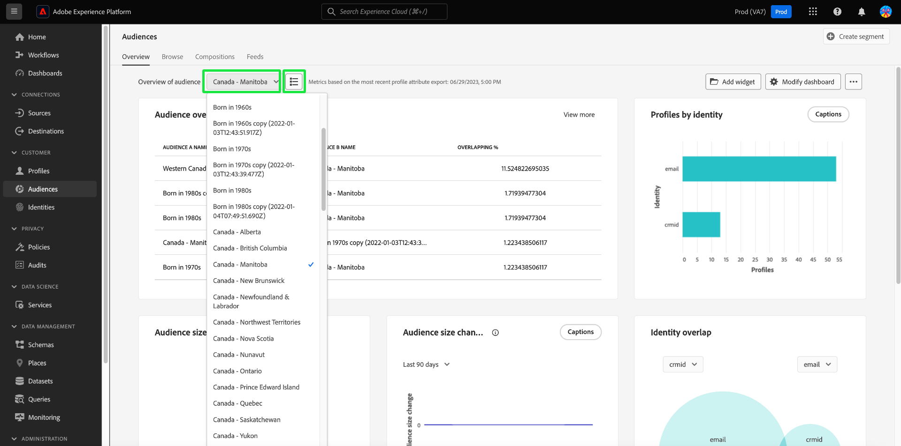
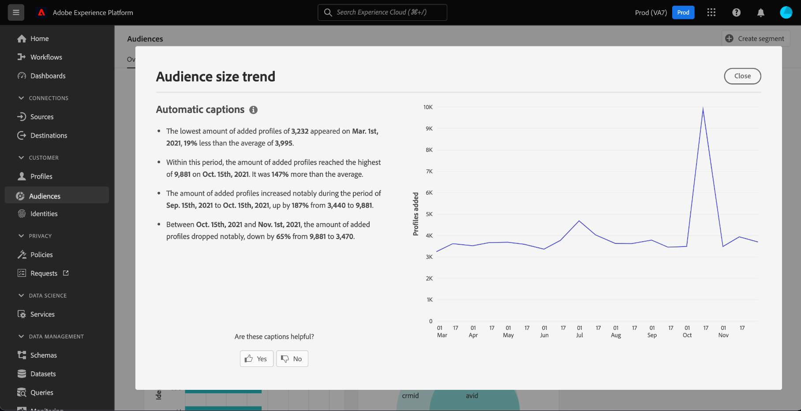
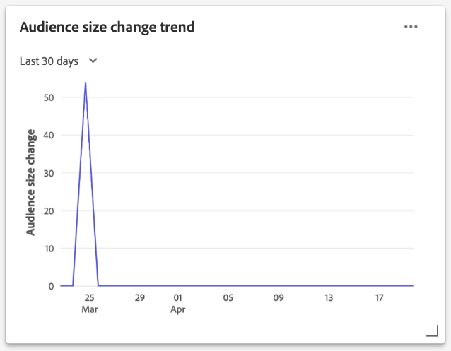

# [!UICONTROL Audiences] dashboard {#audiences-dashboard}

De gebruikersinterface van Adobe Experience Platform (UI) verstrekt een dashboard waardoor u belangrijke informatie over uw publiek kunt bekijken, zoals die tijdens een dagelijkse momentopname wordt gevangen. In deze handleiding wordt beschreven hoe u het dashboard [!UICONTROL Audiences] in de gebruikersinterface kunt openen en gebruiken en wordt meer informatie gegeven over de visualisaties die in het dashboard worden weergegeven.

Voor een overzicht van alle eigenschappen van de Dienst van de Segmentatie van Adobe Experience Platform binnen het gebruikersinterface van Experience Platform, gelieve de [&#x200B; gids UI van de Dienst van de Segmentatie te bezoeken &#x200B;](../../segmentation/ui/overview.md).

## [!UICONTROL Audiences] dashboardgegevens

Op het dashboard van [!UICONTROL Audiences] wordt een momentopname weergegeven van de kenmerkgegevens (record) die uw organisatie heeft in het Profile Store in Experience Platform. De momentopname bevat geen gebeurtenis (tijdreeks)-gegevens.

De kenmerkgegevens in de momentopname geven de gegevens precies zo weer als op het specifieke tijdstip waarop de momentopname is gemaakt. Met andere woorden, de momentopname is geen benadering of voorbeeld van de gegevens en het dashboard van [!UICONTROL Audiences] wordt niet in real-time bijgewerkt.

>[!NOTE]
>
>Wijzigingen of updates die zijn aangebracht in de gegevens nadat de momentopname is gemaakt, worden pas in het dashboard weergegeven als de volgende momentopname is gemaakt.

## Het dashboard van [!UICONTROL Audiences] verkennen {#explore}

Als u naar het [!UICONTROL Audiences] dashboard in de gebruikersinterface van Experience Platform wilt navigeren, selecteert u **[!UICONTROL Audiences]** in de linkertrack en selecteert u vervolgens het tabblad **[!UICONTROL Overview]** om het dashboard weer te geven.

>[!NOTE]
>
>Als uw organisatie nieuw is voor Experience Platform en nog geen actieve profielgegevenssets of samenvoegbeleid heeft gemaakt, is het dashboard van [!UICONTROL Audiences] niet zichtbaar. In plaats daarvan geeft het tabblad [!UICONTROL Overview] koppelingen en documentatie weer om u te helpen aan de slag te gaan met segmentatie.

![&#x200B; het [!UICONTROL Audiences] dashboard [!UICONTROL Overview] lusje met [!UICONTROL Audiences] en [!UICONTROL Overview] benadrukte.](../images/audiences/dashboard-overview.png)

### Het dashboard [!UICONTROL Audiences] wijzigen {#modify}

U kunt de weergave van het dashboard van [!UICONTROL Audiences] wijzigen door **[!UICONTROL Modify dashboard]** te selecteren. Hierdoor kunt u widgets verplaatsen, toevoegen en verwijderen van het dashboard en toegang krijgen tot **[!UICONTROL Widget library]** om beschikbare widgets te verkennen en aangepaste widgets voor uw organisatie te maken.

Gelieve te verwijzen naar de [&#x200B; wijzigende dashboards &#x200B;](../customize/modify.md) en [&#x200B; de bibliotheekdocumentatie van Widget &#x200B;](../customize/widget-library.md) om meer te leren.

### Widgets toevoegen {#add-widget}

Selecteer **[!UICONTROL Add widget]** om naar de widgetbibliotheek te navigeren en een lijst met de beschikbare widgets weer te geven die u aan het dashboard wilt toevoegen.

![&#x200B; het [!UICONTROL Audiences] dashboardoverzicht met [!UICONTROL Add widget] benadrukte.](../images/audiences/audiences-overview-add-widget.png)

In de widgetbibliotheek kunt u bladeren door de selectie van standaard- en aangepaste publiekswidgets. Voor informatie over hoe te om widgets toe te voegen, te zien gelieve de documentatie van de widgetbibliotheek over hoe te [&#x200B; een widget &#x200B;](../customize/widget-library.md#add-widgets) toevoegen.

### SQL weergeven {#view-sql}

U kunt de SQL bekijken die de inzichten produceert die op uw dashboard met een knevel op de [!UICONTROL Overview] werkruimte worden visualiseerd. U kunt inspiratie putten uit de SQL van uw bestaande inzichten om nieuwe vragen tot stand te brengen die unieke inzichten van de gegevens van Experience Platform afleiden die op uw bedrijfsbehoeften worden gebaseerd. Om meer over deze eigenschap te leren, zie de [&#x200B; SQL gids van de Mening UI &#x200B;](../view-sql.md).

## Een publiek selecteren {#select-audience}

Het dashboard selecteert automatisch een publiek om te tonen. U kunt het publiek echter wijzigen met het vervolgkeuzemenu of de publiekskiezer.

Als u een ander publiek wilt kiezen, selecteert u het vervolgkeuzemenu naast de naam van het publiek of opent u het dialoogvenster voor publieksselectie met de kiezer.

>[!IMPORTANT]
>
>Alleen publiek met een profielaantal boven nul wordt weergegeven in de lijst met selecteerbare soorten publiek.

![&#x200B; de dialoog [!UICONTROL Select audience] die alle beschikbare publiek toont.](../images/audiences/select-audience-dialog.png)

## Widgets en metriek {#widgets-and-metrics}

Het dashboard van [!UICONTROL Audiences] bestaat uit widgets. Dit zijn alleen-lezen metriek die belangrijke informatie over het geselecteerde publiek bieden.

De datum en tijd van de meest recente momentopname worden getoond bij de bovenkant van het [!UICONTROL Overview] lusje naast het publieksdrop-down. Alle widgetgegevens zijn nauwkeurig vanaf die datum en tijd. De tijdstempel van de momentopname wordt opgegeven in UTC; deze bevindt zich niet in de tijdzone van de individuele gebruiker of organisatie.

## Standaardwidgets {#default-widgets}

Voor alle nieuwe Adobe Experience Platform-instanties wordt een standaardwidgetbelasting opgegeven die de meest recente inzichten van uw gegevens belicht. De volgende widgets zijn vooraf geconfigureerd in uw segmentweergave van meet af aan. Alle details over het doel en de functie van widgets vindt u in de desbetreffende secties.

* [[!UICONTROL Audience size]](#audience-size)
* [[!UICONTROL Audience size change trend]](#audience-size-change-trend)
* [[!UICONTROL Identity overlap]](#identity-overlap)
* [[!UICONTROL Profiles by identity]](#profiles-by-identity)

>[!NOTE]
>
>Vanaf 26 juli 2023 zijn [!UICONTROL Profiles] , [!UICONTROL Audiences] en [!UICONTROL Destinations] overzichtsdashboards opnieuw ingesteld op een nieuwe standaardwidgetbelasting voor alle gebruikers die hun weergaven in de afgelopen zes maanden niet hebben gewijzigd.
>Verwijs naar de documentatie in de [&#x200B; Profielen &#x200B;](./profiles.md#default-widgets) en [&#x200B; 3&rbrace; standaardwidgetsecties van Doelen &lbrace;voor details waarop widgets als deel van standaard widget lading-outs inbegrepen zijn. &#x200B;](./destinations.md#default-widgets) U kunt uw dashboardwidgets op dezelfde manier blijven aanpassen als voorheen.

## AI-widgets van klant {#customer-ai-audiences-widgets}

Klant-AI wordt gebruikt om aangepaste eigenschapscores zoals churn en conversie voor individuele profielen op schaal te genereren. De klant AI doet dit door de bestaande gegevens van de Gebeurtenis van de Ervaring van de consument te analyseren om **te voorspellen de dun of de scores van de omzetsingsvolheid**. Deze zeer nauwkeurige modellen van de klantenneiging staan voor nauwkeurigere segmentatie en het richten toe. De [&#x200B; distributie van scores &#x200B;](#customer-ai-distribution-of-scores) en [&#x200B; het scoren samenvatting &#x200B;](#customer-ai-scoring-summary) inzichten tonen de afdeling in uw publiek aan. Ze benadrukken welke profielen de hoge/lage/gemiddelde dichtheid zijn en hoe deze over het aantal profielen worden verdeeld.

* [[!UICONTROL Customer AI scoring summary]](#customer-ai-scoring-summary)
* [[!UICONTROL Customer AI distribution of scores]](#customer-ai-distribution-of-scores)

### [!UICONTROL Customer AI distribution of scores] {#customer-ai-distribution-of-scores}

>[!CONTEXTUALHELP]
>id="platform_dashboards_segments_distributionOfScores"
>title="Verdeling van scores"
>abstract="Deze widget visualiseert de verdeling van het totale aantal profielen aan de hand van hun eigenschapscores in stappen van 5 procent. De verdeling van het profielaantal wordt bepaald door het AI-model en het geselecteerde samenvoegbeleid. U kunt het AI-model wijzigen in het vervolgkeuzemenu onder de titel van de widget."

De [!UICONTROL Customer AI distribution of scores] -widget categoriseert het totale aantal profielen op basis van hun densiteitsscores. De verdeling van het profielaantal wordt bepaald door het AI model en het geselecteerde fusiebeleid, dan visualiseerd in vijf percententoename die op hun neiging wijzen. Het aantal profielen wordt opgegeven langs de Y-as en de dichtheidsscores langs de X-as.

>[!NOTE]
>
>Als de visualisatie een conversiesnelheidsscore is, worden de hoge scores groen en de lage scores rood weergegeven. Als je de eigenheid van de kroon voorspelt, wordt deze gespiegeld, dan zijn de hoge scores rood en zijn de lage scores groen. Het gemiddelde emmertje blijft geel ongeacht welk aandrijvingstype u kiest.

Het AI-model waarmee de densiteitsscores worden bepaald, wordt gekozen uit de vervolgkeuzelijst onder de titel van de widget. Het vervolgkeuzemenu bevat een lijst met alle geconfigureerde AI-modellen van de Klant. Selecteer het juiste AI-model voor uw analyse in de lijst met beschikbare modellen. Als er geen AI-model van de Klant beschikbaar is, geeft een bericht in de widget u de opdracht ten minste één AI-model van de Klant te configureren en wordt een hyperlink naar de configuratiepagina van het AI-model van de Klant weergegeven. Zie de documentatie voor instructies op [&#x200B; hoe te om een instantie van AI van de Klant te vormen &#x200B;](../../intelligent-services/customer-ai/user-guide/configure.md).

>[!NOTE]
>
>Selecteer de vervolgkeuzelijst direct onder het tabblad Overzicht om het samenvoegbeleid te wijzigen dat bepaalt welke profielen in de analyse worden opgenomen. Zie de sectie over [&#x200B; fusiebeleid &#x200B;](#merge-policies) voor een korte beschrijving, of het [&#x200B; overzicht van het fusiebeleid &#x200B;](../../profile/merge-policies/overview.md) voor meer details.

Selecteer **[!UICONTROL View model details]** om naar de pagina met gedetailleerde inzichten voor het geselecteerde AI-model van de Klant te navigeren.

![&#x200B; het dashboard van het Soorten Soorten publiek van Experience Platform met [!UICONTROL Customer AI distribution of scores] wordt benadrukt widget en [!UICONTROL View model details].](../images/segments/customer-ai-distribution-of-scores.png)

De gedetailleerde pagina met modelinzichten wordt weergegeven.

Meer informatie over Klant AI kan op [&#x200B; worden gevonden ontdek de gids van inzicht UI &#x200B;](../../intelligent-services/customer-ai/user-guide/discover-insights.md).

### [!UICONTROL Customer AI scoring summary] {#customer-ai-scoring-summary}

>[!CONTEXTUALHELP]
>id="platform_dashboards_segments_scoringSummary"
>title="Overzicht van scores"
>abstract="Deze widget geeft het totale aantal scoreprofielen weer en categoriseert deze in emmers met een hoge, gemiddelde en lage dichtheid. Het donutdiagram illustreert de proportionele samenstelling van totale profielen in hoge, gemiddelde en lage dichtheid."

Deze widget geeft het totale aantal profielen met een score weer en categoriseert deze in emmers met een hoge, gemiddelde en lage dichtheid, respectievelijk groen, geel en rood. Een donutdiagram wordt gebruikt om de proportionele samenstelling van totale profielen tussen hoge, gemiddelde en lage eigenschappen als groen, geel en rood te illustreren. Een profiel komt in aanmerking voor een hoge dichtheid van meer dan 75, een gemiddelde dichtheid tussen 25 en 74 en een lage dichtheid onder 24. Een legenda geeft de kleurcode en drempelwaarden van eigenschappen aan. De tellingen van het profiel voor de hoge, middelgrote, en lage eigenschappen worden getoond in een dialoog wanneer de curseur over de respectieve sectie van de donutgrafiek beweegt.

>[!NOTE]
>
>Als de visualisatie een conversiesnelheidsscore is, worden de hoge scores groen en de lage scores rood weergegeven. Als je de eigenheid van de kroon voorspelt, wordt deze gespiegeld, dan zijn de hoge scores rood en zijn de lage scores groen. Het gemiddelde emmertje blijft geel ongeacht welk aandrijvingstype u kiest.

Het vervolgkeuzemenu onder de widgettitel bevat een lijst met alle geconfigureerde AI-modellen van de Klant. Selecteer het juiste AI-model voor uw analyse in de lijst met beschikbare modellen. Als er geen AI-model van de Klant beschikbaar is, geeft een bericht in de widget u de opdracht ten minste één AI-model van de Klant te configureren en wordt een hyperlink naar de configuratiepagina van het AI-model van de Klant weergegeven. Zie de documentatie op [&#x200B; hoe te om een instantie van AI van de Klant &#x200B;](../../intelligent-services/customer-ai/user-guide/configure.md) voor gedetailleerde instructies te vormen.

>[!NOTE]
>
>Het totale aantal berekende profielen is afhankelijk van het gekozen samenvoegingsbeleid. Als u het gebruikte samenvoegingsbeleid wilt wijzigen, selecteert u de vervolgkeuzelijst direct onder het tabblad Overzicht. Zie de sectie over [&#x200B; fusiebeleid &#x200B;](#merge-policies) voor een korte beschrijving, of het [&#x200B; overzicht van het fusiebeleid &#x200B;](../../profile/merge-policies/overview.md) voor meer details.

Selecteer **[!UICONTROL View model details]** om naar de gedetailleerde pagina met inzichten voor het geselecteerde AI-model van de Klant te navigeren. Meer informatie over Klant AI kan op [&#x200B; worden gevonden ontdek de gids van inzicht UI &#x200B;](../../intelligent-services/customer-ai/user-guide/discover-insights.md).

## Standaardwidgets {#standard-widgets}

Adobe biedt meerdere standaardwidgets die u kunt gebruiken voor het visualiseren van verschillende meetgegevens voor uw publiek. U kunt ook aangepaste widgets maken die u met uw organisatie wilt delen met de [!UICONTROL Widget library] . Om meer over het creëren van douanewidgets te leren, gelieve te beginnen door het [&#x200B; overzicht van de bibliotheek van Widget &#x200B;](../customize/widget-library.md) te lezen.

Als u meer wilt weten over elk van de beschikbare standaardwidgets, selecteert u de naam van een widget in de volgende lijst:

* [[!UICONTROL Audience size]](#audience-size)
* [[!UICONTROL Audience activation order]](#audience-activation-order)
* [[!UICONTROL Audience size trend]](#audience-size-trend)
* [[!UICONTROL Audience size change trend]](#audience-size-change-trend)
* [[!UICONTROL Audience size trend by identity]](#audience-size-trend-by-identity)
* [[!UICONTROL Audience overlap]](#audience-overlap)
* [[!UICONTROL Audience overlap report]](#audience-overlap-report)
* [[!UICONTROL Identity overlap]](#identity-overlap)
* [[!UICONTROL Profiles by identity]](#profiles-by-identity)
* [[!UICONTROL Scheduled activations]](#scheduled-activations)

### [!UICONTROL Audience size] {#audience-size}

>[!CONTEXTUALHELP]
>id="platform_dashboards_segments_audiencesize"
>title="Grootte publiek"
>abstract="Deze widget geeft het totale aantal samengevoegde profielen in het geselecteerde publiek weer. Dit getal is afhankelijk van het samenvoegbeleid dat op de gegevens wordt toegepast en is correct op het moment van de meest recente opname."

De **[!UICONTROL Audience size]** -widget geeft het totale aantal samengevoegde profielen weer binnen het geselecteerde publiek op het moment dat de momentopname werd gemaakt. Dit aantal is het resultaat van het toepassen van het beleid van de publiekssamenvoeging op uw gegevens van het Profiel om profielfragmenten samen te voegen en één enkel profiel voor elk individu in het publiek te vormen.

Voor meer informatie over fragmenten en samengevoegde profielen, verwijs naar het [&#x200B; Real-Time overzicht van het Profiel van de Klant &#x200B;](../../profile/home.md).

![&#x200B; het [!UICONTROL Audiences] dashboardoverzicht met [!UICONTROL Audience size] benadrukte widget.](../images/audiences/audience-size.png)

### [!UICONTROL Audience size trend] {#audience-size-trend}

>[!CONTEXTUALHELP]
>id="platform_dashboards_segments_audiencesizetrend"
>title="Ontwikkeling van de omvang van het publiek"
>abstract="Deze widget verstrekt informatie betreffende het totale aantal profielen die aan de criteria van **om het even welke** segmentdefinitie voldoen, zoals die tijdens de dagelijkse momentopname, voor de laatste 30 dagen, 90 dagen, of 12 maanden wordt gevangen."

De **[!UICONTROL Audience size trend]** widget verstrekt een illustratie van de lijngrafiek voor het totale aantal profielen die voor **om het even welk** publiek over een bepaalde periode kwalificeren. De trend van de publieksgrootte kan over 30 dagen, 90 dagen, en periodes van 12 maanden worden visualiseerd. De tijdsperiode wordt gekozen in een vervolgkeuzemenu in de widget. De publieksgrootte wordt weerspiegeld op de y-as en de tijd op de x-as.

Deze widget bevat ook de automatische functie [!UICONTROL Captions] , waarmee een model voor machinaal leren de diagrammen en de gegevens van het publiek analyseert en automatisch bijschriften genereert om de belangrijkste trends en belangrijke gebeurtenissen te beschrijven. Selecteer **[!UICONTROL Captions]** om het dialoogvenster voor automatische bijschriften te openen.

![&#x200B; het [!UICONTROL Audiences] overzicht toont de de trendwidget van de grootte van de Publiek.](../images/audiences/audience-size-trend-captions.png)

Het dialoogvenster voor automatische bijschriften wordt geopend en verschaft inzicht in uw gegevens.

Meer over de evaluatie van publiek leren en hoe de profielen kwalificeren en van publiek weggaan, gelieve te verwijzen naar de [&#x200B; documentatie van de Dienst van de Segmentatie &#x200B;](../../segmentation/home.md).

### [!UICONTROL Audience size change trend] {#audience-size-change-trend}

Deze widget geeft een lijngrafiekillustratie van het verschil tussen de meest recente dagelijkse momentopnamen in het totale aantal profielen dat voor een bepaald publiek is gekwalificeerd. Het publiek dat u voor analyse kiest, wordt geselecteerd in het keuzemenu met het overzicht. De periode van trendanalyse kan over 30 dagen, 90 dagen, en periodes van 12 maanden worden visualiseerd. De tijdsperiode wordt gekozen in een vervolgkeuzemenu in de widget. De publieksgrootte wordt weerspiegeld op de y-as en de tijd op de x-as.

### [!UICONTROL Audience size trend by identity] {#audience-size-trend-by-identity}

Deze widget illustreert de trend van de publieksgrootte voor een bepaald publiek op basis van het gekozen type identiteit in het vervolgkeuzemenu van de widget. Het publiek dat voor analyse wordt gebruikt wordt geselecteerd van het overzichtsdrop-down. De periode van trendanalyse kan over 30 dagen, 90 dagen, en periodes van 12 maanden worden visualiseerd. De tijdsperiode wordt gekozen in een vervolgkeuzemenu in de widget.

### [!UICONTROL Audience activation order] {#audience-activation-order}

De widget [!UICONTROL Audience activation order] biedt een tabel met drie kolommen met de doelnaam, het platform en de activeringsdatum van het publiek. De lijst wordt geordend van hoog tot laag afhankelijk van recentie en kan maximaal 10 rijen bevatten.

### [!UICONTROL Audience overlap] {#audience-overlap}

Deze widget gebruikt een Venn-diagram om het aantal mensen te visualiseren dat voldoet aan de criteria voor beide soorten publiek. Het publiek dat voor de vergelijking wordt gebruikt, wordt geselecteerd in de widgetdropdown menu&#39;s. Het totale aantal profielen binnen de relevante segmentdefinitie kan worden gezien door de muis boven een cirkel of het snijpunt van het Venn-diagram te houden.

Met deze widget kunt u uw segmentatiestrategie optimaliseren door de gelijkenissen in de resultaten van uw segmentdefinities te visualiseren.

### [!UICONTROL Audience overlap report] {#audience-overlap-report}

Met deze widget wordt een tabel gemaakt waarin het profiel gegevens voor een bepaald publiek overlapt. Er wordt een lijst met vijf soorten publiek weergegeven, van de hoogste tot de laagste overlappende percentages, die wordt gekozen in het vervolgkeuzemenu boven in het scherm. Voor de duidelijkheid wordt het gekozen publiek vermeld in de kolom [!UICONTROL AUDIENCE A NAME] . De publiek overlappende analyse wordt verstrekt voor het tweede publiek dat in de [!UICONTROL AUDIENCE B NAME] kolom wordt vermeld. De procentuele overlapping wordt vermeld in de derde kolom, tot op twaalf decimalen nauwkeurig.

Het publiek overlapt rapport helpt u om nieuwe, krachtige soorten publiek te bouwen. Wanneer u een hoog percentage van de overlappingen observeert, kunt u het publiek onderdrukken en voorkomen dat hetzelfde publiek naar andere bestemmingen wordt gestuurd. Ze helpen u ook verborgen inzichten te identificeren die kunnen helpen met betere segmentatie. Met een laag percentage overlappingen kunt u unieke profielen zoeken.

Selecteer **[!UICONTROL View more]** om een dialoogvenster op volledig scherm te openen dat meer publiek overlappende gegevens bevat.

Het dialoogvenster [!UICONTROL Audience overlap report] wordt weergegeven. Dit dialoogvenster kan tot 50 rijen publiek bevatten die analyses overlappen die in zes kolommen zijn opgedeeld. Selecteer het montagespictogram () om kolommen uit de tabel te verwijderen of toe te voegen.

>[!NOTE]
>
>Selecteer de kolomkop **[!UICONTROL Overlapping]** om de volgorde van de resultaten te wijzigen van het hoogste naar het laagste of het laagste naar het hoogste.

Als u het volledige rapport in PDF-indeling wilt downloaden, selecteert u het optiemenu (**`...`**) gevolgd door **[!UICONTROL Download]** .

Selecteer een rij in het rapport om een Venn-diagram van de overlappende analyse te openen. Houd de muisaanwijzer boven een gedeelte van het Venn-diagram om het aantal profielen in een dialoogvenster weer te geven.

Selecteer **[!UICONTROL Close]** om terug te keren naar het [!UICONTROL Audiences] -dashboard.

### [!UICONTROL Identity overlap] {#identity-overlap}

>[!CONTEXTUALHELP]
>id="platform_dashboards_segments_identityoverlap"
>title="Identiteitsoverlapping"
>abstract="Deze widget toont de overlapping van profielen in uw publiek die beide gekozen identiteiten bevatten. De cirkels geven de relatieve grootte van elke identiteit weer. Het aantal profielen met beide naamruimten wordt weergegeven door de overlapping tussen de cirkels."

De widget **[!UICONTROL Identity overlap]** geeft een Venn-diagram weer of stelt een diagram in waarin de overlapping van profielen in uw publiek met meerdere identiteiten wordt getoond.

Gebruik de vervolgkeuzemenu&#39;s op de widget om de identiteiten te selecteren die u wilt vergelijken. De cirkels geven de relatieve grootte van elke gekozen identiteit weer, waarbij het aantal profielen dat beide naamruimten bevat, wordt weergegeven door de grootte van de overlapping tussen de cirkels.

Als een klant op meer dan één kanaal met uw merk communiceert, zullen de veelvoudige identiteiten met die individuele klant worden geassocieerd. Hierdoor is het waarschijnlijk dat in uw organisatie meerdere profielen met fragmenten van meerdere identiteiten voorkomen.

Om meer over identiteiten te leren, gelieve de [&#x200B; documentatie van de Dienst van de Identiteit &#x200B;](../../identity-service/home.md) te bezoeken.

![&#x200B; het [!UICONTROL Audiences] dashboardoverzicht met de benadrukte overlap van de Identiteit widget.](../images/audiences/identity-overlap.png)

### [!UICONTROL Profiles by identity] {#profiles-by-identity}

>[!CONTEXTUALHELP]
>id="platform_dashboards_segments_profilesbyidentity"
>title="Profielen op identiteit"
>abstract="Deze widget geeft de indeling van de identiteiten in elk samengevoegd profiel in het geselecteerde publiek weer."

De widget **[!UICONTROL Profiles by identity]** geeft de indeling van de identiteiten in elk samengevoegd profiel in het geselecteerde publiek weer. Het totale aantal profielen per identiteit kan hoger zijn dan het totale aantal profielen in het publiek, omdat aan één profiel meerdere identiteiten kunnen zijn gekoppeld. Met andere woorden, het optellen van de waarden die voor elke identiteit worden getoond kan meer dan de totale publieksgrootte totaal. Dit komt omdat als een klant op meer dan één kanaal met uw merk in wisselwerking staat, veelvoudige identiteiten met die individuele klant kunnen worden geassocieerd.

Selecteer **[!UICONTROL Captions]** om het dialoogvenster voor automatische bijschriften te openen.

![&#x200B; het [!UICONTROL Audiences] dashboardoverzicht met de Gebenadrukte Profielen door identiteit widget en de optie van Bijschriften.](../images/audiences/profiles-by-identity.png)

Een machine-leermodel produceert automatisch gegevensinzichten door de algemene distributie en belangrijkste dimensies van de gegevens te analyseren.

Om meer over identiteiten te leren, gelieve de [&#x200B; documentatie van de Dienst van de Identiteit &#x200B;](../../identity-service/home.md) te bezoeken.

### Geplande activeringen {#scheduled-activations}

De widget [!UICONTROL Scheduled activations] biedt een in tabelvorm weergegeven weergave van de laatst geactiveerde doelen. De tabel bevat het doelplatform, de naam van de activeringsstroom naar dit doel en de begin- en einddatum van de activering voor het geselecteerde publiek. Als er geen einddatum voor de activering is opgegeven, wordt deze weergegeven als [!UICONTROL Ongoing] . Het publiek voor analyse wordt geselecteerd van dropdown bij de bovenkant van de pagina.

Met de widget kunt u in één oogopslag zien waar en wanneer het publiek wordt geactiveerd en kunt u dubbele of overbodige activeringen transparanter maken. Deze geaccumuleerde informatie benadrukt ook waar om het even welke activiteiten zijn weggelaten.

## Volgende stappen

Als u dit document volgt, kunt u nu het dashboard van [!UICONTROL Audiences] vinden en een publiek selecteren om te bekijken. U moet ook weten welke maatstaven worden weergegeven in de beschikbare widgets. Meer leren over het werken met publiek in Experience Platform UI, gelieve te verwijzen naar de [&#x200B; gids UI van de Dienst van de Segmentatie &#x200B;](../../segmentation/ui/overview.md).
